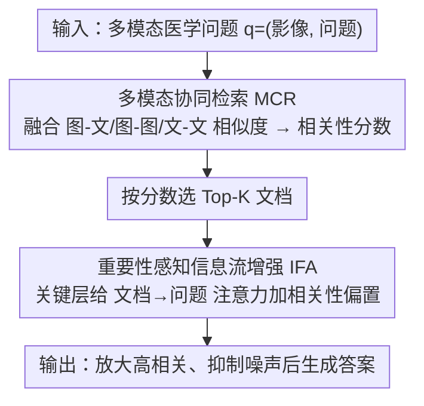

# MR-RAG: Multimodal Relevance-Aware Retrieval-Augmented Generation for Medical Visual Question Answering

**会议**: CVPR 2026  
**论文**: [CVF Open Access](https://openaccess.thecvf.com/content/CVPR2026/html/Li_MR-RAG_Multimodal_Relevance-Aware_Retrieval-Augmented_Generation_for_Medical_Visual_Question_Answering_CVPR_2026_paper.html)  
**代码**: 待确认  
**领域**: 医学图像 / 医学 VQA / 检索增强生成  
**关键词**: 医学 VQA, 检索增强生成, 多模态相关性, 注意力调控, LVLM

## 一句话总结
MR-RAG 在医学视觉问答的 RAG 流水线里同时改检索和生成两端：检索阶段用一个轻量 adapter 融合图-文、图-图、文-文三种相似度算出多模态相关性分数，生成阶段再把这个分数注入 LVLM 的注意力，让高相关文档的信息流被放大、噪声文档被抑制，在三个医学数据集上最高带来 6.4% 的准确率提升。

## 研究背景与动机
**领域现状**：把通用大视觉语言模型（LVLM）用到医疗领域，主流做法是检索增强生成（RAG）——检索外部医学知识、拼进输入，缓解预训练数据与专业医学知识之间的 domain gap。近期工作（RULE、MMed-RAG、FactMM-RAG 等）已在医学 VQA、放射报告生成上证明 RAG 有效。

**现有痛点**：现有医学 RAG 在检索和生成两端各有一个硬伤。检索端是**单一相似度检索**——大多只用「查询图像 vs 知识库报告」一种 image-to-text 相似度估文档相关性，丢掉了 image-to-image、text-to-text 这些同样富含信息的模态对，导致检不准。生成端是**相关性无感的融合**——检回来的文档被不加区分地、均匀地塞进 LVLM 输入，模型分不清哪些有用哪些是噪声，关键信息被稀释、无关内容被放大。

**核心矛盾**：检索和生成被割裂对待，且都没把「文档到底有多相关」这个多模态信号显式建模并贯穿始终。作者做了个实验佐证：往检索集里混入越来越多无关文档，噪声注意力比例上升、准确率从无噪的 77.9% 跌到无关文档占一半时的 68.1%——标准 RAG 模型确实容易被不可靠内容带偏，这在高风险医疗决策里尤其危险。

**本文目标**：用一个统一的双阶段框架，让多模态相关性信号同时服务检索（检得准）和生成（用得对）。

**切入角度**：RAG 自带一种被忽视的监督信号——检索文档的语义相关性；把它量化出来再注入注意力，就能在不重训模型的前提下做可控、相关性感知的信息流。

**核心 idea**：用「多模态协同检索（MCR）算相关性分数 + 重要性感知信息流增强（IFA）把分数注入注意力」替代「单相似度检索 + 均匀融合」，让检索和生成被同一套多模态相关性信号桥接起来。

## 方法详解

### 整体框架
MR-RAG 是一个双阶段 RAG 增强框架，backbone 为 LLaVA-Med-1.5，检索器是 ResNet-50 视觉编码器 + BioClinicalBERT 文本编码器的双塔结构。给定多模态医学问题 $q=(q_i, q_t)$（$q_i$ 影像、$q_t$ 文本问题）和多模态文档库 $D=\{d_k=(d_k^i, d_k^t)\}$，流程分两步。第一步在检索阶段，多模态协同检索（MCR）模块用一个轻量 adapter 把图-文、图-图、文-文三类相似度加权融合成一个相关性分数，据此选出 Top-K 文档，比单相似度检索更准。第二步在生成阶段，重要性感知信息流增强（IFA）把 MCR 算出的相关性分数当作文档级重要性信号，在 LVLM 若干关键层里给「文档 token → 问题 token」的注意力加一个相关性偏置，放大高相关文档、压制低相关文档，最终生成答案。

### 关键设计

**1. 多模态协同检索 MCR：把单一相似度换成三模态对的可学习融合**

痛点是现有医学 RAG 只用 image-to-text 一种相似度，漏掉了图-图、文-文这些互补线索。MCR 对查询 $q=(q_i,q_t)$ 和候选文档 $d=(d_i,d_t)$，把三种余弦相似度加权融合成相关性分数：

$$f(q,d) = \alpha \cdot \mathrm{Sim}(q_i, d_t) + \beta \cdot \mathrm{Sim}(q_i, d_i) + \gamma \cdot \mathrm{Sim}(q_t, d_t)$$

其中 $\alpha,\beta,\gamma$ 是**可学习参数**，自适应地反映每个模态对的相对重要性。它们用 InfoNCE 损失训练：$\mathcal{L} = -\log \frac{e^{s^+/\tau}}{e^{s^+/\tau} + \sum_j e^{s_j^-/\tau}}$，$s^+$ 是正样本的融合分数、$s_j^-$ 是负样本的，鼓励正对高、负对低，从而学出有判别力的相关性分数。训练集 $D_{train}$ 从检索候选里轻量构造：对每个候选集，用多模态模型给每个文档算「答对置信度」，取 top-1 当正例、bottom-m 当负例。这样得到的分数同时利用了跨模态和同模态的互补线索，在单相似度不足的临床场景里检索更准更鲁棒。

**2. 重要性感知信息流增强 IFA：把相关性分数软注入关键层的注意力**

痛点是检回来的文档被均匀对待，高质量文档因注意力被稀释而贡献不足、无关文档又会喧宾夺主。作者先做注意力阻断实验定位关键：发现「文档 token → 问题 token」（记作 Reports→Question）方向、在某些关键层 $L$ 上的注意力流，对高质量信息传递起决定性作用。于是 IFA 只在这些关键层调控：对注意力 logits 矩阵 $\tilde{A}$，给文档-问题之间的交叉注意力加一个相关性偏置得到调制后 logits

$$\tilde{A}'_{ij} = \tilde{A}_{ij} + \lambda_{ij} \cdot |\tilde{A}_{ij}|$$

调制系数 $\lambda_{ij}$ 只在「$i$ 属于问题 token 集 $\mathcal{Q}$、$j$ 属于第 $k$ 个文档 token 集 $\mathcal{D}_k$」时非零，取该文档融合分数 $\mathrm{Score}_k$ 的 Min–Max 归一化值 $\frac{\mathrm{Score}_k - \mathrm{Score}_{\min}}{\mathrm{Score}_{\max} - \mathrm{Score}_{\min}} \in [0,1]$，否则为 0；最后 $A=\mathrm{softmax}(\tilde{A}')$。乘 $|\tilde{A}_{ij}|$ 让偏置按原注意力幅度成比例缩放、保证是个正的相对加权因子。相比硬掩码，这种软调制保留了模型灵活性、避免注意力突变，让高相关路径的信息流被柔性放大，从而提升生成的语义 grounding 与鲁棒性。

**3. 检索与生成靠多模态相关性桥接：分数复用打通两端**

这两个模块不是各干各的——IFA 直接复用 MCR 算出的同一套相关性分数当重要性信号，于是「检得准」和「用得对」被同一个多模态相关性信号串成闭环。整体流水线（Algorithm 2）是：先用 $f(q,d)$ 给检索集所有文档算分、选 Top-K，把问题与文档 token 拼成输入序列喂进模型，再在关键层 $L$ 用 IFA（Eq. 3）按分数调制注意力、生成答案。这种「同一信号贯穿检索+生成」的设计，正是对前面「检索生成割裂、相关性没被显式建模」这一核心矛盾的直接回应。

### 损失函数 / 训练策略
唯一需要训练的是 MCR 的轻量 adapter 权重 $(\alpha,\beta,\gamma)$，用 InfoNCE 对比损失（Eq. 2）在自构造的对比数据集 $D_{train}$ 上优化，梯度下降更新 $(\alpha,\beta,\gamma) \leftarrow (\alpha,\beta,\gamma) - \eta \cdot \nabla \mathcal{L}$。IFA 是推理期的注意力调控、无需训练，LVLM backbone 全程冻结，整体是个轻量、免重训的增强框架。检索 Top-15 候选用于下游推理。

## 实验关键数据

### 主实验
在三个真实医学 VQA 数据集上评测：Harvard-FairVLMed（眼底照 + 文本，4285 测试）、IU-Xray（胸片 + 报告，2573）、MIMIC-CXR（胸片 + 报告，3460）。下表为与各类强基线在准确率/F1 上的对比（%）：

| 方法 | FairVLMed Acc | FairVLMed F1 | IU-Xray Acc | IU-Xray F1 | MIMIC Acc | MIMIC F1 |
|------|---------------|--------------|-------------|------------|-----------|----------|
| LLaVA-Med-1.5 | 77.35 | 60.34 | 85.64 | 82.62 | 71.92 | 71.16 |
| +OPERA（解码端） | 73.94 | 57.80 | 86.49 | 83.64 | 70.39 | 70.21 |
| +FactMM-RAG | 79.59 | 60.29 | 86.85 | 83.70 | 72.32 | 67.76 |
| +MMed-RAG | 70.57 | 56.39 | 84.57 | 81.63 | 70.36 | 69.81 |
| **MR-RAG（本文）** | **84.47** | **66.78** | **88.13** | **85.19** | **79.35** | **78.61** |

MR-RAG 在三数据集四指标上全面领先：相比最强基线，准确率在 FairVLMed/IU-Xray/MIMIC 上分别 +4.9% / +1.3% / +6.4%。对比开源 Med-LVLM（Med-Flamingo、MiniGPT-Med）同样全面胜出（如 IU-Xray Acc 88.13 vs 63.98/72.57）。

### 消融实验
三数据集平均结果（%）：

| 配置 | Acc | Prec | Recall | F1 |
|------|-----|------|--------|-----|
| LLaVA-Med-1.5（基线，直接拼接） | 77.57 | 68.83 | 71.56 | 69.61 |
| +MCR | 81.95 | 73.78 | 73.72 | 73.34 |
| +MCR+IFA（完整 MR-RAG） | **83.66** | **75.90** | **74.88** | **75.33** |

### 关键发现
- 两个模块各有独立增益且叠加有效：只加 MCR 把 F1 从 69.61 提到 73.34（多模态检索的好处），再加 IFA 进一步到 75.33（重要性感知的注意力精修），说明「检得准」和「用得对」是两个正交的提升点。
- 噪声敏感性实验是 IFA 的动机来源：无关文档占比从低升到一半时，标准 RAG 准确率从 77.9% 跌到 68.1%、噪声注意力比例显著上升——这直接证明需要一个抑制噪声文档的机制。
- 软调制优于硬掩码：IFA 用相关性偏置软放大而非直接屏蔽，保留模型灵活性、避免注意力突变。

## 亮点与洞察
- 把「文档相关性」从检索阶段的隐式排序，显式量化成一个可学习的多模态分数，再让它跨阶段复用到生成端的注意力——这种「一个信号桥接检索与生成」的设计很干净，避免了两端各自为政。
- IFA 先用注意力阻断实验定位到 Reports→Question 这条关键信息流，再只在关键层调控，而不是无差别地改全网注意力，既有可解释依据又降低副作用风险。这个「先定位关键注意力路径、再定向干预」的思路可迁移到其他 RAG/多文档任务。
- 整个增强免重训 LVLM、只训三个相似度权重 $(\alpha,\beta,\gamma)$，落地成本极低，对算力受限的医疗场景友好。

## 局限与展望
- 三相似度的可学习权重只有 $\alpha,\beta,\gamma$ 三个全局标量，对不同问题/不同模态质量是否需要更细粒度（如逐样本、逐层）的自适应，文中未深入（⚠️ 以原文为准）。
- IFA 依赖人工选定的「关键层 $L$」，关键层的选择来自注意力阻断实验，跨 backbone / 跨数据集是否稳定、如何自动确定，是个开放问题。
- 评测集中在胸片和眼底两类影像、三个数据集，对更多医学模态（CT/MRI/病理）和开放式生成（而非偏分类式 VQA）的泛化仍需验证；报告生成结果放在附录、正文未充分展开。
- 相关性分数本身的质量受双塔编码器（ResNet-50 + BioClinicalBERT）上限约束，编码器在罕见病/长尾报告上的表征不足会直接传导到检索与注意力调控。

## 相关工作与启发
- **vs RULE / MMed-RAG（联合优化检索+生成的医学 RAG）**：它们靠校准检索量、偏好对齐/自适应上下文选择改进 RAG，但不显式建模每个文档的重要性、也不注入模型内部推理；MR-RAG 显式算文档级多模态重要性并注入注意力。
- **vs FactMM-RAG（多模态 RAG）**：同样用 LLaVA-Med-1.5 backbone，但 FactMM-RAG 仍是相对单一的检索策略；MR-RAG 用三模态对融合 + 注意力调控，三数据集全面更优。
- **vs PASTA / PAI / ITI（注意力 steering）**：这些方法多为单模态语言生成或需重监督地构造 steering 向量；MR-RAG 把 RAG 自带的检索相关性当作免费监督，桥接注意力 steering 与检索增强，做相关性感知的信息流。

## 评分
- 新颖性: ⭐⭐⭐⭐ 「多模态相关性贯穿检索+生成」「相关性分数注入注意力」组合清晰，但 attention steering 与多相似度融合各自已有先例
- 实验充分度: ⭐⭐⭐⭐ 三数据集、四指标、模块消融与噪声敏感性都有，但模态/任务覆盖偏窄，报告生成结果在附录
- 写作质量: ⭐⭐⭐⭐ 动机—方法—实验逻辑顺，算法伪代码与公式清楚
- 价值: ⭐⭐⭐⭐ 免重训、低成本、医学 VQA 上提升明显，对医疗 RAG 落地有实用参考价值

<!-- RELATED:START -->

## 相关论文

- [\[CVPR 2026\] Dual-Level Confidence based Implicit Self-Refinement for Medical Visual Question Answering](dual-level_confidence_based_implicit_self-refinement_for_medical_visual_question.md)
- [\[CVPR 2026\] Attention Consistent Longitudinal Medical Visual Question Answering Guided by Vision Foundation Models](attention_consistent_longitudinal_medical_visual_question_answering_guided_by_vi.md)
- [\[ICLR 2026\] Q-FSRU: Quantum-Augmented Frequency-Spectral Fusion for Medical Visual Question Answering](../../ICLR2026/medical_imaging/q-fsru_quantum-augmented_frequency-spectral_for_medical_visual_question_answerin.md)
- [\[CVPR 2026\] Sketch2CT: Multimodal Diffusion for Structure-Aware 3D Medical Volume Generation](sketch2ct_multimodal_diffusion_for_structure-aware_3d_medical_volume_generation.md)
- [\[CVPR 2026\] Personalized Longitudinal Medical Report Generation via Temporally-Aware Federated Adaptation](personalized_longitudinal_medical_report_generation_via_temporally-aware_federat.md)

<!-- RELATED:END -->
