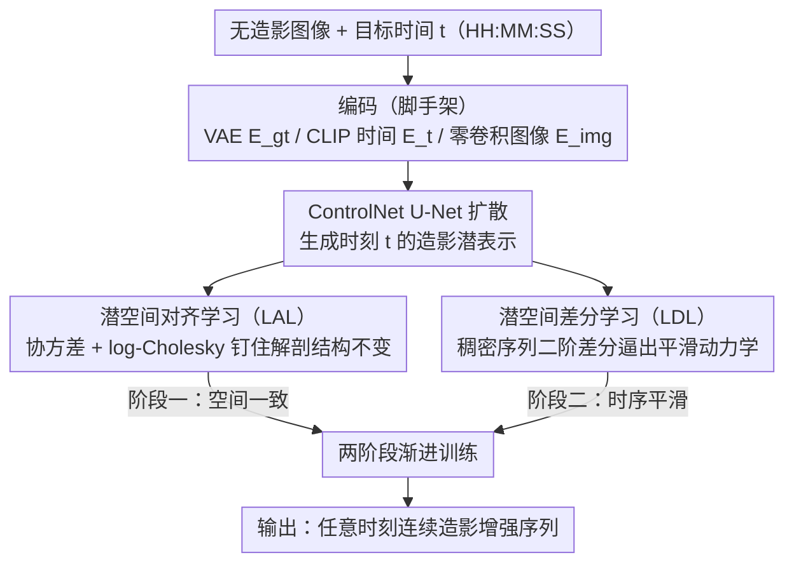

<!-- 由 src/gen_stubs.py 自动生成 -->
# MRI Contrast Enhancement Kinetics World Model

**会议**: CVPR2026  
**arXiv**: [2602.19285](https://arxiv.org/abs/2602.19285)  
**代码**: [GitHub](https://github.com/DD0922/MRI-Contrast-Enhancement-Kinetics-World-Model)  
**领域**: 医学图像  
**关键词**: MRI造影增强, 世界模型, 时空一致性学习, 潜空间对齐, 扩散模型, DCE-MRI

## 一句话总结

首次提出 MRI 造影增强动力学世界模型（MRI CEKWorld），通过时空一致性学习（STCL）在稀疏采样数据上实现从无造影 MRI 到连续高保真造影增强序列的生成，解决了内容失真和时序不连续两大难题。

## 背景与动机

1. **临床造影 MRI 信息效率低**：造影剂注射存在安全风险（沉积、过敏）、经济开销大，但实际获取的序列时间点固定且稀疏，获取信息量与成本严重不匹配
2. **世界模型可模拟造影动力学**：世界模型擅长学习物理系统的动态演化规律，应用于 MRI 造影可实现无造影剂的连续动态成像，规避注射风险
3. **MRI 时间分辨率极低**：受重建时长和患者呼吸配合限制，MRI 采集序列极度稀疏（仅秒级间隔），远不如视频领域的毫秒级连续帧，严重制约模型训练
4. **稀疏训练导致空间内容失真**：缺失时间点无真值监督，模型容易过拟合到无关特征，产生结构变形和器官错位
5. **稀疏训练导致时序不连续**：无连续采样数据使模型无法学到平滑的造影动力学规律，生成序列出现时间跳变和帧间不一致
6. **现有方法局限**：静态生成方法仅合成单时间点图像；动态序列方法仍局限于图像到图像映射，未真正模拟造影动力学；先验正则化和像素空间平滑分别无法保留患者特异性细节和避免模糊

## 方法详解

### 整体框架

MRI CEKWorld 基于 ControlNet 架构，要解决的是：在只有几个稀疏采集时间点的 DCE-MRI 数据上学出一套连续的造影动力学，从而输入无造影图像 $\mathcal{I}_{p,0}$ 和任意时间 $t$，就能生成该时刻的造影增强图像 $\hat{\mathcal{I}}_p(t)$。整体流程是：VAE 编码器 $E_{gt}$ 把造影真值压进潜空间，CLIP 时间编码器 $E_t$ 把「注射后经过时长」（HH:MM:SS 文本）转成语义特征以引导时间特异性增强，零卷积图像编码器 $E_{img}$ 把无造影图像经零卷积注入 U-Net 各层作为生成提示。训练分两阶段（先空间一致、再时序平滑），推理时给一张无造影图加目标时间即可出图。真正的核心是时空一致性学习（STCL），由 LAL 和 LDL 两条正则把物理先验编进训练。

### 关键设计

**1. 潜空间对齐学习（LAL）：用解剖结构不变性堵住稀疏训练的内容失真**

稀疏采样下大量缺失时间点没有真值监督，模型很容易过拟合到无关特征、把器官画歪画错位。LAL 抓住一个物理事实——同一患者在整个造影过程里解剖结构（器官轮廓、组织边界）是不变的，把它当成空间一致性先验来约束。具体做法是从扩散反向过程取出潜表示 $\hat{x}_0$，展平中心化后算各时间点的协方差矩阵 $\Sigma_t$ 来编码解剖区域间的空间共现关系，并做收缩正则 $\tilde{\Sigma}_t = (1-\gamma)\Sigma_t + \gamma I + \varepsilon I$ 保证正定。再通过 log-Cholesky 参数化把协方差映射到欧氏向量 $z_t$，对所有时间点求均值得到代表时不变结构的患者级模板 $\bar{z} = \frac{1}{T}\sum_{t=1}^T z_t$，最后用等距约束让各时刻 $z_t$ 到模板的距离一致：

$$\mathcal{L}_{Spatial} = \frac{1}{P}\sum_p \frac{1}{T_p}\sum_t \|z_t - \bar{z}\|_2^2$$

这样既钉住了内容一致性，又靠「距离一致而非完全相等」给造影带来的合理动态变化留了空间。

**2. 潜空间差分学习（LDL）：用二阶差分平滑逼出连续的造影动力学**

光有空间一致还不够——稀疏采集给不出连续帧，模型学不到平滑的演化规律，生成序列会出现时间跳变和帧间不一致。LDL 利用造影增强本应平滑进化、不该突变的先验，先在原始稀疏时间点之间均匀插入 $K_i$ 个虚拟时间点构成稠密序列 $T_{dense}$（已采集点从去噪过程恢复潜表示，插入点从高斯噪声生成预测），再对相邻点算离散二阶中心差分 $\mathbf{D}_2^k$，并带上非等间距自适应权重 $w^k = \frac{1}{1+h_0^k+h_1^k}$ 让大间隔弱惩罚，最后约束差分趋零：

$$\mathcal{L}_{Temporal} = \frac{1}{T-2}\sum_{k=1}^{T-2}\|\mathbf{D}_2^{(k)}\|_1$$

用 L1 范数是为了对异常值更鲁棒。二阶差分压住的是「曲率」而非「速度」，因此能抑制突变跳跃、又不强行把动力学拉成直线，正好匹配造影剂快速填充→积累→清除的非线性生理过程。

### 损失函数 / 训练策略

两阶段渐进训练，避免空间与时序两个目标互相打架：
- **阶段一**（扩散预热 + 空间一致性）：$\mathcal{L}_1 = \mathcal{L}_{Diffusion} + \lambda_{Spatial}\mathcal{L}_{Spatial}$
- **阶段二**（时序平滑）：$\mathcal{L}_2 = \mathcal{L}_{Diffusion} + \lambda_{Temporal}\mathcal{L}_{Temporal}$

## 实验关键数据

### 数据集与设置

- **腹部 DCE-MRI**（私有）：91例患者，1 张无造影 + 15 张造影增强（动脉期6、静脉期6、延迟期3，300秒内）
- **乳腺 DCE-MRI**（Duke公开数据集）：922例，注射后3-4个时间点
- 均 resize 至 256×256，归一化至 [-1,1]，3通道输入；A100 40GB 训练
- 评价指标：空间维度使用 PSNR、SSIM、LPIPS、rMSE；时序维度使用 cSSIM（相邻帧结构相似性均值）
- 对比方法：CustomDiff、T2I Adapter、CCNet、EditAR、ControlNet baseline
- 训练超参：epoch=14, batch_size=4, 腹部 $\lambda_{Spatial}=6.0$, 乳腺 $\lambda_{Spatial}=4.0$, $\lambda_{Temporal}=1.0$, $K_i=2$

### 主实验结果

| 方法 | 腹部 PSNR↑ | 腹部 SSIM↑ | 腹部 cSSIM↑ | 乳腺 PSNR↑ | 乳腺 SSIM↑ | 乳腺 cSSIM↑ |
|------|-----------|-----------|------------|-----------|-----------|------------|
| ControlNet baseline | 23.61 | 0.7178 | 0.8286 | 19.79 | 0.5196 | 0.3370 |
| + LAL | 23.92 | 0.7227 | 0.8439 | 20.86 | 0.5442 | 0.3879 |
| + LDL | 24.05 | 0.7369 | 0.8411 | 20.21 | 0.5391 | 0.3392 |
| **MRI CEKWorld** | **24.06** | **0.7419** | **0.8451** | **21.09** | **0.5599** | **0.3900** |
| CCNet | 24.35 | 0.5794 | 0.7098 | 21.47 | 0.4043 | 0.3155 |
| EditAR | 22.65 | 0.5571 | 0.7536 | 19.85 | 0.4170 | 0.3886 |

MRI CEKWorld 在 Avg.SSIM（0.6509）和 Avg.cSSIM（0.6176）上均达到最佳。CCNet 虽 PSNR 高但因收敛不充分导致过度平滑，丢失结构细节，SSIM/LPIPS/rMSE 均差。CustomDiff 和 T2I 生成图像与真值偏差严重，器官轮廓模糊、动态增强梯度失真。可视化结果显示 CEKWorld 在腹部和乳腺数据集上均实现了高空间真实性和自然的造影动力学，与 ground-truth 高度吻合。

### 消融实验

- LAL 单独使用：乳腺 SSIM 提升 2.46%，PSNR 提升 1.07
- LDL 单独使用：腹部 SSIM 提升 1.25%，乳腺 SSIM 提升 5.09%（时序平滑带来的空间收益）
- 两者结合效果互补，LAL 先建立空间一致性基础，LDL 进一步增强时序平滑和空间一致
- **超参数**：$\lambda_{Spatial}=6.0$（腹部）/ $4.0$（乳腺）为最优，过大过小均劣；$K_i=2$ 为最优，过多插值点引入分布外噪声
- **造影动力学曲线**：对肾脏感兴趣区域在动脉期（1-15s）/静脉期（55-72s）/延迟期（90-300s）进行等距采样，CEKWorld 的灰度均值曲线平滑稳定，精确匹配造影剂快速填充→积累→清除的生理过程；CCNet 和 EditAR 均有明显突变波动
- **潜空间可视化**：PCA 降维显示 CEKWorld 的特征点按时间顺序连续分布，baseline 则混乱无序

## 亮点

- **首创性**：首次将世界模型应用于 MRI 造影增强动力学模拟，实现无造影剂的连续动态成像，具有明确的临床价值（免除造影剂风险、降低成本、提高时间分辨率）
- **物理先验驱动设计**：LAL 利用解剖结构不变性先验，LDL 利用动力学平滑性先验，设计优雅且有理论支撑
- **log-Cholesky 参数化**：将正定协方差矩阵映射到欧氏空间进行优化，兼顾数值稳定性和正定性保持，使得梯度优化可行
- **非等间距差分**：自适应不同时间间隔的平滑约束，带权重惩罚（大间隔弱约束），适应 DCE-MRI 不均匀采集的实际场景
- **两阶段训练策略**：先空间后时序的渐进式学习，避免多目标冲突，实验证明两阶段的效果优于单独使用任一损失
- **可视化分析到位**：造影动力学时间曲线、潜空间 PCA 分布等分析直观展示了方法的有效性

## 局限与展望

- 仅在 MRI 模态上验证，未扩展到 CT 等其他造影增强成像（作者明确指出的 future work）
- 二阶中心差分对序列首尾两个时间点（t=0s, t=1s）无法约束，可视化中出现离群点，可考虑引入单侧差分或边界特殊处理
- 私有腹部数据集规模偏小（91例），泛化性待验证；缺少多中心数据验证
- 两阶段训练需人工切换损失函数，未探索端到端联合优化或自适应权重调度的可能
- 乳腺数据集 rMSE 较高（作者归因于数据强度范围 0-4000），未深入分析改进方案
- 未讨论临床实际部署中的推理速度和实时性需求

## 与相关工作的对比

- **vs 静态虚拟造影方法**（Chen et al., Cheng et al.）：静态方法仅从多模态无造影序列（T1w, T2w, ADC）合成单时间点造影增强图像，关注肿瘤最终增强模式，无法模拟时序动力学演化
- **vs 动态序列方法**（CCNet, EditAR）：这些方法仍是稀疏时间点间的图像映射，受限于物理采集；本文实现连续时间建模，可在任意时间点生成造影图像
- **vs 通用世界模型**（Dreamer, AdaWorld）：连续动作型依赖持续外部控制信号，观测驱动型需要密集采样视频，两者在 MRI 场景中均不可行；本文通过 STCL 解决稀疏训练问题
- **vs 时空一致性方法**（慢特征分析、对比学习）：慢特征分析依赖连续帧的时间导数最小化，对比学习需充足正负样本对，均不适用于极端稀疏的 DCE-MRI 数据；本文从协方差统计和差分平滑两个角度重新定义一致性

## 评分

- 新颖性: ⭐⭐⭐⭐⭐ — 首次将世界模型引入 MRI 造影动力学，问题定义和方法设计均为全新
- 实验充分度: ⭐⭐⭐⭐ — 两个数据集、多基线对比、消融实验完整，但缺少更大规模或多中心验证
- 写作质量: ⭐⭐⭐⭐ — 问题动机清晰，公式推导严谨，图表丰富；部分符号较重
- 价值: ⭐⭐⭐⭐⭐ — 无造影连续动态成像具有重要临床意义，技术路线对其他稀疏时序医学成像有参考价值

<!-- RELATED:START -->

## 相关论文

- [\[CVPR 2026\] X-WIN: Building Chest Radiograph World Model via Predictive Sensing](x-win_building_chest_radiograph_world_model_via_predictive_sensing.md)
- [\[CVPR 2026\] Adaptive Anisotropic Gaussian Splatting for Multi-contrast MRI Arbitrary-Scale Super-Resolution with Anatomy Guidance](adaptive_anisotropic_gaussian_splatting_for_multi-contrast_mri_arbitrary-scale_s.md)
- [\[AAAI 2026\] PulseMind: A Multi-Modal Medical Model for Real-World Clinical Diagnosis](../../AAAI2026/medical_imaging/pulsemind_a_multi-modal_medical_model_for_real-world_clinical_diagnosis.md)
- [\[AAAI 2026\] CD-DPE: Dual-Prompt Expert Network Based on Convolutional Dictionary Feature Decoupling for Multi-Contrast MRI Super-Resolution](../../AAAI2026/medical_imaging/cd-dpe_dual-prompt_expert_network_based_on_convolutional_dictionary_feature_deco.md)
- [\[CVPR 2026\] OSA: Echocardiography Video Segmentation via Orthogonalized State Update and Anatomical Prior-aware Feature Enhancement](osa_echocardiography_video_segmentation_via_orthogonalized_state_update_and_anat.md)

<!-- RELATED:END -->
