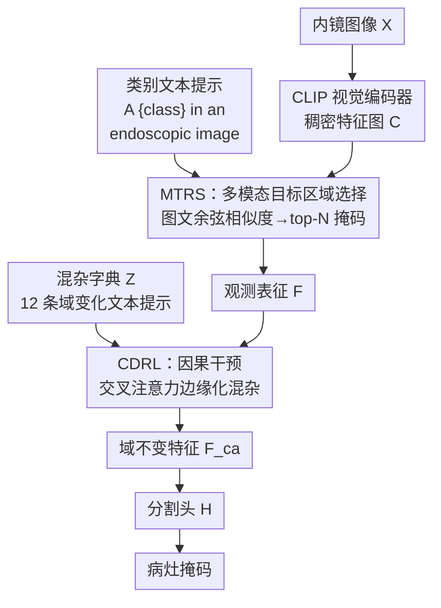

# Multimodal Causality-Driven Representation Learning for Generalizable Medical Image Segmentation

**会议**: CVPR 2026  
**arXiv**: [2508.05008](https://arxiv.org/abs/2508.05008)  
**代码**: 无  
**领域**: 医学图像 / 域泛化 / 多模态VLM  
**关键词**: 因果干预, 混杂字典, 域泛化, CLIP, 内镜分割

## 一句话总结
针对医学图像因设备/光照/成像方式差异造成的域漂移，本文把这些差异显式建模成"混杂因子（confounder）"，用 CLIP 文本提示构造混杂字典并通过后门调整（backdoor adjustment）做因果干预，在内镜分割上跨域平均 mDice 比最强基线再提 2.0%。

## 研究背景与动机

**领域现状**：CLIP 这类视觉-语言模型（VLM）在自然图像上零样本能力很强，最近也被搬到医学图像分割上当 backbone。但医学图像跨中心、跨设备时存在严重的域漂移（domain shift），同一种病灶在不同内镜、不同光照、不同成像协议下长得很不一样。

**现有痛点**：现有的域泛化（DG）方法——对抗训练让特征"域无关"、特征解耦把解剖结构和域因素拆开、元学习模拟域漂移——本质都是在"压制"域相关信息，但**从没显式地去除造成域漂移的那个东西**。它们把混杂因子和病灶特征搅在一起处理，结果在没见过的目标域上还是会被设备伪影、光照误导，给出过分割或边界乱跑的结果。

**核心矛盾**：观测到的表征 $F$ 同时纠缠了**类别相关信息** $F_c$ 和**域相关混杂** $F_d$，预测器学到的是 $P(Y\mid F)$。由于 $F_d$ 的存在引入了虚假相关（spurious correlation，例如"蓝天=飞机"那种），模型学到的相关性在新域上不成立。真正想要的是干预分布 $P(Y\mid do(F))$——切断 $F_d$ 对 $Y$ 的影响。

**本文目标**：把"去域漂移"这件事从经验性的特征对齐，升级成有因果论支撑的显式干预——构造一个能代表各种域变化的混杂集合，再把它的影响边缘化掉。

**切入角度**：作者从结构因果模型（SCM）出发。既然 $F_c$ 不可直接观测、无法显式拆分 $F$，那就用后门调整：引入一个混杂字典 $Z$ 近似混杂分布，对 $Z$ 做边缘化求期望，得到只依赖 $F_c$ 的不变特征。混杂字典恰好可以用 CLIP 的文本编码器"说出来"——用自然语言描述各种成像变化即可。

**核心 idea**：用 CLIP 文本提示把域差异写成混杂字典 $Z$，再用一个因果干预网络对 CLIP 视觉特征做后门调整 $\mathbb{E}_z[A(F,z)]$，把混杂边缘化掉得到域不变表征，喂给分割头。

## 方法详解

### 整体框架
MCDRL 的输入是某个源域内镜图像 $X$，输出是像素级病灶掩码。整条管线分三段：先用 **MTRS**（多模态目标区域选择）借 CLIP 的图文对齐定位出病灶相关区域、抽出观测表征 $F$；再用 **CDRL**（因果驱动表征学习）把域变化建成混杂字典，对 $F$ 做因果干预、边缘化掉混杂，得到域不变特征 $F_{\mathrm{ca}}$；最后把 $F_{\mathrm{ca}}$ 送进分割头生成掩码。理论支点是把分割从 $P(Y\mid F)$ 改写成干预分布 $P(Y\mid do(F))=\sum_{z\in Z}P(Y\mid F,z)P(z)$，并近似为对特征求期望 $H(\mathbb{E}_z[A(F,z)])$。

### 关键设计

**1. MTRS 多模态目标区域选择：用图文相似度先把病灶圈出来，再抽表征**

医学图像背景信息多、病灶占比小，如果直接拿整张图的 CLIP 特征去干预，混杂建模会被大量无关背景稀释。MTRS 解决的是"先聚焦到哪"。具体地，CLIP 视觉编码器把图像编码成稠密特征图 $C\in\mathbb{R}^{H\times W\times d}$；同时用模板 "A {$class_k$} in an endoscopic image" 为 $K$ 个病灶类别生成文本嵌入 $\{e_k\}$。对每个空间位置 $(h,w)$ 算视觉特征与各类文本的余弦相似度

$$S[h,w,k]=\frac{C[h,w]\cdot e_k}{\|C[h,w]\|\,\|e_k\|}$$

再沿类别维取最大得到统一相似图 $\hat{S}[h,w]=\max_k S[h,w,k]$。按 $\hat S$ 排序保留得分最高的 $N=\alpha\cdot H\cdot W$ 个位置（$\alpha\in[0,1]$ 控制稀疏度）得到二值掩码 $S^{\mathrm{mask}}$，与原特征逐元素相乘 $\tilde C[h,w]=C[h,w]\,S^{\mathrm{mask}}[h,w]$，取非零项重排成紧凑表征 $F\in\mathbb{R}^{N\times d}$。这个 $F$ 同时携带类别信息和域信息，正是后面要做干预的"观测表征"。好处是不需要额外检测器，纯靠 CLIP 自带的跨模态先验就完成了弱定位。

**2. 混杂字典：把域漂移用自然语言"说"出来，做成可边缘化的离散混杂集合**

后门调整需要一个能代表混杂分布的集合，但 $F_d$ 不可观测、没法采样。本文的巧思是：内镜成像里造成域漂移的因素是有临床共识、可以用文字枚举的。作者把混杂归成五类——(i) 视野质量（模糊、伪影）、(ii) 光照条件（亮/暗/不均）、(iii) 成像技术（窄带成像 NBI、白光）、(iv) 距离因素（近景/远景）、(v) 表面干扰（黏液、血、反光）。用模板 "An endoscopy image with {$domain_n$}" 写出 $M=12$ 条代表性提示，经 CLIP 文本编码器得到字典 $Z=\{z_m\}_{m=1}^{M}\in\mathbb{R}^{M\times d}$。$M$ 的选择是设计驱动的，在覆盖域变化和计算开销之间折中。这样混杂分布就被一组文本嵌入离散近似了——这是整个因果框架能落地的关键，把抽象的"混杂分布"变成了手里真实可算的张量。

**3. 因果干预网络：用交叉注意力近似对混杂求期望，得到域不变特征**

有了 $Z$，理论上要算 $do(F)\approx\mathbb{E}_z[A(F,z)]$，即对字典里每个混杂都过一遍干预网络再平均。直接求这个期望不可行，本文用交叉注意力一次性近似整个边缘化：

$$F_{\mathrm{ca}}=A(F,Z)=\mathrm{Attn}(F,Z)$$

其中 query 是选出的区域特征 $F\in\mathbb{R}^{N\times d}$，key/value 是混杂字典 $Z\in\mathbb{R}^{M\times d}$。注意力权重相当于度量"每个混杂因子对当前特征有多相关"，再据此对混杂的影响做加权抵消，输出域不变特征 $F_{\mathrm{ca}}\in\mathbb{R}^{N\times d}$。这一步对应公式 $P(Y\mid do(F))\approx H(\mathbb{E}_z[A(F,z)])$ 里的内层期望——先在特征层把混杂边缘化掉，再过分割头 $P=H(F_{\mathrm{ca}})$，而不是对每个混杂的预测结果取平均，后者计算量大得多。这就是它和"特征解耦/对抗去域"方法的本质区别：不是去压制某个未知方向，而是显式枚举混杂、按因果公式把它们积分掉。

### 损失函数 / 训练策略
总损失为三项加权：

$$\mathcal{L}=\mathcal{L}_{\text{seg}}+\lambda_1\mathcal{L}_{\text{causal}}+\lambda_2\mathcal{L}_{\text{contrast}}$$

- $\mathcal{L}_{\text{seg}}$：标准像素级交叉熵分割损失。
- $\mathcal{L}_{\text{causal}}=\big\|\bar F_{\mathrm{ca}}-\frac{1}{M}\sum_{m=1}^{M}t_{k,m}\big\|^2$，把池化后的干预特征 $\bar F_{\mathrm{ca}}=\mathrm{Pool}(F_{\mathrm{ca}})$ 拉向"该类别在所有域提示下的平均文本嵌入"，其中 $t_{k,m}$ 由模板 "A [$class_k$] with [$domain_m$]" 生成。直觉是：同一病灶类别在各种域下的语义中心应当是一致的，干预后的特征就该落在这个跨域不变中心上。
- $\mathcal{L}_{\text{contrast}}$：对 CLIP 视觉编码器做对比微调，把图像级特征 $F_{\mathrm{vis}}$ 拉近正确类别文本 $e_k$、推远其他类别，温度 $\tau=0.5$，保证视觉特征仍与疾病类别判别性对齐。

权重 $\lambda_1=0.5$、$\lambda_2=0.1$。采用渐进式训练：因果干预机制在第 10 个 epoch 后才启动，共训 50 epoch；AdamW，初始学习率 0.005，输入 $224\times224$，单卡 A800。先让分割主干热身、再开因果干预，避免早期特征不稳时干预反而引入噪声。

## 实验关键数据

五个数据集横跨三类自然腔道：支气管镜 BM-BronchoLC（Site A，3057 帧）、喉镜 Laryngoscope8（Site B，3533 张）、以及三个腹腔/结肠镜数据集 CVC-ClinicDB（Site C，612）、ETIS（Site D，196）、Kvasir（Site E，1000）。采用留一域评测（"Site A"指在 B-E 上训练、在 A 上测）。指标为 Dice、IoU、Acc。

### 主实验
ViT-L/14 backbone 下五站平均（单位 %）：

| 方法 | Dice | IoU | Acc |
|------|------|-----|-----|
| Baseline | 75.1 | 68.3 | 90.9 |
| StyLIP | 78.3 | 71.2 | 92.5 |
| BiomedCoOp | 79.4 | 72.4 | 93.2 |
| **MCDRL** | **81.6** | **74.3** | **94.3** |

MCDRL 平均 mDice 81.6%，比 baseline 提 6.5%、比最强竞品 BiomedCoOp 提 2.0%。backbone 越大收益越明显：从 ResNet-50（78.6）到 ViT-L/14（81.6）平均 mDice 涨 3.8%，说明强特征提取对域泛化很关键。各站表现不均，Site A 最高、Site D 最低，反映临床数据分布差异。

按病灶类型看（ViT-L/14，mDice %）：

| 方法 | Polyps | Tumors | Inflam. | Nodules | Cyst | Avg |
|------|--------|--------|---------|---------|------|-----|
| Baseline | 78.2 | 76.5 | 74.4 | 73.5 | 75.6 | 75.6 |
| BiomedCoOp | 81.5 | 79.8 | 77.3 | 78.5 | 75.6 | 78.5 |
| **MCDRL** | **83.9** | **82.2** | **80.1** | **84.9** | **80.8** | **82.4** |

对 nodules 提升最大（+11.4%），作者认为是因为方法能捕捉对结节识别关键的细微纹理和边界；对炎性病灶（视觉模式更隐晦、最易被域因素混淆）的强表现也佐证了去混杂的作用。

### 消融实验

模块消融（mDice %，留一域平均）：

| 配置 | Site A | Site C | Site D | Avg | 说明 |
|------|--------|--------|--------|-----|------|
| Baseline | 65.60 | 63.15 | 68.11 | 69.37 | 纯分割基线 |
| w/o MTRS | 77.09 | 80.50 | 78.32 | 80.47 | 只去区域选择、保留因果干预 |
| w/o CDRL | 79.51 | 77.40 | 77.29 | 78.71 | 只去因果干预、保留区域选择 |
| **MCDRL** | **82.53** | **88.73** | **90.25** | **88.46** | 完整模型 |

> ⚠️ 此消融表（Table 3）的数值量级明显高于主表 Table 1（如 Site D 达 90.25），与主实验不在同一设定下，疑似不同评测口径，纵向看趋势即可、不要与 Table 1 直接对比。

混杂字典大小（Table 4，ViT-L/14，Avg Dice %）：$N$ 从 3→12 平均 Dice 由 76.7 升到 81.6，$N=15$ 时反而微降到 81.4，说明混杂过多会引入冗余/噪声，$N=12$ 是最佳折中。

因果网络深度（Table 5）：层数 1→5，平均 Dice 78.7→82.0，但参数从 12.4M 涨到 37.5M、推理 142ms→290ms；3-4 层后性能饱和，3 层（81.6 mDice / 24.9M / 215ms）是精度-效率最佳点。

### 关键发现
- **两个模块互补且都很关键**：单去 MTRS 仍有 80.47、单去 CDRL 有 78.71，但合起来跳到 88.46（较 baseline +19.09%）。CDRL 负责拆掉域混杂、MTRS 负责把注意力聚到解剖相关区域，缺一不可；在视觉特征更复杂的 Site C（+25.58%）、Site D（+22.14%）增益尤其大。
- **混杂字典存在最优容量**：12 条提示覆盖五类域变化即足够，再加反而退化——印证"显式枚举混杂"比"无限堆容量"更重要。
- **t-SNE 证据**：baseline 在域漂移下类内簇碎裂，MCDRL 的类别分布跨域更紧致对齐，定性支持了"学到的是类别语义、而非域伪相关"。

## 亮点与洞察
- **把"去域漂移"翻译成可计算的因果后门调整**：最妙的一点是用 CLIP 文本编码器把"模糊/光照/NBI/反光"这些临床上说得清的混杂直接写成文本嵌入字典，从而让原本不可观测的混杂分布变得可采样、可边缘化。这是把因果论从纸面落到工程的关键一跃。
- **用交叉注意力一步近似边缘化期望**：不必对字典里每个混杂逐个跑干预再平均，而是 query=区域特征、key/value=混杂字典，一次注意力就完成 $\mathbb{E}_z[A(F,z)]$，既符合因果公式又高效。这个"字典当 KV、特征当 Q"的范式可迁移到任何"想边缘化掉一组已知干扰因素"的任务（如跨设备 ReID、跨风格识别）。
- **因果损失把不变性锚到跨域语义中心**：$\mathcal{L}_{\text{causal}}$ 把干预特征拉向"同类别在所有域提示下的平均文本嵌入"，相当于用语言模型给出的跨域一致语义当监督锚点，比纯靠图像对抗对齐更稳定。
- 渐进式训练（第 10 epoch 才开因果干预）是个实用 trick：先让主干学会基本分割，再叠加干预，避免早期特征噪声把因果模块带偏。

## 局限性 / 可改进方向
- **混杂字典靠人工+临床共识枚举**：五类 12 条提示是内镜场景手工设计的，换到其他模态（CT/MRI/病理）需重新设计提示，且"枚举得全不全"直接决定去混杂效果，未覆盖的域变化无法被边缘化。
- **理论近似有两层放松**：把求和近似成期望、又把"对预测取期望"近似成"对特征取期望再预测" $\mathbb{E}_z[H(A)]\approx H(\mathbb{E}_z[A])$，后一步只有在 $H$ 近线性时才严格成立，非线性分割头下这是经验性近似。
- **消融表口径存疑**：Table 3 数值远高于主表 Table 1，论文未明确两者设定差异，给跨表解读带来困惑（已在上文标注）。
- **符号有小冲突**：混杂数量在正文写 $M=12$、Table 4 表头却用 $N$，且 $N$ 同时被 MTRS 用作选中区域数，阅读时需留意（⚠️ 以原文为准）。
- 只在内镜（支气管/喉/腹腔镜）验证，未触及更大域差的跨成像模态泛化。

## 相关工作与启发
- **vs 对抗式域泛化（DANN 类 [24]）**: 他们用判别器逼特征"域无关"，本文则显式枚举混杂并按后门公式积分掉；对抗法压制的是未知方向、易训练不稳，本文有因果论闭式支撑且去除的是可解释的具名因素。
- **vs 特征解耦 [31]**: 解耦法尝试把解剖特征和域因素拆成两路，但 $F_c$ 不可观测、拆分很难干净；本文绕过显式拆分，直接对混杂边缘化，工程上更可行。
- **vs BiomedCoOp / StyLIP（VLM 提示学习）**: 它们也基于 CLIP 做医学/域泛化提示，但没有因果干预这一层，只是更好地用文本对齐；本文在同样 backbone 下平均再提 2.0% mDice，增量正是来自显式去混杂。
- **vs IRM [2]**: IRM 在多训练环境间求不变性来找因果特征，需要环境划分；本文用文本字典近似混杂分布做后门调整，不依赖显式环境标签，把"环境"换成"可语言描述的混杂"。

## 评分
- 新颖性: ⭐⭐⭐⭐ 把后门调整与 CLIP 文本混杂字典结合，因果框架落到分割任务上较新颖，但因果干预+混杂字典的范式在分类领域已有先例。
- 实验充分度: ⭐⭐⭐⭐ 五站留一域评测+三种 backbone+病灶类型/字典大小/网络深度多维消融，较扎实；但消融表口径存疑、缺与非 VLM SOTA 的对比。
- 写作质量: ⭐⭐⭐⭐ 因果推导清晰、动机到方法一气呵成；个别符号（M/N）混用、表间口径未交代。
- 价值: ⭐⭐⭐⭐ 给"医学图像跨中心域泛化"提供了一条可解释、可迁移的因果去混杂路线，混杂字典+注意力边缘化的范式有复用潜力。

<!-- RELATED:START -->

## 相关论文

- [\[CVPR 2026\] KAMP: Knowledge-Anchored Multimodal Pretraining Framework for Medical Image Representation](kamp_knowledge-anchored_multimodal_pretraining_framework_for_medical_image_repre.md)
- [\[CVPR 2026\] Learning Generalizable 3D Medical Image Representations from Mask-Guided Self-Supervision](learning_generalizable_3d_medical_image_representations_from_mask-guided_self-su.md)
- [\[CVPR 2026\] H2-Surv: Hierarchical Hyperbolic Multimodal Representation Learning for Survival Prediction](h2-surv_hierarchical_hyperbolic_multimodal_representation_learning_for_survival_.md)
- [\[CVPR 2026\] GeoSemba: Reconstructing State Space Model for Cross Paradigm Representation in Medical Image Segmentation](geosemba_reconstructing_state_space_model_for_cross_paradigm_representation_in_m.md)
- [\[CVPR 2026\] InvCoSS: Inversion-driven Continual Self-supervised Learning in Medical Multi-modal Image Pre-training](invcoss_inversion-driven_continual_self-supervised_learning_in_medical_multi-mod.md)

<!-- RELATED:END -->
