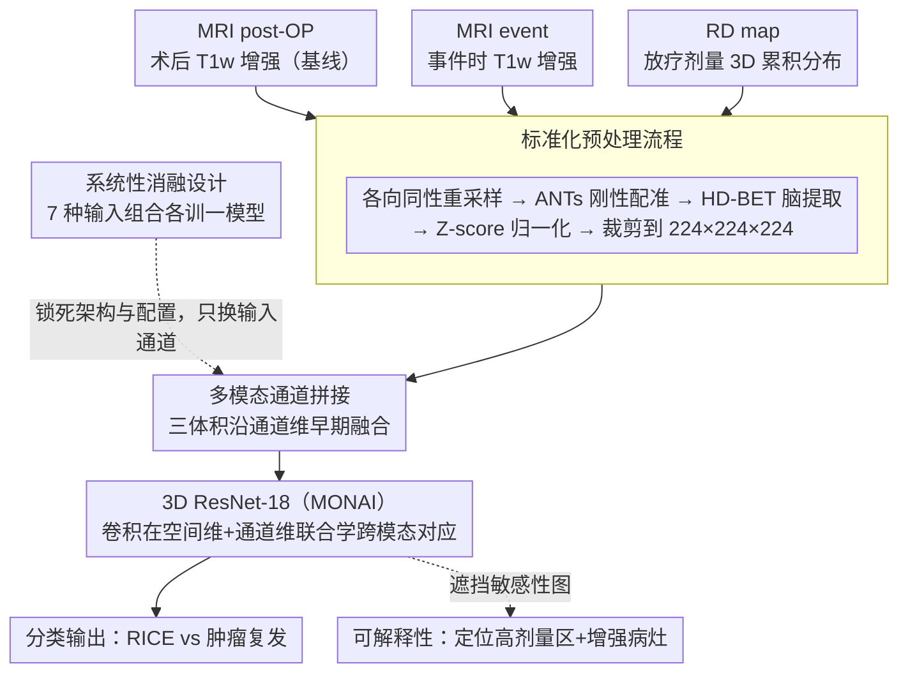

# Multimodal Classification of Radiation-Induced Contrast Enhancements and Tumor Recurrence Using Deep Learning

**会议**: CVPR 2026  
**arXiv**: [2603.11827](https://arxiv.org/abs/2603.11827)  
**代码**: 无  
**领域**: 医学图像  
**关键词**: 脑肿瘤, 放射诱导对比增强, 多模态分类, 纵向MRI, 放疗剂量图

## 一句话总结

提出 RICE-NET，一个多模态 3D ResNet-18 模型，整合纵向 MRI 数据与放疗剂量分布图，用于自动区分胶质母细胞瘤术后放射诱导对比增强（RICE）与肿瘤复发，在独立测试集上达到 F1=0.92。

## 研究背景与动机

### 1. 领域现状
胶质母细胞瘤（GBM）术后放疗是标准治疗，但放疗可能损伤正常脑组织。随访影像中新出现的对比增强病灶面临关键鉴别诊断：是肿瘤复发还是放射诱导对比增强（RICE）？两者在 MRI 上表现相似，目前需要跨学科肿瘤委员会耗时评估影像轨迹才能鉴别。

### 2. 痛点
(1) 现有方法依赖临床上稀缺的弥散 MRI；(2) 大多数研究未纳入放疗剂量信息，而剂量图在临床肿瘤委员会中正受到越来越多的关注；(3) 忽略了影像的纵向演变信息（术后→事件时的变化）。

### 3. 核心矛盾
临床上 RICE 与肿瘤复发的鉴别极其困难且高度依赖专家经验，但自动化方法缺乏对放疗剂量空间分布的建模能力，且未充分利用常规 T1 加权 MRI（相比稀缺的弥散 MRI）。

### 4. 切入角度
将纵向常规 T1w MRI（术后+事件时）与放疗剂量图作为多通道输入，使用简单但有效的 3D ResNet-18 进行分类。

## 方法详解

### 整体框架

RICE-NET 基于 3D ResNet-18（MONAI 框架），输入为多通道 3D 体积，各通道对应不同的成像时间点和模态：
- **MRI post-OP**：术后 T1w 对比增强 MRI（基线）
- **MRI event**：检测到新病灶时的 T1w 对比增强 MRI（诊断时刻）
- **RD map**：放疗剂量空间分布图（3D 累积剂量）

多模态输入沿通道维度拼接（channel-wise concatenation），模型自动学习跨模态交互。

### 关键设计

**1. 标准化预处理流程：把异构来源的体积对齐到同一空间网格**

多通道拼接成立的前提是三个体积逐体素空间对齐——否则卷积核在某个位置看到的"剂量"和"病灶"根本不是同一块脑区，跨模态对应无从学起。为此本文走了一条固定的预处理链：各向同性重采样统一体素间距 → ANTs 把各时间点 MRI 与剂量图刚性配准到同一参考空间 → HD-BET 做脑提取去掉颅骨与背景 → Z-score 归一化抹平不同扫描仪的强度差异 → 统一裁剪到 224×224×224。还有一处临床细节：放疗剂量图（RD map）记录的是累积剂量，但部分患者档案里只存了单次分割（fraction）的剂量，于是按分割次数线性缩放推算出总剂量，保证所有病例的剂量通道量纲一致。

**2. 多模态通道拼接：用早期融合让一个网络同时看 MRI 与剂量图**

RICE 与肿瘤复发在单张 MRI 上几乎无法区分，这正是临床痛点；要让模型有判别力，必须把"术后基线影像""事件时影像""放疗剂量空间分布"这三种互补信息一起喂进去。本文用的是最朴素的早期融合（early fusion）：把三个 3D 体积沿通道维度拼接成多通道输入，再交给同一个 3D ResNet-18，让卷积核在空间维和通道维上同时滑动，自己去发现"哪块高剂量区域对应了哪块新增强病灶"这种跨模态空间对应关系。之所以不上更花哨的跨模态注意力或晚期融合，是因为整个队列只有 92 例——在这种数据量下，复杂融合的参数量足以把训练集背下来，通道拼接配简单骨干反而是泛化更稳的务实选择，后面消融里"含剂量图的组合验证→测试不掉点、纯 MRI 组合掉 ~0.35"也印证了这一点。

**3. 系统性消融设计：用 7 种输入组合把"每种模态值多少"拆开量化**

这篇论文的真正贡献不在模型新颖，而在它干净地回答了"放疗剂量图到底有没有用"这个临床问题，而要回答它就得做严格的变量隔离。作者把三种输入穷举成 7 种组合——3 种单模态、3 种双模态、1 种全模态——网络架构、训练配置、数据增强全部锁死，唯一变化的只有拼进去的输入通道。这样任何 F1 差异都只能归因于模态本身，而非调参运气。正是这套消融让"RD 单模态就是最强（F1=0.78）、所有含 RD 的组合都碾压纯 MRI 组合"的结论站得住脚，对小数据研究而言，这种可解释的变量隔离往往比堆一个复杂模型更有信息量。

### 损失函数 / 训练策略

- **损失**：交叉熵损失 + 加权随机采样器（平衡类别）
- **优化器**：Adam
- **训练**：800 epochs，五折交叉验证（80 例训练集），独立测试集（12 例）
- **数据增强**：弹性形变、旋转、缩放、高斯噪声、亮度/伽马调整
- **评估指标**：Macro F1（精确率和召回率的调和均值）
- **可解释性**：遮挡敏感性图（Occlusion sensitivity）——在 3D 小立方体区域同步遮挡所有配准体积，观察输出概率变化

## 实验关键数据

### 主实验

**模态消融实验（F1 Macro）**

| 输入组合 | 验证F1 | 测试F1 | 说明 |
|----------|--------|--------|------|
| MRI event only | 0.58 | - | 最弱单模态 |
| MRI post-OP only | 0.70 | - | 术后基线有一定预测力 |
| **RD map only** | **0.78** | - | 单模态最强 |
| MRI post-OP + MRI event | 0.70 | - | 两个MRI组合无明显提升 |
| MRI post-OP + RD | 0.828 | - | 术后+剂量 |
| **MRI event + RD** | **0.83** | - | 验证最优双模态 |
| All three | 0.804 | **0.916** | 全模态测试最优 |

### 消融实验

| 配置 | 验证F1 | 测试F1 | 关键观察 |
|------|--------|--------|----------|
| 仅 MRI（无 RD） | 0.58-0.70 | ~0.55 | MRI-only 泛化极差（验证→测试下降 ~0.35） |
| 含 RD 的组合 | 0.78-0.83 | 0.916 | RD 是关键输入，显著提升泛化 |
| 全模态 vs 最优双模态 | 0.804 vs 0.83 | 0.916 vs - | 验证集上三模态略低于双模态，但测试集上最优 |

### 关键发现

1. **放疗剂量图是最关键输入**：单模态 F1 最高（0.78），所有含 RD 的组合均优于纯 MRI 组合
2. **MRI event 预测力最弱**：F1=0.58，说明仅从当前影像区分 RICE 与复发极其困难（这正是临床痛点）
3. **泛化差距揭示统计不确定性**：纯 MRI 实验中验证→测试 F1 下降 ~0.35，反映小队列的统计不确定性和潜在过拟合
4. **遮挡图与临床一致**：模型关注高剂量区域和对比增强病灶，证实多模态推理而非单一模态依赖
5. **术后 MRI + RD > MRI event + RD**：术后影像和剂量信息可能已编码 RICE 风险的早期标记，暗示更早期预测的可能性

## 亮点与洞察

1. **临床视角驱动**：不追求复杂架构，而是首次系统性地将放疗剂量图纳入影像分类，直接回应临床肿瘤委员会需求
2. **系统性消融方法论**：7种组合的完整消融是小数据研究的范本——变量隔离比复杂模型更有信息量
3. **遮挡敏感性可解释性**：3D 遮挡图让放射科医生能直观理解模型决策依据
4. **实用性高**：仅需常规 T1w MRI（临床广泛可用）+ 放疗计划（放疗患者必有），无需稀缺的弥散 MRI

## 局限与展望

1. **数据量极小**：仅 92 例（训练 80 + 测试 12），统计功效有限，验证-测试差距大
2. **简单融合策略**：Channel-wise 拼接可能遗漏 MRI 与剂量图之间的复杂交互
3. **缺乏正常对照**：无未受影响的受试者，模型无法学习"基线正常"
4. **二分类局限**：仅 RICE vs 复发，未考虑假性进展、混合型等更细粒度分类
5. **单中心验证**：所有数据来自海德堡大学医院，需多中心验证
6. **未探索时间信息**：纵向 MRI 仅作为静态多通道输入，未建模时间演变动态

## 相关工作与启发

- **弥散 MRI → 常规 T1w**：现有方法依赖 ADC/DSC 等高级成像，本文证明常规 MRI + 剂量图即可获得高准确率，降低了临床门槛
- **放疗剂量图的价值**：RD 单独即为最强单模态输入，强烈暗示空间剂量分布是 RICE 形成的核心决定因素
- **小数据下的务实策略**：3D ResNet-18 + 数据增强 + 类别平衡采样 + 五折交叉验证 + 多模型集成投票，是小医学数据集的标准打法

## 评分

- 新颖性: ⭐⭐⭐ 方法简单（3D ResNet + channel concat），创新主要在于首次纳入放疗剂量图
- 实验充分度: ⭐⭐⭐ 消融系统全面，但数据量极小（12例测试）
- 写作质量: ⭐⭐⭐⭐ 临床动机清晰，实验设计干净
- 价值: ⭐⭐⭐⭐ 临床意义大，证明了放疗剂量图在 RICE 鉴别中的关键作用，为更大规模研究铺路

<!-- RELATED:START -->

## 相关论文

- [\[CVPR 2026\] Reinforcing the Weakest Links: Modernizing SIENA with Targeted Deep Learning Integration](reinforcing_the_weakest_links_modernizing_siena_wi.md)
- [\[CVPR 2026\] Diffusion-Based Feature Denoising and Using NNMF for Robust Brain Tumor Classification](diffusion-based_feature_denoising_and_using_nnmf_for_robust_brain_tumor_classifi.md)
- [\[CVPR 2026\] GLEAM: A Multimodal Imaging Dataset and HAMM for Glaucoma Classification](gleam_a_multimodal_imaging_dataset_and_hamm_for_gl.md)
- [\[CVPR 2026\] Federated Modality-specific Encoders and Partially Personalized Fusion Decoder for Multimodal Brain Tumor Segmentation](federated_modality-specific_encoders_and_partially_personalized_fusion_decoder_f.md)
- [\[CVPR 2026\] Automated Detection of Malignant Lesions in the Ovary Using Deep Learning Models and XAI](automated_detection_of_malignant_lesions_in_the_ov.md)

<!-- RELATED:END -->
