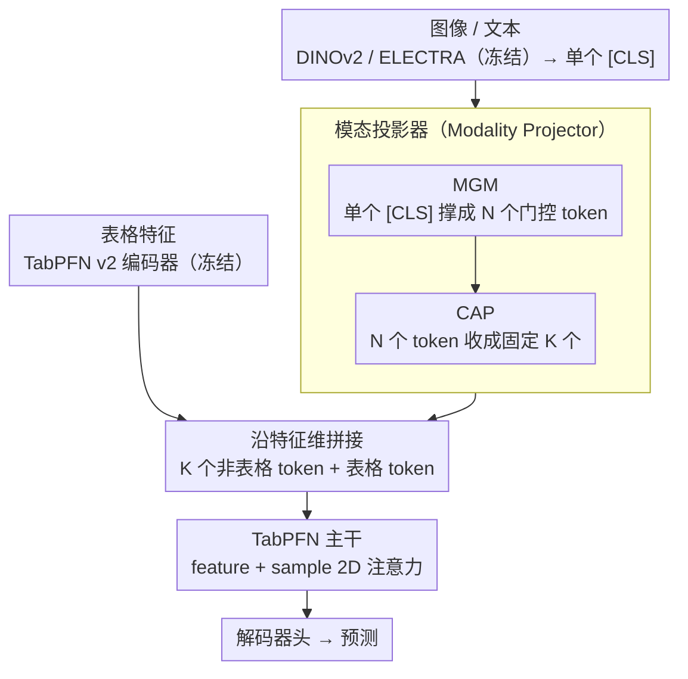

# MultiModalPFN: Extending Prior-Data Fitted Networks for Multimodal Tabular Learning

**会议**: CVPR 2026  
**arXiv**: [2602.20223](https://arxiv.org/abs/2602.20223)  
**代码**: [有](https://github.com/too-z/MultiModalPFN)  
**领域**: 医学图像  
**关键词**: 表格学习, 多模态融合, TabPFN, 注意力不平衡, 模态投影

## 一句话总结

提出 MMPFN，首次将预训练表格基础模型 TabPFN 扩展到多模态（表格+图像/文本）场景，通过多头门控 MLP（MGM）和交叉注意力池化器（CAP）解决非表格嵌入过压缩和 token 数量不平衡问题，在医学和通用数据集上超越 SOTA。

## 研究背景与动机

### 1. 领域现状
TabPFN 作为表格基础模型，通过在合成表格数据上预训练实现贝叶斯推断，在小中规模数据集上单次前向传播即可完成预测。然而 TabPFN 预训练仅限合成表格数据，无法处理图像/文本等非结构化模态。

### 2. 痛点
(1) 现实中医疗、营销等领域常需融合结构化数据和非结构化数据（诊断结果+医学影像，销售记录+产品评论）；(2) 梯度提升树扩展到异质数据收益有限；(3) 深度多模态模型在数据稀缺场景下性能差、训练慢。

### 3. 核心矛盾
TabPFN 拥有强大的表格先验但无法接入非结构化模态；简单融合会产生两个失败模式——非表格嵌入过压缩（单个 [CLS] token 信息不足）和 token 数量不匹配导致注意力不平衡（非表格 token 数>>表格 token 数时，注意力被非表格模态垄断）。

### 4. 切入角度
设计轻量级模态投影器，将非表格嵌入转换为"表格兼容 token"，在不破坏 TabPFN 表格先验的前提下注入多模态信息。

## 方法详解

### 整体框架

MMPFN 在 TabPFN 主干之外只加了一层轻量「桥接」，整条 pipeline 串成三段：

1. **逐模态编码器（Per-Modality Encoders）**：表格走 TabPFN v2 编码器，图像走 DINOv2 ViT-B/14 并取 [CLS]，文本走 ELECTRA 并取 [CLS]——三个编码器全部冻结。
2. **模态投影器（Modality Projector）**：本文贡献所在，由 MGM 和 CAP 两个子层串联，把图像/文本的单个 [CLS] 嵌入转换成 $K$ 个 $d$ 维、与表格兼容的 token。
3. **TabPFN 主干（TabPFN Backbone）**：把投影得到的非表格 token 沿特征维与表格 token 拼成一张统一表格，复用 TabPFN 的 2D 注意力（feature attention + sample attention）做预测，末端接一个解码器头。

训练时冻结所有模态编码器，只训练模态投影器、TabPFN 主干和解码器头，整个微调仅 100 次迭代。

### 关键设计

把非表格嵌入接进 TabPFN 看似只要一个线性投影，但作者发现简单做法会同时踩中两个坑：一个 [CLS] token 把整张图像/整段文本的信息压成一条向量，信息严重不够（过压缩）；而若直接把编码器输出的整串 patch/word token 都喂进去，又会让非表格 token 数量碾压表格 token，垄断注意力（不平衡）。下面三个设计正是分别堵这两个坑，再用一段理论说清为什么必须堵。

**1. Multi-Head Gated MLP（MGM）：把一个 [CLS] 撑开成多个互补 token，解过压缩**

DINOv2/ELECTRA 输出的单个 [CLS] 向量已经把一整张图或一段文本压成一条表示，直接投成一个表格 token 等于让 TabPFN 只看到非表格模态的"缩略图"。MGM 的做法是把同一个 $h_{\text{CLS}}$ 同时送进 $N$ 个独立的 MLP 头，每个头各自把编码器维度投影到 $d$ 维，从而展开出 $N$ 个 token：

$$\text{MGM}(h_{\text{CLS}}) = \{g_i \odot \text{MLP}_i(h_{\text{CLS}})\}_{i=1}^{N}$$

关键在于每个头都被一个 GLU 门控 $g_i = \sigma(W_g^{(i)} h_{\text{CLS}} + b_g^{(i)})$ 逐元素调制。门控让不同头去激活 [CLS] 里不同的子空间、产生互补而非冗余的表示——消融里 Multi-head MGM（57.37）明显高于不带门控的 Multi-head MLP（55.81），而稀疏路由的 Multi-head MoE（53.23）在小数据下反而退化，说明在这种低数据场景下"软门控 + 全头都用"比"硬路由 + 只用少数头"更稳。

**2. Cross-Attention Pooler（CAP）：把 $N$ 个 token 再收成固定 $K$ 个，平衡 token 数量**

MGM 解决了信息量，却又带来新麻烦：token 一多，非表格模态在 TabPFN 的 feature attention 里就会反客为主。CAP 用一组 $K$ 个可学习查询向量做交叉注意力，把 $N$ 个 MGM token 当 key/value 抽取信息、汇成 $K$ 个紧凑 token，再过一层 MLP 精炼，最后沿特征维与表格 token 拼接送入 backbone。这样无论编码器吐出多少信息，进入 TabPFN 的非表格 token 数都被钉死在一个可控的 $K$（数据集相关，如 PU20 用 24、Cloth 用 4），既保住了 MGM 提取的丰富度，又不让它把注意力预算吃光。正是 MGM 先充分展开、CAP 再定量收缩这一前后呼应，消除了"加非表格 token 反而掉点"的非单调现象。

**3. 注意力不平衡的理论分析：说清楚为什么 $K$ 必须被钉死**

为什么 token 数量失衡就会压制表格信号，作者给了一个 softmax 注意力下的定量解释。设 $N_I$、$N_T$ 分别为非表格和表格 token 数，$c_I$、$c_T$ 为各自的 per-token 平均注意力质量，则非表格模态拿到的总注意力份额约为：

$$\mathbb{E}[a_I] \approx \frac{N_I c_I}{N_I c_I + N_T c_T}$$

当 per-token 质量相当（$c_I \approx c_T$）而 $N_I \gg N_T$ 时，$a_I \to 1$，表格信号被几乎完全淹没。这条式子直接解释了"不压缩 token 数就会被非表格模态垄断"的根因，也给出了 CAP 的设计依据——把 $N_I$ 强制收到固定的 $K$，就是把这个份额从"随 token 数失控"拉回到"可控"。

### 损失函数 / 训练策略

- **损失**：交叉熵损失
- **优化器**：AdamW，$\text{lr}=1 \times 10^{-5}$，batch size=1
- **训练**：100 iterations 微调
- **冻结策略**：所有模态编码器冻结（TabPFN v2、DINOv2、ELECTRA），仅训练 MGM、CAP、TabPFN backbone 和 decoder head
- **推理**：沿用 TabPFN 的 in-context inference 协议

## 实验关键数据

### 主实验

**表2：图像-表格数据集（Accuracy）**

| 方法 | PU20 | Mass | Calc | PetFinder | Avg. Rank |
|------|------|------|------|-----------|-----------|
| TabPFN | 82.17 | 71.27 | 73.31 | 36.33 | 4.25 |
| CatBoost | 80.43 | **78.31** | 72.09 | 38.69 | 3.25 |
| AutoGluon | 81.09 | 76.28 | 71.04 | 38.81 | 3.50 |
| MMCL | 76.61 | 57.62 | 60.12 | 36.61 | 7.25 |
| TIP | 78.75 | 73.12 | 67.96 | 37.28 | 5.50 |
| HEALNet | 74.65 | 68.10 | 71.83 | 37.03 | 6.25 |
| **MMPFN** | **85.22** | 74.53 | **75.40** | **40.74** | **1.50** |

**表3：文本-表格数据集（Accuracy）**

| 方法 | Airbnb | Salary | Cloth | PetFinder | Avg. Rank |
|------|--------|--------|-------|-----------|-----------|
| TabPFN | 46.96 | 44.96 | 55.07 | 36.33 | 5.50 |
| AutoGluon | 44.60 | 45.24 | **72.07** | 37.96 | 3.00 |
| TTT | 38.3 | **47.2** | 65.5 | 38.9 | 3.00 |
| **MMPFN** | **47.78** | 46.17 | 66.26 | **39.04** | **1.75** |

MMPFN 在图像-表格平均排名 1.50，文本-表格平均排名 1.75，全面领先。医学数据集 PU20 提升最大（+3.05% vs TabPFN）。

### 消融实验

| 配置 | Avg. Accuracy | 说明 |
|------|---------------|------|
| Single-head Linear | 53.86 | 最简投影，过压缩 |
| Single-head MLP | 54.14 | 略优于线性 |
| Multi-head MLP | 55.81 | 多头扩展有效 |
| Multi-head MoE | 53.23 | 稀疏路由在小数据下不稳定 |
| **Multi-head MGM** | **57.37** | GLU 门控最优 |

### 关键发现

1. **注意力不平衡确实存在**：仅非表格输入时，增加 MGM 头数持续提升性能；但表格+非表格混合时，增加非表格 token 反而降低性能（非单调），证实了理论分析
2. **MGM+CAP 协同**：MGM 先充分提取→CAP 再压缩到固定 token 数，两者结合消除了非单调性
3. **TabPFN 的跨模态潜力**：仅用图像/文本输入（无表格）时，MMPFN 仍可媲美 DINOv2+MLP，说明 TabPFN 的合成表格先验可迁移到非表格特征
4. **低数据鲁棒**：10% 数据下仍优于 TIP（使用全部无标签数据做自监督预训练），PFN 先验在小样本下更有优势
5. **模态越多越好**：PetFinder 上 T→T+t→T+I→T+I+t 准确率单调递增

## 亮点与洞察

1. **首个将 TabPFN 扩展到多模态的工作**：理念新颖——将非结构化数据"表格化"后利用强大的表格先验
2. **注意力不平衡的理论分析**：给出了 softmax 注意力在 token 数量不匹配下的数学推导，为 CAP 设计提供理论依据
3. **极低训练成本**：仅 100 iterations 微调、batch size=1，所有编码器冻结，适合资源受限的医学场景
4. **跨模态嵌入相关性分析**：余弦相似度可视化展示了 MMPFN 确实学到了跨模态交互而非仅模态内结构

## 局限与展望

1. **PU20 以外的医学评估有限**：CBIS-DDSM 两个子集结果差异大（Mass 排第3，Calc 排第1），稳定性存疑
2. **仅分类任务**：未验证回归、生存分析等常见医学场景
3. **非表格编码器固定**：DINOv2/ELECTRA 冻结，未探索端到端微调的效果
4. **CAP 的 $K$ 值手动设定**：PU20 用 24，Cloth 用 4，不同数据集需调参
5. **缺乏与大型多模态模型的比较**：如 GPT-4V、LLaVA 等在医学多模态场景的对比

## 相关工作与启发

- **TabPFN 的先验迁移**：TabPFN 在合成数据上学到的"表格分布先验"可以被巧妙地用于处理非表格数据，这种"万物表格化"的思路有启发性
- **注意力不平衡问题**：不仅存在于多模态 TabPFN，也广泛存在于 VLM 中长文本 vs 短图像序列的场景
- **MGM 与 Q-Former 的联系**：CAP 的交叉注意力池化与 BLIP-2 的 Q-Former 异曲同工，但更轻量

## 评分

- 新颖性: ⭐⭐⭐⭐ 首次将 TabPFN 扩展到多模态，MGM+CAP 设计有理论支撑
- 实验充分度: ⭐⭐⭐ 6个数据集覆盖医学和通用场景，但医学评估深度不够
- 写作质量: ⭐⭐⭐⭐ 理论分析清晰，实验组织系统
- 价值: ⭐⭐⭐⭐ 为表格基础模型的多模态扩展开辟了新方向，医学小数据场景实用性强

<!-- RELATED:START -->

## 相关论文

- [\[ECCV 2024\] TIP: Tabular-Image Pre-training for Multimodal Classification with Incomplete Data](../../ECCV2024/medical_imaging/tip_tabular-image_pre-training_for_multimodal_classification_with_incomplete_dat.md)
- [\[CVPR 2026\] Extending ZACH-ViT to Robust Medical Imaging: Corruption and Adversarial Stress Testing in Low-Data Regimes](extending_zach-vit_to_robust_medical_imaging_corruption_and_adversarial_stress_t.md)
- [\[CVPR 2026\] GLEAM: A Multimodal Imaging Dataset and HAMM for Glaucoma Classification](gleam_a_multimodal_imaging_dataset_and_hamm_for_gl.md)
- [\[CVPR 2026\] PGR-Net: Prior-Guided ROI Reasoning Network for Brain Tumor MRI Segmentation](pgr-net_prior-guided_roi_reasoning_network_for_brain_tumor_mri_segmentation.md)
- [\[CVPR 2026\] Multimodal Classification of Radiation-Induced Contrast Enhancements and Tumor Recurrence Using Deep Learning](multimodal_classification_of_radiation-induced_contrast_enhancements_and_tumor_r.md)

<!-- RELATED:END -->
