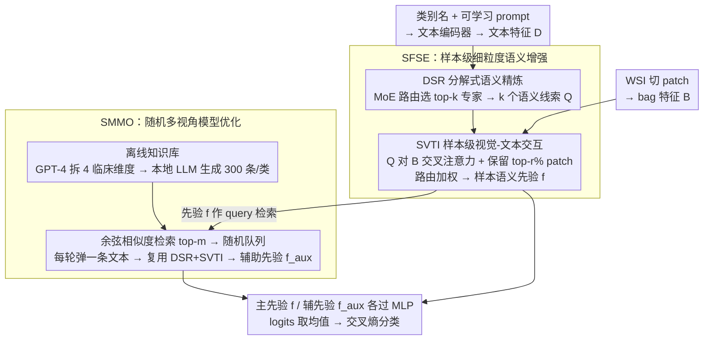

<!-- 由 src/gen_stubs.py 自动生成 -->
# MUSE: Harnessing Precise and Diverse Semantics for Few-Shot Whole Slide Image Classification

**会议**: CVPR2026  
**arXiv**: [2602.20873](https://arxiv.org/abs/2602.20873)  
**代码**: [JiahaoXu-god/CVPR2026_MUSE](https://github.com/JiahaoXu-god/CVPR2026_MUSE)  
**领域**: 医学图像  
**关键词**: 全切片图像分类, 少样本学习, 多实例学习, 视觉-语言模型, 语义增强, MoE, 知识库检索

## 一句话总结

提出 MUSE 框架，通过 MoE 驱动的样本级细粒度语义增强（SFSE）和基于 LLM 知识库的随机多视角语义优化（SMMO），在少样本全切片图像分类任务上显著提升泛化能力。

## 背景与动机

1. **全切片图像（WSI）的标注极度稀缺**：WSI 标注需要病理学专家，加上隐私法规限制，每个诊断类别往往仅有极少标注样本，少样本学习范式成为刚需。
2. **多实例学习（MIL）是 WSI 分析的标准框架**：将 WSI 切分为 patch，提取特征后做 bag-level 聚合。但在少样本场景下，纯视觉特征不足以捕捉区分病理亚型的关键信息。
3. **视觉-语言模型（VLM）引入文本语义辅助分类**：PLIP、CONCH、MUSK 等病理领域预训练模型提供了跨模态编码器，已有工作用 LLM 生成的文本描述辅助分类。
4. **现有方法的语义使用过于粗糙**：LLM 仅作为描述生成器，产出的文本是静态的类别级先验，所有样本共享同一描述，缺乏样本级适配。
5. **单一全局查询无法解耦细粒度诊断属性**：肿瘤分级、免疫浸润等复杂概念被折叠到一个全局 query 中，视觉-语义对齐粗糙，无法精准定位诊断关键区域。
6. **文本多样性不足导致过拟合**：依赖未优化的固定提示词，忽略临床语言在抽象层次、语境细微差异和句法表述上的结构多样性，少样本下极易过拟合到特定措辞。

## 方法详解

### 整体框架

MUSE 要解决的是少样本全切片图像（WSI）分类下「语义用得太粗」的问题：现有方法把 LLM 当描述生成器，所有样本共享同一条静态类别级文本，既不够精准也不够多样。它的整体思路是把语义同时往「精」和「多」两个方向推——SFSE（样本级细粒度语义增强）负责为每张 WSI 量身定制精确的语义感知，SMMO（随机多视角模型优化）负责注入丰富的语义多样性，两条线产出的先验在分类头处融合，共同提升泛化。

### 关键设计

**1. SFSE：把全局类别语义拆成专家子概念，再按样本定制**

传统做法把肿瘤分级、免疫浸润等复杂概念折叠进一个全局 query，视觉-语义对齐粗糙、定位不到诊断关键区域。SFSE 分两步破这个粗糙度。第一步是分解式语义精炼（DSR）：给每个类别名附加 $M$ 个可学习 prompt 向量经文本编码器得到类别文本特征 $D$，再借 MoE 范式建 $R$ 个专家查询矩阵、由路由网络为每个类别选 top-k 专家，路由得分上注入输入依赖的高斯噪声以鼓励专家多样、防止坍塌，于是每个类别产出 $k$ 个分别编码不同诊断子概念的细粒度语义线索。第二步是样本级视觉-文本交互（SVTI）：以这些语义线索为 query 对 WSI 的 patch 特征做多头交叉注意力，只保留注意力得分 top-r% 的 patch 以聚焦相关区域，再用路由得分加权融合 $k$ 个线索的交互结果，得到这一张样本专属的语义先验 $f$。这样语义就从「类别级静态」升级为「子概念级、样本自适应」。

**2. SMMO：用 LLM 知识库 + 随机采样把语义多样性当数据增强**

少样本下若依赖固定提示词，模型极易过拟合到某种特定措辞。SMMO 先离线建知识库：用 GPT-4 把类别名拆成细胞形态、组织结构、染色特征、空间纹理模式四个临床维度，每维度生成 10 个示例描述随机组合后，由本地 Qwen2-7B 为每类生成 300 条多视角描述并编码入库。训练时用 SFSE 的样本先验 $f$ 经余弦相似度检索 top-m 条匹配文本，每次迭代从检索队列里随机弹出一条，再走一遍 DSR+SVTI 得到辅助先验 $f_{\text{aux}}$；主、辅先验各自经 MLP 映射成 logits 取均值后用交叉熵训练。每轮迭代看到的语义视角都不同，等于在语义空间里做数据增强，从而压制过拟合。

### 损失函数 / 训练策略

标准交叉熵：$\mathcal{L}^{t} = \text{CE}(z^{t}_{\text{final}}, GT)$，其中主辅先验 logits 取均值 $z^{t}_{\text{final}} = (z + z^{t}_{\text{aux}}) / 2$。

## 实验关键数据

### 主实验：三个数据集 × 三种 few-shot 设置

在 CAMELYON、TCGA-NSCLC、TCGA-BRCA 上以 4/8/16-shot 设置评估（10 次重复取均值±标准差）：

| 数据集 | 设置 | ACC | AUC | F1 |
|--------|------|-----|-----|-----|
| CAMELYON | 4-shot | **74.86** (vs FOCUS 68.13, +6.73) | **76.65** | **68.66** |
| CAMELYON | 8-shot | **84.01** (vs FOCUS 80.33, +3.68) | **88.32** | **82.42** |
| CAMELYON | 16-shot | **89.70** (vs FOCUS 88.62, +1.08) | **92.52** | **88.59** |
| NSCLC | 4-shot | **79.90** (vs FOCUS 79.14, +0.76) | **87.57** | **79.85** |
| NSCLC | 8-shot | **87.27** (vs FOCUS 86.04, +1.23) | **94.27** | **87.20** |
| NSCLC | 16-shot | **89.74** | **96.82** | **89.70** |
| BRCA | 4-shot | **84.14** (vs ViLa 81.80, +2.34) | **86.66** | **73.81** |
| BRCA | 8-shot | **84.37** | **88.39** | **76.29** |

关键发现：标注越少增益越大，4-shot 设置下 CAMELYON ACC 提升达 6.73%。

### 消融实验（CAMELYON）

| 配置 | 4-shot ACC | 8-shot ACC | 16-shot ACC |
|------|-----------|-----------|------------|
| Base MIL | 62.04 | 71.52 | 82.37 |
| +TI（传统交互） | 65.13 | 79.10 | 86.61 |
| +TI+SFSE | 65.16 | 80.85 | 86.72 |
| +TI+SMMO | 71.18 | 83.68 | 87.99 |
| +TI+SFSE+SMMO（完整） | **74.86** | **84.01** | **89.70** |

- SMMO 在低数据设置贡献最大（4-shot 提升 ~6%），SFSE 与 SMMO 联合使用有协同增益。
- 余弦相似度检索 > L2 范数 > 随机检索。
- 随机优化策略 > 多文本均值优化（4-shot ACC 74.86 vs 70.33）。
- 知识库 LLM 选择：Qwen2-7B > Deepseek-R1-7B > Llama-3.2-1B。

## 亮点

1. **首次从语义优化角度改进少样本 WSI 分类**：不仅生成语义，而且主动优化语义的精度和多样性。
2. **MoE 驱动的细粒度语义分解**：将全局类别语义分解为多个专家子概念，每个样本选择最相关的子概念，实现样本级自适应。
3. **随机多视角训练策略设计巧妙**：通过知识库检索 + 随机采样，每次迭代看到不同的语义视角，类似数据增强思想但作用于语义空间，有效抗过拟合。
4. **实验全面且增益显著**：3 个数据集 × 3 种 shot 设置，大量消融实验覆盖检索策略、优化策略、LLM 选择等维度。

## 局限与展望

1. **知识库构建依赖 GPT-4**：概念分解和示例生成阶段需调用 GPT-4 API，成本较高且难以完全离线。
2. **仅验证二分类任务**：CAMELYON（正常/转移）、NSCLC（LUAD/LUSC）、BRCA（IDC/ILC）均为二分类，多类别场景的可扩展性未验证。
3. **知识库质量与 LLM 强绑定**：消融显示不同 LLM 生成的知识库对性能影响显著，选择合适 LLM 的指导原则不够清晰。
4. **推理开销可能较大**：SFSE 中 MoE 路由 + 多头交叉注意力 + SMMO 检索环节增加了计算量，单张 3090 训练但未报告推理速度。
5. **文本知识库为离线一次性构建**：不随训练动态更新，文本多样性上限固定（每类 300 条）。

## 与相关工作的对比

| 方法 | 语义来源 | 语义粒度 | 语义多样性 | 样本自适应 |
|------|---------|---------|-----------|-----------|
| Top | 类别名文本 | 类别级 | 无 | 无 |
| ViLa-MIL | LLM 描述 | 类别级 | 有限 | 无 |
| FOCUS | LLM 描述+知识引导压缩 | 类别级 | 有限 | 部分（视觉压缩） |
| **MUSE** | LLM 知识库+MoE 分解 | **子概念级** | **300条/类 + 随机采样** | **MoE 路由 + 样本级交叉注意力** |

MUSE 的核心差异在于将语义从"静态类别描述"提升为"动态样本自适应的多视角语义优化"。

## 评分

- 新颖性: ⭐⭐⭐⭐ — MoE 细粒度语义分解 + 随机多视角优化的组合思路新颖，首次在 FSWC 中引入语义优化视角
- 实验充分度: ⭐⭐⭐⭐ — 3 数据集、多 shot 设置、丰富消融（模块/检索/优化/LLM），但缺少多分类和推理效率分析
- 写作质量: ⭐⭐⭐⭐ — 结构清晰，图示直观，公式推导完整
- 价值: ⭐⭐⭐⭐ — 对病理少样本分类有较强实用价值，语义优化思路可迁移到其他医学 VLM 任务

<!-- RELATED:START -->

## 相关论文

- [\[CVPR 2026\] Universal-to-Specific: Dynamic Knowledge-Guided Multiple Instance Learning for Few-Shot Whole Slide Image Classification](universal-to-specific_dynamic_knowledge-guided_multiple_instance_learning_for_fe.md)
- [\[CVPR 2026\] Contrastive Cross-Bag Augmentation for Multiple Instance Learning-based Whole Slide Image Classification](contrastive_cross-bag_augmentation_for_multiple_instance_learning-based_whole_sl.md)
- [\[ECCV 2024\] Pathology-knowledge Enhanced Multi-instance Prompt Learning for Few-shot Whole Slide Image Classification](../../ECCV2024/medical_imaging/pathology-knowledge_enhanced_multi-instance_prompt_learning_for_few-shot_whole_s.md)
- [\[CVPR 2026\] Dual-Level Hypergraph Generation for Addressing Feature Scarcity in Whole-Slide Image Classification](dual-level_hypergraph_generation_for_addressing_feature_scarcity_in_whole-slide_.md)
- [\[CVPR 2026\] TopoSlide: Topologically-Informed Histopathology Whole Slide Image Representation Learning](toposlide_topologically-informed_histopathology_whole_slide_image_representation.md)

<!-- RELATED:END -->
