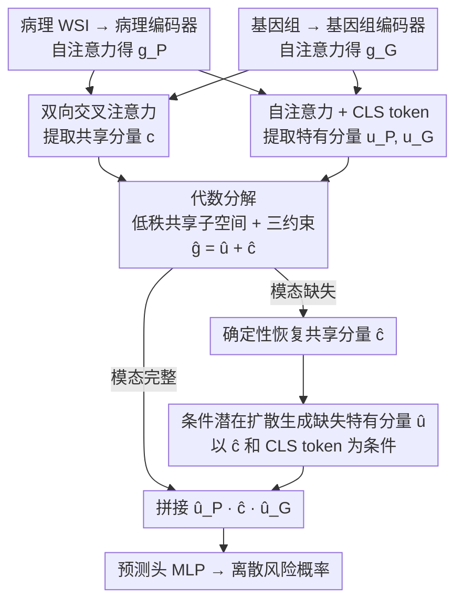

# MUST: Modality-Specific Representation-Aware Transformer for Diffusion-Enhanced Survival Prediction with Missing Modality

**会议**: CVPR 2026  
**arXiv**: [2603.26071](https://arxiv.org/abs/2603.26071)  
**代码**: [项目主页](https://kylekwkim.github.io/MUST/)  
**领域**: 医学图像
**关键词**: 生存预测, 缺失模态, 代数分解, 潜在扩散模型, 多模态融合

## 一句话总结

提出 MUST 框架，通过代数约束将多模态表征显式分解为模态特有和跨模态共享两部分，并用条件潜在扩散模型在模态缺失时生成特有信息，在五个 TCGA 癌症数据集上以 0.742 C-index 达到 SOTA，且在模态缺失场景下仅降约 0.4%-3.5%。

## 研究背景与动机

1. **领域现状**：多模态生存预测（病理 WSI + 基因组）能显著提升预后评估精度，SurvPath、CMTA 等方法通过交叉注意力实现模态融合。
2. **现有痛点**：临床场景中模态频繁缺失——基因组检测昂贵且耗时、历史数据往往只有病理没有分子数据。现有多模态模型假设数据完整，缺失时性能骤降。
3. **核心矛盾**：现有缺失模态方法分三类——特征对齐（不知缺了什么）、插值（高维空间噪声大）、联合分布学习（未解耦模态特有 vs 共享信息）。根本问题是**没有显式建模每个模态的独特贡献**。
4. **本文目标** 在模态缺失时精确识别"丢了什么信息"，并针对性恢复。
5. **切入角度**：将模态表征做代数分解，在学到的低秩共享子空间中把每个模态拆成"特有分量"和"共享分量"，共享部分可从任一可用模态确定性恢复，特有部分用条件扩散模型生成。
6. **核心 idea**：通过代数可逆约束实现"缺什么补什么"的精确重建策略。

## 方法详解

### 整体框架

这篇论文要解决的是：多模态生存预测在临床里常常缺模态（基因组检测贵、历史病例只有病理切片），而现有模型默认数据完整，一缺就崩。MUST 的思路是先把每个模态的表征拆成"别的模态也能推出来的共享部分"和"只有自己才有的特有部分"，缺模态时共享部分用数学等式直接算回来，只对真正补不回来的特有部分动用生成模型。

整体怎么转：病理 WSI 的 patch 特征集合 $P$ 和基因组 token 集合 $G$ 先各自过编码器得到全局表征 $g_P, g_G$；双向交叉注意力提取"对方携带的信息" $c_{P\leftarrow G}, c_{G\leftarrow P}$，自注意力提取模态特有分量 $u_P, u_G$；这些分量被投影到一个低秩共享子空间里完成代数分解 $g_P = \hat{u}_P + \hat{c}_{G\leftarrow P}$。数据完整时，把 $[\hat{u}_P; \hat{c}; \hat{u}_G]$ 三段拼起来送进预测头输出离散风险概率；某个模态缺失时，先靠代数关系确定性地把共享分量 $\hat{c}$ 算回来，再用条件潜在扩散模型补上缺掉的那段模态特有分量。下图是数据完整 / 缺失两条推理通路的架构数据流（渐进式两阶段训练是训练侧的设计，不在此数据流图里）：

### 关键设计

**1. 低秩共享子空间的代数分解：用一道可逆等式锁死"共享的部分缺了也能补回来"**

之前的缺失模态方法（特征对齐、插值、联合分布学习）有个共同短板——没显式建模每个模态的独特贡献，于是模态一缺，模型根本不知道到底丢了什么、该补什么。MUST 把这件事变成代数运算：构造一个可学习的低秩投影矩阵 $P_\cap = B_\cap B_\cap^T$（$B_\cap \in \mathbb{R}^{D\times r}$，$r\ll D$）并要求它幂等，于是共享分量被投影进这个子空间、特有分量被投影到它的正交补空间，两者天然分开。分解再受三个约束钳住：两个方向的交叉注意力结果要一致（共享一致性）、两个模态的特有分量互相正交（$\hat{u}_P \perp \hat{u}_G$）、同一模态的特有与共享分量正交（$\hat{u}_m \perp \hat{c}_m$）。和 ShaSpec 那种靠分布对齐隐式逼近的做法不同，这套代数约束给出的是"数学保证"——只要任一模态在手，共享分量 $\hat{c}$ 就能被确定性地反算出来，不确定性被严格挤压到特有分量这一小块上。

**2. 条件潜在扩散模型：只去生成"真正补不回来"的那点特有残差**

共享分量能算回来，可模态特有的信息（比如基因组独有的分子特征）本就无法从病理切片推断，硬补会出错。MUST 把这部分交给生成模型，但刻意把生成范围压到最小：先冻结主网络参数，再单独训一个 4 层 Transformer 去噪网络，以前一步恢复出的共享分量 $\hat{c}$ 和一个学到的模态特有 CLS token $[\text{CLS}_{u}]$ 作为条件，用 DDIM 采样 50 步生成缺失的 $\hat{u}$，推理时生成 5 个样本取平均以压住随机性。关键在于它没有去生成整个模态表征，而只生成"真正模态特有的残差"——生成空间大幅缩小，难度和方差也跟着降下来，CLS token 还为生成提供了模态结构先验。

**3. 渐进式两阶段训练：先让编码器有语义，再去做结构化分解**

如果一上来就端到端地把分解框架和生存损失一起训，模型很容易走捷径塌成退化解（比如把所有信息都塞进共享分量、特有分量学成零）。MUST 分两段走：第一阶段只用生存损失，并往全局表征里注入高斯噪声 $\epsilon_P, \epsilon_G$ 来训各模态编码器，目的是让每个编码器先单独学到有意义的、任务相关的特征；第二阶段才引入分解损失 $\mathcal{L}_{\text{decomp}}$、共享一致性损失 $\mathcal{L}_{\text{shared}}$、正交性损失 $\mathcal{L}_{\text{orth}}$，在已有语义的基础上做结构化拆分。先有语义、后有结构，分解才不会退化。

### 一个完整示例：一例只有病理、缺基因组的样本怎么走完推理

假设来了一张乳腺癌（BRCA）病例，只有病理 WSI、没有基因组数据。第一步，WSI 的 patch 特征 $P$ 过病理编码器得到 $g_P$；由于基因组缺席，正常的双向交叉注意力少了一边。第二步，靠代数等式 $g_P = \hat{u}_P + \hat{c}_{G\leftarrow P}$ 把病理里"本该和基因组共享"的那段 $\hat{c}$ 确定性地反算出来——这一步没有任何随机性，因为共享子空间的低秩投影是可逆约束保证的。第三步，缺掉的只剩基因组的模态特有分量 $\hat{u}_G$，把刚算出的 $\hat{c}$ 和基因组的 $[\text{CLS}_{u}]$ 喂给扩散去噪网络，DDIM 跑 50 步、采 5 个样本取平均，生成出 $\hat{u}_G$。第四步，把 $[\hat{u}_P; \hat{c}; \hat{u}_G]$ 重新拼齐送进预测头，输出离散风险概率。整条链路里"确定性恢复"扛下了大头、"随机生成"只补一小块，所以 BRCA 这类样本缺基因组时 C-index 反而稳（0.690→0.651 量级），整体只小幅下降。

### 损失函数 / 训练策略

- 第一阶段：$\mathcal{L}_{\text{warm}} = \mathcal{L}_{\text{surv}}(\phi([g_P; \epsilon_P])) + \mathcal{L}_{\text{surv}}(\phi([g_G; \epsilon_G]))$
- 第二阶段：$\mathcal{L}_{\text{main}} = \mathcal{L}_{\text{surv}} + \lambda_{\text{dec}}\mathcal{L}_{\text{decomp}} + \lambda_{\text{sh}}\mathcal{L}_{\text{shared}} + \lambda_{\text{orth}}\mathcal{L}_{\text{orth}}$
- LDM 阶段：标准扩散去噪损失 $\mathcal{L}_{\text{LDM}} = \mathbb{E}[\|\epsilon - \epsilon_\theta(z_t, t, \text{cond})\|^2]$
- 超参数：$\lambda_{\text{dec}}=1.0, \lambda_{\text{sh}}=1.0, \lambda_{\text{orth}}=0.5$，共享子空间秩 $r=64$，特征维度 $D=256$

## 实验关键数据

### 主实验

在 5 个 TCGA 癌症数据集（BLCA/BRCA/GBMLGG/LUAD/UCEC）上的 C-index 对比：

| 方法 | 设置 | BLCA | BRCA | GBMLGG | LUAD | UCEC | Overall |
|------|------|------|------|--------|------|------|---------|
| CMTA | 双模态完整 | 0.691 | 0.648 | 0.857 | 0.667 | 0.755 | 0.724 |
| **MUST** | **双模态完整** | **0.703** | **0.690** | **0.864** | **0.686** | **0.768** | **0.742** |
| LD-CVAE | 缺基因组 | 0.651 | 0.649 | 0.831 | 0.629 | 0.726 | 0.697 |
| **MUST** | **缺基因组** | **0.673** | **0.651** | **0.864** | **0.637** | **0.755** | **0.716** |
| ShaSpec | 缺病理 | 0.636 | 0.629 | 0.823 | 0.610 | 0.682 | 0.676 |
| **MUST** | **缺病理** | **0.702** | **0.692** | **0.865** | **0.690** | **0.748** | **0.739** |

### 消融实验

| 配置 | C-index (Overall) | 说明 |
|------|-------------------|------|
| 无热启动 | 降低 0.6-3.5% | 各数据集不等，UCEC 最明显 |
| LDM 仅用 $\hat{c}$ 条件 | 缺G: 0.712, 缺P: 0.732 | 缺少结构先验 |
| LDM 用 $[\hat{c}; \text{CLS}]$ | 缺G: 0.716, 缺P: 0.739 | CLS token 提供模态结构先验 |

### 关键发现

- 缺失病理时仅降 0.4%（0.742→0.739），缺失基因组降 3.5%（0.742→0.716）——说明 LDM 对高维噪声 patch 特征有"正则化去噪"效果
- BRCA/GBMLGG/LUAD 在缺病理时甚至性能微升，因为扩散生成过程滤除了 WSI 的高频噪声
- 分解保真度（cosine similarity）在 0.75-0.94 之间，验证代数分解的有效性
- 在 A6000 上完整数据推理 ≤70ms，缺失模态 879ms（50步 DDIM × 5样本），临床可接受

## 亮点与洞察

- **代数可逆性设计非常巧妙**：不同于 ShaSpec 的分布对齐，MUST 通过低秩投影 + 正交约束让共享分量可精确恢复，将不确定性严格限制在特有分量上。这使得缺失模态处理变成"确定性恢复 + 有限随机生成"
- **"缺失反而更好"的现象值得关注**：LDM 生成的病理特有分量因扩散去噪过程天然过滤了 WSI 的高维噪声，这为"数据增强式推理"提供了思路
- **渐进训练 + 噪声注入的组合**可迁移到其他多模态分解场景

## 局限与展望

- 仅处理两个模态（病理 + 基因组），扩展到 N 模态时两两交叉注意力的复杂度增长
- LDM 推理 879ms（5次采样取平均），在临床场景勉强可接受但仍较慢
- 分解保真度 0.75-0.94 说明代数分解并非完美，低保真情况下恢复的共享分量可能引入误差
- 可探索更轻量的生成模型（如 Flow Matching）替代 DDIM 降低采样步数

## 相关工作与启发

- **vs ShaSpec**: 同样尝试分离共享/特有信息，但 ShaSpec 用分布对齐（head distillation），缺乏代数可逆性保证，缺失时降幅更大（4.7% vs 3.5%）
- **vs LD-CVAE**: 联合分布学习但未解耦贡献，无法处理缺病理场景（单向架构），MUST 双向对称
- **vs CMTA**: 同样用交叉注意力但无缺失机制，MUST 证明"仅交叉注意力不够，需要代数框架防止模态坍缩"

## 评分

- 新颖性: ⭐⭐⭐⭐ 代数分解 + 条件扩散的组合很有创意，但整体框架仍是分解+生成的常见范式
- 实验充分度: ⭐⭐⭐⭐⭐ 5个数据集、3种设置、完整消融、KM曲线分析、推理延迟分析
- 写作质量: ⭐⭐⭐⭐ 数学表述清晰，但符号较多，初读门槛高
- 价值: ⭐⭐⭐⭐ 临床场景模态缺失是真实痛点，方法实用性强

<!-- RELATED:START -->

## 相关论文

- [\[CVPR 2026\] CLoE: Expert Consistency Learning for Missing Modality Segmentation](cloe_expert_consistency_learning_for_missing_modality_segmentation.md)
- [\[CVPR 2026\] H2-Surv: Hierarchical Hyperbolic Multimodal Representation Learning for Survival Prediction](h2-surv_hierarchical_hyperbolic_multimodal_representation_learning_for_survival_.md)
- [\[CVPR 2026\] Uni-Encoder Meets Multi-Encoders: Representation Before Fusion for Brain Tumor Segmentation with Missing Modalities](uni-encoder_meets_multi-encoders_representation_before_fusion_for_brain_tumor_se.md)
- [\[CVPR 2026\] Turning Pre-Trained Vision Transformers into End-to-End Histopathology Whole Slide Image Models for Survival Prediction](turning_pre-trained_vision_transformers_into_end-to-end_histopathology_whole_sli.md)
- [\[AAAI 2026\] GROVER: Graph-guided Representation of Omics and Vision with Expert Regulation for Cancer Survival Prediction](../../AAAI2026/medical_imaging/grover_graph-guided_representation_of_omics_and_vision_with_expert_regulation_fo.md)

<!-- RELATED:END -->
