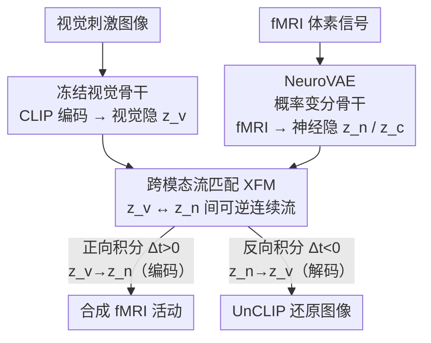

# NeuroFlow: Toward Unified Visual Encoding and Decoding from Neural Activity

**会议**: CVPR 2026  
**arXiv**: [2604.09817](https://arxiv.org/abs/2604.09817)  
**代码**: https://michaelmaiii.github.io/NeuroFlow-S (项目页)  
**领域**: 医学图像 / 脑机接口 / fMRI 视觉解码  
**关键词**: 视觉编码解码、fMRI、流匹配、跨模态对齐、变分自编码器

## 一句话总结
NeuroFlow 把"看图→脑信号"（编码）和"脑信号→看图"（解码）统一进同一个流模型：先用变分骨干 NeuroVAE 把 fMRI 压进一个语义结构化的隐空间，再用跨模态流匹配 XFM 在视觉隐分布与神经隐分布之间学一条可逆的连续流，正向积分做编码、反向积分做解码，仅用 MindEye2 约 25% 的参数就同时拿下两个任务的 SOTA 或可比表现。

## 研究背景与动机
**领域现状**：理解视觉的神经编码（external stimulus → neural activity）与解码（neural activity → stimulus）是神经科学与脑机接口的核心问题。fMRI 因其高空间分辨率成为主流测量手段。当前主流做法把编码和解码当成**两个独立任务**：编码模型（如 SynBrain、MindSimulator）用预训练视觉特征 + 体素回归预测脑响应；解码模型（如 MindEye、MindEye2、BrainDiffuser）把脑信号映射到 CLIP 等视觉-语言嵌入空间再用生成模型还原图像。

**现有痛点**：即便有工作想把两个方向连起来，也依旧是**两套独立网络**——要么在像素-体素空间做细粒度映射（重建模糊、缺语义），要么虽然桥接了神经/视觉隐空间，却用**两条独立的线性回归**分别处理编码和解码方向，没有共享表示。这导致两个本应互补的过程各练各的，无法建模二者的一致性。

**核心矛盾**：编码和解码本质上是**同一映射的正反两个方向**（贝叶斯关系下，神经分布是视觉表示的似然，视觉后验又可从神经分布反推），但现有范式把它们割裂。更深层的问题出在主流的"条件 noise-to-data 扩散"策略上：它只在某一个经验分布和高斯噪声之间建立随机对应（单向建模），且训练时从带噪经验分布出发去噪、推理时却从纯高斯噪声出发，存在**训练-推理分布鸿沟**。

**本文目标**：用单一模型统一编码与解码，且满足两个必备性质——(i) **共享隐空间**：两个过程在同一隐空间里联合优化、互相支撑；(ii) **编码-解码一致性**：合成的神经信号必须能反向还原成连贯的图像。

**核心 idea**：把编码和解码重写成共享隐空间里**一条时间相关、可逆的流**——正向积分（$z_v \to z_n$）做编码、反向积分（$z_n \to z_v$）做解码，两个任务只靠时间方向的正负区分，从而抛弃"以噪声为起点、靠条件引导"的扩散范式。

## 方法详解

### 整体框架
NeuroFlow 要解决的是"用一个模型既能由图生成脑信号、又能由脑信号还原图像"。它由三个部件拼成：一个**冻结的视觉骨干**（CLIP 编码 + UnCLIP 解码）把图像在语义隐空间和像素之间来回转换；一个可训练的**神经骨干 NeuroVAE** 把 fMRI 投影进语义对齐的概率隐空间；中间用**跨模态流匹配 XFM** 在视觉隐分布 $z_v$ 与神经隐分布 $z_n$ 之间学一条可逆流。

训练分两阶段、推理是第三阶段：Stage-1 先单独训 NeuroVAE，建立结构化的神经隐空间并保证语义一致的 fMRI 重建；Stage-2 冻住两个骨干，只训 XFM 这条流；Stage-3 推理时同一个 XFM 流——时间正向走就是编码、时间反向走就是解码。

### 关键设计

**1. NeuroVAE：用概率变分骨干把 fMRI 压成语义结构化的神经隐空间**

要让编码和解码共享隐空间，第一步得给 fMRI 一个"干净、语义对齐、还能采样"的表示，而不是死记体素级噪声。NeuroVAE 是个变分自编码器：神经编码器 $E_n$ 给定 fMRI $x_{\text{fMRI}} \in \mathbb{R}^{1\times n}$ 估计一个后验 $q(z_n \in \mathbb{R}^{m\times d} \mid x_{\text{fMRI}})$，一个线性投影再把通道维聚合成紧凑隐向量 $z_c \in \mathbb{R}^{1\times d}$，解码器 $D_n$ 据此重建 $\hat{x}_{\text{fMRI}}$。这里有个关键的**双隐向量分工**：$z_n$ 走解码方向、$z_c$ 走编码方向，把编码通路从解码过程里解耦出来，让 fMRI 合成有任务专属的抽象。引入概率（变分）建模是为了刻画"同一刺激跨试次脑响应不同"的一对多关系，而把后验拉向标准高斯则在隐空间里注入噪声、保持平滑，为后续连续流匹配铺路。相比只做编码的 SynBrain，NeuroVAE 额外加了紧凑隐 $z_c$、循环一致损失和一些结构改动来支持双向建模。

**2. 跨模态流匹配 XFM：把编码/解码改写成共享隐空间里一条可逆的流**

这是全文最核心的创新，直接针对"条件 noise-to-data 扩散单向、且训练-推理分布鸿沟"的痛点。XFM 不再从高斯噪声出发，而是**直接在视觉隐分布 $z_v$ 和神经隐分布 $z_n$ 之间**学一个时间相关向量场 $v_\theta(z,t)$，满足 ODE：

$$\frac{dz(t)}{dt} = v_\theta(z_t, t), \quad z_0 = z_v,\ z_1 = z_n.$$

向量场用 Scalable Interpolant Transformer (SiT) 参数化，中间状态由余弦插值定义 $z_t = \alpha_t z_0 + \sigma_t z_1$，其中 $\alpha_t = \cos^2(\frac{\pi}{2}t)$、$\sigma_t = \sin^2(\frac{\pi}{2}t)$，目标场 $v^*(z_t,t) = \frac{d\alpha_t}{dt} z_0 + \frac{d\sigma_t}{dt} z_1$。可逆性来自 ODE 解的唯一性：同一条学好的向量场，正向积分（$\Delta t > 0$，$t_0 \to t_1$）实现编码 $z_v \to z_n$，反向积分（$\Delta t < 0$，$t_1 \to t_0$）实现解码 $z_n \to z_v$。换句话说，编码和解码不再是两个网络、两套训练，而是**同一条流的两个时间方向**——一致性由流匹配原理"硬"约束，而非靠额外的对齐损失去凑。这也符合编码解码的贝叶斯关系：神经分布是视觉表示的似然，反向就能推出视觉后验。

**3. 对比 + 循环一致对齐：先把两个分布粗对齐，XFM 才有流可学**

XFM 能直接在两个分布间架流的前提是它们已经被粗略对齐，否则向量场无从学起。NeuroVAE 用两个对比目标完成这件事：对比损失 $\mathcal{L}_{\text{clip}} = \text{SoftCLIP}(z_n, z_v)$ 把神经隐拉去和视觉语义一致；循环一致损失 $\mathcal{L}_{\text{cyc}} = \text{SoftCLIP}(\hat{z}_n, z_v)$（其中 $\hat{z}_n = E_n(\hat{x}_{\text{fMRI}})$）则要求**重建出来的 fMRI 再编码一遍仍保持语义**，逼模型关注语义模式而不是过拟合体素级细节。消融显示：去掉这两个对比目标，检索几乎全崩（Raw 86.4%→0.3%，Syn 96.4%→0.5%），XFM 在没有任何引导下也建不起两分布间的直接流——可见这层粗对齐是 XFM 的前置必需品。

### 损失函数 / 训练策略
**Stage-1（NeuroVAE）** 用复合目标优化：

$$\mathcal{L}_{\text{VAE}} = \mathcal{L}_{\text{mse}} + \alpha \mathcal{L}_{\text{kl}} + \beta \mathcal{L}_{\text{clip}} + \lambda \mathcal{L}_{\text{cyc}}.$$

其中 $\mathcal{L}_{\text{mse}} = \|\hat{x}_{\text{fMRI}} - x_{\text{fMRI}}\|_2^2$ 保体素保真度，$\mathcal{L}_{\text{kl}}$ 把后验拉向 $\mathcal{N}(0,I)$ 注入随机性，$\mathcal{L}_{\text{clip}}$/$\mathcal{L}_{\text{cyc}}$ 做语义对齐。权重 $\alpha=0.001$（只软约束高斯先验、保留采样能力）、$\beta=\lambda=1000$（强推语义组织与语义一致重建）——作者强调这样设是把"互相冲突的目标转成互补"：$\mathcal{L}_{\text{clip}}$ 与 $\mathcal{L}_{\text{kl}}$ 平衡语义结构 vs 随机采样，$\mathcal{L}_{\text{mse}}$ 与 $\mathcal{L}_{\text{cyc}}$ 平衡体素细节 vs 语义保真。

**Stage-2（XFM）** 在冻结骨干上最小化均匀时间采样下的流匹配误差：

$$\mathcal{L}_{\text{XFM}} = \mathbb{E}_{t\sim U(0,1)}\big[\|v_\theta(z_t,t) - v^*(z_t,t)\|_2^2\big].$$

推理用 Euler 解 ODE：$z_{t+\Delta t} = z_t + \Delta t\, v_\theta(z_t,t)$，$\Delta t$ 的符号决定方向。训练硬件极省：单张 A100-40G、全程 5 小时内完成；NeuroVAE 用 AdamW 训 50 epoch（lr=1e-4、weight decay=0.05、batch 64），XFM 同配置训 50k 步。

## 实验关键数据

数据集为 Natural Scenes Dataset (NSD)，4 名完成全部 session 的被试（Sub-1/2/5/7），每人 9000 张训练图、1000 张共享测试图（每图 3 试次模拟神经变异）。解码评估语义保真度用 Inception Score (Incep)、CLIP 相似度、EfficientNet 距离 (Eff↓)、SwAV 距离 (SwAV↓)；编码评估的是"图→fMRI→图"的编码-解码一致性；检索指标看 fMRI 隐与视觉隐的 top-1 余弦相似命中率（Raw=原始 fMRI，Syn=合成 fMRI）。

### 主实验

| 方法 | 类型 | 解码 Incep↑ | 解码 CLIP↑ | 编码 Incep↑ | 编码 CLIP↑ | 检索 Raw↑ | 检索 Syn↑ |
|------|------|------|------|------|------|------|------|
| MindSimulator | 编码 E | - | - | 93.1% | 91.2% | - | - |
| SynBrain | 编码 E | - | - | 95.7% | 94.3% | 84.8% | 92.5% |
| BrainDiffuser | 解码 D | 91.3% | 90.9% | - | - | 18.8% | - |
| MindEye | 解码 D | 94.6% | 93.3% | - | - | 90.0% | - |
| MindEye2 | 解码 D | 95.4% | 93.0% | - | - | 98.8% | - |
| **NeuroFlow** | **E&D** | **95.6%** | **94.2%** | **98.6%** | **98.7%** | 80.6% | **97.0%** |

NeuroFlow 是唯一一个 E&D 统一模型：解码侧 Incep/CLIP 都拿到最佳、Eff/SwAV 也有竞争力；编码侧大幅超过所有专门编码模型。一个反直觉的结果是**用合成 fMRI 反而比原始 fMRI 解码/检索得更好**（编码 Incep 98.6% vs 解码 95.6%；检索 Syn 97.0% vs Raw 80.6%），说明 NeuroFlow 能从稀疏冗余的真实 fMRI 里蒸出任务相关的语义、合成出比原信号更"干净"的神经信号。代价是 Raw 检索略有牺牲（80.6%，低于 MindEye2 的 98.8%）。

### 效率对比

| 方法 | 类型 | 预训练 | 架构 | 参数量 |
|------|------|------|------|------|
| SynBrain | E | × | VAE+Transformer | 690M |
| MindEye | D | × | MLP+DP | 1.00B |
| MindEye2 | D | ✓ | Linear+MLP+DP | 2.60B |
| **NeuroFlow** | **E&D** | × | VAE+XFM | **660M** |

NeuroFlow 不需预训练、仅 660M 可训练参数（约 MindEye2 的 25%），却同时做编码+解码且性能可比或更优。

### 消融实验（Subject 1）

| 配置 | 解码 CLIP↑ | 编码 CLIP↑ | 检索 Raw↑ | 检索 Syn↑ | 说明 |
|------|------|------|------|------|------|
| Full NeuroFlow | 95.0% | 98.7% | 86.4% | 96.4% | 完整模型 |
| w/o $z_c$ | 94.0% | 96.6% | 84.1% | 90.4% | 去紧凑隐，各任务一致小掉 |
| w/o $\mathcal{L}_{\text{kl}}$ | 79.6% | 57.1% | 75.1% | 11.5% | 去变分采样，编码侧崩 |
| w/o $\mathcal{L}_{\text{cyc}}$ | 93.7% | 95.5% | 81.4% | 88.9% | 去循环一致，中度退化 |
| w/o $\mathcal{L}_{\text{clip}}\text{-}\mathcal{L}_{\text{cyc}}$ | 58.8% | 51.3% | 0.3% | 0.5% | 去对比对齐，检索全崩 |
| w/o $\mathcal{L}_{\text{XFM}}$ | 83.7% | 58.1% | 86.4% | 14.1% | 去流匹配，编码合成崩 |

### 关键发现
- **对比对齐（$\mathcal{L}_{\text{clip}}$-$\mathcal{L}_{\text{cyc}}$）是地基**：去掉后检索从 86.4%/96.4% 直接塌到 0.3%/0.5%，没有粗对齐 XFM 根本无流可学，编码解码全废。
- **XFM 是统一的引擎**：去掉后 Syn 检索 96.4%→14.1%、编码 CLIP→58.1%，只能产出扭曲轮廓，证明它才是真正缝合两个方向的关键模块。
- **变分采样（$\mathcal{L}_{\text{kl}}$）对编码方向至关重要**：去掉后 Syn 检索 96.4%→11.5%，概率隐空间是一对多跨模态对齐与连续流匹配的前提。
- **采样轨迹有可解释性**：编码轨迹逐步压制早期视觉响应、转向 FFA/EBA 等类别选择区；解码轨迹从一张"语义草图"（而非高斯噪声）起步逐渐精修成真实图像——路径更短、更稳。
- **脑功能层面可信**：合成 fMRI 保留了皮层功能选择性，选择性激活 FFA（人脸）、EBA（身体）、OPA/PPA（场景）等高阶功能区并抑制早期视觉区，与已知皮层组织一致。

## 亮点与洞察
- **"换时间方向 = 换任务"的统一范式**：把编码/解码归约为同一条可逆 ODE 流的正反积分，是非常优雅的形式化——一致性不靠额外 loss 拼凑，而是由流匹配 + ODE 唯一性天然保证，这个思路可迁移到任何"成对正反映射"任务（如文本↔语音、低分↔高分图像）。
- **绕开 noise-to-data**：直接在两个经验分布间架流，既消除了训练-推理分布鸿沟，又让解码从"语义草图"而非纯噪声起步，缩短采样路径、稳定轨迹——对所有"条件扩散从噪声生成"的范式是一记有力的反例。
- **合成信号优于原始信号**：用 NeuroVAE 合成的 fMRI 比真实 fMRI 解码效果还好，说明变分隐空间起到了"去噪 + 语义蒸馏"的作用，这对处理低信噪比生物信号是可复用的洞察。
- **双隐向量解耦（$z_n$ 解码 / $z_c$ 编码）**：用一个紧凑分支隔离编码专属信息，是个轻量但有效的工程巧思。

## 局限性 / 可改进方向
- **Raw 检索被牺牲**：为换取统一建模，原始 fMRI 的检索精度（80.6%）明显低于 MindEye2（98.8%），在"直接用真实脑信号做语义检索"的场景下不占优。
- **只在语义层评估**：解码/编码指标都聚焦语义保真，论文坦言未显式纳入低层视觉信息；像素级结构虽因 UnCLIP 解码器而尚可，但缺乏对低层重建质量的直接量化。
- **数据规模受限**：仅在 NSD 的 4 名被试上验证，跨被试泛化、跨数据集（EEG/MEG）迁移能力未知；fMRI 本身是神经活动的间接代理（BOLD 信号）。
- **可改进方向**：引入低层视觉先验补结构细节、探索 few-shot/跨被试适配、把可逆流框架推广到其他神经成像模态。

## 相关工作与启发
- **vs MindEye2（解码 SOTA）**：MindEye2 是纯解码、2.6B 参数且需预训练，把 fMRI 经 Linear+MLP+DP 映到 CLIP 再生成。NeuroFlow 用 660M（25%）参数同时做编码+解码、无需预训练，解码可比、编码大幅领先；劣势是 Raw 检索略逊。
- **vs SynBrain（编码 SOTA）**：SynBrain 只做编码、用条件扩散合成 fMRI。NeuroFlow 在其变分骨干思路上加紧凑隐 $z_c$ + 循环一致损失支持双向，并用 XFM 取代条件 noise-to-data，编码 CLIP 从 94.3% 提到 98.7%。
- **vs 两条独立线性回归的编解码桥接 [45]**：它们虽桥接神经/视觉隐空间但用两个独立 LR、无共享表示。NeuroFlow 用单一可逆流共享隐空间，论文还在附录用 NeuroVAE+MSE / NeuroVAE+LRs 作对照证明 XFM 不可替代。
- **vs 条件扩散（DiT/DP）跨模态对齐**：传统做法把噪声条件在一个模态上迭代逼近目标、单向且有训练-推理鸿沟；XFM 在两经验分布间建连续可逆流，从根上统一双向。

## 评分
- 新颖性: ⭐⭐⭐⭐⭐ 首次把视觉编码与解码统一进单一可逆流模型，"换时间方向即换任务"的形式化很漂亮。
- 实验充分度: ⭐⭐⭐⭐ NSD 上主结果/效率/消融/轨迹/脑功能分析齐全，但仅 4 被试、单数据集，跨域泛化未验证。
- 写作质量: ⭐⭐⭐⭐⭐ 动机推导清晰，三阶段架构和流匹配公式交代到位。
- 价值: ⭐⭐⭐⭐⭐ 为双向视觉脑机接口提供了高效统一范式与可解释的机制洞察。

<!-- RELATED:START -->

## 相关论文

- [\[ICLR 2026\] Neuro-Symbolic Decoding of Neural Activity](../../ICLR2026/medical_imaging/neuro-symbolic_decoding_of_neural_activity.md)
- [\[CVPR 2026\] Meta-learning In-Context Enables Training-Free Cross Subject Brain Decoding](meta-learning_in-context_enables_training-free_cross_subject_brain_decoding.md)
- [\[ECCV 2024\] UMBRAE: Unified Multimodal Brain Decoding](../../ECCV2024/medical_imaging/umbrae_unified_multimodal_brain_decoding.md)
- [\[CVPR 2026\] Uni-Hema: Unified Model for Digital Hematopathology](uni-hema_unified_model_for_digital_hematopathology.md)
- [\[ICLR 2026\] SEED: Towards More Accurate Semantic Evaluation for Visual Brain Decoding](../../ICLR2026/medical_imaging/seed_towards_more_accurate_semantic_evaluation_for_visual_brain_decoding.md)

<!-- RELATED:END -->
