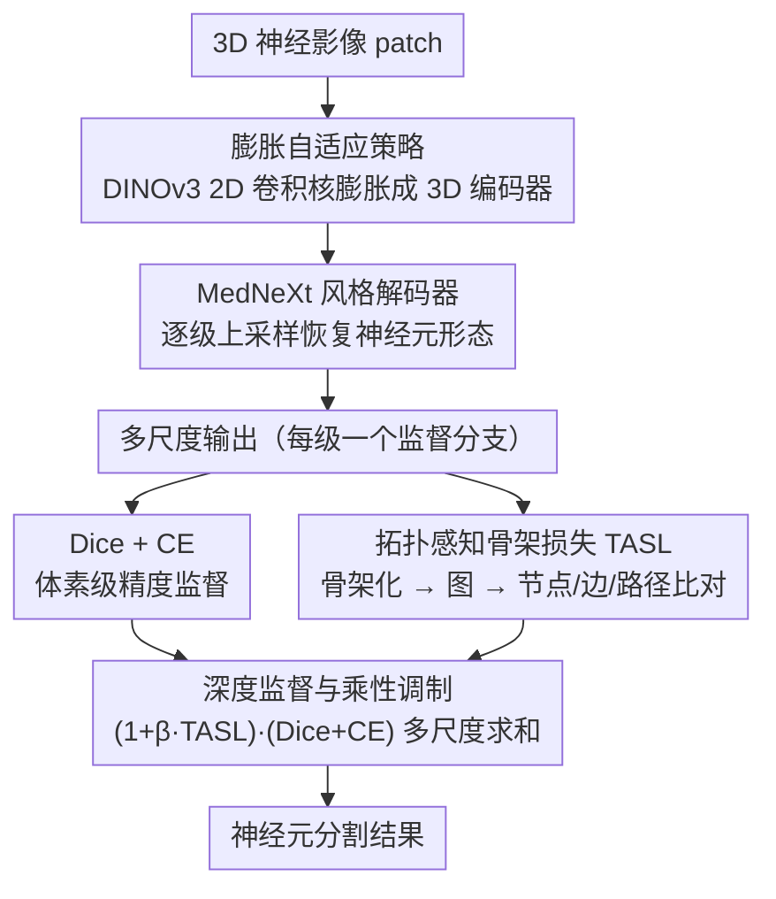

# NeuroSeg Meets DINOv3: Transferring 2D Self-Supervised Visual Priors to 3D Neuron Segmentation via DINOv3 Initialization

**会议**: CVPR 2026  
**arXiv**: [2603.23104](https://arxiv.org/abs/2603.23104)  
**代码**: [https://github.com/yy0007/NeurINO](https://github.com/yy0007/NeurINO)  
**领域**: 医学图像 / 3D分割  
**关键词**: 神经元分割, DINOv3, 2D-3D迁移, 拓扑感知损失, 数据高效学习

## 一句话总结

NeurINO 提出通过将 DINOv3 预训练的 2D 卷积核膨胀（inflate）为 3D 算子来初始化 3D 神经元分割模型，同时引入拓扑感知骨架损失（TASL）显式监督骨架级结构保真性，在四个神经影像数据集上 ESA 平均提升 2.9%、DSA 提升 2.8%、PDS 提升 3.8%。

## 研究背景与动机

1. **领域现状**：从体光学显微镜图像中精确重建神经元形态对于大脑连接组学至关重要，需要追踪轴突和树突在多个脑区的长距离投射。深度学习方法（3D U-Net、V-Net 等）已显著改进了分割质量。

2. **现有痛点**：
    - **数据稀缺**：3D 神经影像数据获取困难、标注成本极高，限制了数据驱动方法的性能；
    - **缺乏结构监督**：现有方法通常优化体素级别的精度（Dice/CE 损失），缺乏对分支拓扑、连接完整性的显式监督，导致分割结果可能在体素指标上表现良好但拓扑不保真（断裂、合并错误）；
    - **缺少 3D 基础模型**：2D 视觉基础模型（DINO、SAM 等）在自然图像上表现出色，但 3D 生物医学领域没有类似的通用基础模型。

3. **核心矛盾**：2D 基础模型拥有丰富的语义先验但无法直接用于 3D 体积数据；而 3D 数据太少无法从头训练出强大的特征表示。

4. **本文目标** 如何高效地将 2D 基础模型的视觉先验迁移到 3D 神经元分割任务，同时保证形态学拓扑保真性。

5. **切入角度**：将 3D 体积学习分解为 2D 切片内特征提取（利用 DINOv3 先验）和 3D 切片间聚合（需要额外学习），同时用拓扑感知损失引导跨切片结构学习。

6. **核心 idea**：用膨胀策略将 DINOv3 的 2D 权重迁移到 3D 编码器，让模型只需学习切片间相关性，再用骨架级拓扑损失保证形态保真。

## 方法详解

### 整体框架

这篇论文要解决的是一个很现实的窘境：3D 神经影像数据又少又贵，从头训练的 3D 分割模型学不出强特征，而真正"见多识广"的 DINOv3 只在 2D 自然图像上预训练过，没法直接搬到体积数据上。NeurINO 的整体思路是把这个迁移做成两件可拆开的事——切片内的语义提取交给 DINOv3 的现成先验，切片间的结构连续性留给模型自己学。

具体地，一个 3D 神经影像 patch 先送进 3D 编码器提取多尺度特征，这个编码器的卷积核不是随机初始化的，而是由 DINOv3 的 2D ConvNeXt 权重"膨胀"而来；随后对称的 MedNeXt 风格解码器逐级上采样、恢复精细的神经元形态。每一级输出都用 Dice + CE 监督体素精度，再叠一个拓扑感知骨架损失（TASL）盯着分支连接是否保真。

### 关键设计

**1. 膨胀自适应策略：把 DINOv3 的 2D 卷积核无损升成 3D**

数据稀缺这个痛点逼得人没法从头训 3D 模型，但若把预训练编码器直接冻住，又适配不了神经元这种细长、稀疏的分布。膨胀策略的折中是：保留 DINOv3 学到的切片内语义先验（边缘、纹理、空间模式），只让模型集中精力去学它没见过的切片间结构关系。做法是把 2D 卷积核 $W_{2D} \in \mathbb{R}^{C_{out} \times C_{in} \times k_h \times k_w}$ 沿新增的深度维展开成 $W_{3D} \in \mathbb{R}^{C_{out} \times C_{in} \times k_d \times k_h \times k_w}$。论文给了两种展开方式：**中心膨胀**把 2D 核放在 3D 核的中央深度切片、其余深度填零（$W_{3D}[:,:,c,:,:] = W_{2D}$），**平均膨胀**则把 2D 核复制到所有深度切片再除以 $k_d$。实验里中心膨胀更好，原因是它让 3D 感受野的中心切片与原 2D 感受野严格对齐，没有把深度方向的语义稀释掉；平均膨胀相当于在每个深度都摊薄了一份权重，反而模糊了原先锐利的 2D 响应。

**2. 拓扑感知骨架损失 (TASL)：在骨架图上直接惩罚断裂与误连**

Dice、CE 这类体素级损失是"拓扑无感知"的——一条轴突即使在中间断了一小截，体素重叠率可能掉得不多，但对连接组学来说这就是致命的结构错误。TASL 的做法是先用骨骼化算子 $\mathcal{S}(\cdot)$ 把预测和真值的二值分割各自抽成中心线骨架，再转成图 $G=(V,E)$，然后从三个互补的粒度比对两张图：节点级 $L_{node}$ 算两边骨架节点集的对称最近邻距离，专治分叉点错位和端点缺失；边级 $L_{edge}$ 比预测图和真值图的边数差异比例，捕捉过连接（误把两条神经元粘在一起）和欠连接（漏掉分支）；路径级 $L_{path}$ 比连通分量的平均大小差异，强调长距离的结构连续性。三项合起来，$\mathcal{L}_{TASL} = \lambda_{node}L_{node} + \lambda_{edge}L_{edge} + \lambda_{path}L_{path}$，把"形态学上像不像同一棵神经元树"这件事变成可优化的正则信号。

**3. 深度监督与乘性调制：让不可微的骨架损失也能稳定起作用**

骨骼化操作 $\mathcal{S}(\cdot)$ 本身不可微，直接拿 TASL 当梯度源会让训练不稳。论文的处理是把它做成一个调制因子而非独立损失项：在每个尺度的输出分支上，总损失写成

$$\mathcal{L}_{total} = \sum_s \lambda_s \, (1 + \beta \mathcal{L}_{TASL}^s)\,(\mathcal{L}_{Dice}^s + \mathcal{L}_{CE}^s)$$

也就是说 TASL 不直接反传，而是以乘性方式放大那些拓扑误差大的位置上 Dice/CE 的权重——哪里断了、连错了，哪里的体素学习信号就被加强。多尺度的深度监督顺带改善了梯度流、精化了不同分辨率的特征。这样既享受了拓扑监督的好处，又绕开了骨骼化不可微带来的不稳定。

### 损失函数 / 训练策略

- TASL 综合损失：$\mathcal{L}_{TASL} = \lambda_{node}L_{node} + \lambda_{edge}L_{edge} + \lambda_{path}L_{path}$
- 总损失通过深度监督在多个尺度联合优化
- 训练 110 epochs，AdamW 优化器，学习率 0.001，AMP 混合精度训练
- 推理时使用滑动窗口策略处理大体积数据
- 解码器归一化层替换为 Batch Renormalization 缓解 tiling artifacts
- 在两块 NVIDIA RTX 4060 Ti (16GB) 上完成全部实验

## 实验关键数据

### 主实验

| 方法 | Drosophila F1/HD95 | Mouse F1/HD95 | NeuroFly F1/HD95 | CWMBS F1/HD95 |
|------|-------------------|---------------|------------------|---------------|
| nnUNet | 47.20/3.20 | 52.05/10.12 | 63.36/18.33 | 36.50/16.34 |
| MedNeXt | 47.74/3.15 | 50.61/13.77 | 62.50/19.23 | 33.46/18.37 |
| NeurINO-T | **50.06/3.07** | 52.50/9.50 | **65.23/16.38** | **36.77/16.10** |
| NeurINO-S | 50.19/**3.02** | **52.73/9.24** | 65.44/16.53 | 36.55/16.27 |

重建指标（Drosophila + SmartTracing）：

| 方法 | ESA↓ | DSA↓ | PDS↓ |
|------|------|------|------|
| nnUNet | 1.67 | 4.48 | 0.20 |
| MedNeXt | 1.68 | 4.44 | 0.20 |
| NeurINO-T | **1.62** | **4.29** | **0.20** |

### 消融实验

| 配置 | F1(%) | SmartTracing ESA/DSA/PDS |
|------|-------|--------------------------|
| 平均膨胀 | 49.64 | 1.71/4.34/0.21 |
| 中心膨胀 (默认) | **50.06** | **1.62/4.29/0.20** |
| w/o TASL | 50.59 | 1.68/4.41/0.21 |
| with TASL | 50.06 | **1.62/4.29/0.20** |
| 冻结编码器 | 47.22 | 1.78/4.49/0.23 |
| 从头训练 | 48.56 | 1.76/4.37/0.23 |
| 微调 (默认) | **50.06** | **1.62/4.29/0.20** |

### 关键发现

- **中心膨胀优于平均膨胀**：中心膨胀保持了 2D 感受野的空间锚定，平均膨胀则稀释了深度语义
- **TASL 以牺牲微小的 F1 换取显著的重建精度提升**：去掉 TASL 后 F1 反而略高（50.59 vs 50.06），但重建指标大幅退化，说明 TASL 引导网络优先保证全局连接性
- **全微调远优于冻结和从头训练**：DINOv3 先验提供了关键的切片内语义，但必须通过微调适配目标分布
- NeurINO-T 在重建指标上往往优于 NeurINO-S，说明较小编码器配合膨胀策略可能泛化更好

## 亮点与洞察

- **2D→3D 迁移的思路**：将体积学习分解为"2D 切片内 + 3D 切片间"，用膨胀策略免费获得切片内先验，这个思路可迁移到其他 3D 医学任务（如器官分割、血管追踪）
- **TASL 的乘性调制设计**巧妙避开了骨骼化不可微的问题——TASL 不直接作为梯度源，而是调制 Dice/CE 的权重
- **F1 与拓扑保真的权衡**是一个重要洞察：体素级最优不等于结构级最优，这对所有管状/网络状结构分割任务都有参考价值
- 仅用两块 4060 Ti 即可完成全部实验，对硬件资源要求极低

## 局限与展望

- TASL 中的骨骼化操作是不可微的，当前只能作为间接正则项，限制了拓扑信息的梯度传递
- 膨胀策略是一种静态初始化方法，无法动态适配不同模态的各向异性分辨率
- 仅验证了 ConvNeXt 架构，未探索 ViT 类架构的膨胀迁移
- 数据集规模较小（最大 245 volumes），在大规模数据上的表现有待验证
- 未与 SAM3D、UniverSeg 等最新 3D 通用分割方法比较

## 相关工作与启发

- **vs nnUNet**：nnUNet 是自适应的通用分割框架但从头训练，NeurINO 通过迁移 2D 先验在数据稀缺时显著优于它（F1 提升 2-3%）
- **vs MedNeXt**：MedNeXt 参数量更大（62M vs 39M）但性能反而更差，说明大模型在小数据集上不一定有优势
- **vs Skeleton Recall Loss**：之前的骨架损失只关注中心线覆盖，TASL 在图级别建模节点、边和路径一致性，提供更细粒度的拓扑监督
- 膨胀策略借鉴了 I3D 的思想，但针对分割任务做了简化和改进

## 评分

- 新颖性: ⭐⭐⭐⭐ DINOv3 → 3D 的膨胀迁移在神经元分割中是新的；TASL 的三级拓扑损失设计有创意
- 实验充分度: ⭐⭐⭐⭐ 四个数据集 + 两种追踪算法 + 详细消融，但缺少与更多 3D 预训练方法的比较
- 写作质量: ⭐⭐⭐⭐ 结构清晰，动机论述合理，图示直观
- 价值: ⭐⭐⭐⭐ 为资源受限的 3D 生物医学分割提供了实用的低成本方案

<!-- RELATED:START -->

## 相关论文

- [\[CVPR 2026\] Revisiting 2D Foundation Models for Scalable 3D Medical Image Classification](revisiting_2d_foundation_models_for_scalable_3d_medical_image_classification.md)
- [\[CVPR 2026\] Dual-Level Confidence based Implicit Self-Refinement for Medical Visual Question Answering](dual-level_confidence_based_implicit_self-refinement_for_medical_visual_question.md)
- [\[AAAI 2026\] NeuroBridge: Bio-Inspired Self-Supervised EEG-to-Image Decoding via Cognitive Priors and Bidirectional Semantic Alignment](../../AAAI2026/medical_imaging/neurobridge_bio-inspired_self-supervised_eeg-to-image_decoding_via_cognitive_pri.md)
- [\[CVPR 2026\] Learning Generalizable 3D Medical Image Representations from Mask-Guided Self-Supervision](learning_generalizable_3d_medical_image_representations_from_mask-guided_self-su.md)
- [\[CVPR 2026\] Uni-Encoder Meets Multi-Encoders: Representation Before Fusion for Brain Tumor Segmentation with Missing Modalities](uni-encoder_meets_multi-encoders_representation_before_fusion_for_brain_tumor_se.md)

<!-- RELATED:END -->
