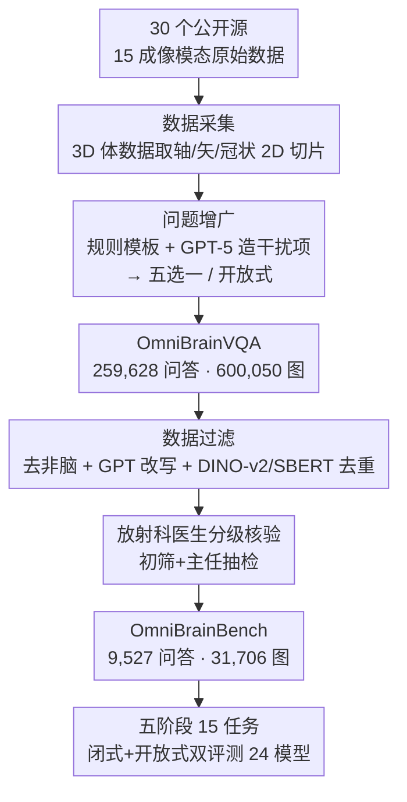

# OmniBrainBench: A Comprehensive Multimodal Benchmark for Brain Imaging Analysis Across Multi-stage Clinical Tasks

**会议**: CVPR 2026  
**论文**: [CVF Open Access](https://openaccess.thecvf.com/content/CVPR2026/html/Peng_OmniBrainBench_A_Comprehensive_Multimodal_Benchmark_for_Brain_Imaging_Analysis_Across_CVPR_2026_paper.html)  
**代码**: 已公开（论文称 release benchmark and code）  
**领域**: 医学图像 / 多模态VLM / Benchmark  
**关键词**: 脑影像、多模态VQA、临床工作流、基准评测、MLLM 评估

## 一句话总结
OmniBrainBench 是首个覆盖脑影像分析完整临床流程的多模态 VQA 基准：从 30 个验证过的数据源采集 15 种成像模态、构建 9,527 条经放射科医生核验的问答对（31,706 张图），按"解剖识别→病灶定位→诊断推理→预后判断→治疗管理"五大临床阶段拆成 15 个多阶段任务，评测 24 个 SOTA 模型，揭示最强模型 Gemini-2.5-Pro（66.58%）仍远落后于医生（91.35%）。

## 研究背景与动机
**领域现状**：脑影像分析是现代诊疗决策的基石（可视化结构/功能异常、检出早期病变、纵向监测神经疾病），传统上高度依赖医生主观经验、存在变异与延迟。多模态大模型（MLLM）在自然图像的感知、上下文理解与跨模态推理上展现潜力，被寄望于辅助脑影像分析。要落地，就需要一个能贴合多阶段临床工作流、评估 MLLM 理解力的专门基准。

**现有痛点**：现有脑影像基准有两大硬伤。其一是**模态覆盖太窄**：多数只盯有限模态，覆盖不到结构/功能/分子神经影像的常用谱系——如 Brain Tumor VQA 只有结构 MRI，漏掉 fMRI、弥散、PET 等；NOVA 只有解剖 MRI、不含核医学。但真实临床高度依赖模态多样性，比如卒中要从平扫 CT 排除出血、再加 DWI/SWI/FLAIR 勾画损伤组织。其二是**任务覆盖太碎**：完整临床流程从解剖识别→病灶定位→治疗规划→预后评估，而现有基准只覆盖其中一小段，如 VQA-RAD 偏基础发现、NOVA 偏定位却不接预后，无法评估端到端临床胜任力。

**核心矛盾**：存在一道"视觉到临床"的鸿沟——现有基准既不在模态上贴合神经影像临床现实，也不在任务上贯穿完整诊疗链路，导致对 MLLM 真实脑影像能力的评估系统性地被高估或片面化。

**本文目标**：构建一个同时满足"全模态覆盖 + 全临床阶段覆盖 + 严格临床验证 + 闭式与开放式双评测"的脑影像基准，并据此体检 24 个主流 MLLM，量化它们与医生的差距、定位短板阶段。

**切入角度**：把基准结构直接对齐真实临床工作流的五个阶段，让每个任务都对应医生实际要回答的问题（"找到什么/在哪/是什么病/会怎样/怎么治"），从而能精确诊断模型在流程哪一环掉链子。

**核心 idea**：以"临床流程"为骨架组织模态与任务，先从 30 源构建 59 万图、26 万问答的大规模指令集 OmniBrainVQA，再经多轮放射科医生审核蒸馏出 9,527 条高质量评测对，形成 OmniBrainBench。

## 方法详解

### 整体框架
OmniBrainBench 不是模型而是评测基准，核心贡献是一条严谨的"数据构建管线"和一套"对齐临床流程的多维评测体系"。管线分三步：先**数据采集**（30 个公开脑影像源、15 模态），再**问题增广**（规则模板 + GPT 生成五选一题）得到 259,628 问答 / 600,050 图的 OmniBrainVQA，最后**数据过滤**（去非脑内容 + GPT 改写 + 嵌入去重 + 临床核验）蒸馏出 9,527 条评测对 / 31,706 图的 OmniBrainBench。评测时按五大临床阶段下的 15 个子任务，对 24 个模型做闭式（准确率）与开放式（ROUGE/BLEU/BERTScore + LLM 裁判）双评测，并以医生表现为参照系。

### 关键设计

**1. 临床流程对齐的五阶段 15 任务体系：把评测做成端到端诊疗链**

针对"任务覆盖太碎"的痛点，OmniBrainBench 把任务严格对齐真实临床决策链："解剖与影像评估（AIA）→病灶识别与定位（LIL）→诊断综合与因果推理（DSCR）→预后判断与风险预测（PJRF）→治疗周期管理（TCM）"。每个阶段下挂具体子任务，共 15 个：AIA 含解剖结构识别(ASI)/影像模态识别(IMI)/解剖功能理解(AFU)，回答"我们看到什么"；LIL 含异常筛查(AS)/病灶特征描述(LFD)/病灶定位(LL)，回答"异常在哪、长什么样"；DSCR 含疾病诊断推理(DDR)/病理机制关联(PMC)，回答"是什么病、为何发生"；PJRF 含风险分层(RS)/预后因素分析(PFA)/临床体征预测(CSP)/药物反应预测(DRP)，回答"接下来会怎样"；TCM 含术前评估(PA)/治疗方案选择(TPS)/术后结果评估(POA)，构成"决策—执行—评估"闭环。这样能逐环定位模型短板，而非给一个笼统分数。

**2. 全模态覆盖 + 防泄漏切片采样：贴合神经影像临床现实**

针对"模态覆盖太窄"的痛点，基准纳入 15 种模态并建立粗/细粒度层级关系：粗粒度有 CT、MRI、PET、SPECT、解剖图(ADiag)、组织病理(HI)，细粒度有 DWI、SWI、FLAIR、T1W、T1CE、T2W、MRA、PD、fMRI（如 MRI 是 T1W/T2W/FLAIR/DWI/fMRI 的父类）。模态按临床用途分五组（基础结构、病理敏感结构、功能与分子、连接与代谢、多模态与序列影像）。对原始 3D 体数据，作者咨询放射科医生沿轴位/矢状位/冠状位选 2D 切片，**刻意打散像素级检索关系以缓解数据泄漏**；并专门把 NEJMIC、Radiopaedia、StrokQD 作为开放式 VQA 源（含临床专家的推理说明）。

**3. 规则 + GPT 双路问题增广与多级去重：高质量、抗记忆泄漏**

为把采集到的原始数据变成评测题，作者用两条增广路径：对疾病/模态特异的样本，从临床文档抽元数据按标准模板生成题与选项（规则路）；对有多粒度文字描述的样本，用 GPT-5 API 造**似真干扰项**，形成五选一、且五个选项对专业人士都"看似合理"（GPT 路）。即便图像是公开的，VQA 对都经结构化提示**重新改写**，防止 MLLM 检索记忆中的答案。随后用 Sentence Transformers 编码文本、DINO-v2 编码图像得到嵌入，借 K-center 聚类选每组最靠质心的样本做去重，保证代表性与去冗余。

**4. 放射科医生分级核验：把"图盲猜测"挡在门外**

为保证临床正确性，蒸馏阶段引入分级人工核验工作流：先由三位初级医师做初筛过滤（剔除低质量图像、模糊问答、非脑内容），再由有 13 年以上经验的主任放射科医师随机抽样复核，确保医学正确性并**严格消除纯语言偏置**，防止模型不看图就能蒙对。正是这一步把 26 万规模的 OmniBrainVQA 收敛成 9,527 条可信评测对。

## 实验关键数据

### 基准规模与对比
| 基准 | 图像数 | 问答对 | 模态 | 任务 | 开放式 |
|------|--------|--------|------|------|--------|
| Brain Tumor VQA | 750 | 14,015 | 1 | 3 | 否 |
| NOVA | 906 | 281 | 1 | 4 | 是 |
| PMC-VQA* | 10,799 | 12,591 | 12 | 7 | 否 |
| PubMedVision* | 34,929 | 53,554 | 3 | 2 | 否 |
| OmniBrainVQA（指令集） | 600,050 | 259,628 | 15 | 15 | 是 |
| **OmniBrainBench（评测集）** | **31,706** | **9,527** | **15** | **15** | **是** |

（带 * 为含脑影像的通用基准，仅其脑部子集可比。）闭式评测 6,823 条五选一、开放式 2,704 条自由描述。

### 24 模型评测主结果（闭式 VQA 总体准确率，节选）
| 模型 | 类型 | Overall ACC |
|------|------|-------------|
| Physician（医生参照） | 人类 | **91.35** |
| Gemini-2.5-Pro | 专有 | 66.58 |
| HuatuoGPT-V-34B | 医学专用 | 63.56 |
| InternVL3-8B | 开源通用 | 53.25 |
| Janus-Pro-7B | 开源通用 | 45.11 |
| MedGemma-4B | 医学专用 | 48.04 |
| Llava-Med-7B | 医学专用 | 38.84 |

### 关键发现
- **人机鸿沟巨大**：医生平均 91.35%，最强模型 Gemini-2.5-Pro 仅 66.58%，差距约 24.77 个百分点，凸显脑影像同时需要精确视觉解读与专业临床知识。
- **医学专用模型表现高度分化**：HuatuoGPT-V-34B（63.56%）能与领先专有模型掰手腕（IMI 69.55%、RS 40.84% 突出），但 MedGemma-4B（48.04%）、Llava-Med-7B（38.84%）明显偏低，说明域内微调要在泛化与任务适配间权衡。
- **任务难度暴露视觉-临床鸿沟**：所有 MLLM 在复杂术前推理（PA 等 TCM 阶段）上普遍掉链子，反映从"看见"到"临床决策"之间的断裂；开放式 VQA 上模型方差更大。
- **模态/任务分布天然长尾**：评测集里 CT(20.22%)/MRI(18.11%)/DWI(14.03%) 占主导，DRP(10 条)、RS(9 条)等子任务样本极少——细分任务的结论需谨慎看待（⚠️ 小样本子任务以原文为准）。

## 亮点与洞察
- **以临床流程为骨架**：把评测任务一一映射到"找到什么/在哪/是什么/会怎样/怎么治"的诊疗链，是这篇最巧的设计——它让"模型在临床哪一环不行"变得可测，而不是只给一个总分。
- **防泄漏做得扎实**：3D 取 2D 切片打散像素检索 + VQA 对全部 GPT 改写 + 嵌入去重，三重手段共同压低"模型靠记忆而非理解答题"的风险，这套思路可迁移到任何基于公开图像的基准。
- **真·医生参照系**：让放射科医生在**完全相同的 2D 切片与文本**下作答当上界，使人机对比公平可信，91.35% vs 66.58% 的鸿沟极具冲击力。
- **双产物**：顺手放出 26 万规模的 OmniBrainVQA 指令集，既能当训练资源也能当更大评测池，价值外溢。

## 局限与展望
- 评测主要基于把 3D 体数据切成 2D 切片，丢失了真实临床里跨切片/三维空间的连续信息，对依赖立体结构的任务可能低估或失真。
- 子任务样本分布极不均衡（DRP 仅 10、RS 仅 9、POA 仅 20），这些细分阶段的准确率统计噪声大，跨模型比较结论需保留——⚠️ 以原文为准。
- 干扰项与部分题面由 GPT-5 生成，尽管经医生核验，仍可能引入 LLM 风格偏置或与真实临床表述的细微偏差。
- 评测停在 VQA，未涉及真实临床多图/纵向序列的联合推理（仅以 OmniBrainBench-Extended 患者级扩展集在附录中补充），距完整临床决策仍有距离。

## 相关工作与启发
- **vs Brain Tumor VQA / NOVA**: 二者分别局限于结构 MRI 单模态或解剖 MRI 定位，任务也只覆盖诊疗链一小段；OmniBrainBench 把模态扩到 15 种、任务贯穿五大临床阶段，是覆盖广度上的代际升级。
- **vs VQA-RAD / Slake / PMC-VQA**: 这些通用医学 VQA 基准里脑影像只占很小一部分、且偏基础发现；本文专做神经影像、并强调端到端临床推理与开放式评测。
- **vs MedTrinity-25M / PubMedVision**: 它们提供大规模多模态指令调优数据但非为神经影像定制；OmniBrainVQA/OmniBrainBench 在脑影像上同时给出大规模指令集与精核验评测集。
- **vs MedSegBench / BraTS（分割套件）**: 后者聚焦像素级感知；本文聚焦从感知到诊断、预后、治疗的端到端神经-临床推理，评测目标层级更高。

## 评分
- 新颖性: ⭐⭐⭐⭐ 首个全临床流程 + 全模态脑影像基准，结构设计有新意；单项技术（VQA 增广/去重）较常规
- 实验充分度: ⭐⭐⭐⭐⭐ 评测 24 个模型、医生参照、闭式+开放式双评测、五阶段 15 任务细分，体检充分
- 写作质量: ⭐⭐⭐⭐ 临床流程映射讲得清楚；表格信息密度高、部分子任务缩写较多需对照
- 价值: ⭐⭐⭐⭐⭐ 公开基准与代码、量化人机鸿沟、定位模型短板阶段，对医学 MLLM 评测有标准意义

<!-- RELATED:START -->

## 相关论文

- [\[CVPR 2026\] Gastric-X: A Multimodal Multi-Phase Benchmark Dataset for Advancing Vision-Language Models in Gastric Cancer Analysis](gastric-x_a_multimodal_multi-phase_benchmark_dataset_for_advancing_vision-langua.md)
- [\[CVPR 2026\] MuViT: Multi-Resolution Vision Transformers for Learning Across Scales in Microscopy](muvit_multi-resolution_vision_transformers_for_learning_across_scales_in_microsc.md)
- [\[CVPR 2026\] X-PCR: A Benchmark for Cross-modality Progressive Clinical Reasoning in Ophthalmic Diagnosis](x-pcr_a_benchmark_for_cross-modality_progressive_clinical_reasoning_in_ophthalmi.md)
- [\[NeurIPS 2025\] 3D-RAD: A Comprehensive 3D Radiology Med-VQA Dataset with Multi-Temporal Analysis and Diverse Diagnostic Tasks](../../NeurIPS2025/medical_imaging/3drad_a_comprehensive_3d_radiology_medvqa_dataset_with_multi.md)
- [\[NeurIPS 2025\] EndoBench: A Comprehensive Evaluation of Multi-Modal Large Language Models for Endoscopy Analysis](../../NeurIPS2025/medical_imaging/endobench_a_comprehensive_evaluation_of_multi-modal_large_language_models_for_en.md)

<!-- RELATED:END -->
