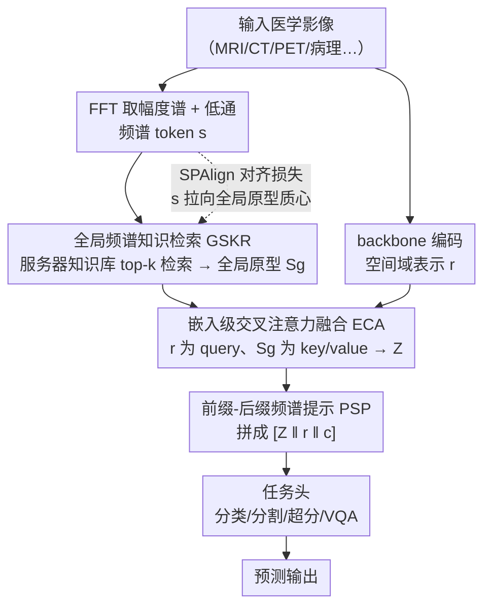

# OmniFM: Toward Modality-Robust and Task-Agnostic Federated Learning for Heterogeneous Medical Imaging

**会议**: CVPR 2026  
**arXiv**: [2603.21660](https://arxiv.org/abs/2603.21660)  
**代码**: 无  
**领域**: 医学图像 / 联邦学习  
**关键词**: 联邦学习, 模态异构, 频域分析, 医学影像, 任务无关

## 一句话总结

提出 OmniFM，一个模态鲁棒且任务无关的联邦学习框架，通过频域频谱知识检索、嵌入式交叉注意力融合和前缀-后缀频谱提示三个互补组件，在一个统一的 FL pipeline 下支持分类、分割、超分辨率、VQA 和多模态融合五种医学影像任务，并在跨模态异构场景下显著超越现有基线。

## 研究背景与动机

1. **领域现状**：联邦学习（FL）已成为跨机构医学影像协作训练的主流范式，能够在不共享数据的前提下联合训练模型。现有 FL 方法主要针对特定任务设计（如分类用 CNN、分割用 U-Net），且假设同构的影像模态。

2. **现有痛点**：（1）**任务绑定**：分类、分割、VQA 等任务各需定制 FL pipeline，切换任务需要重新工程化优化流程；（2）**模态脆弱**：医院间使用不同影像模态（MRI、CT、PET、病理等），导致局部模型的损失landscape存在根本性差异。聚合时全局模型被拉向矛盾的极小值，收敛缓慢且振荡。

3. **核心矛盾**：现有 FL 框架将联邦优化设计与模型架构/任务类型深度耦合，导致"一个任务一条pipeline"的现状，工程成本高且难以在真实多模态场景中部署。

4. **本文目标**（1）能否构建一个跨任务复用的统一 FL pipeline？（2）在任务固定但模态异构时，能否保持稳定的优化行为？

5. **切入角度**：频域洞察——不同模态的低频频谱分量展现出强跨模态一致性，编码了模态不变的解剖结构信息。利用这一点可以桥接模态间的表示差异。

6. **核心 idea**：用频域频谱embedding作为跨模态锚点，通过全局检索-融合-提示机制将模态不变知识注入局部表示，实现"单pipeline跨任务+跨模态"的联邦学习。

## 方法详解

### 整体框架

OmniFM 的每个客户端提取两类表示：通过 backbone 获取的空间域表示 $\mathbf{r} \in \mathbb{R}^{L \times d}$，以及通过 FFT 获取的频域频谱 embedding $\mathbf{s}$。频谱 embedding 上传至服务器侧的全局知识库进行 top-k 检索，检索到的全局频谱原型 $\mathbf{S}_g$ 先经嵌入级交叉注意力（ECA）与本地表示 $\mathbf{r}$ 融合得 $\mathbf{Z}$，再以前缀-后缀频谱提示（PSP）拼成增广序列 $[\mathbf{Z}\|\mathbf{r}\|\mathbf{c}]$ 送入任务头产生预测。整套机制只在 embedding 层动手、不改 backbone，因此同一 pipeline 可挂在分类、分割、超分、VQA 等不同任务上；频谱-近端对齐损失（SPAlign）则在优化层面把局部频谱拉向全局原型，抑制模态引起的漂移。

### 关键设计

**1. 全局频谱知识检索 GSKR：让不同模态在低频频谱里找到共同锚点**

模态异构的根子在于 MRI、CT、PET 的纹理统计天差地别，直接在空间域聚合会把全局模型拉向互相矛盾的极小值。作者的切入点是：图像幅度谱的低频分量编码的是粗粒度解剖结构，这部分跨模态一致性远高于高频纹理。于是客户端先对输入做 FFT 取幅度谱，低通滤波滤掉模态特异的高频细节，再经一个频谱 tokenization 模块（FreqMix 混频 + 投影 + 池化）压成一个归一化的频谱 token $\mathbf{s}$。服务器侧维护一个全局知识库 $\mathcal{K}^{(r)}$，客户端把 $\mathbf{s}$ 上传后，服务器按余弦相似度检索出 top-k 个全局频谱原型 $\mathbf{S}_g$ 回传。知识库本身按检索频率做剪枝，既保持紧凑又维持各模态的平衡占比。这一步等于在频域建了一个跨客户端共享的「解剖结构字典」，让每个本地表示都能借到模态无关的先验。

**2. 嵌入级交叉注意力融合 ECA：把检索到的全局先验注进本地表示，但不动 backbone**

检索回来的 $\mathbf{S}_g$ 是全局知识，但要让它真正影响本地预测，得和 backbone 的空间域表示 $\mathbf{r}$ 融合。作者刻意把融合放在 embedding 空间而非改 backbone 结构——这正是「任务无关」的关键：同一套机制能挂在分类的 ResNet、分割的 U-Net 或 VQA 的 encoder 上。具体以本地表示 $\mathbf{r}$ 为 query、全局原型 $\mathbf{S}_g$ 为 key/value 做一次标准交叉注意力

$$\mathbf{Z} = \text{Softmax}\!\left(\frac{\mathbf{Q}\mathbf{K}^\top}{\sqrt{d_h}}\right)\mathbf{V}$$

输出 $\mathbf{Z}$ 就是被全局低频先验调制过的本地 token，自然偏向模态不变的解剖特征而非各家医院特有的成像纹理。因为只在表示层动手，切换任务时整套融合逻辑原样复用，不必为每个任务重新设计 FL pipeline。

**3. 前缀-后缀频谱提示 PSP：一头管跨客户端一致、一头管本地特化**

联邦学习永远要在「全局共识」和「本地个性化」之间权衡：只追全局会丢掉机构特有分布，只顾本地又退化成各训各的。PSP 用 token 序列的两端分别承接这两个目标——把 ECA 融合后的频谱 token $\mathbf{Z}$ 作为 prefix 前置、把客户端各自的一个可学习 CLS token $\mathbf{c}$ 作为 suffix 后接，拼成

$$\mathbf{r}' = [\,\mathbf{Z}\,\|\,\mathbf{r}\,\|\,\mathbf{c}\,]$$

prefix 携带全局共享的模态不变结构，把本地特征往跨客户端一致的方向拉；suffix 是私有参数、不参与聚合，专门吸收本机构的分布偏移。两端一夹，同一个序列里既保留了联邦共识又留了本地适配的口子，再送进任务头出预测。

### 损失函数 / 训练策略

总损失为：$\min_{\phi,\psi} \mathcal{L}_\text{task}(h_\psi([\mathbf{Z}\|\mathbf{r}\|\mathbf{c}]), y) + \lambda \mathcal{L}_\text{align}$

其中 **Spectral-Proximal Alignment (SPAlign)** 损失 $\mathcal{L}_\text{align} = \|\mathbf{s} - \bar{\mathbf{s}}_g\|_2^2$ 强制局部频谱 embedding 靠近检索到的全局原型质心，在频域空间抑制模态引起的优化漂移，同时保留空间域的灵活性。

## 实验关键数据

### 主实验

跨模态分类（MedMNIST-v2，Scenario 1 Hard，ResNet-18 backbone）：

| 方法 | Acc@20% | Acc@100% | F1@100% |
|------|---------|----------|---------|
| FedAvg | 56.31 | 84.21 | 0.474 |
| FedPer | 84.47 | 92.57 | 0.665 |
| **OmniFM** | **96.85** | **97.82** | **0.668** |

超分辨率（BreaKHis，×2 尺度，平均 PSNR）：

| 方法 | Scenario 1 | Scenario 2 |
|------|-----------|-----------|
| FedAvg | 35.95 | 41.50 |
| FedPer | 39.52 | 40.87 |
| **OmniFM** | **42.21** | **42.30** |

### 消融实验

VQA Task 1 在不同微调策略下的表现：

| 配置 | F-C (IID) | F-CL (Non-IID) |
|------|-----------|----------------|
| FedAvg | 0.783 | 0.827 |
| FedPer | 0.799 | 0.833 |
| OmniFM | **0.812** | **0.831** |

### 关键发现

- OmniFM 在所有任务（分类/分割/超分/VQA）和所有异构场景下均取得最佳或次佳
- 跨模态分类场景下，20% 参与率时 OmniFM 仍达 96.85% 准确率，而 FedAvg 仅 56.31%，差距超 40 个百分点
- 超分辨率任务中，OmniFM 在 ×8 高难度尺度下仍保持优势（30.02 vs 29.36 PSNR）
- 跨模态 VQA Task 2 中，8个完全异构模态客户端的平均性能 79.27%，超过 FedPer 的 78.40%

## 亮点与洞察

- **频域不变性洞察极佳**：低频频谱跨模态一致性这一观察简洁有力，为联邦学习中处理模态异构提供了优雅的理论基础。该洞察可迁移到其他跨域/跨模态学习场景
- **真正的"一个pipeline多任务"**：支持分类、分割、超分、VQA、多模态融合五种任务的单一联邦优化流程，这在 FL 领域非常罕见
- **检索增强的联邦学习**：全局频谱知识库 + top-k 检索 的思路类似 RAG，但应用在联邦学习的频域空间，是一个巧妙的交叉创新

## 局限与展望

- 频谱 embedding 上传虽然轻量，但仍需探讨是否存在隐私泄露风险（频谱可能包含可恢复的患者信息）
- 实验中客户端数量较少（3-8个），未验证大规模联邦场景（50+ 客户端）的表现
- 知识库剪枝策略（按检索频率）可能导致稀有模态的频谱原型被过早删除
- 未与最新的基础模型联邦微调方法（如 FedPETuning）进行对比

## 相关工作与启发

- **vs FedPer**: FedPer 通过分离个性化层实现部分适应，但不处理模态异构；OmniFM 通过频域对齐从根本上缓解模态差异
- **vs FedProx**: FedProx 的近端约束在空间域操作，对模态异构效果有限；OmniFM 的 SPAlign 在频域施加约束，更精准地解耦模态特异和模态不变成分
- 频域先验 + 联邦学习的思路可启发跨机构的医学影像预训练

## 评分

- 新颖性: ⭐⭐⭐⭐ 频域视角解决联邦学习模态异构是新颖的切入点，但各子模块（交叉注意力、prefix/suffix）较常规
- 实验充分度: ⭐⭐⭐⭐ 覆盖五种任务和多种异构场景，但缺少大规模客户端实验和隐私分析
- 写作质量: ⭐⭐⭐⭐ 框架描述清晰，图示信息量大，但部分公式可以更精简
- 价值: ⭐⭐⭐⭐ 对联邦医学影像分析有重要实用价值，统一pipeline的理念具有工程意义

<!-- RELATED:START -->

## 相关论文

- [\[CVPR 2026\] MedGRPO: Multi-Task Reinforcement Learning for Heterogeneous Medical Video Understanding](medgrpo_multi-task_reinforcement_learning_for_heterogeneous_medical_video_unders.md)
- [\[CVPR 2026\] TopoCL: Topological Contrastive Learning for Medical Imaging](topocl_topological_contrastive_learning_for_medical_imaging.md)
- [\[CVPR 2026\] Personalized Longitudinal Medical Report Generation via Temporally-Aware Federated Adaptation](personalized_longitudinal_medical_report_generation_via_temporally-aware_federat.md)
- [\[CVPR 2026\] CG-Reasoner: Centroid-Guided Positional Reasoning Segmentation for Medical Imaging with a Robust Visual-Text Consistency Metric](cg-reasoner_centroid-guided_positional_reasoning_segmentation_for_medical_imagin.md)
- [\[CVPR 2026\] FedVG: Gradient-Guided Aggregation for Enhanced Federated Learning](fedvg_gradient-guided_aggregation_for_enhanced_federated_learning.md)

<!-- RELATED:END -->
