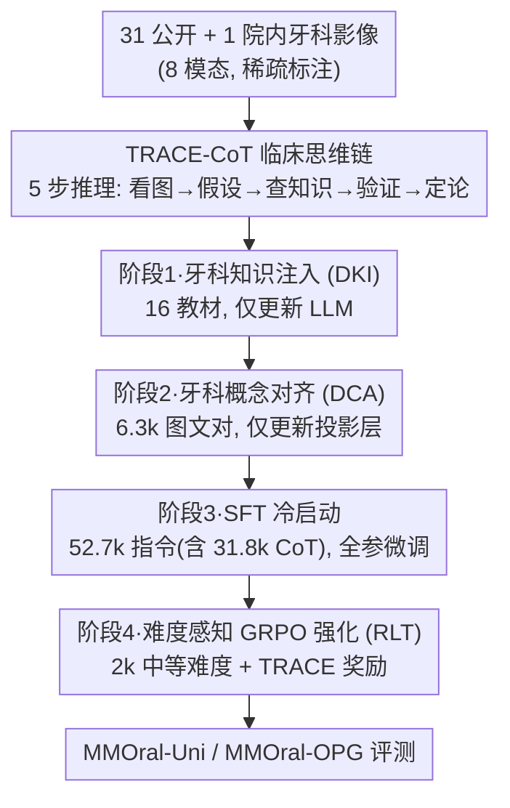

# OralGPT-Omni: A Versatile Dental Multimodal Large Language Model

**会议**: CVPR 2026  
**论文**: [CVF Open Access](https://openaccess.thecvf.com/content/CVPR2026/html/Hao_OralGPT-Omni_A_Versatile_Dental_Multimodal_Large_Language_Model_CVPR_2026_paper.html)  
**代码**: 待开源（论文称 code/benchmark/models 将公开）  
**领域**: 医学图像 / 多模态VLM  
**关键词**: 牙科 MLLM、临床思维链、四阶段训练、统一基准、GRPO

## 一句话总结
OralGPT-Omni 是首个牙科专用多模态大模型，通过构建模仿放射科医生诊断流程的 TRACE-CoT 思维链数据 + 四阶段渐进训练，在覆盖五模态五任务的统一基准 MMOral-Uni 上拿到 51.84 分，远超 GPT-5 的 15.42。

## 研究背景与动机
**领域现状**：多模态大模型（MLLM）已在皮肤科、眼科、胸部放射、病理、儿科等医学子领域展现潜力，但牙科几乎是一片空白。

**现有痛点**：近期研究指出，通用与医学 MLLM 在牙科场景里输出的一致性、完整性、清晰度都不足，还经常产生幻觉，根本无法落到真实临床。这背后有三层原因——牙科影像模态高度异质（口内照、全景片、根尖片、头颅侧位片、病理图、3D 扫描、口内视频、图文交错数据并存）、临床诊断流程本身复杂、以及模型回答缺乏可解释性与可靠性。

**核心矛盾**：进展还被数据卡死。牙科影像因隐私严格、数据共享受限、专家标注昂贵而既稀缺又质量参差；同时医疗场景又强制要求"可解释"——医生和患者不仅要知道结论，还要知道推导过程，而这恰恰是现有研究普遍忽略的。

**本文目标**：做一个能跨多模态、多任务做稳健分析的牙科专用 MLLM，并且让它在诊断异常时不仅给答案、还能给出像临床医生一样的推理链。

**切入角度**：作者认为牙科 MLLM 要补三块——多样的牙科影像数据、能复现医生诊断思维的推理监督、以及循序渐进的训练范式。其中关键观察是：黑盒预测在医疗里不可信，显式的临床推理链既能提升透明度，又能反过来提升诊断准确率。

**核心 idea**：用"TRACE-CoT 临床思维链数据 + 四阶段训练"把牙科专家的诊断推理显式注入一个 Qwen2.5-VL-7B 底座，并配套发布首个统一牙科多模态基准 MMOral-Uni 来系统评测。

## 方法详解

### 整体框架
OralGPT-Omni 以 Qwen2.5-VL-7B-Instruct 为底座。整条流水线分两大块：**数据侧**先从 31 个公开数据集 + 1 家香港牙科医院聚合多模态影像，再把稀疏标注转写成 TRACE-CoT 五步推理链（异常诊断模态）；**训练侧**用四个阶段把"牙科知识 → 视觉对齐 → 指令+推理 → 强化推理"逐层叠上去。最终在 MMOral-Uni / MMOral-OPG 两个基准上评测。

### 关键设计

**1. TRACE-CoT：把放射科医生的诊断流程显式写成五步推理链**

牙科诊断最缺"可解释"，而现成的两条造链路线都不够：纯 CoT prompting 依赖底座本身的推理能力，专家人工标注又难以规模化。作者提出 TRACE-CoT（Transparent Radiologic Analysis with Clinical Evidence），把放射科医生的真实决策拆成五步——(1) 图像观察（描述显著结构与异常表现）、(2) 假设生成（基于观察提出可能病变）、(3) 医学知识参考（查临床指南/Wikipedia 里该病变的典型影像学征象）、(4) 特征验证（拿观察到的特征对照知识标准，找并消解矛盾）、(5) 证据汇总定论。造链时先让 GPT-5-mini 生成视觉描述，把每张图的稀疏标注当作初始诊断假设，再检索特征性影像模式，最后让 GPT-5-mini 组织成完整五步链，共生成 36,777 条（覆盖口内图、根尖片、病理图三类）。两位牙医对 300 条从七个维度评估，质量与可靠性都高。这套显式推理链不仅提升透明度，消融实验更证明它能直接抬高诊断准确率。

**2. 四阶段渐进训练：从知识 → 对齐 → 指令 → 强化逐层加载能力**

牙科适配不是一次性 SFT 能解决的，作者按"先打底再精调"的顺序排了四阶段。阶段一**牙科知识注入（DKI）**：用 16 本牙科教材（约 3.21M tokens）训 1 个 epoch，**只更新语言模型**，把基础牙科知识灌进去。阶段二**牙科概念对齐（DCA）**：用 6,318 个从教材抽取的图文对训 1 个 epoch，**只更新视觉-语言投影层**，做初步的牙科概念↔视觉表征对齐。阶段三**SFT 冷启动**：用 52,725 条高质量指令（含 31,777 条 CoT 推理对）对**整个架构全参微调** 2 个 epoch，覆盖 8 种影像模态，强化指令跟随、多模态理解与显式推理。阶段四在此之上做强化（见设计 3）。值得注意的是只有第一阶段是单模态训练。

**3. 难度感知 GRPO 强化 + TRACE 奖励：只在"中等难度"样本上激发推理**

最后一阶段用 GRPO 框架做强化学习微调（RLT），核心是两个组件。其一是**难度感知数据选择**：对每条指令在"未带 TRACE-CoT 的 SFT 模型"上做 $N=5$ 次 rollout，得到分数集合 $\mathcal{S}=\{S_1,\dots,S_N\}$，只保留同时满足 $0.2 \le \mathcal{S}_{avg} \le 0.8$ 且 $\max(\mathcal{S})-\min(\mathcal{S}) \ge 0.4$ 的样本（从 5,000 条里挑出 2,000 条中等难度）——因为太易或太难的样本提供的学习信号有限。用"未带 TRACE-CoT 的模型"来评难度，是期望 RLT 能在这些中等难度样本上把 TRACE-CoT 推理模式进一步激发出来。其二是 **TRACE 奖励** $\mathcal{R}_{trace}$，用 LLM 裁判（GPT-5-nano）从事实知识可靠性、逻辑连贯性、答案一致性三方面打分。总奖励为

$$\mathcal{R}_{total} = \alpha\cdot\mathcal{R}_{answer} + \beta\cdot\mathbb{I}_{\mathcal{R}_{answer}>0}\cdot\mathcal{R}_{trace} + \gamma\cdot\mathcal{R}_{format},\quad \alpha+\beta+\gamma=1.$$

其中指示函数 $\mathbb{I}$ 保证：当答案完全错时 $\mathcal{R}_{trace}$ 失效，避免奖励"答案错但推理像模像样"的样本，强制推理与答案一致正确。

**4. MMOral-Uni：首个覆盖五模态五任务的统一牙科评测基准**

牙科此前只有一个 MMOral-OPG（仅全景片）基准，模态单一无法系统评测。作者构建 MMOral-Uni，含 2,809 个开放式问答对，覆盖五模态（口内照、根尖片、头颅侧位片、病理图、口内视频，以及图文交错输入）与五任务（异常诊断、颈椎成熟度 CVM 分期、治疗规划、牙齿定位与计数、牙科治疗视频理解）。所有图像取自被系统综述评为"低适用性风险"的公开数据集，答案由 GPT-5-mini 把稀疏标注转写为文本后、再经两位资深牙医校验修订。评测用 GPT-5-mini 做 few-shot 开放式打分（每样本 0~1 分），并已集成进 VLMEvalKit 框架。

### 损失函数 / 训练策略
四阶段训练逐阶段更新不同参数（DKI 仅 LLM、DCA 仅投影层、SFT 全参、RLT 用 GRPO）。前三阶段用 LLaMA-Factory，RLT 阶段用 ms-swift。整套训练在 2×A100 80G 上约 90 小时；RLT 阶段每样本生成 6 条候选 rationale，采样温度 $\tau=0.8$。

## 实验关键数据

### 主实验
在 MMOral-Uni 上对比 27 个代表性 MLLM（7 个闭源 API、12 个通用开源、8 个医学专用）。OralGPT-Omni 总分 51.84，把 GPT-5 的 15.42 远远甩开，也大幅领先医学专用 MLLM。

| 模型 | 类别 | Overall |
|------|------|---------|
| GPT-5 | 闭源 | 15.42 ⚠️（原文 Table 1 各列分布，总分以正文 51.84 vs 15.42 对比为准） |
| o3 | 闭源 | — |
| Qwen2.5-VL-7B | 开源底座 | 22.88 |
| Lingshu-7B | 医学专用 | 27.08 |
| MedGemma-27B | 医学专用 | 21.56 |
| **OralGPT-Omni** | **本文** | **51.84** |

> ⚠️ 缓存为 OCR 文本，GPT-5 的逐模态分列（II/PA/CE/PI/TP/IV）数值清晰但"Overall=15.42"来自正文对比句；表格里 GPT-5 的逐列分较高（如 II 44.60、IV 40.52），与正文 15.42 的总分口径存在张力，**以原文为准**。OralGPT-Omni 逐模态分为 II 66.80 / PA 56.60 / CE 39.99 / PI 48.11 / TP 65.90 / IV 56.01。另外它在"治疗规划"任务上不及闭源模型，作者归因于治疗规划数据仅占训练集约 0.006%，且该任务依赖术后/手术专业知识，是闭源模型的强项。

OralGPT-Omni 在 MMOral-OPG（全景片）基准上得 45.31，同样超过 GPT-5。

### 消融实验
四阶段训练 + TRACE-CoT 的消融（MMOral-Uni Overall）：

| 配置 | Overall | 说明 |
|------|---------|------|
| Baseline (Qwen2.5-VL-7B) | 22.88 | 底座 |
| +阶段1 DKI | 23.66 | 注入牙科知识，微涨 |
| +阶段2 DCA | 24.00 | 概念对齐，微涨 |
| +阶段3 SFT | 48.67 | 指令+CoT 全参微调，**质变** |
| +阶段4 RLT | **51.84** | GRPO 强化，再 +3.17 |
| SFT w/o TRACE-CoT | 44.31 | 仅答案、无推理链 |
| SFT w/ TRACE-CoT | 48.67 | 含推理链，**+4.36** |

### 关键发现
- 贡献最大的是 SFT 阶段：把总分从 24.00 直接拉到 48.67，是整条流水线的"质变点"；前两阶段（DKI/DCA）只贡献温和提升（22.88→24.00）。
- TRACE-CoT 推理数据在 SFT 阶段带来 +4.36 的净增益，且增益主要落在带 CoT 标注的模态（II-Dx-I、II-Dx-R、PI），印证"显式推理链能直接提升诊断准确率"而非只是好看。
- RLT 阶段再 +3.17，说明强化阶段确实在中等难度样本上激发出了更强的推理。
- 一位 10 年以上经验的放射科医生对三个领先 MLLM 做临床效度评估，认为 OralGPT-Omni 在准确性与潜在临床效用上突出。

## 亮点与洞察
- **把"医生怎么想"工程化为五步链**：TRACE-CoT 不是泛泛的 CoT，而是严格对齐放射科诊断流程（看图→假设→查知识→验证→定论），既提升可解释性又被消融证明能提升准确率——这是医疗 MLLM 里"可解释性反哺性能"的有力证据。
- **难度感知数据选择很巧**：用"未带 CoT 的中间模型"评难度、只留 $0.2\sim0.8$ 区间且 rollout 方差够大的样本，把强化预算精准投在"学得动又值得学"的样本上，可直接迁移到任何 GRPO/RLT 场景。
- **奖励里的指示函数细节**：$\mathbb{I}_{\mathcal{R}_{answer}>0}$ 让推理奖励只在答案至少部分对时生效，从机制上堵死"答案错但推理华丽"的奖励黑客，值得在 reasoning RL 里复用。
- **基准本身就是贡献**：MMOral-Uni 把牙科从"只有全景片单基准"扩到五模态五任务，并集成进 VLMEvalKit，降低后续工作的评测门槛。

## 局限与展望
- **治疗规划是明显短板**：受限于该任务数据仅占约 0.006%，OralGPT-Omni 在治疗规划上不及闭源模型；扩充手术/术后知识与数据是直接的改进方向。
- **重度依赖 GPT 系造数据与评测**：TRACE-CoT 由 GPT-5-mini 生成、奖励由 GPT-5-nano 打分、评测又用 GPT-5-mini 做裁判——造数据与评测共用同源闭源模型可能引入系统性偏置，作者虽用牙医做了抽样校验，但 LLM-as-judge 的天花板与偏好仍需警惕。
- **部分模态无 CoT 监督**：TRACE-CoT 只覆盖口内图、根尖片、病理图三类异常诊断，CVM 分期、视频理解、牙齿计数等任务缺少显式推理监督，提升空间不均衡。
- 底座固定为 7B，未探究更大底座或不同视觉编码器对牙科细粒度征象的影响。

## 相关工作与启发
- **vs 通用/医学 MLLM（GPT-5、Lingshu-7B、MedGemma 等）**：它们在牙科上缺乏深度领域建模与模态专门化，输出一致性/完整性差、易幻觉；本文通过牙科专属语料 + 四阶段训练 + 临床 CoT，把牙科特异知识真正灌进模型，总分大幅领先。
- **vs 纯 CoT prompting / 纯人工标注造链**：前者依赖底座推理能力、后者难规模化；TRACE-CoT 用"GPT 生成 + 临床知识检索 + 牙医校验"折中，兼顾规模与可靠性。
- **vs 仅有 MMOral-OPG 的评测现状**：MMOral-Uni 从单模态单基准扩到五模态五任务，填补了牙科多模态系统评测的空白。

## 评分
- 新颖性: ⭐⭐⭐⭐ 首个牙科专用 MLLM + 临床对齐 CoT + 统一基准，组合扎实但单点技术（GRPO、CoT 蒸馏）多为已有范式的领域迁移。
- 实验充分度: ⭐⭐⭐⭐⭐ 对比 27 个 MLLM、两个基准、逐阶段消融 + TRACE-CoT 消融 + 临床医生效度评估，覆盖很全。
- 写作质量: ⭐⭐⭐⭐ 动机—数据—训练—基准四条线清晰，但表格 OCR 后存在口径张力（GPT-5 总分）需对照原文。
- 价值: ⭐⭐⭐⭐⭐ 数据/基准/模型全部承诺开源，对数字牙科与医疗 MLLM 评测有直接推动价值。

<!-- RELATED:START -->

## 相关论文

- [\[CVPR 2026\] MedMO: Grounding and Understanding Multimodal Large Language Model for Medical Images](medmo_grounding_and_understanding_multimodal_large_language_model_for_medical_im.md)
- [\[CVPR 2026\] MLLM-HWSI: A Multimodal Large Language Model for Hierarchical Whole Slide Image Understanding](mllm-hwsi_a_multimodal_large_language_model_for_hierarchical_whole_slide_image_u.md)
- [\[CVPR 2026\] LLaDA-MedV: Exploring Large Language Diffusion Models for Biomedical Image Understanding](llada-medv_exploring_large_language_diffusion_models_for_biomedical_image_unders.md)
- [\[CVPR 2026\] LEMON: A Large Endoscopic MONocular Dataset and Foundation Model for Perception in Surgical Settings](lemon_a_large_endoscopic_monocular_dataset_and_foundation_model_for_perception_in.md)
- [\[CVPR 2026\] fMRI-LM: Towards a Universal Foundation Model for Language-Aligned fMRI Understanding](fmri-lm_towards_a_universal_foundation_model_for_language-aligned_fmri_understan.md)

<!-- RELATED:END -->
