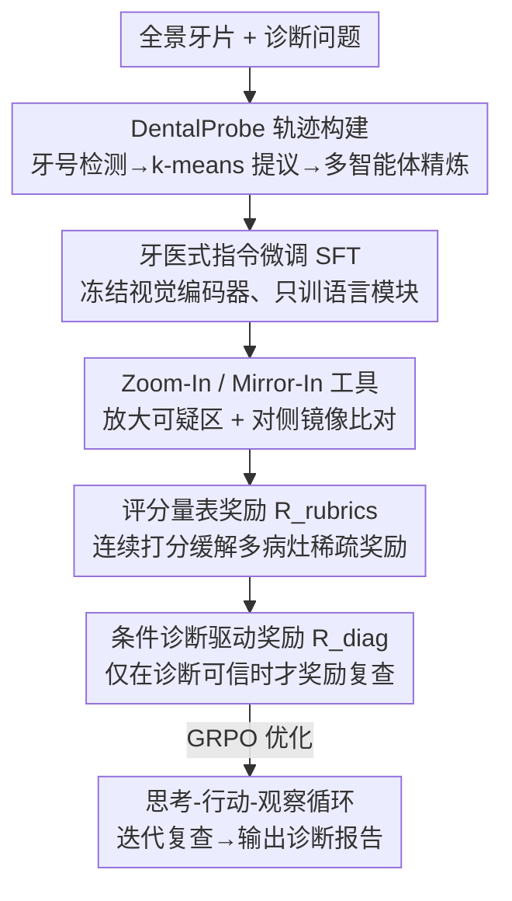

# OralGPT-Plus: Learning to Use Visual Tools via Reinforcement Learning for Panoramic X-ray Analysis

**会议**: CVPR 2026  
**论文**: [CVF Open Access](https://openaccess.thecvf.com/content/CVPR2026/html/Fan_OralGPT-Plus_Learning_to_Use_Visual_Tools_via_Reinforcement_Learning_for_CVPR_2026_paper.html)  
**代码**: https://github.com/isbrycee/OralGPT  
**领域**: 医学图像 / 多模态VLM / Agent  
**关键词**: 全景牙片、智能体 VLM、视觉工具、强化学习、对称性推理

## 一句话总结
OralGPT-Plus 把牙科全景 X 光诊断从"单次前向"的 VLM 改造成一个会自己调"放大"和"镜像对比"工具、像牙医一样迭代复查的智能体，靠专家轨迹指令微调 + 复查驱动的强化学习训练，在自建的 MMOral-X 等基准上稳定超越 GPT-5 等强基线。

## 研究背景与动机

**领域现状**：全景牙片（OPG）是口腔诊断的基础影像，一张图覆盖牙齿、牙槽骨及周边结构。现有自动化分两条路：传统目标检测器（YOLO、DETR）只输出类别 + 框 + 置信度；视觉语言模型（VLM，如 LLaVA、Qwen2.5-VL）语义表达更强，但走的是**单次前向**范式——看一遍图直接出答案。

**现有痛点**：检测器只给框、给不出诊断理由；单次前向 VLM 没法回看模糊区域、捕捉细微病灶。而全景牙片分辨率高，牙医实际看片时会反复放大可疑区域细看，还会**对照对侧象限的同名牙**（牙列有左右对称性），靠两边对比才能判断细微阴影到底是不是真病灶（如龋齿、根尖周炎）。这些临床行为单次前向范式都做不到。

**核心矛盾**：可靠诊断需要的是"迭代复查 + 对称比对"这种多步交互推理，但 VLM 的静态单次范式从结构上就限制了它，临床可靠性上不去。

**本文目标**：(1) 给 VLM 装上模仿牙医的诊断工具（聚焦放大、对侧镜像）；(2) 让它学会**何时**该复查、**怎么**调工具；(3) 在多病灶场景下稳定多轮长程推理。

**切入角度**：模仿牙医"思考—行动—观察"的诊断循环。光靠 prompt 工程，Qwen2.5-VL 这类模型并不会自发学会调工具（预训练缺工具交互数据），所以必须用专家轨迹显式教，再用 RL 精修。

**核心 idea**：把口腔对称性从隐式先验变成显式的"Mirror-In"模型动作，配合"Zoom-In"，用 agentic VLM 的思考—行动—观察循环替代单次前向；并设计复查驱动的混合奖励，让强化学习只在诊断已可信但不完整时才鼓励复查。

## 方法详解

### 整体框架
OralGPT-Plus 是一个智能体 VLM，按"思考 $T_i$ → 行动 $A_i$ → 观察 $O_i$"的循环迭代诊断：每步策略产生思考、选动作（Zoom-In 放大 / Mirror-In 镜像对比 / Finalize 终结），环境执行图像动作返回新视图，历史 $H_i = H_{i-1}\cup\{T_i,A_i,O_i\}$ 不断累积，直到发出 Finalize 或达到 $K$ 步给出最终报告 $y^* = \pi_{\text{answer}}(q, I_0, H_K)$。训练分两阶段：先用 DentalProbe 专家轨迹做"牙医式指令微调"教会基础工具行为，再用"复查驱动强化学习"（含基于评分量表的连续奖励 + 条件诊断激励，由混合奖励系统统一）精修，稳住长程优化。

### 关键设计

**1. Dental-Aware 工具设计：把口腔对称性从隐式先验变成显式 Mirror-In 动作**

以往 agentic VLM 主要靠 Zoom-In 放大可疑区，但全景牙片有强解剖对称性，纯局部增强会忽略这个内在特性。临床上牙医靠对侧比对来判断细微阴影是不是真病灶，本文据此引入 **Mirror-In** 工具：模型识别出潜在病灶后，工具沿中线检索其水平镜像的对侧对应区，形成"原图 + 镜像图"的双视图对来做比较推理。形式上，给定宽 $W$ 的图 $I(x,y)$ 和选定区域 $[x_1,x_2]\times[y_1,y_2]$，对称视图定义为 $I_{\text{mirror}}(x,y) = I(W-x, y)$；实现时用 1.5× padding 的原图/镜像裁剪吸收轻微错位与不对称。这把牙医的对比习惯嵌进推理循环，让低对比度异常能通过对侧参照被验证，诊断判断更稳更可解释。

**2. DentalProbe 专家轨迹构建：用多阶段流水线造出"牙医式"监督数据**

VLM 不会凭空学会调工具，根因是预训练缺工具交互数据。作者整合 4 个公开全景牙片异常检测数据集（覆盖美/中/瑞/罗 50+ 病种）+ MMOral-OPG 精选 2500 张 + 自采 2562 张，构建 5k 图的 DentalProbe。轨迹构建是多阶段的：先用牙号检测模型定位牙框并对齐病灶标签，病灶分为明显/细微/骨性三类；对细微和骨性病例用 k-means 对牙级框聚类生成区域提议，标出需聚焦检查的难诊区；再按显式规则造多轮轨迹（首轮全局检查，后续逐步纳入放大区和上下文线索）。之后进质量精炼：多智能体工具决策模块逐步判断调用的工具是否合适（裁判智能体认为当前视图够了就确认 Zoom-In，否则触发 Mirror-In），视觉描述智能体为每个工具调用图生成区域级摘要并结合临床定义重写每步推理，再用三个模型独立改写选最佳版本以增加语言多样性。最后专家牙医做抽样评估迭代精炼。整套产出临床对齐、风格多样、即用于指令微调的轨迹。指令微调用全参数 SFT 训练语言模块、冻结视觉编码器和投影层，目标为 $L_{\text{SFT}} = -\sum_{t=1}^{T}\log\pi_\theta(y^*_t\mid x, I, y^*_{<t})$。

**3. 复查驱动强化学习：用评分量表奖励 + 条件诊断奖励解决稀疏奖励与工具滥用**

SFT 后模型会调基础工具，但朴素 GRPO 用二值 $\{0,1\}$ 奖励对临床诊断不可靠——全景片有多个空间分散病灶，全有或全无的反馈造成信号稀疏、优势微弱、训练不稳，且不受控的探索会把智能体引向无关区域。作者设计三个互补组件：**(a) 评分量表奖励 $R_{\text{rubrics}}$**——用对齐 MMOral-X 标准的少样本评分器（GPT-5-mini）给每条轨迹一个连续分 $R_{\text{rubrics}}(\tau)\in[0,1]$，评估临床意义、影像准确度、主要错误严重度与漏诊敏感度，让"识别出部分但非全部病灶"也能拿成比例的奖励而不塌成零，提供稠密梯度。**(b) 条件诊断驱动奖励 $R_{\text{diag}}$**——受"牙医只在初诊可靠但不完整时才复查"启发，只有评分置信度足够高时才开启探索激励：$R_{\text{diag}}(\tau) = \mathbb{I}\big(R_{\text{rubrics}}(\tau)>\eta\big)\cdot\alpha\cdot(H - C_u(x))_+ \cdot \mathbb{1}_{\text{tool}}(\tau)$，其中 $(\cdot)_+ = \max(\cdot,0)$ 让好奇心随探索饱和而衰减，$\alpha$ 控内在奖励强度，防止低置信度下的无意义调工具。**(c) 混合奖励系统**把三者统一：$R(\tau) = R_{\text{rubrics}}(\tau) + R_{\text{format}}(\tau) + R_{\text{diag}}(\tau)$，平衡诊断准确度、结构正确性和探索效率，最终用 GRPO 优化，引导模型从可靠的局部评估走向有临床意义的复查，避免长程推理中的工具使用崩溃。

### 一个完整示例
对一张牙片：首轮做全局检查，发现某象限有可疑低对比阴影 → 策略选 Zoom-In 放大该区细看 → 仍不确定，触发 Mirror-In 检索对侧同名牙的镜像视图做双视图对比 → 确认是真病灶（如龋齿） → 在评分置信度足够时被条件奖励鼓励对另一处骨性发现再复查 → 整合后发 Finalize 输出结构化诊断报告。整个过程像牙医一样"放大—对比—复查—收口"。

## 实验关键数据

### 主实验
在自建 MMOral-X（300 道开放式问答，分 Simple/Moderate/Complex 三档难度，各 100 图）和 MMOral-OPG 开放式 VQA 上评测，MMOral-X 取 5 次平均（Avg@5），MMOral-OPG 取 pass@1。OralGPT-Plus-7B 在各难度都拿最高：

| 模型 | 参数 | MMOral-X Simple | Moderate | Complex | MMOral-OPG Overall |
|------|------|------|------|------|------|
| GPT-5 (闭源) | N/A | 32.90 | 8.30 | 9.30 | 42.34 |
| Claude-sonnet-4-5 | N/A | 27.72 | 8.14 | 9.78 | 37.68 |
| MedDr (医学专用) | 40B | 6.14 | 4.26 | 3.08 | 26.20 |
| Qwen2.5-VL-7B (开源底座) | 7B | 7.22 | 4.58 | 3.70 | 15.92 |
| **OralGPT-Plus-7B** | 7B | **43.16** | **20.60** | **24.96** | **45.35** |

7B 全面超越 GPT-5、MedDr、HuatuoGPT-V 等强基线，且在 MMOral-OPG 的牙齿（Teeth）、病理（Patho）、颌骨（Jaw）等关键诊断维度领先，说明结构化工具交互让模型能像牙医一样分步、临床连贯地分析。

### 消融实验
在 MMOral-X 上逐组件消融：

| 配置 | Simple | Moderate | Complex | 说明 |
|------|--------|----------|---------|------|
| w/o 指令微调 | 8.02 | 4.64 | 4.98 | 不微调几乎不会调工具，掉到最低 |
| w/o $R_{\text{rubrics}}$ & $R_{\text{cond}}$ | 20.82 | 9.24 | 9.82 | 退回二值奖励 |
| w/o $R_{\text{rubrics}}$ | 21.48 | 12.08 | 13.42 | 缺连续评分奖励 |
| w/o $R_{\text{cond}}$ | 24.62 | 14.14 | 15.96 | 缺条件诊断奖励 → 奖励作弊 |
| w/o Mirror-In | 34.68 | 14.26 | 14.30 | 去掉镜像工具 |
| OralGPT-Plus (Full) | 43.16 | 20.60 | 24.96 | 完整模型 |

### 关键发现
- **指令微调是必需的**：没它即使后续 RL 也激活不了工具使用行为（掉到 8.02），说明工具推理不会从奖励优化里自发涌现，必须有临床结构化示范教"何时、如何"用工具。
- **模型容量决定 RL 收益**：同样设置下 7B 比 3B 的 RL 增益大得多——7B 能稳定发展出基于工具的复查，3B 做不到，说明掌握工具驱动诊断流程需要足够容量。
- **条件诊断奖励防奖励作弊**：去掉它会出现"工具使用先掉后飙、验证精度恶化"的崩溃—反弹模式，因为智能体会钻空子——只调一次工具就不检查直接作答。
- 失败案例主要集中在复杂全景片上。

## 亮点与洞察
- **把对称性做成显式工具动作**：Mirror-In 把牙列左右对称这个隐式解剖先验变成模型可主动调用的镜像检索动作，比让模型"隐式学会"对称推理更可控、更可解释，这种"把领域先验工具化"的思路可迁移到其他有结构对称性的医学影像。
- **条件触发的好奇心奖励**：只在诊断已可信（$R_{\text{rubrics}}>\eta$）时才奖励探索复查，配合随饱和衰减的好奇心项 $(H-C_u)_+$，精准切中"工具滥用 / 奖励作弊"，是把临床"先有可靠初判再复查"的工作流写进奖励函数的好例子。
- **评分量表替代二值奖励**：用 GPT-5-mini 做少样本量表评分给连续奖励，让部分正确的多病灶诊断拿成比例分，从根上缓解了医学多目标任务里二值奖励的稀疏性。

## 局限与展望
- 评分量表奖励依赖 GPT-5-mini 作裁判，评测也用 GPT-5-mini，存在裁判偏置与"用同源模型既训又测"的潜在风险（作者做了一致性检查但仍是闭环）。
- 复杂全景片仍是主要失败来源，多病灶高歧义场景的可靠性有待提升。
- 工具集目前只有 Zoom-In / Mirror-In，且 RL 收益强依赖模型容量（3B 几乎吃不到），小模型部署受限。
- MMOral-X 只有 300 题、单中心标注体量有限，泛化性需更大规模验证。

## 相关工作与启发
- **vs 传统检测器（YOLO / DETR）**：它们只输出框 + 类别 + 置信度，给不出诊断理由；OralGPT-Plus 做的是带可解释推理的交互式诊断。
- **vs 单次前向 VLM（LLaVA / Qwen2.5-VL）**：单次范式没法回看模糊区；本文用思考—行动—观察循环迭代复查，并显式对称比对。
- **vs 通用 agentic VLM（Mini-o3）**：它们主要靠 Zoom-In；OralGPT-Plus 针对牙科加了 Mirror-In 对称工具 + 牙医式轨迹监督 + 复查驱动奖励，临床对齐更强。

## 评分
- 新颖性: ⭐⭐⭐⭐ 首个用 agentic VLM 做牙科全景诊断，Mirror-In 工具化对称先验是亮点
- 实验充分度: ⭐⭐⭐⭐ 基线丰富 + 多维消融，但 MMOral-X 体量小、裁判偏置存疑
- 写作质量: ⭐⭐⭐⭐ 范式演进与奖励设计讲得清晰，部分附录指标被略写
- 价值: ⭐⭐⭐⭐ 把临床复查工作流落进 RL 奖励，对医学 agentic VLM 有借鉴意义

<!-- RELATED:START -->

## 相关论文

- [\[CVPR 2026\] MedGRPO: Multi-Task Reinforcement Learning for Heterogeneous Medical Video Understanding](medgrpo_multi-task_reinforcement_learning_for_heterogeneous_medical_video_unders.md)
- [\[CVPR 2026\] OraPO: Oracle-educated Reinforcement Learning for Data-efficient and Factual Radiology Report Generation](orapo_oracle-educated_reinforcement_learning_for_data-efficient_and_factual_radi.md)
- [\[NeurIPS 2025\] FairGRPO: Fair Reinforcement Learning for Equitable Clinical Reasoning](../../NeurIPS2025/medical_imaging/fairgrpo_fair_reinforcement_learning_for_equitable_clinical_reasoning.md)
- [\[CVPR 2026\] Focus-to-Perceive Representation Learning: A Cognition-Inspired Hierarchical Framework for Endoscopic Video Analysis](focus-to-perceive_representation_learning_a_cognition-inspired_hierarchical_fram.md)
- [\[CVPR 2026\] OralGPT-Omni: A Versatile Dental Multimodal Large Language Model](oralgpt-omni_a_versatile_dental_multimodal_large_language_model.md)

<!-- RELATED:END -->
