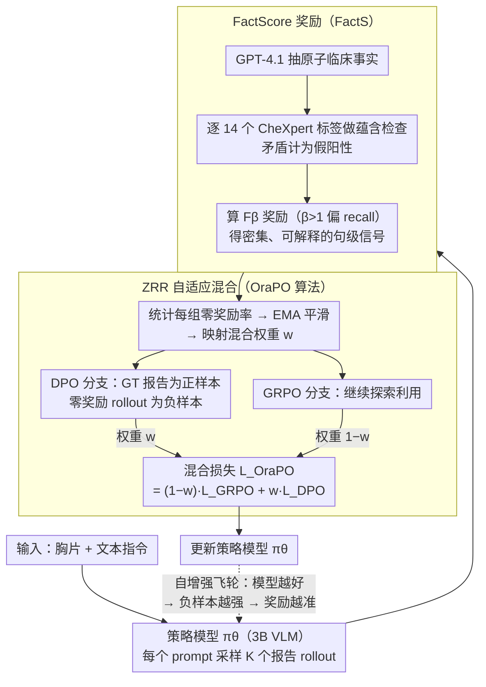

# OraPO: Oracle-educated Reinforcement Learning for Data-efficient and Factual Radiology Report Generation

**会议**: CVPR2026  
**arXiv**: [2509.18600](https://arxiv.org/abs/2509.18600)  
**代码**: 待确认  
**领域**: 医学图像  
**关键词**: 放射报告生成, GRPO, DPO, 强化学习, 数据高效, 临床事实评分

## 一句话总结

提出 OraPO（Oracle-educated GRPO），在 GRPO 探索失败时注入轻量 DPO 监督将失败 rollout 转化为偏好样本，配合 FactScore 奖励实现仅用 1K 样本、3B 小模型在 CheXpert Plus 和 MIMIC-CXR 上达到放射报告生成 SOTA（F1=0.341/0.357），训练数据量比前最优减少 2-3 个数量级。

## 研究背景与动机

**临床刚需**：放射科影像积压严重，英国放射科顾问缺口 29%，美国约 14000 个空缺但年毕业仅 1150 人；AI 辅助草稿已被证明可减少 24% 报告时间

**主流方法代价高昂**：现有 RRG 方法依赖多阶段训练（领域预训练→图文对齐→任务微调）和大规模配对语料（≥223K 样本），部分方法使用 >13B 参数模型，GPU 预算需求极大

**GRPO 的探索失败问题**：将 GRPO 应用于 RRG 时，基座 VLM 缺乏放射学领域知识，前 50 步约 30% 的 group 产生全零奖励，导致梯度消失和 rollout 浪费

**现有修复方案不理想**：重采样直到非零奖励出现（DAPO）或增大 group size 均增加计算成本；交替 SFT+RL 仍丢弃低质量 rollout

**奖励设计困难**：不同于数学/编程的二值验证，放射报告是长文本多事实叙述，BLEU/CIDEr 等指标仅捕捉表面流畅度，对句子级事实错误和跨句矛盾惩罚不足

**数据效率缺口**：先前工作专注优化稳定性而非数据效率，训练集规模和 epoch 数基本不变

## 方法详解

### 整体框架

OraPO 是一个单阶段、纯 RL 的放射报告生成框架，不需要领域预训练、图文对齐或 SFT。它要解决两件事：一是长文本报告没法像数学题那样二值验证，BLEU/CIDEr 又抓不住事实错误，奖励难设计；二是 GRPO 直接用在 RRG 上时，基座 VLM 缺放射学知识，前 50 步约 30% 的 group 全零奖励、梯度消失、rollout 白白浪费。对应地，OraPO 由两块拼成：FactScore 奖励（FactS）先从每条报告抽原子临床事实、对照 ground-truth 标签做蕴含检查，给出密集、可解释的句子级奖励；OraPO 算法再用这些奖励统计每个 group 的零奖励率，在 group 全零奖励、GRPO 学不动时动态注入 DPO 监督，把 ground-truth 报告当正样本、零奖励 rollout 当负样本组成偏好对，并按零奖励率自适应混合 GRPO 与 DPO 两种损失，让失败探索直接变成监督信号。整套训练随之形成自增强飞轮：模型越好 → 负样本越强 → 奖励越准 → 模型更好。

### 关键设计

**1. FactScore 奖励（FactS）：把报告质量锚定到原子临床事实蕴含**

RRG 的奖励难设计，是因为表面流畅度指标对句子级事实错误和跨句矛盾几乎不罚。FactS 改成三步给出贴临床的奖励：先用 GPT-4.1 从生成报告中抽出原子临床陈述集合 $\mathcal{F}(\hat{y}_i)$；再对 14 个 CheXpert 标签逐一检查事实集是否蕴含该标签，矛盾就记假阳性；最后基于 per-instance 的 precision/recall 算 $F_\beta$ 作为奖励，取 $\beta > 1$ 让奖励偏向 recall——因为临床里漏诊比误报后果重得多。这样奖励既密集又可解释，直接惩罚的是「说错事实」而非「说得不顺」，也为下游的混合训练提供了可统计零奖励率的可靠信号。

**2. ZRR 自适应混合（OraPO 算法）：把失败 rollout 回收成免费偏好负样本**

GRPO 撞上全零奖励 group 时既学不到东西又浪费算力，而 DAPO 重采样、增大 group size 这些修法都是在加计算。OraPO 换个思路：对每个 prompt $x_i$ 先算 $K$ 个 rollout 里零奖励的比例 $z_i$，用指数移动平均（EMA, $\alpha=0.5$）平滑成 $\tilde{z}_i^{(t)}$，再映射成混合权重：

$$w_i^{(t)} = \text{clip}(w_{\min} + (w_{\max} - w_{\min})[\tilde{z}_i^{(t)}]^\gamma, w_{\min}, w_{\max})$$

其中 $w_{\min}=0.05$、$w_{\max}=0.15$、$\gamma=2.0$。最终目标是 GRPO 与 DPO 的加权和：

$$\mathcal{L}_{\text{OraPO}} = \frac{1}{B}\sum_{i=1}^{B}[(1 - w_i^{(t)})\mathcal{L}_{\text{GRPO}} + w_i^{(t)}\mathcal{L}_{\text{DPO}}]$$

ZRR 高就让 DPO 主导（oracle 教育、稳住梯度），ZRR 低就让 GRPO 主导（继续探索）。关键巧处在于 DPO 的负样本就是那些全零奖励 rollout、正样本就是 ground-truth 报告，两者都是现成的、零额外标注开销，等于把失败探索直接变成监督信号。

### 损失函数 / 训练策略

- **GRPO 损失**：标准 clipped PPO ratio + KL 正则，用 DR.GRPO 缓解长度偏差
- **DPO 损失**：标准 DPO + LN-DPO 按序列长度归一化偏好 margin
- 两者经 ZRR 权重动态混合，形成自增强数据飞轮：模型越好 → 零奖励 rollout（负样本）质量越高 → 奖励信号越强 → 模型更好

## 实验

### 主实验结果

| 数据集 | 方法 | Precision | Recall | F1 | 训练样本 |
|:------|:-----|:---------|:-------|:---|:--------|
| CheXpert Plus | MambaXray-L (CVPR25) | 0.377 | 0.319 | 0.335 | 1.27M |
| CheXpert Plus | **OraPO (Ours)** | **0.237** | **0.832** | **0.341** | **1K** |
| MIMIC-CXR | MambaXray-L (CVPR25) | 0.371 | 0.321 | 0.340 | 1.27M |
| MIMIC-CXR | **OraPO (Ours)** | **0.242** | **0.891** | **0.357** | **1K** |

- CheXpert Plus 上 F1 SOTA（0.341），Recall 比前最优提升 **+160.8%**
- MIMIC-CXR 上 F1=0.357 比 MambaXray-L 提升 +5.0%，Recall 提升 +153.8%
- 仅用 1K 样本（前最优 MambaXray-L 用 1.27M，减少约 1270 倍）

### 消融实验

| FactS | GRPO | DPO | 训练量 | Precision | Recall | F1 |
|:------|:-----|:----|:------|:---------|:-------|:---|
| ✗ | ✗ | ✗ | 0 | 0.097 | 0.104 | 0.034 |
| ✗ | ✓ | ✗ | 1K | 0.026 | 0.162 | 0.089 |
| ✓ | ✓ | ✗ | 1K | 0.204 | 0.605 | 0.291 |
| ✓ | ✓ | ✓ | 400 | 0.217 | 0.732 | 0.296 |
| ✓ | ✓ | ✗ (SFT) | 1K | 0.171 | 0.176 | 0.106 |
| ✓ | ✓ | ✓ | 1K | **0.237** | **0.832** | **0.341** |

### 关键发现

- **FactS 是核心**：加入 FactS 后 F1 从 0.089 跳到 0.291（+227%），说明 accuracy 奖励完全不足以指导 RRG
- **OraPO 在 FactS 基础上再提升 17.2% F1**，且仅 400 样本的 OraPO 已超过 1K 样本的 FactS-only
- **SFT 替代 DPO 导致崩溃**：GRPO+SFT 的 recall 仅 0.176，F1 仅 0.106，因 SFT 只学"怎么说对的"而不学"怎么不说错的"
- **Gold label 验证**：在放射科医生标注的 CheXpert 验证集上，OraPO 超过 MambaXray-L（F1 0.288 vs 0.280），也优于 GPT-4.1（F1 0.288 vs 0.253）
- **推理效率**：3B 模型 3.3s/image，而 GPT-5 Thinking 需 25.2s/image

## 亮点

- **极致数据效率**：1K 样本超越百万级训练的 SOTA，训练量减少 2-3 个数量级，仅需 4×A10 GPU
- **GRPO+DPO 首次融合**：将失败探索回收为偏好负样本的思路优雅且几乎零额外开销
- **ZRR 自适应机制**：自动权衡 oracle 教育与 RL 探索，形成正反馈飞轮
- **FactScore 奖励**：将报告质量评估锚定到原子临床事实蕴含检查，比 BLEU/CIDEr 更贴近临床意义
- **Recall 导向设计**：高灵敏度（0.832/0.891）符合临床场景需求——漏诊比误报后果严重得多

## 局限性

- **Precision 偏低**（0.237/0.242），高 recall 换来一定的假阳性率，需放射科医师最终审核
- **FactS 依赖 GPT-4.1** 提取事实和蕴含检查，引入外部 API 成本和潜在不稳定性
- **仅验证胸片 RRG**，未扩展至其他影像模态（CT、MRI）或其他临床任务
- **仅在 3B 模型上实验**，未探索更大/更小模型的 scaling 行为
- **$w_{\min}$/$w_{\max}$ 等超参**需要调优，论文中搜索范围较窄

## 相关工作

- **RRG 方法演进**：从 CNN-RNN/Transformer seq2seq → 知识引导生成 → 多阶段预训练 → LLM-driven 指令微调，共性问题是数据/计算密集
- **GRPO 变体**：DeepSeekMath 提出、DR.GRPO 处理长度偏差、DAPO 重采样非零奖励，但均未针对数据效率
- **DPO 变体**：SimPO（长度归一化）、ORPO（无 reference）、KTO（单元信号），OraPO 将 DPO 作为 GRPO 失败时的 oracle 步骤
- **最强基线**：MambaXray-L（CVPR25，1.27M 样本，F1=0.335/0.340）、CheXagent（8.5M 样本）

## 评分

- 新颖性: ⭐⭐⭐⭐ — GRPO+DPO 融合思路新颖，ZRR 自适应混合设计简洁有效
- 实验充分度: ⭐⭐⭐⭐ — 两个大型数据集、28+ 基线对比、详细消融、gold label 验证、商用 API 对比
- 写作质量: ⭐⭐⭐⭐ — 问题动机清晰，方法推导完整，实验分析深入
- 价值: ⭐⭐⭐⭐⭐ — 极致数据效率对医疗场景有极强实用价值，recall 导向设计符合临床需求

<!-- RELATED:START -->

## 相关论文

- [\[CVPR 2026\] BiOTPrompt: Bidirectional Optimal Transport Guided Prompting for Disease Evolution-aware Radiology Report Generation](biotprompt_bidirectional_optimal_transport_guided_prompting_for_disease_evolutio.md)
- [\[CVPR 2026\] TIM: Temporal Decoupling with Iterative Mutual-Refinement Model for Longitudinal Radiology Report Generation](tim_temporal_decoupling_with_iterative_mutual-refinement_model_for_longitudinal_.md)
- [\[CVPR 2026\] SAT-RRG: LLM-Guided Self-Adaptive Training for Radiology Report Generation with Token-Level Push–Pull Optimization](sat-rrg_llm-guided_self-adaptive_training_for_radiology_report_generation_with_t.md)
- [\[CVPR 2025\] Enhanced Contrastive Learning with Multi-view Longitudinal Data for Chest X-ray Report Generation](../../CVPR2025/medical_imaging/enhanced_contrastive_learning_with_multi-view_longitudinal_data_for_chest_x-ray_.md)
- [\[CVPR 2026\] MedCLIPSeg: Probabilistic Vision-Language Adaptation for Data-Efficient and Generalizable Medical Image Segmentation](medclipseg_probabilistic_vision-language_adaptation_for_data-efficient_and_gener.md)

<!-- RELATED:END -->
