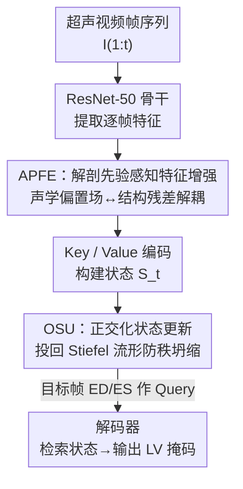

# OSA: Echocardiography Video Segmentation via Orthogonalized State Update and Anatomical Prior-aware Feature Enhancement

**会议**: CVPR 2026  
**论文**: [CVF Open Access](https://openaccess.thecvf.com/content/CVPR2026/html/Wang_OSA_Echocardiography_Video_Segmentation_via_Orthogonalized_State_Update_and_Anatomical_CVPR_2026_paper.html)  
**代码**: https://github.com/wangrui2025/OSA  
**领域**: 医学图像 / 视频分割  
**关键词**: 超声心动图、左心室分割、线性递归、Stiefel 流形、秩坍缩

## 一句话总结
OSA 把超声心动图视频里的左心室时序记忆更新约束到 Stiefel 流形上（正交化状态更新），再配一个把解剖结构和散斑噪声物理解耦的特征增强模块，在 CAMUS 和 EchoNet-Dynamic 上以实时速度刷新了分割精度与时序稳定性。

## 研究背景与动机

**领域现状**：从超声心动图视频里准确、时序一致地分割左心室（LV）是估计射血分数（LVEF）、评估心功能的基础。主流时序建模分两类：基于记忆库的检索方法（XMem、Cutie、SAM 2、MemSAM 等）靠稀疏关键帧检索维持时序一致；线性递归模型（LRM，如 LiVOS、GDKVM）把整段历史压进一个固定大小的隐状态矩阵 $S_t$，做常数复杂度的连续追踪。

**现有痛点**：检索方法用离散存储，没法充分利用视频连续的历史信息；而 LRM 虽然高效，却在**无约束的欧氏空间**里更新状态——门控机制 $\alpha_t$ 相当于对状态矩阵做各向同性收缩，再叠加逐帧的 rank-1 数据更新 $k_t k_t^\top$，会让主导方向被放大、正交方向衰减，导致 $S_t$ 的奇异值逐步塌陷。

**核心矛盾**：这个现象叫**秩坍缩（rank collapse）**——状态矩阵被压成低秩近似，关联记忆容量下降，当前观测和历史先验之间的连接被切断，长序列追踪逐渐失稳。再加上超声本身有严重散斑噪声、深度相关的声衰减，空间特征里解剖边界和噪声混在一起，长程传播时解剖信息会被噪声淹没。

**本文目标**：同时解决两件事——(1) 让连续时序状态演化保持稳定、不坍缩；(2) 在空间上把解剖结构从散斑噪声里分离出来。

**切入角度**：作者把状态更新重新看成一次优化迭代。LRM 的门控更新本质是在欧氏空间做近端梯度下降，那只要给它套上**几何约束**，让状态始终待在保正交性的流形上，就能从根上阻止奇异值衰减。

**核心 idea**：把状态演化约束到 Stiefel 流形（正交矩阵流形）上做正交化更新（OSU）防秩坍缩，再用一个物理驱动的解剖先验感知特征增强（APFE）把声学偏置场和结构残差解耦，给时序追踪器喂抗噪的结构锚点。

## 方法详解

### 整体框架
OSA 是一个端到端的视频分割流水线：以 ResNet-50 为视觉骨干，每帧特征先经 APFE 做对比度解耦得到抗噪的结构化 Key/Value 表征，再用这些 Key/Value 递归更新一个固定大小的状态矩阵 $S_t \in \mathbb{R}^{C_v \times C_k}$；更新时通过正交化把 $S_t$ 投回 Stiefel 流形（OSU），保证时序转移数值稳定；预测阶段拿目标帧（如 ED/ES 帧）特征作 Query 去和维护好的状态 $S_t$ 交互，解码出分割掩码。和半监督视频分割不同，OSA 推理时**不需要首帧参考掩码**，是全自动的，更贴合临床流程。

### 关键设计

**1. 正交化状态更新 OSU：把记忆演化钉在 Stiefel 流形上防秩坍缩**

LRM 的门控更新对应欧氏空间里的一步近端梯度下降：每个时刻引入线性化代理目标 $\ell_t(S) = -\mathrm{Tr}(G_t^\top S)$，其中梯度 $G_t = \beta_t(v_t - \alpha_t S_{t-1} k_t)k_t^\top$，无约束解为 $S_t^{\text{Euc}} = \arg\min_S\big(\ell_t(S) + \tfrac{1}{2}\|S - \alpha_t S_{t-1}\|_F^2\big)$。问题就出在这里：$\alpha_t$ 是各向同性收缩，叠加 rank-1 更新会扭曲谱分布，主导方向放大、正交方向衰减 → 秩坍缩。OSU 的做法是把状态约束到 Stiefel 流形 $\mathcal{V}_{C_v,C_k} = \{S : S^\top S = I_{C_k}\}$，每步把无约束中间状态投回流形：$S_t = \mathrm{Proj}_{\mathcal{V}}(S_t^{\text{Euc}}) = \arg\min_{S \in \mathcal{V}} \tfrac{1}{2}\|S - S_t^{\text{Euc}}\|_F^2$，等价于 $\arg\max_S \mathrm{Tr}(S^\top S_t^{\text{Euc}})$，即找离 $S_t^{\text{Euc}}$ 最近的正交矩阵。强制正交后 Frobenius 范数恒定（$\|S_t\|_F^2 = C_k$），相当于对状态施加常数谱范数约束，奇异值不再衰减、条件数有界，从根上避免了无约束递归里的秩坍缩，能在整个心动周期里保住瓣膜运动、心肌形变这些细粒度结构细节。

**2. 高阶 Newton-Schulz 迭代：让流形投影便宜到能实时跑**

精确求正交极因子要做 SVD，代价 $O(C_v C_k^2)$，对逐帧更新太贵。OSU 改用参数化的高阶 Newton-Schulz 迭代来近似投影。Newton-Schulz 只在初始奇异值被严格限定时才收敛，作者利用 $\|\cdot\|_2 \le \|\cdot\|_F$，先用 Frobenius 范数缩放给一个充分上界：$X^{(0)} = S_t^{\text{Euc}} / (\|S_t^{\text{Euc}}\|_F + \epsilon)$，保证所有奇异值落进收敛域；再用 5 阶多项式展开迭代 $X^{(j+1)} = aX^{(j)} + bX^{(j)}{X^{(j)}}^\top X^{(j)} + cX^{(j)}({X^{(j)}}^\top X^{(j)})^2$，系数 $a,b,c$ 被调到优化谱映射函数、最大化向流形收敛的速度。这样固定几步迭代就能达到正交，彻底绕开 SVD，使得"流形约束"这件事在 35 fps 的实时预算内可行。

**3. 解剖先验感知特征增强 APFE：用声学物理先验把解剖边界从散斑里抠出来**

时序模型再稳，喂进去的空间特征若把散斑和解剖边界混为一谈，长程传播照样会漂移。超声信号同时被随机散斑和深度相关的声衰减污染，衰减近似随深度指数衰减，形成一个空间变化的声学偏置场，混淆真实组织对比度——全局阈值处理不了这种空间异质性。APFE 把中间特征 $X_t$ 解耦成低频环境声场和高频结构残差：先用大核平均池化估计偏置场 $M_t = \mathrm{AvgPool}_{K\times K}(X_t)$，再做极性感知分解 $X_t^{+} = \mathrm{ReLU}(X_t - M_t)$、$X_t^{-} = \mathrm{ReLU}(M_t - X_t)$，前者隔离高频结构边缘（如心肌边界），后者捕获低响应均质区（如血池），且满足无损残差分解 $X_t = X_t^{+} - X_t^{-} + M_t$。两支用不共享的 $3\times3$ Conv-BN-ReLU 分别处理结构几何与区域语义：$H_t^{+} = \phi^{+}(X_t^{+})$、$H_t^{-} = \phi^{-}(X_t^{-})$，再经自适应门控融合 $\lambda_t = \sigma(W_g[H_t^{+}; H_t^{-}])$、$Z_t = \lambda_t \odot H_t^{+} + (1-\lambda_t)\odot H_t^{-}$，产出抗噪的结构特征 $Z_t$ 作为后续序列建模稳定的 Key/Value 输入。

### 损失函数 / 训练策略
推理阶段用目标帧特征作 Query 从学到的状态 $S_t$ 检索分割掩码。训练沿用 LiVOS/GDKVM 的点监督设置，用点监督交叉熵 + Dice 损失，优化器 AdamW（学习率 $1\times10^{-4}$，batch size 6），状态转移上额外加 0.02 权重衰减做正则。CAMUS 视频缩放到 $256\times256$、取 15 帧；EchoNet-Dynamic 缩放到 $128\times128$、取 10 帧；训练 3000 次迭代收敛，在两块 RTX 2080 上完成。

## 实验关键数据

### 主实验
在 CAMUS 和 EchoNet-Dynamic 两个公开超声心动图数据集上评测，指标含分割的 mDice↑/mHD95↓ 和 LVEF 估计的相关系数 corr↑、bias±std。OSA 在两个数据集的 mDice 上都拿到最优：

| 数据集 | 指标 | OSA | 次优 (方法) | 说明 |
|--------|------|------|------------|------|
| CAMUS | mDice ↑ | 94.82 | 94.18 (GDKVM) | 新 SOTA |
| CAMUS | mHD95 ↓ | 3.25 | 3.21 (EchoVim) | 边界距离接近最优 |
| EchoNet-Dynamic | mDice ↑ | 93.90 | 93.33 (GDKVM) | 新 SOTA |
| EchoNet-Dynamic | corr ↑ | 0.816 | 0.835 (GDKVM, CAMUS) | LVEF 相关性 |

效率上 OSA 用"流形投影"范式：38.3M 参数、训练显存 7.6 GB、约 3.0 小时达最优 mDice，部署时 **35 fps** 实时；相比之下 EchoVim（SSM）要 34.9 GB 显存、9 小时，SAMed-2（检索）110M 参数、27.5 GB 显存。OSA 在精度和算力开销间取得最佳平衡。

### 消融实验
在 CAMUS 上逐组件消融（Baseline = 去掉 APFE + OSU 后退化成朴素线性 KV 关联模型）：

| 配置 | mDice ↑ | mHD95 ↓ | 说明 |
|------|---------|---------|------|
| Baseline | 92.94 | 3.56 | 无几何约束 + 无解剖先验 |
| w/o OSU | 93.61 | 3.29 | 只加 APFE，+0.67 |
| w/o APFE | 94.12 | 3.21 | 只加 OSU，+1.18 |
| Full | 94.82 | 3.25 | 完整模型，比 Baseline +1.88 |

作者还给出几何/数值稳定性的专项指标（ColR = 奇异值 $\sigma_{\min} < 10^{-3}$ 的步数占比，衡量坍缩程度）：Baseline 的 ColR 高达 91.40%、正交偏差 OrthE 21.30，而 Full 模型 SVVar 降到 0.00、OrthE 降到 8.48，谱行为明显更稳。⚠️ 这些自定义稳定性指标的精确定义以原文为准。

### 关键发现
- OSU 贡献最大（单独 +1.18 mDice），印证秩坍缩才是长序列追踪失稳的主因；APFE 贡献 +0.67，主要让心内膜边界处的激活响应更锐利。
- 两个模块显存开销几乎可忽略（7.5→7.6 GB），说明几何约束和物理解耦都是轻量增益。
- OSA 在成像质量差、声影、边界模糊的真实样本上更鲁棒，预测与 GT 的重叠区（黄色）明显更大。

## 亮点与洞察
- **把"状态更新"重新解释成"流形上的优化迭代"**：这是最漂亮的视角转换——既然门控更新等价于欧氏空间的近端梯度下降，那秩坍缩就是缺几何约束的必然结果，加一步 Stiefel 投影即可治本，思路干净且可迁移到任何线性递归/关联记忆模型。
- **用 Newton-Schulz 替代 SVD 让流形约束实时可行**：正交约束防秩坍缩在传统 RNN 早有共识，但矩阵值状态做精确 SVD 太贵一直是拦路虎；Frobenius 缩放 + 5 阶多项式迭代把它压进固定步数，是让这套理论真正落地的工程关键。
- **APFE 的物理动机很具体**：不是泛泛的"特征增强"，而是针对超声深度相关声衰减建模偏置场、做无损极性分解，这种把成像物理写进网络的做法在其他超声/医学模态上有复用价值。

## 局限与展望
- 方法专为左心室分割 + 超声散斑物理设计，APFE 的声学偏置假设是否能直接迁移到 MRI/CT 等其他模态存疑。
- 评测只在 CAMUS 和 EchoNet-Dynamic 两个 LV 数据集上，缺多腔室/多病变场景验证；mHD95 上并非全面最优（CAMUS 3.25 略逊 EchoVim 3.21），边界极端情形仍有提升空间。
- Newton-Schulz 的多项式系数 $a,b,c$ 与迭代步数如何选、对不同序列长度的鲁棒性，论文未给充分敏感性分析。

## 相关工作与启发
- **vs 检索式记忆（XMem / Cutie / SAM 2 / MemSAM）**：它们靠离散关键帧检索维持时序一致，OSA 用连续压缩的固定大小状态，能充分利用整段历史且常数复杂度。
- **vs 无约束 LRM（LiVOS / GDKVM）**：同样把历史压进 $S_t$，但 OSA 在 Stiefel 流形上做正交化更新，从根上避免它们在欧氏空间的秩坍缩。
- **vs Muon 等正交优化器**：Muon 用 Newton-Schulz 正交化的是参数梯度/动量（训练时优化动态），OSA 把同样的几何严谨性搬到了推理时的状态演化上，对象不同。

## 评分
- 新颖性: ⭐⭐⭐⭐⭐ 把秩坍缩问题用 Stiefel 流形投影 + Newton-Schulz 一招治本，视角转换漂亮
- 实验充分度: ⭐⭐⭐⭐ 两个主流数据集 + 几何/数值稳定性专项指标，但模态/任务覆盖偏窄
- 写作质量: ⭐⭐⭐⭐ 动机到方法的优化视角推导清晰，自定义稳定性指标定义稍简
- 价值: ⭐⭐⭐⭐ 实时 + SOTA，对线性递归记忆模型的几何约束思路有普适借鉴意义

<!-- RELATED:START -->

## 相关论文

- [\[CVPR 2026\] EchoVDiff: Cardiac-Cycle Echocardiography Video Generation from Arbitrary Single Frame](echovdiff_cardiac-cycle_echocardiography_video_generation_from_arbitrary_single_.md)
- [\[CVPR 2026\] Semi-supervised Echocardiography Video Segmentation via Anchor Semantic Awareness and Continuous Pseudo-label Reforging](semi-supervised_echocardiography_video_segmentation_via_anchor_semantic_awarenes.md)
- [\[CVPR 2026\] R2-Seg: Training-Free OOD Medical Tumor Segmentation via Anatomical Reasoning and Statistical Rejection](r2-seg_training-free_ood_medical_tumor_segmentation_via_anatomical_reasoning_and.md)
- [\[CVPR 2026\] CoFiDA-M: Concept-Aware Feature Modulation for Cross-Domain Adaptation with Image-Only Inference](cofida-m_concept-aware_feature_modulation_for_cross-domain_adaptation_with_image.md)
- [\[CVPR 2026\] GeoSemba: Reconstructing State Space Model for Cross Paradigm Representation in Medical Image Segmentation](geosemba_reconstructing_state_space_model_for_cross_paradigm_representation_in_m.md)

<!-- RELATED:END -->
