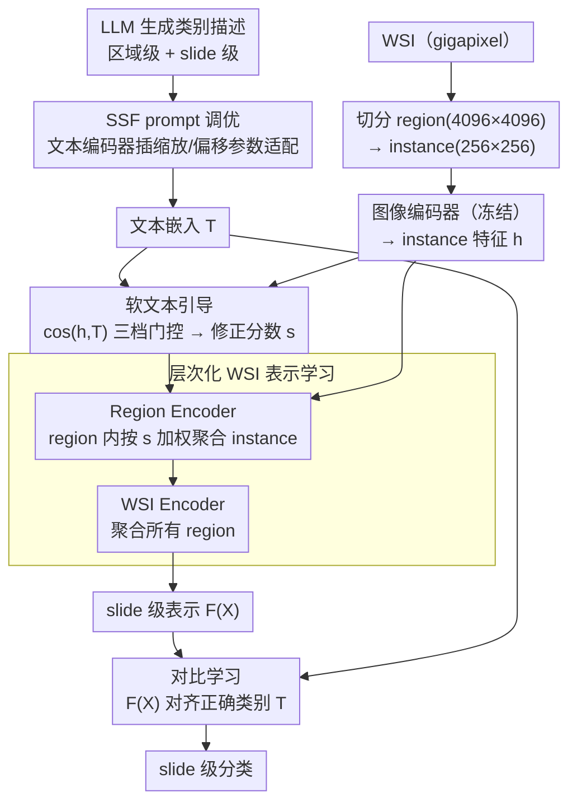

# Parameter-efficient Prompt Tuning and Hierarchical Textual Guidance for Few-shot Whole Slide Image Classification

**会议**: CVPR 2026  
**arXiv**: [2603.21504](https://arxiv.org/abs/2603.21504)  
**代码**: 无  
**领域**: 医学图像 / 少样本学习  
**关键词**: 全切片图像分类, 少样本学习, 视觉语言模型, 参数高效微调, 层次化文本引导

## 一句话总结

HIPSS 提出了两个关键创新用于少样本 WSI 分类：(1) 基于缩放和偏移特征（SSF）的参数高效 prompt 调优替代 CoOp，大幅减少可训练参数；(2) 软层次化文本引导策略无需硬过滤即可利用 VLM 的预训练知识和 WSI 的固有层次结构。在三个癌症数据集上最高提升 13.8%。

## 研究背景与动机

1. **领域现状**：计算病理学中 WSI 分类通常采用多示例学习（MIL），将 gigapixel 级 WSI 切分为 patch 后进行弱监督训练。但 MIL 方法需要大量标注的 WSI，在医学数据稀缺的场景下受限。

2. **现有痛点**：
    - 现有 FSWC 方法使用 CoOp 进行 prompt 调优，但引入大量可训练参数和推理开销，在极端少样本设置下易过拟合
    - 使用交叉注意力融合视觉-文本特征的方法参数量更大（如 FOCUS、ViLa-MIL）
    - 现有方法通常基于与文本嵌入的对齐度硬过滤丢弃 patch（有时丢弃 >60%），可能丢失诊断相关信息

3. **核心矛盾**：VLM 在 instance 级图像-文本对上预训练，但下游任务需要 slide 级分类——局部 instance 特征与全局 slide 标签之间存在语义鸿沟。且 WSI 具有固有的空间层次结构（细胞→区域→切片），但现有聚合方法忽略了这一结构。

4. **本文目标** (a) 如何以更少的参数更有效地适配预训练 VLM？(b) 如何利用 WSI 的层次空间结构和 VLM 文本引导进行表示学习，且不丢弃可能有诊断价值的 patch？

5. **切入角度**：从视觉编码器中 SSF（Scaling and Shifting Features）的成功经验出发，将其迁移到文本编码器的 prompt 调优中；同时设计层次化的注意力聚合机制，用文本嵌入的余弦相似度软加权而非硬过滤。

6. **核心 idea**：用文本编码器中极少量的缩放/偏移参数替代 CoOp 的 prompt 向量，并用软层次化文本引导替代硬 patch 过滤，实现参数高效且鲁棒的少样本 WSI 分类。

## 方法详解

### 整体框架

HIPSS 要解决的是「极端少样本下怎么把预训练 VLM 适配到 slide 级 WSI 分类」，而它的回答是把改造的重心从视觉侧挪到文本侧、再让文本去软引导视觉聚合。整条流程是这样转的：先让 LLM 为每个类别写出区域级和 slide 级两套文本描述，经 tokenizer 拼接后送进文本编码器，得到文本嵌入 $T$——这个编码器不是冻死的，而是插了少量 **SSF prompt 调优** 参数做轻量适配。视觉侧则把 gigapixel 的 WSI 拆成 region → instance 两层，做 **层次化 WSI 表示学习**：先 Region Encoder 聚合 region 内的 instance，再 WSI Encoder 聚合所有 region，压成 slide 级表示 $F(X_i)$；而每一级的注意力权重都不是裸算出来的，而是被 **软文本引导** 用 $T$ 算出的修正分数 $s$ 重新加权。最后用对比学习把 $F(X_i)$ 拉向正确类别的文本嵌入。下面三个关键设计正好对应这条流程上的三个贡献点：怎么省参数地适配文本编码器、怎么按 WSI 的天然层次聚合、怎么让文本引导而不粗暴丢 patch。

### 关键设计

**1. SSF prompt 调优：用缩放/偏移参数取代 CoOp 的上下文向量**

CoOp 那一套是在 prompt 嵌入空间里学一组上下文向量，参数多、还会在推理时多走一遍前向，少样本下又容易过拟合。HIPSS 换了个更省的思路：不动 prompt 的内容，而是直接在文本编码器内部对特征做仿射对齐。具体地，在选定的若干层里，对该层特征 $x \in \mathbb{R}^{D_t}$ 配一对可学习的缩放/偏移参数 $\gamma, \beta \in \mathbb{R}^{D_t}$，做 $y = \gamma \cdot x + \beta$，训练时只更新 $\gamma$ 和 $\beta$、其余权重全冻结。适配多深由 $d_s$ 控制，只在最后 $d_s$ 个 block 上加 SSF。这样每层只多 $2 \times D_t$ 个参数就完成了预训练分布到目标任务的对齐；而且因为变换是纯线性的，推理时可以重参数化合并进原权重，等于零额外推理开销——既比 CoOp 省参数，又不拖慢速度。

**2. 层次化 WSI 表示学习：按组织→细胞的天然结构两级聚合**

直接把一张 WSI 的几万个 patch 平铺进一个注意力池化，会丢掉病理图像本身的空间结构。HIPSS 顺着 WSI 的天然层次来切：先切成 4096×4096 的 region，每个 region 再切成 256×256 的 instance，然后做两级注意力池化。第一级 Region Encoder 在 region 内部聚合 instance 特征得到 region 嵌入 $F(R_{i,m}) = \sum_j a_{i,m}^j h_{i,m}^j$，捕获局部的细胞间交互；第二级 WSI Encoder 再把所有 region 嵌入聚合成 slide 级表示，捕获更大尺度的组织模式。这种「先局部后全局」的归纳偏置比一锅端的平铺更贴合病理诊断的观察方式，而注意力权重 $a$ 里还会注入下面要讲的文本引导修正分数 $s_{i,m}^j$。

**3. 软文本引导：用三档门控加权代替硬丢 patch**

像 FOCUS 那类方法会按与文本嵌入的对齐度硬过滤、动辄丢掉 >60% 的 patch，问题是文本嵌入没覆盖到的诊断信息也会被一起丢掉，少样本下尤其伤。HIPSS 改成谁都不丢、只调权重：对每个 instance 算它与文本嵌入 $T$ 的余弦相似度 $cos(h_{i,m}^j, T)$，再按可靠性分三档给修正分数

$$s_{i,m}^j = \begin{cases} \lambda \cdot cos(h_{i,m}^j, T), & cos(h_{i,m}^j, T) > \alpha \\ cos(h_{i,m}^j, T), & 0 < cos(h_{i,m}^j, T) \le \alpha \\ 0, & cos(h_{i,m}^j, T) \le 0 \end{cases}$$

也就是：相似度为负的视作语义不一致、压到 0；低正相似度的「不确定但可能有用」就保留线性权重；高于阈值 $\alpha$ 的「高置信匹配」用因子 $\lambda$ 放大。打个比方，一个 region 里若有三个 patch 的余弦相似度分别是 $-0.1 / 0.2 / 0.6$（设 $\alpha=0.5$），那它们的修正分数就是 $0 / 0.2 / 0.6\lambda$——可疑的被抑制、典型病灶被放大，而那个中间档的 patch 不会因为没被文本命中就被直接扔掉。这种可靠性感知的软门控让模型在数据极度稀缺时仍能保住文本嵌入没涵盖的那部分信息，是 HIPSS 比硬过滤稳的主因。

### 损失函数 / 训练策略

- 使用对比学习损失：$P(Y_i = c | X_i) = \frac{\exp(cos(F(X_i), T_c) / \tau)}{\sum_j \exp(cos(F(X_i), T_j) / \tau)}$
- 交叉熵损失在预测概率和 GT slide 标签之间计算
- VLM 图像编码器完全冻结，文本编码器仅训练 SSF 参数
- 使用 LLM 生成的类别特异性描述作为文本 prompt（区域级 + slide 级两个查询）

## 实验关键数据

### 主实验

Camelyon16 (乳腺癌) 数据集 AUC：

| 方法 | 16-shot | 8-shot | 4-shot | 2-shot | 1-shot |
|------|---------|--------|--------|--------|--------|
| ABMIL | 0.782 | 0.720 | 0.609 | 0.597 | 0.571 |
| TOP (NeurIPS'23) | 0.835 | 0.730 | 0.728 | 0.705 | 0.685 |
| FOCUS (CVPR'25) | 0.840 | 0.797 | 0.637 | 0.568 | 0.527 |
| **HIPSS (Ours)** | **0.911 (+8.4)** | **0.859 (+7.7)** | **0.816 (+10.9)** | **0.807 (+6.2)** | **0.743 (+7.2)** |

UBC-OCEAN (卵巢癌) 1-shot 设置下 AUC：HIPSS 0.854 vs FOCUS 0.751，**提升 13.8%**。

### 消融实验

Camelyon16 各组件贡献：

| H（层次化） | T（文本引导） | S（SSF调优） | 16-shot | 4-shot | 1-shot |
|:-:|:-:|:-:|---------|--------|--------|
| ✗ | ✗ | ✗ | 0.782 | 0.609 | 0.571 |
| ✓ | ✗ | ✗ | 0.867 | 0.690 | 0.643 |
| ✓ | ✓ | ✗ | 0.872 | 0.755 | 0.651 |
| ✗ | ✗ | ✓ | 0.885 | 0.780 | 0.707 |
| ✓ | ✓ | ✓ | **0.911** | **0.816** | **0.743** |

### 关键发现

- **SSF 贡献最大**：单独加 SSF（无层次化无文本引导）就能从 0.782 提升到 0.885（16-shot），说明文本编码器适配是关键瓶颈
- **参数效率**：HIPSS 在乳腺癌和肺癌数据集上减少 18.1% 可训练参数，卵巢癌数据集减少 5.8%
- **少样本越极端优势越大**：1-shot 上提升最大（卵巢癌 +13.8%），因为硬过滤等方法在数据极度稀缺时更容易丢失关键信息
- 软文本引导相比硬过滤更稳定：FOCUS 在 4-shot 和 2-shot 时性能骤降（如 Camelyon16 从 0.840 降到 0.568），HIPSS 保持平稳下降

## 亮点与洞察

- **SSF 在文本编码器 prompt 调优中的首次应用**：每层仅需两个向量（$\gamma, \beta$）就能有效适配预训练特征分布到目标任务，且可重参数化消除推理开销，这一思路可广泛迁移到其他 VLM 适配场景
- **软引导替代硬过滤的哲学**：在信息极度稀缺的少样本场景下，保留所有信息并用分档加权的方式比激进丢弃更为稳健。三档设计（抑制/保留/放大）兼顾了噪声过滤和信息保留
- **层次化结构利用 WSI 的天然特性**：4096→256 的两级分区自然对应组织→细胞的病理层次，是 domain-specific 的有效归纳偏置

## 局限与展望

- 层次化分区的尺寸（4096×4096 → 256×256）是固定的，不同放大倍率或组织类型可能需要不同的分区策略
- SSF 的调优深度 $d_s$ 需要超参搜索，不同数据集最优值可能不同
- 仅在二分类（乳腺癌/肺癌）和多分类（卵巢癌）场景验证，更复杂的多标签或分级任务未测试
- 改进方向：自适应学习分区尺寸；结合图神经网络建模 region 之间的空间关系；扩展到全监督 WSI 分类中验证通用性

## 相关工作与启发

- **vs TOP (NeurIPS'23)**: TOP 使用 CoOp 的 instance 和 bag 级 prompt 学习，需要 domain 专家设计 prompt；HIPSS 的 SSF 更简洁且参数更少
- **vs FOCUS (CVPR'25)**: FOCUS 使用自适应视觉 token 压缩减少计算开销，但会丢弃潜在有价值的区域；HIPSS 的软引导保留所有信息
- **vs ViLa-MIL (CVPR'24)**: ViLa-MIL 使用交叉注意力融合多尺度特征，参数量大且在极端少样本下过拟合严重（1-shot 0.457 vs HIPSS 0.743）

## 评分

- 新颖性: ⭐⭐⭐⭐ SSF 应用于文本编码器是新颖的迁移，软层次化引导设计巧妙但组件级创新为主
- 实验充分度: ⭐⭐⭐⭐⭐ 三个数据集五种 shot 设置全面评估，消融充分，还有肿瘤定位的额外验证
- 写作质量: ⭐⭐⭐⭐ 技术描述详细清晰，公式推导完整，动机论证有力
- 价值: ⭐⭐⭐⭐ 在医学图像少样本场景下实用性强，参数减少+性能提升的组合对资源受限环境有意义

<!-- RELATED:START -->

## 相关论文

- [\[CVPR 2026\] MUSE: Harnessing Precise and Diverse Semantics for Few-Shot Whole Slide Image Classification](muse_harnessing_precise_and_diverse_semantics_for_few-shot_whole_slide_image_cla.md)
- [\[ECCV 2024\] Pathology-knowledge Enhanced Multi-instance Prompt Learning for Few-shot Whole Slide Image Classification](../../ECCV2024/medical_imaging/pathology-knowledge_enhanced_multi-instance_prompt_learning_for_few-shot_whole_s.md)
- [\[CVPR 2026\] Act Like a Pathologist: Tissue-Aware Whole Slide Image Reasoning](act_like_a_pathologist_tissue-aware_whole_slide_image_reasoning.md)
- [\[CVPR 2026\] SD-FSMIS: Adapting Stable Diffusion for Few-Shot Medical Image Segmentation](sd_fsmis_adapting_stable_diffusion_for_few_shot_medical_image_segmentation.md)
- [\[CVPR 2026\] Interpretable Cross-Domain Few-Shot Learning with Rectified Target-Domain Local Alignment](interpretable_cross-domain_few-shot_learning_with_rectified_target-domain_local_.md)

<!-- RELATED:END -->
