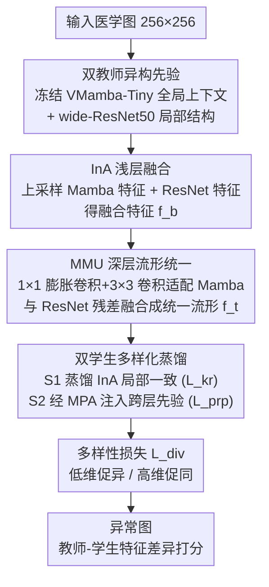

# PDD: Manifold-Prior Diverse Distillation for Medical Anomaly Detection

**会议**: CVPR 2026  
**论文**: [CVF Open Access](https://openaccess.thecvf.com/content/CVPR2026/html/Lu_PDD_Manifold-Prior_Diverse_Distillation_for_Medical_Anomaly_Detection_CVPR_2026_paper.html)  
**代码**: https://github.com/OxygenLu/PDD （作者称将开源）  
**领域**: 医学图像  
**关键词**: 医学异常检测, 反向蒸馏, 双教师双学生, 流形统一, 表示多样性

## 一句话总结
本文用 Grad-CAM 分析揭示工业异常检测里好用的判别式激活图在医学图像上失效，进而提出 PDD：把冻结的 VMamba-Tiny（全局上下文先验）与 wide-ResNet50（局部结构先验）两个异构教师的特征统一到同一个高维流形，再蒸馏给两个行为互补的学生，靠多样性损失防止表示坍缩，在 HeadCT / BrainMRI / ZhangLab 上 AUROC 分别比最优基线高 11.8 / 8.5 / 2.9 个点。

## 研究背景与动机
**领域现状**：无监督异常检测（UAD）只用健康样本学一个"正常解剖结构"的紧致流形，推理时把偏离这个流形的样本判为异常。近年教师–学生（KD）框架在工业缺陷检测（如 MVTec）上很成功，反向蒸馏 RD4AD、Skip-TS 等都是代表作。

**现有痛点**：作者做了一个关键的诊断实验——把冻结的 VMamba 和 ResNet 的 Grad-CAM 激活图在工业图和医学图上对比。工业缺陷上热力图干净、高度局部化；但在 BrainMRI / HeadCT 这类医学图上，热力图变得弥散、嘈杂、与解剖结构不一致。原因是：工业缺陷是纹理驱动、空间局部的，而医学异常是分布在解剖层级上的**结构性偏差**，边界微弱、依赖上下文。

**核心矛盾**：单流特征提取器学不出完整且解剖上自洽的正常流形。CNN 擅长细粒度局部纹理，Mamba 这类序列模型擅长长程依赖与全局结构，但二者的流形是异构的——直接拼接特征既不能保证两个流形对齐，也不能保证下游学生网络保留"表示多样性"（而这正是可靠检测细微异常所必需的）。

**本文目标**：把多个互补先验融成一个鲁棒、统一的正常流形；同时让蒸馏出来的学生网络在正常结构上达成一致、却在潜在异常上保持多样化反应。

**切入角度**：既然两个异构骨干的浅层/深层激活天然互补（一个聚合、一个分散），那就把它们**显式统一到一个公共流形**，再用双学生分别学"局部一致"和"跨层依赖"，最后用多样性约束防坍缩。

**核心 idea**：用"双教师统一流形 + 双学生多样化反向蒸馏"替代"单教师单学生同构蒸馏"，解决医学异常检测的正常流形不完整、表示不多样问题。

## 方法详解

### 整体框架
PDD 是一个"流形统一的反向蒸馏"框架，整条线只用正常样本训练。输入是单张医学图（resize 到 256×256），输出是异常图（anomaly map）。流程是：两个**冻结**的异构教师（VMamba-Tiny + wide-ResNet50）并行抽多尺度特征 → 浅层用 InA 模块融合得到融合特征 $f_b^i$ → 深层用 MMU 模块把两个异构流形几何对齐、统一成公共流形特征 $f_t^i$ → 把统一流形蒸馏进两个结构相同但行为互补的学生：Student 1 直接蒸馏 InA 融合特征做"局部一致"，Student 2 经 MPA 模块把统一流形的先验经跳连注入、抓"跨层依赖" → 多样性损失约束两学生在低维促异、高维促同。推理时按教师–学生特征差异算异常分。

总目标是三项损失加权（权重可设为超参或学习得到）：
$$\mathcal{L}_{\text{total}} = \lambda_{\text{kr}}\,\mathcal{L}_{\text{kr}} + \lambda_{\text{prp}}\,\mathcal{L}_{\text{prp}} + \lambda_{\text{div}}\,\mathcal{L}_{\text{div}}$$

### 关键设计

**1. 双教师异构先验：用两种归纳偏置补齐单流提取器的盲区**

针对"单流提取器学不出完整正常流形"的痛点，PDD 不再用同构教师，而是并联两个在 ImageNet-1K 上预训练、推理时**冻结**的异构骨干：VMamba-Tiny（Teacher 2）靠状态空间建模学序列化的全局上下文流形 $\mathcal{M}_m\subset\mathbb{R}^{d_m}$，wide-ResNet50（Teacher 1）靠卷积学空间局部的结构流形 $\mathcal{M}_c\subset\mathbb{R}^{d_c}$。Grad-CAM 显示二者在同一特征维度上一个偏聚合、一个偏分散，恰好构成互补先验。这是整套方法的根基——后面所有融合/蒸馏都建立在"两个流形信息互补但几何不同"这个观察上。

**2. InA + MMU：把两个异构流形统一进一个公共空间**

针对"直接拼接不保证流形对齐"的痛点，PDD 用两个模块分别处理浅层和深层。浅层用 **InA（Inter-Level Feature Adaption）**：把 Mamba 特征双线性上采样到与卷积特征同尺度再逐元素相加，$f_b^i=\mathcal{U}(f_m^i,S)+f_c^i$（$S$ 是按高宽算的缩放因子），得到融合特征 $f_b^i$，相当于在每一层都给特征注入跨骨干的互补先验。深层（骨干尾部、语义最丰富处）用 **MMU（Manifold Matching and Unification）**：先用"1×1 膨胀卷积 + 3×3 卷积 + GeLU + 残差"对 Mamba 特征做通道与空间适配 $f_{m^c}^i=\mathrm{Res}([C^3\circ\mathcal{G}(\mathrm{BN}(C^1(f_m^i)))],\,C^1(f_m^i))$，再与 ResNet 特征相加得到统一流形特征 $f_t^i=\tilde f_{m^c}^i+f_c^i$。⚠️（公式由 OCR 还原，符号以原文为准。）这样做的关键是：MMU 做的是几何对齐，把语义相近的特征映射到同一流形，而不是粗暴拼接，从而保住两个骨干各自的强项又能交互。

**3. 双学生多样化蒸馏：一个学局部一致、一个经 MPA 抓跨层依赖**

针对"同构学生表示不够多样、对细微异常不敏感"的痛点，PDD 把统一流形 $f_t^i$ 蒸馏给两个结构相同但功能不同的学生。Student 1 直接重建 InA 融合特征，用逐层 MSE：$\mathcal{L}_{\text{kr}}=\sum_i\lVert f_b^i-\mathcal{F}_{E_u}^i\rVert_2^2$，专注局部一致性。Student 2 经 **MPA（Manifold Prior Affine）** 模块：先对统一流形做 MLP 仿射变换 $z_p^i=W_p^i f_t^i+b_p^i$，再把这份先验经跳连注入到各层，使它既能用统一流形的先验、又能用 InA 的丰富特征，从而捕捉跨层上下文依赖；其损失同时用 MSE 和余弦相似度：$\mathcal{L}_{\text{prp}}=\sum_i[\alpha\lVert f_b^i-\mathcal{F}_{E_p}^i\rVert_2^2+\beta(1-\cos(f_b^i,\mathcal{F}_{E_p}^i))]$。两个学生分工的妙处在于：局部分支保细节一致、跨层分支保全局依赖，合起来对正常样本能"多样化重建"，对异常则更敏感。

**4. 多样性损失：低维促异、高维促同，防止双学生坍缩成同一模式**

如果两个学生最后学成同一个表示，多样性就白搭。$\mathcal{L}_{\text{div}}$ 用一个"分段反向余弦"约束：在低维浅层惩罚两学生特征的高余弦相似度（用 $\max(0,\cos-\tau_{\text{low}})$ 鼓励**相异**，捕获多样性），在高维深层惩罚低余弦相似度（用 $-\min(0,\cos-\tau_{\text{high}})$ 鼓励**相似**，保证语义一致）。这等于让框架在浅层捕捉结构/密度/成像协议的差异、在深层保持语义一致，从而既多样又能稳定地把异常与正常分开。消融显示：若改成强制两个学生互相一致 cos(s1,s2)，BrainMRI 上 AUROC 会从 96.7 崩到 32.5——印证了"学生间要多样、而不是趋同"。

### 损失函数 / 训练策略
全部图像 resize 到 256×256；Adam 优化器，初始学习率 $2\times10^{-3}$，余弦退火；单张 RTX A6000。训练只见正常样本，三项损失（$\mathcal{L}_{\text{kr}}$、$\mathcal{L}_{\text{prp}}$、$\mathcal{L}_{\text{div}}$）联合优化；推理时把"未知样本（正常或异常）"过模型，按重建误差 / 特征差异算异常分。阈值 $\tau_{\text{low}},\tau_{\text{high}}$ 按数据集调（见表 5）。

## 实验关键数据

**评测指标**：图像级 AUROC（ROC 曲线下面积）、AP（平均精度）、F1 max（最大 F1 分数），均越高越好。数据集覆盖胸片（ZhangLab、CheXpert）、脑 CT（HeadCT）、脑 MRI（BrainMRI）、以及多模态多类的 Uni-Medical（脑/肝/视网膜）。

### 主实验（四个医学数据集，AUROC %）

| 方法 | HeadCT | ZhangLab | BrainMRI | CheXpert |
|------|--------|----------|----------|----------|
| f-AnoGAN (MIA'19) | 82.6 | 75.5 | 77.1 | 65.8 |
| RD4AD (CVPR'22) | 74.3 | 87.5 | 80.9 | 71.9 |
| SQUID (CVPR'23) | 75.4 | 87.6 | 74.7 | 78.1 |
| SimSID (TPAMI'24) | 74.9 | **91.1** | 81.5 | **79.7** |
| Skip-TS (TIM'24) | 85.7 | 79.2 | 88.2 | 68.7 |
| **PDD（本文）** | **97.5** | **94.0** | **96.7** | 79.1 |

PDD 在 4 个数据集中的 3 个取得 SOTA，分别比最优基线高 11.8（HeadCT vs Skip-TS）、2.9（ZhangLab vs SimSID）、8.5（BrainMRI vs Skip-TS）个点；CheXpert 上 79.1% 略低于 SimSID 79.7%，仍具竞争力。

### Uni-Medical 多类（AUROC / AP / F1 max，均值 %）

| 方法 | Mean AUROC | Mean AP | Mean F1 max |
|------|-----------|---------|-------------|
| DiAD (AAAI'24) | 80.4 | 80.1 | 77.8 |
| MambaAD (NeurIPS'24) | **83.7** | **80.1** | 82.0 |
| **PDD（本文）** | 81.4 | 80.0 | **85.4** |

PDD 在三个类别上 F1 max 全部最优（脑 96.7 / 肝 70.5 / 视网膜 88.9），均值 85.4 比最强对手 MambaAD 高 3.4 个点；但均值 AUROC（81.4）略低于 MambaAD（83.7），说明优势主要体现在更平衡的查准/查全（F1）上。

### 消融一：蒸馏范式与模块（ZhangLab，AUROC / AUPR / F1 max %）

| 配置 | AUROC | AUPR | F1 max | 说明 |
|------|-------|------|--------|------|
| M1: 普通 RD（1教师1学生） | 81.5 | 85.5 | 84.8 | 基线 |
| M3: 双教师 + InA + MMU（2t1s） | 90.8 | 95.7 | 89.7 | +9.3 AUROC，验证互补先验 |
| M4: + MPA | 92.9 | 96.6 | 90.3 | 跨层先验注入再涨 |
| Ours: 升级双学生（2t2s） | **94.0** | **99.0** | **96.6** | 双学生最优 |

### 消融二：学生一致性监督方式（BrainMRI，AUROC / AUPR / F1 max %）

| 配置 | $\mathcal{L}_{\text{div}}$ | cos(t1,s1)+cos(t2,s2) | cos(s1,s2) | AUROC | F1 max |
|------|------|------|------|------|------|
| M1 | ✓ | ✗ | ✓ | 32.50 | 93.02 |
| M2 | ✗ | ✗ | ✓ | 70.46 | 95.65 |
| M3 | ✗ | ✓ | ✗ | 93.41 | 95.93 |
| Ours | ✓ | ✓ | ✗ | **96.67** | **97.56** |

### 关键发现
- **双教师互补先验贡献最大**：从单教师 RD（81.5）加到双教师 InA+MMU（90.8）一步跳了 +9.3 AUROC，是整套方法里最大的单步增益，证明"异构骨干互补"这个核心假设成立。
- **学生间不能强制趋同**：用 cos(s1,s2) 把两个学生互相拉一致会直接崩盘（BrainMRI AUROC 32.50）；改成各自向对应教师对齐 cos(t1,s1)+cos(t2,s2) 才正常（93.41→96.67）。多样性损失要的是"学生分工"，不是"学生雷同"。
- **MPA 跨层先验是有效增量**：在双教师基础上加 MPA（M3→M4）AUROC 再 +2.1，双学生设计再 +1.1 并把 F1 从 90.3 拉到 96.6。
- **阈值 $\tau_{\text{low}}/\tau_{\text{high}}$ 需按数据集调**：表 5 显示不同数据集最优阈值不同（如 HeadCT 在 $\tau_{\text{high}}{=}0.30,\tau_{\text{low}}{=}0.75$ 时 97.31），说明多样性约束的强度对数据敏感。

## 亮点与洞察
- **用 Grad-CAM 诊断"工业经验为何不适配医学"**：把判别式激活图在两域对比，直接把"医学异常是结构性、跨解剖层级"这个抽象判断变成可视化证据，再据此推出"要做流形级建模"——这种"先诊断再设计"的叙事很有说服力。
- **浅层 InA + 深层 MMU 的分工很干净**：浅层只做尺度对齐相加（轻量），深层才做带卷积适配 + 残差的几何对齐，把"在哪一层做多重的融合"想清楚了，而不是一刀切全层重融合。
- **"分段反向余弦"多样性损失可迁移**：低维促异、高维促同这个思路，对任何"想要多个分支既多样又语义一致"的集成/蒸馏任务都有借鉴价值。
- **反向蒸馏 + 双学生**：学生不是去复刻教师，而是从统一流形里学出两种互补的正常模式，对正常样本能多样重建、对异常更敏感——这是它在医学结构性异常上比单流方法强的根本原因。

## 局限与展望
- CheXpert 上未达 SOTA（79.1 vs SimSID 79.7），Uni-Medical 均值 AUROC（81.4）也低于 MambaAD（83.7），说明该框架在某些胸片/多类设定下优势不全面，主要赢在 F1 平衡上。
- 推理要同时跑两个大教师骨干（VMamba-Tiny + wide-ResNet50）+ 两个学生，计算与显存开销显著高于单流方法，文中未给推理速度/参数量对比。⚠️ 缓存里未见效率表。
- 多样性损失依赖 $\tau_{\text{low}},\tau_{\text{high}}$ 两个阈值且按数据集调（表 5），跨数据集的泛化与自动选阈未充分讨论。
- 教师冻结、只用 ImageNet 预训练权重，未探讨医学域自监督预训练的教师是否能进一步提升。
- 评测均为图像级指标（AUROC/AP/F1），像素级定位只给了定性图（图 4/5），缺像素级定量。

## 相关工作与启发
- **vs RD4AD（反向蒸馏开山）**：RD4AD 是单教师单学生、同构空间；PDD 升级为双教师统一流形 + 双学生多样化，消融里从 RD 基线 81.5 一路提到 94.0，正是补上了"先验不互补、表示不多样"两块。
- **vs Skip-TS**：Skip-TS 用跳连 + 多尺度采样缓解医学正常模式重建难；PDD 也用跳连（MPA 注入），但把重点放在异构流形统一上，HeadCT/BrainMRI 上分别高出 11.8/8.5 个点。
- **vs SQUID / SimSID（医学专用）**：它们靠记忆模块 + 位置编码，擅长结构固定的 X 光，但在 CT（3D→2D 降维时解耦解剖结构）上吃力；PDD 用双流形先验，跨 CT/MRI/X 光更稳。
- **vs MambaAD**：同样用 Mamba，但 MambaAD 是单骨干多类统一模型；PDD 把 Mamba 当全局先验、与 ResNet 局部先验融合，Uni-Medical 上 F1 max 反超 3.4，虽 AUROC 略逊。

## 评分
- 新颖性: ⭐⭐⭐⭐ 双教师统一流形 + 双学生多样化反向蒸馏，针对医学异常的结构性特点设计，思路新颖但各组件（RD、跳连、流形对齐）多有前作。
- 实验充分度: ⭐⭐⭐⭐ 5 个数据集 + 多组消融（蒸馏范式 / 学生监督 / 阈值），但缺效率对比与像素级定量。
- 写作质量: ⭐⭐⭐⭐ Grad-CAM 诊断引出动机的叙事清晰，模块职责分明；公式排版较密。
- 价值: ⭐⭐⭐⭐ 在多个医学异常检测基准刷新 SOTA 且承诺开源，对医学 UAD 社区有实用价值。

<!-- RELATED:START -->

## 相关论文

- [\[CVPR 2026\] From Infusion to Assimilation Distillation for Medical Image Segmentation](from_infusion_to_assimilation_distillation_for_medical_image_segmentation.md)
- [\[CVPR 2026\] Momentum Memory for Knowledge Distillation in Computational Pathology](momentum_memory_for_knowledge_distillation_in_computational_pathology.md)
- [\[CVPR 2026\] TANGO: Learning Distribution-wise Foundation Prior Consistency and Instance-wise Style Calibration for Medical Image Generalization](tango_learning_distribution-wise_foundation_prior_consistency_and_instance-wise_.md)
- [\[CVPR 2026\] MultiModalPFN: Extending Prior-Data Fitted Networks for Multimodal Tabular Learning](multimodalpfn_extending_prior-data_fitted_networks_for_multimodal_tabular_learni.md)
- [\[CVPR 2026\] The Invisible Gorilla Effect in Out-of-distribution Detection](the_invisible_gorilla_effect_in_out-of-distribution_detection.md)

<!-- RELATED:END -->
