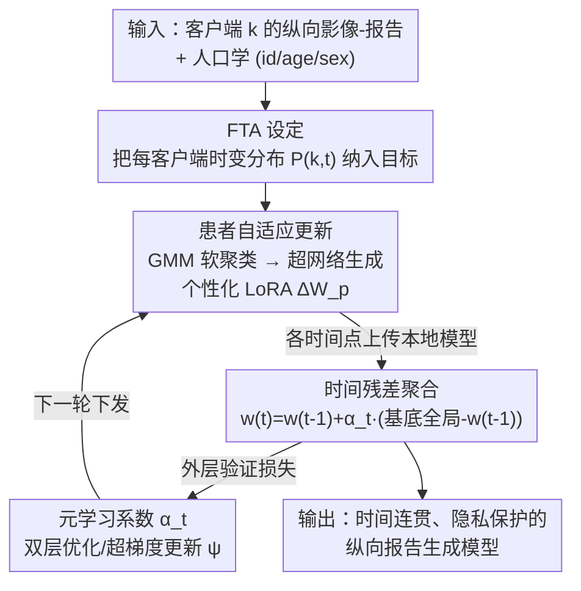

# Personalized Longitudinal Medical Report Generation via Temporally-Aware Federated Adaptation

**会议**: CVPR 2026  
**论文**: [CVF Open Access](https://openaccess.thecvf.com/content/CVPR2026/html/Zhu_Personalized_Longitudinal_Medical_Report_Generation_via_Temporally-Aware_Federated_Adaptation_CVPR_2026_paper.html)  
**代码**: https://github.com/zhuhe98/FedTAR-MedicalReport-Generation  
**领域**: 医学图像 / 联邦学习  
**关键词**: 纵向医学报告生成, 联邦学习, 时间漂移, 个性化 LoRA, 元学习聚合

## 一句话总结
本文提出"联邦时间适应"（FTA）这一把时间演化当作一等公民的联邦学习设定，并用 FedTAR 框架——以人口学信息驱动的个性化 LoRA + 元学习时间残差聚合——在隐私约束下建模患者随访的纵向变化，在 J-MID（约 100 万次检查）和 MIMIC-CXR 上同时提升了语言准确度、时间连贯性和跨机构泛化。

## 研究背景与动机
**领域现状**：从纵向胸部 CT 等随访影像自动生成报告，对追踪疾病进展、减轻医生负担很关键。受隐私法规约束，医院数据不能集中，联邦学习（FL）成为多机构协同训练的主流范式，已经从分类任务扩展到报告生成（FedMRG、FedMME 等）。

**现有痛点**：主流 FL 把每个客户端（医院）当成一个**固定不变的数据分布**——它把同一患者、同一机构在不同年份的所有检查都视为从单一静态分布里 i.i.d. 采样。但作者在纵向 CT 队列上观察到（论文 Fig.1）：同一机构报告的语义分布在 2018–2024 逐年明显漂移，不同机构的报告嵌入又聚成彼此分离的簇。也就是说，真实数据里既有"时间漂移"又有"客户端漂移"。

**核心矛盾**：现有 FL 是"客户端分布感知、但本质上时间无关"的。当用静态参数平均（FedAvg 那一套）去聚合带有进展信号的随访更新时，会把对临床判断最关键的进展相关信号给"平均掉"，导致优化不稳、报告质量次优。

**本文目标**：把问题拆成两个子问题——① "谁在变"（who varies）：建模患者个体异质性（年龄、性别等人口学差异）；② "何时变"（when change occurs）：建模随访序列上的时间非平稳性。

**切入角度**：既然时间漂移是真实存在且对诊断关键的，就不该再假设平稳，而要把时间演化提升为联邦优化目标里的一等组件，并为它设计参数高效、且有收敛/稳定性保证的机制。

**核心 idea**：用"人口学条件化的个性化 LoRA"回答"谁在变"，用"元学习加权的时间残差聚合"回答"何时变"，两者组成 FTA 设定的首个具体实例 FedTAR。

## 方法详解

### 整体框架
FedTAR 是一个两模块顺序耦合的多模态联邦框架：客户端侧先做**患者自适应更新**（把低维人口学数据经 GMM 编码、再由超网络动态生成个性化 LoRA 权重做本地微调），服务器侧再做**时间残差聚合**（在每个时间步计算残差、用基于超梯度的元学习自适应地给各时间步更新加权再聚合）。一次完整通信轮里，每个时间点的客户端模型上传后先在该时间步做一次加权平均得到基底全局模型，再以残差方式融入历史，最后用验证集梯度更新元参数。

### 关键设计

**1. FTA 联邦时间适应设定：把时间漂移写进联邦目标**

针对"现有 FL 假设客户端分布静态、抹掉进展信号"这个根因，作者重新形式化了问题。标准 FL 假设客户端 $k$ 从静态分布 $P_k$ 采样 i.i.d. 样本；在线 FL 则把时间索引挂在优化过程（轮次 $\tau$）上而非数据分布上。FTA 不同：它显式地把每个客户端建模成一组时变分布 $\{P_{k,t}\}_{t=1}^{T}$，每条序列 $p_n=\{x_{k,t},y_{k,t}\}_{t=1}^{T}$ 对应一次次随访，目标是 $\min_{w}\sum_{k}\sum_{t}\mathcal{L}(f(w;x_{k,t}),y_{k,t})$。这样"时间漂移"就成了目标函数的一等组件，而不是被聚合平均掉的噪声。这是后续两个机制的设定地基——先把问题问对，再谈怎么解。

**2. 患者自适应 LoRA：用人口学软聚类回答"谁在变"**

针对患者个体异质性，作者不直接交换原始人口学数据（保隐私），而是为每个患者 $p$ 算一个归一化画像向量 $v_p=[\mathrm{Norm}(\mathrm{hash}(\mathrm{id}_p)),\mathrm{Norm}(\mathrm{age}_p),\mathrm{enc}(\mathrm{sex}_p)]^\top\in\mathbb{R}^3$，再用高斯混合模型得到软聚类分配 $q_p=\mathrm{GMM}(v_p)$（实现用 16 个分量的对角协方差 GMM）。软分配捕捉患者在若干潜在子群间的概率隶属，允许在子群之间平滑插值；随后线性投影成患者嵌入 $\phi_p=W_{proj}q_p+b_{proj}$。关键一步是用轻量超网络 $h^l$ 把 $\phi_p$ 映射成**患者专属的低秩适配器** $[A_p^l,B_p^l]=h^l(\phi_p)$，于是层 $l$ 的有效权重是 $W_p^l=W_{client}^l+A^lB^{l\top}+A_p^l(\phi_p)B_p^l(\phi_p)^\top$——一个共享 LoRA 项加一个患者个性化 LoRA 项。这样既参数高效（只需训练投影、超网络和共享适配器），又能按子群差异做细粒度个性化，避免"一刀切"模型。

**3. 时间残差聚合：用残差+凸组合回答"何时变"且不丢历史**

针对"静态参数平均无法对齐未来时间漂移"，作者在服务器端改成残差式聚合。在通信轮 $r$、时间步 $t$，先做一次加权平均得到基底全局模型 $\bar{w}_g^{(t,r)}=\sum_k\frac{1}{n_k}w_c^{t,k,r}$，再做残差修正 $w_g^{(t,r)}=w_g^{(t-1,r)}+\alpha_t(\bar{w}_g^{(t,r)}-w_g^{(t-1,r)})$（上一轮末状态作为本轮起点）。论文用两条定理为它背书：定理 1 证明该迭代可写成对各时间步快照的**凸组合**（系数非负、和为 1），因此 $w_g^{(t,r)}$ 始终落在 $\{\bar{w}_g^{(1,r)},\dots,\bar{w}_g^{(t,r)}\}$ 的凸包内，保留对全部历史快照的平滑记忆、早期生物标志与近期观察都被反映；定理 2 证明单步更新幅度 $\|w_g^{(t,r)}-w_g^{(t-1,r)}\|=\alpha_t\|\Delta_t\|\le\alpha_t G$ 有界，于是 $\alpha_t$ 大则快速响应新数据、$\alpha_t$ 小则抑噪并收敛。这把"适应性 vs 稳定性"的权衡显式落到一个可控系数上（⚠️ 定理证明细节以原文附录为准）。

**4. 元学习系数：用双层优化自动调时间权重，避免手工排程**

直接最小化训练损失来选 $\{\alpha_t\}$ 会过拟合时间波动，所以作者把系数参数化为 $u_t=g(e(t);\psi)$、$[\alpha_1,\dots,\alpha_T]=\mathrm{Softmax}([u_1,\dots,u_T])$（$g$ 是把时间嵌入映射到打分的轻量 MLP），softmax 保证 $\alpha_t\in(0,1)$ 从而残差聚合仍在凸包内、保留定理保证。训练用双层优化：内层按式 (7) 跨 $t$ 聚合得到 $w_g^{(T,r)}(\psi)$，外层用留出验证损失更新元参数 $\psi\leftarrow\psi-\eta\nabla_\psi\mathcal{L}_{val}$（一阶 MAML / 超梯度下降）。这样就不用人工排时间权重，分布漂移大的时间点自动拿到大系数，零散噪声波动被衰减，兼顾优化速度与鲁棒稳定。

### 损失函数 / 训练策略
客户端用标准临床报告损失 $\mathcal{L}=\sum_{(I,R)\in\mathcal{D}_k}\ell(f(I;W_p),R)$，梯度流入客户端权重、共享适配器 $\{A^l,B^l\}$、超网络 $\{h^l\}$ 和投影参数。图像编码器为 ImageNet-21K 预热的 Convolutional vision Transformer，文本解码器为临床语料预训练的 DistilGPT2；LoRA 秩 $r=4$、$\alpha=128$ 加在每个 transformer 层；模型与适配器学习率 $10^{-5}$，元学习时间系数学习率 $10^{-4}$，优化器 AdamW。

## 实验关键数据

### 主实验
在自建的五机构纵向胸部 CT 数据集（每位患者恰好 5 次连续 CT）上，对比六个 FL baseline（基线遵循把所有时间点汇集成单一数据集的常规训练协议）：

| 方法 | BLEU-1 | BLEU-4 | ROUGE-L | CIDEr |
|------|--------|--------|---------|-------|
| FedAvg | 38.40 | 10.98 | 28.54 | 31.70 |
| FedProx | 38.32 | 11.00 | 28.58 | 31.62 |
| SCAFFOLD | 35.40 | 10.10 | 27.12 | 24.82 |
| FedAdam | 38.26 | 10.93 | 28.61 | 30.62 |
| DRFA | 36.80 | 11.60 | 28.75 | 29.51 |
| **FedTAR（本文）** | **40.08** | **12.40** | **29.54** | **42.80** |

CIDEr 从最强基线的 31.70 提升到 42.80，提升幅度最大，说明时间+人口学感知的适应显著改善了内容相关性。在公开 MIMIC-CXR（划成 4 个客户端）上，FedTAR 的 CE-F1 33.21、CIDEr 120.58 也领先多数基线（如 FedAvg CIDEr 37.54、DRFA 108.10）。与集中式纵向模型 CT2RepLong 相比，FedTAR 在 CE-F1（14.47 vs 13.24）和 CIDEr（42.80 vs 25.68）上更优，但 BLEU-1/ROUGE-L 略低——在隐私保护的联邦设定下取得这样的结果已属不易。

### 消融实验
| 配置 | BLEU-4 | ROUGE-L | CIDEr | 说明 |
|------|--------|---------|-------|------|
| FedTAR w/o GMM | 12.07 | 28.65 | 41.56 | 去掉人口学软聚类嵌入 |
| FedTAR w/o temporal | 11.21 | 29.50 | 41.88 | 去掉元学习时间聚合 |
| **FedTAR（完整）** | **12.40** | **29.54** | **42.80** | 两模块齐备 |

### 关键发现
- 去掉 GMM 人口学嵌入，BLEU/CIDEr 明显下降，说明患者条件化嵌入对捕捉个体异质性是必需的。
- 去掉时间超网络，ROUGE-L 与召回类指标下降，说明自适应时间加权对建模纵向进展、缓解跨机构漂移关键。
- 两模块呈互补效应，缺一不可，分别对应"谁在变"和"何时变"。
- 论文还提供了 CIDEr 随通信轮的经验与理论收敛曲线，呼应残差聚合的凸包/有界性保证。

## 亮点与洞察
- **把"时间"提升为联邦优化的一等公民**：FTA 设定区分了标准 FL（时间挂在数据分布外）、在线 FL（时间挂在优化轮次）与 FTA（时间挂在客户端数据分布内），定位清晰，是一个可被后续工作沿用的问题框架。
- **理论+工程双轮驱动**：残差聚合不是拍脑袋的 trick，凸包定理保证不丢历史、有界性定理刻画适应-稳定权衡，让"为什么这样聚合"有据可依。
- **个性化但不泄露隐私**：把人口学先 hash/归一化再过 GMM 软聚类、只交换适配器而非原始人口学，是医疗联邦里值得复用的"以统计画像换个性化"思路。
- **可迁移**：人口学条件化超网络生成 LoRA、元学习时间残差权重，都可迁移到其他纵向/流式联邦场景（如可穿戴时序、跨院电子病历）。

## 局限与展望
- 主数据集是不公开的私有五机构 CT 队列（受隐私法规限制），外部难以复现，泛化证据主要靠 MIMIC-CXR 补充。
- 每位患者被设为恰好 5 次随访，真实临床里随访次数高度不齐，对不定长、缺失时间点的鲁棒性论文未充分展开。
- 时间系数用 softmax 参数化保证落在凸包内，但这也限制了"完全遗忘早期快照"等更激进策略；双层优化的计算开销与收敛对元学习率较敏感。
- 与集中式模型在部分 n-gram 指标上仍有差距，说明隐私约束下的纵向建模还有提升空间。

## 相关工作与启发
- **vs FedMRG / FedMME**：它们缓解客户端间异质性但假设数据静态、单轮 FL，本文把时间非平稳性显式纳入目标，多了"何时变"这一维。
- **vs PerAda / pFedLoRA**：同样做参数高效个性化适配器，但它们时间无关；本文的个性化适配器由人口学软聚类驱动，且与时间聚合耦合。
- **vs CT2Rep / CT2RepLong**：用记忆解码器+交叉注意力融合多时间点 CT 提升时间连贯，但是集中式的；本文把纵向建模搬进隐私保护的联邦设定。
- **vs FedAvg 系（FedProx/SCAFFOLD/FedAdam/FedYogi/DRFA）**：这些做静态参数平均，会平均掉进展信号；本文用残差+元学习加权聚合保留并自适应地利用时间信息。

## 评分
- 新颖性: ⭐⭐⭐⭐⭐ 提出 FTA 设定并给出首个带理论保证的实例，把时间漂移写进联邦目标。
- 实验充分度: ⭐⭐⭐⭐ 私有大规模 CT + MIMIC-CXR + 消融 + 收敛分析较完整，但主数据集不公开、随访次数固定。
- 写作质量: ⭐⭐⭐⭐ 问题动机和两模块分工清晰，理论与方法衔接好，部分公式排版较密。
- 价值: ⭐⭐⭐⭐ 对隐私敏感的纵向多机构医学报告生成有直接价值，框架也可迁移到其他时序联邦场景。

<!-- RELATED:START -->

## 相关论文

- [\[CVPR 2026\] TIM: Temporal Decoupling with Iterative Mutual-Refinement Model for Longitudinal Radiology Report Generation](tim_temporal_decoupling_with_iterative_mutual-refinement_model_for_longitudinal_.md)
- [\[CVPR 2026\] BiOTPrompt: Bidirectional Optimal Transport Guided Prompting for Disease Evolution-aware Radiology Report Generation](biotprompt_bidirectional_optimal_transport_guided_prompting_for_disease_evolutio.md)
- [\[CVPR 2026\] OmniFM: Toward Modality-Robust and Task-Agnostic Federated Learning for Heterogeneous Medical Imaging](omnifm_toward_modality-robust_and_task-agnostic_federated_learning_for_heterogen.md)
- [\[CVPR 2026\] Sketch2CT: Multimodal Diffusion for Structure-Aware 3D Medical Volume Generation](sketch2ct_multimodal_diffusion_for_structure-aware_3d_medical_volume_generation.md)
- [\[CVPR 2026\] SHAPE: Structure-aware Hierarchical Unsupervised Domain Adaptation with Plausibility Evaluation for Medical Image Segmentation](shape_structure-aware_hierarchical_unsupervised_domain_adaptation_with_plausibil.md)

<!-- RELATED:END -->
