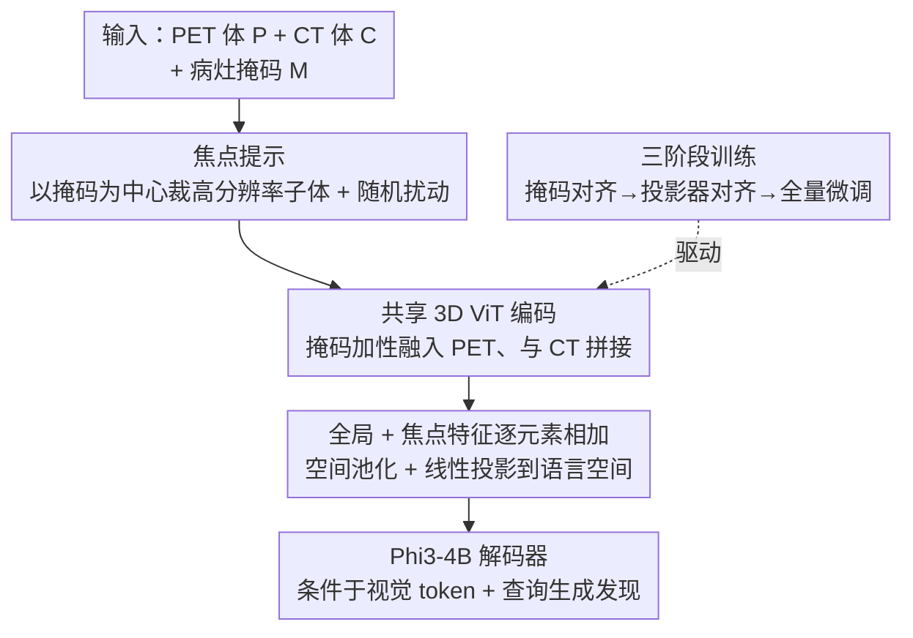

# PETAR: Localized Findings Generation with Mask-Aware Vision-Language Modeling for PET Automated Reporting

**会议**: CVPR 2026  
**论文**: [CVF Open Access](https://openaccess.thecvf.com/content/CVPR2026/html/Maqbool_PETAR_Localized_Findings_Generation_with_Mask-Aware_Vision-Language_Modeling_for_PET_CVPR_2026_paper.html)  
**代码**: https://github.com/DanyalMaq/petar-release/  
**领域**: 医学图像 / 多模态VLM / 报告生成  
**关键词**: PET/CT 报告生成, 病灶级定位, 掩码感知, 3D 视觉语言模型, 焦点提示

## 一句话总结
针对 3D 全身 PET/CT 报告生成中「病灶极小（<0.1% 体积）、感兴趣区分散、且缺乏掩码-文本对齐数据集」三大难题，本文同时给出了首个病灶级对齐的公开数据集 PETARSeg-11K 和一个掩码感知的 3D 视觉语言模型 PETAR-4B，靠「掩码条件 + 焦点提示」把小病灶看清，在所有自动指标上大幅超越 2D/3D baseline，并通过首个 PET 报告人评研究（5 名核医学医师）验证了临床可用性。

## 研究背景与动机

**领域现状**：视觉语言模型（VLM）在自动放射报告生成上潜力很大，但现有研究压倒性地集中在 2D 模态（胸片、单张 CT 切片）。3D 模态本就更难，而 PET（正电子发射断层）尽管在肿瘤诊断、分期、疗效评估中作用关键、临床应用还在扩张，却严重欠缺研究。

**现有痛点**：PET 报告有几个独特难点让现有 VLM 难以应付。其一，临床 PET 报告要求**病灶级**的细粒度描述（要写清病灶的解剖部位、子部位、侧别、形态、代谢活性），而非全局总结，组合空间巨大、报告往往是放射科最长的（有时是 CT 报告的 3 倍长）。其二，临床相关病灶可能数量多、体积极小（平均占总体积不到 0.1%）、空间分散，标准视觉编码器靠全局特征提取+下采样很容易把这些细节抹掉。其三，现有 3D 医学 VLM（CT2Rep、M3D、Merlin）多在 CT（解剖成像）上训练，不是为 PET（代谢/分子成像）设计、也不能联合处理 PET/CT 双模态。

**核心矛盾**：最根本的卡点是**没有任何大规模公开数据集**把 3D 病灶级分割掩码与自由文本放射学发现对齐起来——没有这种「空间定位 ↔ 自然语言描述」的直接连接，模型既学不会病灶特异的描述，可用性和可靠性也无从谈起。

**本文目标**：(1) 造一个把病灶掩码、3D 影像、文本发现三者对齐的数据集；(2) 设计一个能把 PET、CT、病灶掩码联合编码、在小病灶上看清细节的 3D 掩码感知 VLM；(3) 建立一套含人评的评测，搞清哪些自动指标最贴合医师判断。

**切入角度**：既然病灶小到会在全局处理中丢失，就把「定位信息」显式喂进模型——用病灶掩码引导一个高分辨率的局部视图（焦点提示），让语言生成同时条件于全局疾病背景和细粒度病灶属性。

**核心 idea**：用「掩码引导的焦点提示 + PET/CT/掩码联合编码」做病灶级、空间锚定的 PET/CT 报告生成，并配套首个病灶级掩码-文本对齐数据集。

## 方法详解

### 整体框架
PETAR 由两部分组成：数据集 PETARSeg-11K 与模型 PETAR-4B。数据侧用 LLM 集成从临床报告里抽取病灶属性（SUVmax、切片号等），驱动迭代阈值/区域生长算法在 PET 体上定位病灶，产出 11,356 条病灶描述与对应 3D 分割的对齐数据。模型侧输入是 PET 体 $P$、CT 体 $C$ 和二值病灶掩码 $M$，目标是生成聚焦该掩码区域的诊断发现 $y = f_\theta(P, C, M)$。整条流水线是：以掩码为中心裁出高分辨率焦点子体（焦点提示）→ 共享 3D ViT 把 PET/CT/掩码编码并将掩码加性融进 PET → 全局特征与焦点特征逐元素相加、空间池化、投影进语言空间 → Phi3-4B 解码器条件于视觉 token 与查询生成病灶发现，全程用三阶段训练逐步解冻。

### 关键设计

**1. PETARSeg-11K：首个病灶级掩码-文本对齐的全身 PET/CT 数据集**

这是全文的数据地基，直接补上「3D 病灶掩码 ↔ 自由文本发现」对齐资源的空白。构建管线（Huemann et al. 的方法）用 Mistral-7B-Instruct + Mixtral-8×7B-Instruct 的语言模型集成过滤无关句子、消解对既往检查的指代、精确抽取每个病灶的 SUVmax 与对应轴向切片号；再用迭代阈值算法在 PET 体上生成掩码——先按报告 SUVmax 设阈值得到候选连通域，挑出 SUVmax 与报告值匹配（±0.1）且与报告切片相交的成分，从峰值像素出发迭代生长轮廓直至稳定。最终得到 11,356 条病灶描述、覆盖 5,126 次独特检查（含 FDG、DOTATATE、fluciclovine、DCFPyL 等多种示踪剂），数据重采样到 3mm、尺寸 192×192×352，医师抽检轮廓位置准确率 98%。每条描述再用 Qwen3-30B-A3B 格式化成结构化 schema（显式锚定空间与解剖引用）。⚠️ 论文不同处对样本量描述略有出入（摘要称 11,356 条描述配 3D 分割、采集自「5000+ 次全身 PET/CT」；正文提到先收集 33,000 次 PET/CT 扫描，Table 1 列总扫描数 5126），数字以原文为准。此外还用 TotalSegmentator 对 CT 自动分割出约 10 万个覆盖 117 类解剖结构的标注，作为强化全局解剖理解的预训练数据。

**2. 焦点提示（Focal Prompt）：把不到 0.1% 体积的小病灶「放大看清」**

这是性能影响最大的设计，直击「病灶太小、全局缩放/裁剪/下采样会丢信息」的痛点。作者把 Describe Anything Model 的思路扩展到 3D：以掩码 $M$ 为中心裁出一个覆盖感兴趣区的立方子体，提供高分辨率局部视图。为增强鲁棒、避免过拟合到固定空间位置，对裁剪中心 $c$ 和边长 $r$ 都施加小幅随机扰动——$\tilde c = c + \triangle c,\ \tilde r = r + \triangle r$，其中 $\triangle c, \triangle r \stackrel{i.i.d.}{\sim} U(-0.2r, 0.2r)$，并保证扰动后掩码仍完整落在子体内（病灶不被裁出）。由此得到 PET/CT/掩码三路焦点裁剪 $F_P, F_C, F_M = \text{Crop}(P, C, M; \tilde c, \tilde r)$。消融显示焦点提示「整体影响最强」，它锐化了模型对细粒度细节的注意力。

**3. 共享 3D 编码 + 掩码加性条件 + 全局-焦点融合：让代谢、解剖、定位三种线索协同**

为了既看全局又看局部、既懂代谢又懂解剖，作者用一个共享 3D ViT 同时编码 PET 与 CT（PET 本身结构信息少、需 CT 提供解剖背景），并把病灶掩码用**逐元素加性条件**注入 PET 分支：PET/CT 各自切成不重叠 3D patch、线性投影成 token 嵌入 $Z_P, Z_C$，掩码用另一组参数得到 $Z_M$，编码为 $X_{\text{PET}} = T(Z_P + Z_M),\ X_{\text{CT}} = T(Z_C)$，再沿嵌入维拼接成全局特征 $X = \text{Concat}(X_{\text{PET}}, X_{\text{CT}})$。同样的过程作用于焦点裁剪得焦点特征 $\tilde X$；全局与焦点特征逐元素相加 $T = X + \tilde X$、空间池化后线性投影进语言空间 $V = \text{Proj}(\text{SpatialPooler}(T))$，最后把视觉 token $V$ 与病灶描述查询 $q$ 一起送进 Phi3-4B 解码器生成发现 $y$。这种「掩码加性条件 + 全局/焦点双视图融合」让 PET 的代谢活性、CT 的解剖结构、掩码的空间定位三者对齐协同。

### 损失函数 / 训练策略
训练目标是标准的自回归负对数似然：$L(D, \theta) = -\sum_{(V,q,y)\sim D} \sum_{i=1}^{N} \log p_\theta(y_i \mid V, q, y_{<i})$，三阶段共用同一目标但更新不同参数。**Stage 1 掩码嵌入对齐**：只训把 PET/CT 视觉特征映射进语言空间的投影头，掩码嵌入权重初始化为零、PET/CT 编码器与语言模型均冻结。**Stage 2 投影器对齐**：只训掩码嵌入模块（式 7），让掩码权重学会把二值掩码编码成与底层 3D 解剖/代谢信号对齐的表示。**Stage 3 全量微调**：解冻整个架构端到端联合优化。整套三阶段先在 TotalSegmentator 预训练数据（问答式：「掩码高亮的是哪个区域？」）上跑一遍，再在 PETARSeg-11K 上重复。视觉编码器与语言模型取自 M3D（ViT + Phi3-4B），2×L40S、各阶段 10 epoch、共约 20 小时。

## 实验关键数据

### 主实验
在 PETARSeg-11K 的 1175 条留出测试集上，PETAR-4B 在 N-gram、语义、LLM 临床三类指标上全面领先（「finetuned」表示在本数据集上微调过）：

| 模型 | BLEU | ROUGE-L | METEOR | CIDEr | BERTScore | RaTEScore | GREEN |
|------|------|---------|--------|-------|-----------|-----------|-------|
| MedGemma-4B (finetuned, 最强 2D) | 0.495 | 0.454 | 0.510 | 0.119 | 0.754 | 0.613 | 0.086 |
| M3D-RAD (finetuned, 最强 3D) | 0.485 | 0.446 | 0.501 | 0.132 | 0.750 | 0.627 | 0.071 |
| Reg2RG (finetuned, 掩码感知 3D) | 0.478 | 0.416 | 0.487 | 0.055 | 0.732 | 0.532 | 0.031 |
| **PETAR-4B (Ours)** | **0.535** | **0.524** | **0.560** | **0.457** | **0.795** | **0.713** | **0.257** |

其中 CIDEr（0.457 vs 0.132）与 GREEN（0.257 vs 0.071）的差距最为悬殊，说明 PETAR 不只是词面相似、更生成了临床上有意义的描述。未微调的通用/医学 VLM 在 PET 上几乎失效（多数 GREEN 仅 0.002–0.03），印证 PET 的领域漂移之大、以及本数据集的价值。

### 消融实验
四个组件（掩码 / CT / 焦点 / TS 预训练）逐项消融（基线为在本数据集 finetuned 的 M3D-RAD 配置）：

| Mask | CT | Focal | TS | BLEU | CIDEr | GREEN |
|------|----|-------|----|------|-------|-------|
| × | × | × | × | 0.485 | 0.132 | 0.071 |
| × | × | ✓ | × | 0.528 | 0.397 | 0.226 |
| ✓ | ✓ | ✓ | × | 0.521 | 0.439 | 0.239 |
| ✓ | ✓ | ✓ | ✓ | **0.535** | **0.457** | **0.257** |

去掉任一模块都会让所有指标下降；**焦点提示整体影响最强**（单加焦点就把 CIDEr 从 0.132 拉到 0.397、GREEN 从 0.071 拉到 0.226），掩码提供关键空间锚定、CT 提升解剖连贯性、TS 预训练再补一档。

### 关键发现
- **GREEN 是最贴合医师判断的自动指标**：用 5 名核医学医师对 116 对真实/PETAR 描述盲评，分析各自动指标与人评的 Spearman 相关，GREEN（ρ=0.59）、RaTEScore（0.55）、BERTScore（0.51）等语义/上下文指标明显优于 BLEU（0.21）等纯 n-gram 指标，说明评测应转向反映临床推理而非表层词面相似。
- **临床可用性获人评背书**：PETAR-4B 在解剖、解释、实用性三项人评得分 3.7–3.9（医师为 4.3–4.4），且医师在约 60%（69/116）的病例中认为模型描述优于或等同于真实报告；在外部 AutoPET（32 例、分布外）上也保持相近水平。
- **掩码定性优势**：未微调时 M3D-RAD 会幻觉无关解剖（把气管旁淋巴结描述成「上颌嵴」），微调后仍频繁定位错误（把左腹股沟淋巴结说成「左股骨近端」），而 PETAR 的描述持续与真实视觉特征和解剖背景对齐。

## 亮点与洞察
- **「数据 + 模型」双贡献闭环**：先用 LLM 集成把临床报告里的 SUVmax/切片号自动转成可定位的病灶掩码，造出首个病灶级掩码-文本对齐数据集，再围绕它设计掩码感知模型——这种「为新任务先造对齐数据、再设计对齐架构」的范式可迁移到其他缺标注的 3D 医学报告任务。
- **焦点提示是把 3D 小目标看清的实用招**：把 2D 的 Describe Anything 焦点裁剪扩展到 3D，并对中心/边长加随机扰动防过拟合——对「目标占比 <0.1%、全局下采样必丢」这类问题是通用解法，不限于 PET。
- **首个 PET 报告人评 + 指标可信度分析**：不止刷自动指标，还回答了「哪个自动指标该信」，对医学报告生成的评测实践有方法学价值。

## 局限与展望
- **依赖掩码输入**：最佳性能要求提供病灶掩码，目前需医师标注。作者认为这能融入临床阅片流程（单击分割工具如 PETEdge+），未来可接自动 PET 病灶检测/分割模型做全自动管线，但本文未实现端到端自动版。
- **定量测量会幻觉**：模型对病灶大小、SUVmax 等数值会编造（人评时已特意排除这类项），这些值需直接从掩码测量替换，说明模型并不真正「读数」。
- **泛化范围**：训练与评测以特定机构数据为主，外部仅在 AutoPET 32 例小样本上验证；跨机构扫描协议、跨示踪剂、罕见病灶类型的稳健性仍待更大规模检验。

## 相关工作与启发
- **vs M3D / Merlin / CT2Rep（3D 医学 VLM）**：它们靠全局特征提取+下采样、且**掩码无关**，难以定位描述细粒度病灶，且主要在 CT 上训练；PETAR 掩码感知、PET/CT 联合编码、焦点提示放大小病灶，故在所有指标上大幅领先。
- **vs Reg2RG（掩码感知 3D）**：Reg2RG 用器官级大掩码生成区域级描述、限于单模态胸部 CT；PETAR 用病灶级小掩码 + 双模态 PET/CT，面向解剖与技术都不同的病灶级描述任务。
- **vs MAIRA / LLaVA-Med（2D 医学 VLM）**：受限于 2D 平面、丢弃 3D 体的关键空间信息；本文实验中即便给 2D 模型喂三视图切片近似 3D，也仍逊于 PETAR 的体级掩码引导编码。

## 评分
- 新颖性: ⭐⭐⭐⭐ 首个病灶级 PET/CT 掩码-文本数据集 + 3D 焦点提示掩码感知架构，填补 PET 报告生成空白；单组件思路多有前作可循。
- 实验充分度: ⭐⭐⭐⭐⭐ 覆盖 2D/3D 多基线、三类指标、四组件消融、首个 5 医师人评 + 指标可信度分析 + 外部数据集，非常扎实。
- 写作质量: ⭐⭐⭐⭐ 问题—数据—模型—评测脉络清晰，公式与图表完整；部分样本量数字前后略有出入。
- 价值: ⭐⭐⭐⭐⭐ 开源数据集与模型直击 PET 报告生成这一欠研究且临床重要的方向，并给出评测指标选型建议，落地与后续研究价值高。

<!-- RELATED:START -->

## 相关论文

- [\[CVPR 2026\] IVAAN: Instance-level Vision-Language Alignment via Attribute-Guided Text Prompts Generation for Nuclei Analysis](ivaan_instance-level_vision-language_alignment_via_attribute-guided_text_prompts.md)
- [\[CVPR 2026\] D2T2 - Multimodal Automated Planning for Brachytherapy](d2t2_-_multimodal_automated_planning_for_brachytherapy.md)
- [\[CVPR 2026\] Modeling the Brain's Grammar: ROI-Guided fMRI Pretraining for Transferable and Interpretable Vision Decoding](modeling_the_brains_grammar_roi-guided_fmri_pretraining_for_transferable_and_int.md)
- [\[NeurIPS 2025\] Toward a Vision-Language Foundation Model for Medical Data: Multimodal Dataset and Benchmarks for Vietnamese PET/CT Report Generation](../../NeurIPS2025/medical_imaging/toward_a_vision-language_foundation_model_for_medical_data_multimodal_dataset_an.md)
- [\[CVPR 2026\] Unleashing Video Language Models for Fine-grained HRCT Report Generation](unleashing_video_language_models_for_fine-grained_hrct_report_generation.md)

<!-- RELATED:END -->
