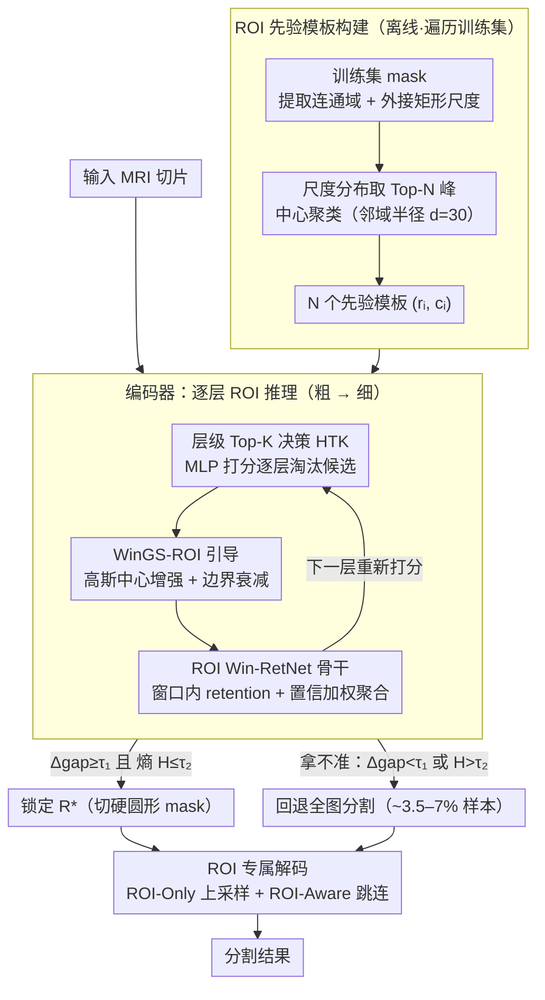

# PGR-Net: Prior-Guided ROI Reasoning Network for Brain Tumor MRI Segmentation

**会议**: CVPR 2026  
**arXiv**: [2603.21626](https://arxiv.org/abs/2603.21626)  
**代码**: [https://github.com/CNU-MedAI-Lab/PGR-Net](https://github.com/CNU-MedAI-Lab/PGR-Net)  
**领域**: 医学图像分割  
**关键词**: 脑肿瘤分割, ROI先验, 空间引导, RetNet, MRI

## 一句话总结

PGR-Net 提出了一种显式 ROI 感知的脑肿瘤 MRI 分割网络，通过从训练集构建数据驱动的空间先验模板、层级 Top-K ROI 选择机制和窗口高斯-空间衰减引导模块（WinGS-ROI），将计算资源集中于病灶区域，仅用 8.64M 参数就在 BraTS-2019/2023 和 MSD Task01 上达到了 SOTA。

## 研究背景与动机

**领域现状**：脑肿瘤 MRI 分割是临床诊断和放疗靶区勾画的基础任务。从 UNet 到 TransUNet、Swin UNETR 再到 Mamba-UNet 等 SSM 方法，分割精度持续提升。

**现有痛点**：脑肿瘤在 MRI 中具有严重的**空间稀疏性**——BraTS2023 中平均肿瘤区域仅占整幅图像的约 10.7%（约 2740 像素/160×160）。这导致模型在早期训练被背景特征主导，后期虽能大致定位肿瘤但仍在健康组织上消耗大量计算。现有模型通常假设病灶均匀分布，忽略了临床上已知的肿瘤空间分布规律。

**核心矛盾**：肿瘤在脑部有明确的空间分布模式——中心多集中在额-颞叶交界处，而枕叶很少出现。现有分割网络忽略了这些先验，对全图做均等计算是一种巨大浪费。少数引入硬性 ROI 指导的方法又因为无法捕获分布模式而泛化性差。

**本文目标**（1）从数据统计中建模肿瘤的位置和尺度先验；（2）利用先验进行渐进式层级 ROI 选择；（3）在网络各层嵌入可学习的空间引导以聚焦病灶、抑制背景。

**切入角度**：作者观察到脑肿瘤的空间分布具有统计规律性（通过分析训练集的病灶中心分布和尺度分布），因此可以从训练集中提取 ROI 先验模板集 $\{(r_i, c_i)\}$，将先验知识显式注入网络从而"把钱花在刀刃上"。

**核心 idea**：构建数据驱动的肿瘤空间先验模板，通过层级 Top-K 选择 ROI + 窗口高斯空间衰减引导图，在 RetNet 骨干中实现从全局到局部的 ROI 感知分割。

## 方法详解

### 整体框架

PGR-Net 想解决的核心问题是：脑肿瘤只占 MRI 图像的约 11%，但常规分割网络对全图做均等计算，把大量算力浪费在了健康组织上。它的破题思路是先从训练集里"摸清"肿瘤一般长在哪、有多大，再让网络在推理时顺着这份先验把注意力收缩到病灶上。

整张网络是一个以窗口化 RetNet（Win-RetNet）为骨干的编码器-解码器。离线阶段先扫一遍训练集所有标注，统计出一组 ROI 先验模板 $\{(r_i, c_i)\}_{i=1}^N$，每个模板记录一个代表性的病灶尺度比 $r_i$ 和中心坐标 $c_i$。在线推理时，这 $N$ 个候选 ROI 被丢进编码器：层级 Top-K 决策（HTK）从最粗的编码层开始逐层打分、逐层淘汰，候选集越来越小，直到锁定最可信的那一个；与此同时，WinGS-ROI 模块把当前存活的候选转成一张"中心强、边界缓"的高斯引导图，乘进特征里，引导 Win-RetNet 骨干在 ROI 窗口内做高效建模。解码阶段则进一步只在锁定的 ROI 内做上采样和跳连融合（ROI-Only / ROI-Aware），彻底不在背景上花算力。

### 关键设计

**1. ROI 先验模板构建：把"肿瘤一般长在哪"变成可查的模板集**

直接对全图均等计算的浪费，根子在于网络事先对"病灶可能在哪"一无所知。PGR-Net 在训练前先把这份知识离线挖出来：对训练集每张 mask 提取连通域，量出它最小外接矩形的最大边长 $s$（作为尺度）和中心坐标。过滤掉过小的噪声区域后，把所有样本的尺度汇成一个分布，检测其中的局部极大值（峰值），取 Top-N 个峰作为代表性尺度；对落在每个尺度峰附近的样本，再对其中心坐标做聚类求均值，得到 $N$ 个先验模板 $(r_i, c_i)$。聚类时约束邻域半径 $d=30$，避免把相距很远但尺度恰好相同的两块区域错误地并成一个模板。和硬编码一个固定框不同，这种数据驱动的模板会自适应不同数据集的分布特点，而且天然覆盖多个尺度，为后面的层级筛选留足了搜索空间。

**2. 层级 Top-K ROI 决策（HTK）：从粗到细逐层淘汰候选，越选越准**

有了 $N$ 个候选模板，还得在推理时挑出当前这张图真正对应的那个 ROI。单层一次性决策容易失误——粗层感受野大但分辨率低，细层分辨率高但视野窄，谁都不全能。HTK 因此把决策摊到多层上：在最粗的编码层 $l=L$，用一个轻量 MLP 给全部 $N$ 个候选打分，只留下 Top-$K^{(L)}$ 个；到更细的层 $l<L$，只对上一层幸存的候选重新打分、继续收窄。各层分数经 softmax 归一化后加权汇总成一个跨层置信矩阵

$$S = \sum_l \alpha_l \hat{s}^{(l)}, \qquad R^* = \arg\max_i S_i$$

最终选置信度最高的 $R^*$。粗层负责"大致定位"、细层负责"精确定位"，逐层接力比单层硬选更稳。为防止遇到形态异常或分布偏移的样本时误判，HTK 还设了稳定性闸门：当最高分与次高分的间隔 $\Delta_{gap} < \tau_1$（说明拿不准）或置信分布的信息熵 $H > \tau_2$（说明太分散）时，直接回退到全图模式，宁可不聚焦也不聚焦错。实测这种回退只在约 3.5–7% 的样本上触发，绝大多数情况下先验都靠得住。

**3. WinGS-ROI 窗口高斯-空间衰减引导：用柔性引导图替代硬裁剪**

选出 ROI 之后，怎么把它"告诉"网络？直接用硬框裁剪会在边界制造伪影、也切断了梯度。WinGS-ROI 改用一张柔性引导图：每个存活的候选建模成一个圆形高斯

$$G_i^{(l)}(u,v) = \rho_i \exp\!\left(-\frac{(u-x_i)^2+(v-y_i)^2}{2\sigma_i^2}\right)$$

用 HTK 给出的置信度 $\rho_i$ 加权——越可信的候选，引导越强。ROI 外部不是直接清零，而是施加一个随距离平滑衰减的径向项 $\exp(-\frac{(d_i-R_i)^2}{2\tau^2})$，让信号缓慢消退而非硬截断。把各候选的模板聚合成引导图 $M^{(l)}$ 后，通过乘性调制注入特征：

$$\tilde{F}^{(l)} = (1 + \lambda M^{(l)}) \odot F^{(l)}$$

这里的 $1+\lambda M^{(l)}$ 是关键——它对病灶区域做增益，但对背景只是不增益（系数趋近 1）而非置零，所以原始特征的梯度流被保留下来，非 ROI 区域的信息也不会被完全屏蔽（除非候选已被高置信锁定，此时才切换成硬圆形 mask）。同一张引导图被嵌进编码器（Win-RetNet 内部）、跳连（ROI-Aware）和上采样（ROI-Only）三处，让"聚焦病灶"这件事贯穿整条前向通路。

**4. ROI Win-RetNet 骨干与 ROI 专属解码：在窗口内高效建模、解码只在病灶里花算力**

前三个设计解决了"ROI 在哪、引导多强"，但真正把算力省下来、撑起 8.64M 参数 / 39G FLOPs 的，是骨干和解码端的"只算 ROI"。骨干用的是 RetNet 的 retention 机制替代自注意力——它用一个带衰减因子 $\gamma$ 的循环/并行双形式建模序列长程依赖，复杂度比 $O(n^2)$ 的注意力低，天然适合高分辨率医学图像。具体地，Win-RetNet 按 WinGS-ROI 给出的引导图圈出每个存活候选的窗口，把窗口内特征拉平成序列喂给 RetNet 块，再把多个候选窗口的输出按 HTK 置信度做加权聚合：

$$Y^{(l)} = \sum_{k=1}^{K_l} \omega_k^{(l)} \cdot \mathrm{Fusion}(h_k^{(l)}), \qquad \omega_k^{(l)} = \frac{\exp(\gamma \rho_k^{(l)})}{\sum_j \exp(\gamma \rho_j^{(l)})}$$

越可信的候选窗口在聚合里权重越大，等于让骨干"重点听"那几个最像病灶的区域。解码端则把"只算 ROI"贯彻到底：ROI-Only 上采样只在锁定区域内重建、区域外补零；ROI-Aware 跳连只把 ROI 内的编码特征传给解码器。注意解码用的是 HTK 最终锁定的 $R^*$ 而非中间层那些尚未收敛的候选，保证整条解码路径的引导一致。正是"骨干用 retention 省算力 + 解码彻底跳过背景"这一组合，让网络在精度领先的同时把参数和 FLOPs 压到对比方法的几分之一。

### 一个完整示例

以一张 BraTS-2023 切片为例走一遍：离线阶段已从训练集得到 $N$ 个先验模板（比如 $N$ 个不同尺度/位置的候选 ROI）。推理时这 $N$ 个候选全部进入最粗编码层，HTK 的 MLP 逐一打分，把明显不像的（如落在枕叶、肿瘤罕见的位置）淘汰，只留下 Top-$K^{(L)}$ 个；进入下一层后只对这几个存活者重新评分，候选集继续收缩，到细层时通常只剩一两个高分候选。这时 WinGS-ROI 已经在每一层为存活候选生成高斯引导图，乘进特征让网络越来越聚焦于额-颞叶交界处那块真正的病灶。当最高分候选与其余拉开足够间隔（$\Delta_{gap} \ge \tau_1$、熵 $H \le \tau_2$）时，$R^*$ 被锁定，引导图切换为硬圆形 mask，解码阶段只在这个框内上采样出分割结果。反之若到最后几个候选仍纠缠不清（间隔太小或熵太大），HTK 触发回退、退化成全图分割——这条安全通道正是约 3.5–7% 样本走的路。

### 损失函数 / 训练策略

损失为 Dice loss 和 BCE loss 的加权组合（2:8 比例）。Adam 优化器，初始学习率 1e-3，训练 300 epochs + 50 epoch early stopping。所有实验独立运行 3 次取均值。HTK 与分割损失端到端训练，不需要额外的 ROI 定位标签。

## 实验关键数据

### 主实验

BraTS-2023 Dice (%) 对比：

| 方法 | 参数量 | Dice_WT | Dice_TC | Dice_ET | HD95_WT |
|------|--------|---------|---------|---------|---------|
| UNet | 39.40M | 90.71 | 93.05 | 93.36 | 1.1863 |
| Swin UNETR | 25.11M | 91.11 | 93.20 | 93.42 | 1.1629 |
| Mamba-UNet | 35.86M | 91.03 | 93.32 | 93.31 | 1.1734 |
| M-Net | 81.59M | 91.33 | 93.55 | 93.42 | 1.1534 |
| VM-UNet | 44.28M | 90.52 | 93.40 | 93.50 | 1.1806 |
| **PGR-Net** | **8.64M** | **91.82** | **94.07** | **93.88** | **1.1334** |

计算效率对比：

| 方法 | Params(M) | FLOPs(G) | 推理时间 |
|------|-----------|----------|----------|
| UNet | 39.40 | 321.19 | 12:32 |
| Swin UNETR | 25.11 | 106.80 | 21:33 |
| M-Net | 81.59 | 91.29 | 15:33 |
| **PGR-Net** | **8.64** | **39.05** | **9:41** |

### 消融实验

BraTS-2019 / BraTS-2023 Dice (%) 消融：

| 配置 | Dice_WT | Dice_TC | Dice_ET |
|------|---------|---------|---------|
| Baseline (无任何模块) | 87.82 / 91.06 | 88.91 / 92.97 | 91.05 / 93.13 |
| + ROI Win-RetNet | 87.85 / 91.10 | 88.89 / 93.02 | 91.15 / 93.08 |
| + HTK | 88.55 / 91.66 | 89.64 / 93.42 | 91.99 / 93.35 |
| + WinGS-ROI (编码器) | 88.63 / 91.76 | 90.33 / 93.75 | 92.72 / 93.57 |
| + WinGS-ROI (跳连) | 88.85 / 91.80 | 90.32 / 93.79 | 92.88 / 93.74 |
| + WinGS-ROI (上采样) 完整 | **89.02 / 91.82** | **90.69 / 94.07** | **93.61 / 93.88** |

### 关键发现

- **HTK 是最大单步提升贡献者**：加入 HTK 后 WT Dice 提升 0.7/0.56，TC 提升 0.75/0.40，说明层级 ROI 选择有效聚焦了计算
- WinGS-ROI 在编码器中贡献最大（尤其 ET 从 91.99 到 92.72），在跳连和上采样中继续叠加收益
- PGR-Net 参数仅 8.64M（比 UNet 少 4.6x，比 M-Net 少 9.4x），FLOPs 仅 39.05G，推理最快（9:41 vs 其他 12-30+ 分钟）
- 回退全图模式在 BraTS-2023 上仅触发 3.52% 的样本，说明先验引导在绝大多数情况下可靠
- 在三个数据集上一致性优于所有对比方法，特别是 WT 区域提升最显著（先验主要从 WT 构建）

## 亮点与洞察

- **"把钱花在刀刃上"的设计哲学**：脑肿瘤占图像 <11%，PGR-Net 通过 ROI 先验引导将计算聚焦于这 11%，用最少参数和 FLOPs 达到最好效果。这个思路可推广到所有空间稀疏的分割任务（如肺结节、小器官分割、视网膜病变检测）。
- **数据驱动先验 + 层级决策**的组合：先验提供初始搜索空间约束，HTK 在推理时动态精化——兼顾了先验的稳定性和推理时的灵活性。
- **WinGS-ROI 的柔性设计**比硬 mask 更优：高斯中心增强保证病灶中心获得最强特征调制，边界衰减避免硬截断导致的伪影。只有在高置信锁定后才切换硬掩码。

## 局限与展望

- ROI 先验仅从 WT（Whole Tumor）区域构建，未针对 TC 和 ET 构建独立先验——多区域先验可能进一步提升小区域分割
- 所有实验在 2D 切片上进行（因 GPU 限制），未利用 3D 体积的上下文信息——3D 版本有望更好
- 先验从训练集构建，对分布偏移（如不同医院、不同扫描仪）的鲁棒性有待验证
- 对非脑肿瘤的其他稀疏分割任务的泛化性未验证
- RetNet 骨干虽然高效，但其单向序列建模可能在需要双向上下文的区域（如对称结构）有局限

## 相关工作与启发

- **vs nnUNet**: nnUNet 是自动化分割的经典方法，PGR-Net 在 BraTS-2023 上 WT Dice 从 90.34 提升到 91.82，且推理时间从 86:52 大幅降到 9:41
- **vs Swin UNETR**: Swin UNETR 是 Transformer 系列的代表，PGR-Net 参数少 2.9x（8.64M vs 25.11M），WT Dice 高 0.71
- **vs Mamba-UNet**: Mamba 系列的 SSM 方法在效率上有优势但不如 PGR-Net 精确（91.03 vs 91.82 WT），且参数量是 4x
- **vs MedSAM**: 即使是基础模型 MedSAM（240M 参数），在脑肿瘤分割上也不如 PGR-Net，说明领域特定的先验比通用大模型更重要

## 评分

- 新颖性: ⭐⭐⭐⭐ 数据驱动先验 + 层级 Top-K ROI + WinGS-ROI 的组合是新颖的，将临床观察转化为算法设计的思路有启发性
- 实验充分度: ⭐⭐⭐⭐⭐ 三个数据集、三次重复、完整消融（6 个配置渐进添加）、效率对比、定性可视化
- 写作质量: ⭐⭐⭐⭐ 逻辑清晰，从临床观察到先验构建到网络设计的推导自然
- 价值: ⭐⭐⭐⭐ 用最小参数达到 SOTA 的思路在医学影像分割社区有实用价值

<!-- RELATED:START -->

## 相关论文

- [\[ICCV 2025\] M-Net: MRI Brain Tumor Sequential Segmentation Network via Mesh-Cast](../../ICCV2025/medical_imaging/m-net_mri_brain_tumor_sequential_segmentation_network_via_mesh-cast.md)
- [\[CVPR 2026\] Federated Modality-specific Encoders and Partially Personalized Fusion Decoder for Multimodal Brain Tumor Segmentation](federated_modality-specific_encoders_and_partially_personalized_fusion_decoder_f.md)
- [\[CVPR 2026\] Diffusion-Based Feature Denoising and Using NNMF for Robust Brain Tumor Classification](diffusion-based_feature_denoising_and_using_nnmf_for_robust_brain_tumor_classifi.md)
- [\[CVPR 2026\] Multiscale Structure-Guided Latent Diffusion for Multimodal MRI Translation](multiscale_structure-guided_latent_diffusion_for_multimodal_mri_translation.md)
- [\[CVPR 2026\] Virtual Full-stack Scanning of Brain MRI via Imputing Any Quantised Code](virtual_full-stack_scanning_of_brain_mri_via_imputing_any_quantised_code.md)

<!-- RELATED:END -->
