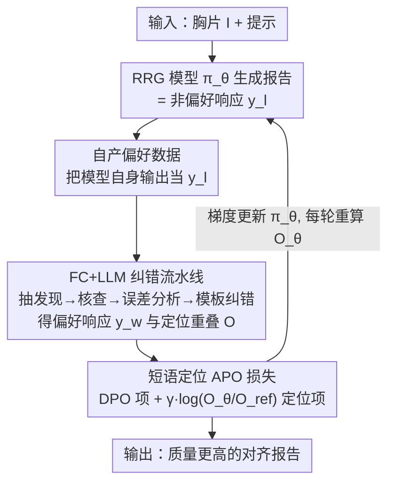

# Phrase-grounded APO for Improving Chest X-ray Report Generation

**会议**: CVPR 2026  
**论文**: [CVF Open Access](https://openaccess.thecvf.com/content/CVPR2026/html/Mahmood_Phrase-grounded_APO_for_Improving_Chest_X-ray_Report_Generation_CVPR_2026_paper.html)  
**代码**: 待确认  
**领域**: 医学图像 / 放射报告生成  
**关键词**: 胸片报告生成, 推理时对齐, 自动偏好优化, 短语级定位, 事实核查

## 一句话总结
本文提出"短语级定位的自动偏好优化（APO）"：在推理阶段、无需任何额外真值的前提下，用事实核查模型 + LLM 纠错把放射报告生成器自己的输出改成"偏好/非偏好"对，再用一个把偏好对齐损失和短语定位损失结合的新 APO 损失轻量更新模型权重，在多机构胸片数据集上让 7 个 SOTA 报告生成器的报告质量平均提升约 30–40%。

## 研究背景与动机
**领域现状**：自动放射报告生成（RRG）在胸片上进展最快（得益于 MIMIC、CheXpert 等大规模配对数据训练 VLM）。但临床试点暴露出大量幻觉和事实错误——既有"发现存在/不存在"的识别错误，也有"发现定位"错误，严重阻碍落地。

**现有痛点**：要提升 RRG，常规做法是训练时对齐——DPO、PPO、GRPO 等。但这些方法**都需要成对的"偏好 $y_w$ / 非偏好 $y_l$"真值数据集**，而在临床部署时根本没有现成真值。另一类推理时方法只调提示/采样/解码规则、不更新权重，又还没被改造到临床可用、不够"开箱即用"。最近出现的事实核查（FC）模型能在推理时对冻结 RRG 的报告做短语级定位纠错，但它只会"报错"，并不能改进生成器本身。

**核心矛盾**：临床部署里"想真正改进生成器（需要参数更新和偏好真值）"和"没有真值、不能集中数据"之间存在矛盾——已有对齐方法要么离不开人工构造的偏好真值，要么只能事后改报告而不触及模型。

**本文目标**：① 在推理时、无额外真值的情况下，自动生成偏好/非偏好数据；② 设计一个不仅对齐文字、还对齐发现"图像位置"的损失；③ 让方法对底座 RRG 模型无关、即插即用。

**切入角度**：作者注意到 FC 模型 + 模板化 LLM 纠错能把一份有错的报告改成一份"更对"的报告——那何不把"RRG 原始输出"当成**非偏好响应**、把"FC+LLM 纠正后的报告"当成**偏好响应**，从模型自己的输出里"自产"偏好对？再把发现的空间定位也纳入对齐目标。

**核心 idea**：用"自产偏好数据 + 短语定位项"把 DPO 改造成推理时、零真值的 APO（Automatic Preference Optimization）。

## 方法详解

### 整体框架
APO 把待对齐的 RRG 模型（策略 $\pi_\theta$）原始输出当作**非偏好响应** $y_l$；把它送进预处理（抽取发现及解剖定位）→ FC 模型核查（预测每个发现的真伪标签 $E$ 和预测位置 $l_w$）→ 误差分析（按真伪和 IoU 量化到 16 种组合、其中 6 种一致）→ LLM 模板化纠错，得到**偏好响应** $y_w$ 和短语定位重叠概率 $O$。然后用一个把偏好对齐损失与短语定位损失结合的 APO 损失，在测试图像上对 $\pi_\theta$ 做轻量参数更新（每次更新后重算 $\pi_\theta(y_w)$ 与重叠 $O_\theta$）。整个过程发生在**推理阶段**、不需要任何外部真值，且对底座 RRG 模型无关。

### 关键设计

**1. 自产偏好数据：把模型自己的输出当非偏好，推理时零真值对齐**

针对"DPO/PPO/GRPO 都要偏好真值、临床部署却没有"的根因，APO 把 RRG 模型的输出直接当作非偏好响应 $y_{l,ref}=r_{ref}$、$y_{l,\theta}=r_\theta$，把对应"被 FC 模型纠正后的报告"当作偏好响应 $y_{w,ref}=r_{w,ref}$、$y_{w,\theta}=r_{w,\theta}$（若没查到错则偏好=非偏好）。偏好数据集形式化为 $D=\{x_i,y_w^i,L_w^i,y_l^i,L_l^i\}$，其中 $x_i$ 是图像和初始提示，$L$ 是发现的定位集合。这样偏好对完全从模型自身响应里"自我生成"，不需要任何额外标注，把训练时对齐的范式整体搬到了推理阶段。先冻结 RRG 跑测试图保存 $y_l$，再生成 $y_w$ 和重叠概率，随后边微调边重复这一过程。

**2. FC + LLM 纠错流水线：用事实核查把"非偏好→偏好"做成可控编辑**

偏好响应的质量决定对齐效果，所以作者复用其前作搭了一条结构化纠错流水线。预处理先把句子抽成细粒度发现标签 FFL：$F_j=N_j|C_j|l_j$，其中 $N_j$ 是存在/不存在指示、$C_j$ 是核心发现名、$l_j=\langle u,v,w,h\rangle$ 是由 36 个解剖区域边界框合并出的定位（抽取算法约 97% 准确）。FC 模型（一个多标签对比回归网络，用监督对比学习训练）对每个发现预测真伪 $E_p$ 和预测位置 $l_p$；误差分析用真伪和 IoU（$\mathrm{IOU}_{pi}=1-\frac{|l_p\cap l_i|}{|l_p\cup l_i|}$）把情形量化成 16 种组合、仅 6 种是 FC 一致输出，据此设计 5 个纠错提示模板。最后由 LLM（用 Llama3.2，温度 0、400 token 上限）在模板约束下做确定性句子改写。模板约束让 LLM 主要改可读性、不乱改发现及描述，1000 句评测中 94.5% 正确、语法错仅 0.4%、临床错 4.2%（多发生在一句含多个发现、左/右等定位形容词归属歧义时——这也正是要保留短语定位损失的原因）。

**3. 短语级定位 APO 损失：在偏好对齐之外再对齐"发现的图像位置"**

针对"只对齐文字不对齐位置会漏掉定位错误"，作者在 DPO 损失上加了一项短语定位损失。原始 DPO 为 $L_{DPO}=-\mathbb{E}\log\sigma(\beta\log\frac{\pi_\theta(y_w|x)}{\pi_{ref}(y_w|x)}-\beta\log\frac{\pi_\theta(y_l|x)}{\pi_{ref}(y_l|x)})$。APO 改为在括号内追加 $\gamma\log\frac{O_\theta}{O_{ref}}$：

$$L_{APO}=-\mathbb{E}\log\sigma\Big(\beta\log\tfrac{\pi_\theta(y_w|x)}{\pi_{ref}(y_w|x)}-\beta\log\tfrac{\pi_\theta(y_l|x)}{\pi_{ref}(y_l|x)}+\gamma\log\tfrac{O_\theta}{O_{ref}}\Big)$$

其中 $O$ 是偏好与非偏好响应里对应发现定位的平均 IoU 重叠，$O_\theta=\frac{1}{M_\theta}\sum_j\frac{|l_{w\theta j}\cap l_{l\theta j}|}{|l_{w\theta j}\cup l_{l\theta j}|}$（参考模型 $O_{ref}$ 同理）。直觉是：要让被微调模型相对参考模型，在"偏好 vs 非偏好"对应发现上的定位重叠更高。$\gamma,\beta$ 经验上都设 0.1（沿用 DPO 用 KL 散度平衡偏离基模型的惯例）。这一项让对齐同时关注"发现的文字描述"和"它在图上的位置"，弥补纯文本 DPO 看不见定位错误的盲区。

### 损失函数 / 训练策略
训练流程类似 DPO，但发生在推理阶段、偏好响应自产。多数 RRG 模型可装进单张 GPU、在测试集上 10 个 epoch 内微调完；实验里 RRG/FC/纠错 LLM 全部装进单张 40GB A100，batch size 32，AdamW + 余弦退火、最大学习率 1e-5、50 步 warmup。

## 实验关键数据

### 主实验
在 ChestImaGenome Gold 数据集上，用多种指标比较"非偏好原报告(A,G)、仅纠错偏好报告(P,G)、APO 对齐后报告(C,G)"对真值(G)的相似度（值越高越好，下表摘 RadgraphF1 列）：

| 生成器 | RadF1 (A,G) | RadF1 (P,G) | RadF1 (C,G) |
|--------|-------------|-------------|-------------|
| RGRG | 0.52 | 0.67 | 0.69 |
| XrayGPT | 0.39 | 0.45 | 0.47 |
| R2GenGPT | 0.54 | 0.58 | 0.59 |
| Maira-2 | 0.58 | 0.63 | 0.66 |
| **平均提升** | — | — | **13.5%（RadF1 列）** |

跨四种指标看 (C,G) 相对 (A,G) 的平均提升在 13.5%–78.9% 之间，该数据集整体平均约 39.98%；而仅靠纠错的 (P,G) 平均约 26.52%，说明 APO 参数更新带来的增益超过单纯改报告——它甚至能补出原报告漏掉的新发现（如论文 Fig.4 里补上"right pleural effusion"）。在 7 个生成器 × 4 个数据集上用 RQ 分数衡量，APO 平均提升约 22.7%。

### 消融实验
| 配置 | 平均提升（RQ） | 说明 |
|------|---------------|------|
| 仅静态纠错(P,G) | 26.52%（CG 多指标） | 只能删改已报告发现，补不出漏报 |
| DPO 对齐(D,G) | 11.4% | 去掉短语定位项、退回标准 DPO |
| **APO 完整(C,G)** | **22.7%** | DPO + 短语定位损失 |
| GRPO(R,G) | <5% | 用 RQ 当奖励的强化学习对齐 |

### 关键发现
- **短语定位项是关键增益来源**：去掉它退回 DPO，RQ 平均提升从 22.7% 掉到 11.4%，证明对齐"位置"而非只对齐文字很重要。
- **APO > 静态纠错**：参数更新让模型能报告此前漏掉的发现，而静态纠错只能在已报告发现上删改。
- **GRPO 不稳**：用 RQ 当奖励的 vanilla GRPO 整体提升不足 5%，对欠成熟模型（如 XrayGPT）甚至更差——因为临床 RRG 通常对同一图像重复调用会给出稳定（哪怕有错）的报告，采样多样性不足，GRPO 难以受益。
- **跨数据集/跨模型稳健**：在 MS-CXR、ChestX-ray8、VinDr-CXR 等多机构集上，对 7 个生成器都有正向提升（约 8–42%）。

## 亮点与洞察
- **把"训练时对齐"搬到"推理时、零真值"**：用 RRG 自身输出 + FC/LLM 纠错自产偏好对，绕开了 DPO 系对偏好真值的硬依赖，这是临床落地很实在的一步。
- **对齐损失里加"空间定位"项很巧**：放射报告的错误一半在定位上，纯文本偏好损失看不见；$\gamma\log(O_\theta/O_{ref})$ 用 IoU 重叠把定位拉进梯度，思路简单但切中要害。
- **模型无关、即插即用**：FC 模型和纠错 LLM 都对底座 RRG 无关，能给任意已部署的冻结生成器做轻量提质。
- **可迁移**："用一个 critique/verifier 模型把模型自身输出改成偏好对、再做偏好优化"的范式，可迁移到其他缺真值但有可验证信号的生成任务（如带可核查事实的摘要、代码）。

## 局限与展望
- 受 FC 模型能力限制，方法不处理发现的**严重程度和测量值**错误。
- 没有把"预处理/FC 预测误差"与"RRG 自身输出误差"的相对贡献分离开来，提升来源归因不够细。
- 短语定位目前用边界框只能近似定位，作者认为换成发现的完整分割可能更好。
- LLM 纠错每次运行输出不保证一致，报告仍可能有变异；提示模板也还能按发现类型进一步细化。

## 相关工作与启发
- **vs DPO**：DPO 需要人工构造偏好真值；APO 把非偏好设为模型输出、偏好设为 FC+LLM 纠正后报告，自产偏好对并在推理时更新，且多了短语定位项。
- **vs GRPO/PPO（RL 对齐）**：实验里用 RQ 当奖励的 GRPO 整体提升 <5% 且不稳；APO 不靠采样多样性，针对临床 RRG 输出稳定的特点更鲁棒。
- **vs 静态事实核查纠错**：前者只能删/改已报告发现、处理不了"一句多发现只错部分"的情况，也补不出漏报；APO 通过参数更新能补出新发现。
- **vs 推理时仅调提示/采样/解码**：那类方法不更新参数、未被改造到临床可用；APO 做轻量梯度更新、对底座模型无关。

## 评分
- 新颖性: ⭐⭐⭐⭐⭐ 首个在推理时、无额外真值做参数级偏好对齐的 RRG 方法，并把短语定位写进对齐损失。
- 实验充分度: ⭐⭐⭐⭐ 7 个生成器 × 5 个数据集 × 多指标 + DPO/GRPO/静态纠错对比较充分，但缺误差来源分离与严重程度评估。
- 写作质量: ⭐⭐⭐⭐ 动机和流水线讲得清楚，公式与误差分析表完整；部分实现细节依赖前作引用。
- 价值: ⭐⭐⭐⭐⭐ 直击放射报告幻觉这一临床落地痛点，零真值、模型无关、即插即用，实用价值高。

<!-- RELATED:START -->

## 相关论文

- [\[CVPR 2026\] CURE: Curriculum-guided Multi-task Training for Reliable Anatomy Grounded Report Generation](cure_curriculum-guided_multi-task_training_for_reliable_anatomy_grounded_report_.md)
- [\[AAAI 2026\] A Disease-Aware Dual-Stage Framework for Chest X-ray Report Generation](../../AAAI2026/medical_imaging/a_disease-aware_dual-stage_framework_for_chest_x-ray_report_.md)
- [\[AAAI 2026\] PriorRG: Prior-Guided Contrastive Pre-training and Coarse-to-Fine Decoding for Chest X-ray Report Generation](../../AAAI2026/medical_imaging/priorrg_prior-guided_contrastive_pre-training_and_coarse-to-fine_decoding_for_ch.md)
- [\[CVPR 2026\] DARC: Dual Adjustment Reasoning with Counterfactuals for Trustworthy Chest X-ray Classification](darc_dual_adjustment_reasoning_with_counterfactuals_for_trustworthy_chest_x-ray_.md)
- [\[CVPR 2025\] Enhanced Contrastive Learning with Multi-view Longitudinal Data for Chest X-ray Report Generation](../../CVPR2025/medical_imaging/enhanced_contrastive_learning_with_multi-view_longitudinal_data_for_chest_x-ray_.md)

<!-- RELATED:END -->
