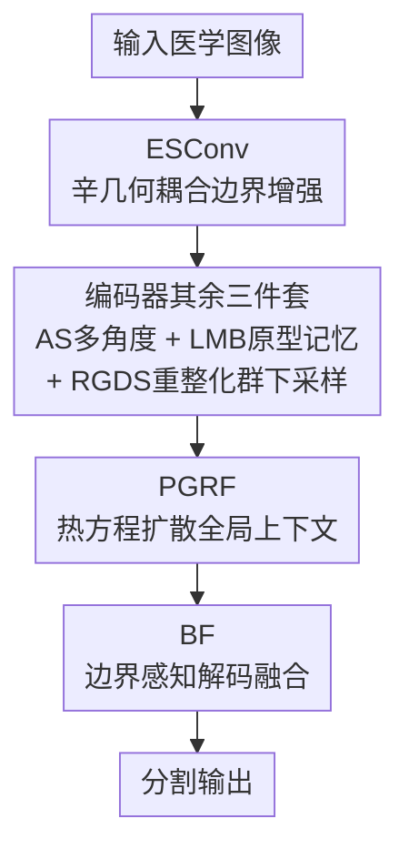

# PMRNet: Physics-informed Multi-scale Refinement Network for Medical Image Segmentation

**会议**: CVPR 2026  
**论文**: [CVF Open Access](https://openaccess.thecvf.com/content/CVPR2026/html/Kang_PMRNet_Physics-informed_Multi-scale_Refinement_Network_for_Medical_Image_Segmentation_CVPR_2026_paper.html)  
**代码**: https://github.com/KangBoce/PMRNet  
**领域**: 医学图像  
**关键词**: 医学图像分割, 轻量化网络, 物理先验, 边界感知, 辛几何

## 一句话总结
PMRNet 不靠堆参数，而是把辛几何、重整化群、热扩散三种物理先验编进网络结构，用 0.87M 参数 / 3.43 GFLOPs 在 12 个医学分割数据集上超过参数量大 10–100 倍的 SOTA，并保持 152 FPS 实时推理。

## 研究背景与动机
**领域现状**：医学图像分割普遍用 UNet 式编码器-解码器，后续靠注意力门控、嵌套跳连不断加重网络；Transformer（如 TransUNet 105M+ 参数）虽能捕捉全局关系，但二次复杂度让它在便携设备、院内工作站这类资源受限场景几乎不可部署。

**现有痛点**：轻量化方向（UNeXt、MALUNet，<2M 参数）能跑，但在小目标、复杂边界上精度明显掉队；折中方案（EMCAD、Deformable-LKA）往特定模态塞大核 / 专用注意力，结果是不同成像模态收益参差，还拖慢推理。

**核心矛盾**：业界面对"归纳偏置弱"的惯性回答就是加参数换精度——精度和效率成了此消彼长的 trade-off。作者反着走：能不能在不放大模型容量的前提下补强归纳偏置？

**本文目标**：在 <1M 参数预算内，同时拿到高精度、低 HD95 边界质量和实时速度，且跨多种成像模态稳定。

**切入角度**：作者注意到医学分割里三个老大难问题——边界只有几像素宽容易被普通卷积抹掉、下采样会丢小目标的细粒度结构、瓶颈处缺全局上下文——分别对应物理学里成熟的三套机制：哈密顿力学的位置-动量联合更新、重整化群的粗粒化、热方程的信息扩散。

**核心 idea**：用物理先验当结构归纳偏置——辛卷积保边界、重整化群下采样保多尺度、热扩散换线性复杂度的全局上下文——以"物理换参数"实现轻量高精度。

## 方法详解

### 整体框架
PMRNet 是三阶段编码器 + 瓶颈 + 三阶段解码器的 U 形结构。输入医学图像，编码器逐级抽象，每个阶段叠四个模块（ESConv/PR 做特征处理、AS 做多角度提取、LMB 做跨尺度原型匹配、RGDS 做下采样）；瓶颈处先跑 PR 迭代精化，再用 PGRF 以热扩散注入全局上下文；解码器逐级上采样，用 BF 按边界强度门控跳连，最后经 ECB + 1×1 卷积投到类别数。基础积木是 ECB（深度可分离卷积 + BN + SiLU），被复用在多处。

### 关键设计

**1. ESConv：用辛几何耦合把边界梯度"焊"进特征更新**

边界像素往往只有几像素宽，普通卷积对内部和边缘一视同仁，很容易把它抹平。作者实测过几种补救：Sobel/Canny 固定算子和可学习边缘注意力替换 ESConv 后，IoU 和 HD95 全线变差，固定算子掉得最狠——说明把边界当成"独立的辅助信号"塞进来、和特征更新解耦，是行不通的。ESConv 借哈密顿力学里位置与动量联合更新、谁都不会丢的思想：把特征图当位置 $q$、把它的空间梯度当动量 $p$，先用 Sobel 初始化的分组卷积算梯度幅值（$\|\nabla x\|\approx(|G_x*x|+|G_y*x|)/\sqrt{2}$ 用 L1 近似省算力），拼成增广表示 $x_{\text{aug}}=[x;\hat{\nabla}x]$ 再拆回 $q,p$。核心是一步类辛积分器的耦合残差更新：

$$\begin{bmatrix} q' \\ p' \end{bmatrix}=\begin{bmatrix} q \\ p \end{bmatrix}+\epsilon\cdot\tanh(\mathrm{BN}(\mathrm{Conv}_{1\times1}([p;-q])))$$

其中 $\epsilon=0.1$ 控制步长，$[p;-q]$ 的反对称重排正是辛结构的来源（BN 和 tanh 让它只是近似辛，但实用目标是防梯度信号被冲掉）。随后一个轻量 detector 预测边界图 $D$ 去调制耦合特征 $f_{\text{boundary}}=f_{\text{coupled}}\odot(1+D)$。这样边界信息全程和语义特征耦合演化，而不是事后叠加，比独立边缘流更稳。

**2. 编码器其余三件套：AS 多角度 + LMB 原型记忆 + RGDS 重整化群下采样**

这一簇是物理先验编码器里和 ESConv 协同的三个模块，分别治三个小病。**AS（自适应尺度选择器）**针对小目标朝向任意：与其真旋转特征 4 次（每次前向 12 个旋转操作），不如把权重张量 $W_{\text{rot}}\in\mathbb{R}^{4C\times C\times3\times3}$ 初始化成对每个输入通道做 Rot90 的四份共享权重，等价于 4× 参数共享的"滚动卷积"，把 $O(4CHW)$ 降到 $O(CHW)$，再用 Softmax 学到的尺度权重 $\alpha_s$ 加权融合小/中/大三个分支。**LMB（轻量记忆库）**在每个编码阶段存 $N$ 个可学习原型（stage 1-3 分别 8/12/16，深层语义多就多给），把查询特征降到 $C/4$ 后做温度缩放（系数 10）的余弦相似度匹配，检回的原型特征经可学习残差系数 $\alpha$（初始 0.1）折回输入，实现跨尺度原型检索。**RGDS（重整化群下采样）**对应统计物理里粗粒化时直接平均会丢短程关联的问题：下采样前先用学到的耦合函数 $x_{\text{enhanced}}=x+\alpha\cdot(\beta(x)+\gamma(x)\odot x)$ 把细粒度结构编进通道激活，再走"步长卷积取低频 + 平均池化取高频"双路 $\mathrm{RGDS}(x)=f_{\text{low}}+\lambda\cdot f_{\text{high}}$（$\lambda=0.3$），比 max-pool 对小目标更友好。

**3. PGRF：用热方程扩散换线性复杂度的全局上下文**

瓶颈处需要全局上下文把小目标和背景杂波分开，但自注意力是二次复杂度。PGRF 借物理系统里熵驱动扩散——信息自然从高确定区流向不确定区——的思路，用带学习系数的热方程建模特征传播：$\frac{\partial u}{\partial t}=D(x)\cdot\nabla^2 u+g(x)$，再用 3 步显式 Euler 离散：

$$u^{(k+1)}=u^{(k)}+D(x)\odot\mathcal{L}(u^{(k)})\cdot(0.5)^k+0.1\cdot g$$

拉普拉斯算子用深度可分离卷积近似 $\mathcal{L}(u)=\mathrm{DSConv}_{3\times3}(u)-u$，$(0.5)^k$ 指数衰减防过平滑。关键在扩散系数 $D(x)$ 由局部方差算出（方差大=同质区给高扩散率，方差小=边界附近给低扩散率），从而让确定特征往模糊区传播、同时尊重边界。全程 $O(N)$、不含任何注意力，是它能在轻量预算里逼近全局感受野的根本。

**4. BF：按边界强度门控跳连的边界感知解码**

解码端的跳连若不分轻重地融合编码器特征，会让边界被区域信息淹没。BF 先从编码特征用轻量 detector（降到 $C/8$）抽边界图 $B=\sigma(\mathrm{Conv}_{3\times3}(\cdots))$，再用两条并行 Enhance 路分别处理区域特征 $f_{\text{region}}=\mathrm{Enhance}([f_{\text{dec}}^{\uparrow};f_{\text{enc}}])$ 和边界特征 $f_{\text{boundary}}=\mathrm{Enhance}(f_{\text{enc}})$，最后按空间边界强度动态加权：

$$\mathrm{BF}(f_{\text{dec}},f_{\text{enc}})=f_{\text{region}}\odot(1-B)+f_{\text{boundary}}\odot B$$

即边界处更信边界特征、内部更信区域特征。消融里去掉 BF 是单模块删除中边界质量掉得最狠的（HD95 从 13.99 涨到 15.50），印证解码器确实依赖显式边界特征才能保持空间精确。

### 损失函数 / 训练策略
损失是 BCE 与 Dice 的等权组合 $\mathcal{L}=0.5\cdot\mathcal{L}_{\text{BCE}}+0.5\cdot\mathcal{L}_{\text{Dice}}$。所有模型在单张 RTX 4090 上训 200 epoch、batch size 8，AdamW 优化器初始学习率 0.001、余弦退火；无预训练。报告指标取 3 次独立训练的中位数，按验证集选最优 checkpoint。PR 模块的迭代次数 $T$ 由验证集定（stage 2 用 2 次、stage 3 与瓶颈用 3 次），超过 3 次在 PH2 上无额外收益。

## 实验关键数据

### 主实验
在 TG3K 与 Clinic 两个含小目标的难数据集上，PMRNet 以 0.87M 参数 / 3.43 GFLOPs 全面领先（节选 4 个代表性方法对比）：

| 数据集 | 方法 | Params(M) | FLOPs(G) | IoU↑ | Dice↑ | HD95↓ |
|--------|------|-----------|----------|------|-------|-------|
| Clinic | TransUNet | 105.32 | 38.52 | 83.87 | 90.35 | 16.72 |
| Clinic | Deformable-LKA | 101.64 | 46.12 | 85.65 | 91.60 | 13.90 |
| Clinic | EMCAD-B2 | 26.76 | 5.60 | 84.30 | 90.47 | 14.47 |
| Clinic | **PMRNet (Ours)** | **0.87** | **3.43** | **87.25** | **92.56** | **13.13** |
| TG3K | EMCAD-B2 | 26.76 | 5.60 | 74.88 | 83.56 | 15.49 |
| TG3K | **PMRNet (Ours)** | **0.87** | **3.43** | **76.19** | **84.73** | **14.96** |

跨 12 个数据集（超声、内镜、皮肤镜、组织病理）PMRNet 在多数上拿到最佳 IoU/Dice/HD95；在 ISIC2017 速度对比中达 152.03 FPS，超过 EMCAD(146.41)、PVT-CASCADE(104.59)、TransUNet(96.37)、Deformable-LKA(24.73)，是这批近期方法里又快又准的那个。

### 消融实验
PH2 数据集上的组件消融与两组模块替换：

| 配置 | IoU↑ | Dice↑ | HD95↓ | 说明 |
|------|------|-------|-------|------|
| Full PMRNet | 91.02 | 95.23 | 13.99 | 完整模型 |
| w/o LMB | 90.61 | 94.97 | 15.61 | IoU 仅掉 0.41，但 HD95 涨 1.62 |
| w/o PGRF | 90.43 | 94.89 | 14.84 | 四指标均匀退化 |
| w/o BF | 90.24 | 94.78 | 15.50 | 单模块删除中边界掉得最狠 |
| w/o All Three | 89.80 | 94.52 | 16.98 | 三模块互相增强 |

模块替换实验进一步佐证物理先验的有效性：PGRF 在 Clinic 上比大核(7×7 DSConv×2)/空洞卷积/全局池化分别高 1.11/1.43/1.68 IoU；ESConv 在 ISIC2017 上比最接近的 Edge Attention 高 0.93 IoU、比 Canny+Conv 高 1.51 IoU。

| 替换项 (数据集) | 变体 | IoU↑ | HD95↓ |
|------|------|------|-------|
| PGRF (Clinic) | Global Pooling | 85.57 | 14.36 |
| PGRF (Clinic) | **PGRF (Ours)** | **87.25** | **13.13** |
| ESConv (ISIC2017) | Canny Edge + Conv | 81.63 | 15.91 |
| ESConv (ISIC2017) | **ESConv (Ours)** | **83.14** | **13.73** |

### 关键发现
- BF 对边界质量贡献最大（删掉 HD95 退化最严重），印证解码端依赖显式边界特征。
- LMB 的作用偏"保边界一致性"而非"提区域重叠"——删掉它 IoU 几乎不动（−0.41）但 HD95 跳 1.62。
- 三模块不是各自独立有用，而是互相增强：同时删三个，IoU 掉到 89.80、HD95 涨到 16.98，掉幅大于单删之和。
- 固定边缘算子（Sobel/Canny）替换 ESConv 掉得比可学习边缘注意力更狠，说明把梯度信号和特征更新解耦的做法本身有害。

## 亮点与洞察
- **"物理换参数"的思路很巧**：辛几何、重整化群、热方程三套先验各自精准对应分割里的边界/下采样/全局上下文三个痛点，等于用结构归纳偏置替代了原本要靠参数堆出来的能力，0.87M 打 100M 很有说服力。
- **辛耦合的反对称重排 $[p;-q]$ 是点睛之笔**：它不是简单把梯度当辅助输入，而是让边界动量和特征位置联合演化、谁也丢不掉，这解释了为何固定算子替换会失败。
- **热扩散系数由局部方差自适应**：同质区高扩散、边界区低扩散，天然做到"传播上下文但不糊边界"，给 O(N) 全局建模提供了一条绕开注意力的可迁移路径——可借鉴到其他需要轻量全局上下文的密集预测任务。

## 局限与展望
- 作者承认仅在 2D 分割验证，未来才会探索体数据（3D）分割与基础模型集成。
- 物理先验虽优雅，但 ESConv 的"近似辛"（BN/tanh 破坏严格辛结构）、PGRF 的 3 步 Euler 离散都带较强工程近似，其物理"保真度"对最终精度的贡献边界并不清晰，可能存在解释与实际增益不完全对齐的风险（⚠️ 以原文为准）。
- 多个模块都引入了手调超参（$\epsilon=0.1$、温度 10、$\alpha$ 初始 0.1、$\lambda=0.3$、PR 迭代 T），跨模态稳健性虽好，但这些常数的可迁移性未充分剖析。
- 仅在小数据/小目标医学集上验证，是否在大尺度自然图像或多类语义分割上仍占优未知。

## 相关工作与启发
- **vs TransUNet / Deformable-LKA**：它们靠注意力 / 大核拿全局上下文与高精度，但参数 100M+、推理慢；PMRNet 用热扩散 PGRF 把全局上下文做成 O(N)，以 0.87M 拿到更高 IoU 与更快 FPS。
- **vs UNeXt / MALUNet**：同属轻量阵营，但这些方法在小目标上精度掉队；PMRNet 靠 ESConv+RGDS 的物理先验补回边界与多尺度细节，在同等甚至更小预算下精度反超。
- **vs EMCAD / Rolling-UNet**：折中派靠模态专用模块，收益跨模态参差、还可能拖慢推理；PMRNet 的物理先验是通用归纳偏置，跨 12 个数据集稳定且实时。

## 评分
- 新颖性: ⭐⭐⭐⭐⭐ 把辛几何/重整化群/热方程三套物理先验系统性编进分割网络，角度新且自洽。
- 实验充分度: ⭐⭐⭐⭐⭐ 12 数据集 + 15 baseline + 组件/替换多组消融 + 速度对比，覆盖很全。
- 写作质量: ⭐⭐⭐⭐ 动机与方法讲得清楚，但部分物理类比的"严格性"表述偏强、近似程度交代略含糊。
- 价值: ⭐⭐⭐⭐ 资源受限临床部署场景实用性强，物理换参数的范式有迁移潜力。

<!-- RELATED:START -->

## 相关论文

- [\[CVPR 2026\] TAMER: A Tri-Modal Contrastive Alignment and Multi-Scale Embedding Refinement Framework for Zero-Shot ECG Diagnosis](tamer_a_tri-modal_contrastive_alignment_and_multi-scale_embedding_refinement_fra.md)
- [\[CVPR 2026\] From Infusion to Assimilation Distillation for Medical Image Segmentation](from_infusion_to_assimilation_distillation_for_medical_image_segmentation.md)
- [\[AAAI 2026\] FunKAN: Functional Kolmogorov-Arnold Network for Medical Image Enhancement and Segmentation](../../AAAI2026/medical_imaging/funkan_functional_kolmogorov-arnold_network_for_medical_image_enhancement_and_se.md)
- [\[CVPR 2026\] TopoSlide: Topologically-Informed Histopathology Whole Slide Image Representation Learning](toposlide_topologically-informed_histopathology_whole_slide_image_representation.md)
- [\[CVPR 2026\] SegMoTE: Token-Level Mixture of Experts for Medical Image Segmentation](segmote_token-level_mixture_of_experts_for_medical_image_segmentation.md)

<!-- RELATED:END -->
