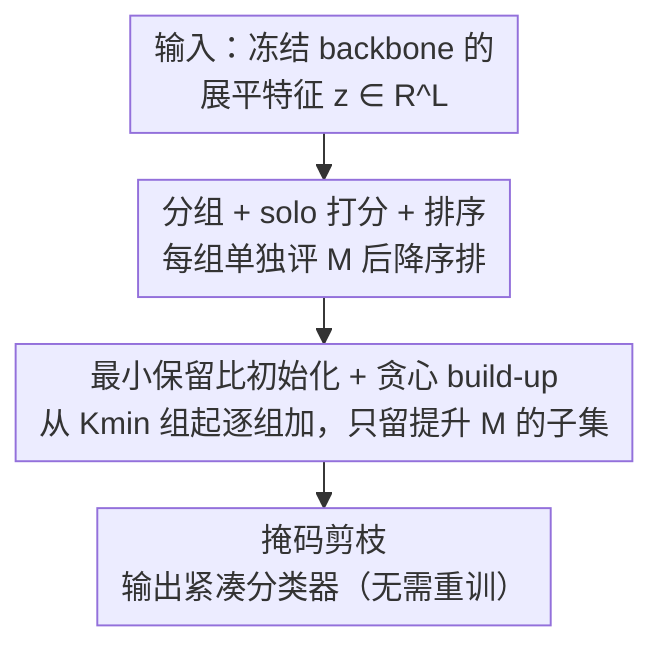

# Post-training Feature Pruning for Fundus Images Classification

**会议**: CVPR 2026  
**论文**: [CVF Open Access](https://openaccess.thecvf.com/content/CVPR2026/html/Pham_Post-training_Feature_Pruning_for_Fundus_Images_Classification_CVPR_2026_paper.html)  
**代码**: 待确认  
**领域**: 医学图像  
**关键词**: 眼底图像分类, 特征剪枝, 后训练, 贪心算法, 跨域泛化

## 一句话总结
GFP 是一种训练后、与架构无关的特征剪枝框架——冻结 backbone，只对最后展平的特征向量做"贪心 + 最小保留比"的子集选择，删掉冗余维度后在 5 个眼底数据集上常能提升 AUROC/AUPRC，同时砍掉 4%–96% 的特征维度并改善跨数据集泛化。

## 研究背景与动机
**领域现状**：眼底图像（糖网 DR、青光眼等）分类如今普遍用 CNN / ViT / 混合 backbone 抽特征，把 backbone 输出**展平**成一个高维特征向量，再喂给线性分类头。

**现有痛点**：这个展平特征里塞满了冗余——解剖结构规整、光照与设备风格、伪影都会贡献大量相关或弱信号，而真正的病理线索往往很小、很容易被背景特征稀释。保留这些冗余维度会摊薄判别信号、放大数据集特异噪声，在换设备/换条件成像时鲁棒性变差；眼底公开数据集普遍偏小，高维特征空间更容易过拟合采样噪声和站点特性，还让决策空间难以解释。

**核心矛盾**：现有压缩/剪枝几乎都在**网络权重或神经元层级**动手（通道剪枝、注意力选择、低秩分解、ViT 的 token 剪枝），它们要么改了特征抽取过程本身、要么需要重训，而且 token 剪得太早会把临床相关的小病灶结构直接删掉。**对训练后展平特征空间里冗余坐标的删除**几乎没人研究，尤其在医学影像里。

**本文目标**：在不改 backbone 架构、不重训的前提下，从最终特征向量里挑出一个紧凑且判别力强的子集，同时直接评估每个特征维度的诊断相关性。

**切入角度**：把"删冗余"重新写成特征空间上的**子集选择**问题——保留哪些维度由它们对训练集诊断指标的贡献决定，而非靠权重幅值这类间接代理。

**核心 idea**：用一个训练集指标引导的**贪心 build-up + 最小保留比**算法，在展平特征上做后训练剪枝，得到一个轻量、可解释、跨 CNN/ViT/混合 backbone 通用的特征压缩框架。

## 方法详解

### 整体框架
GFP 完全在训练之后、backbone 冻结的前提下运行，只改分类头消费的那个展平特征向量。给定一个把图像映射到展平特征 $z\in\mathbb{R}^L$ 的冻结 backbone 和分类头 $f_{\text{cls}}$，目标是挑一个索引子集 $I$ 最大化训练集上的诊断指标 $M$（本文用 (AUROC+AUPRC)/2），约束是保留比 $|I|/L\ge r_{\min}$。算法分四步走：把 $L$ 维分成连续小组、对每组单独打分、按分排序、再从最小保留比起逐组贪心加入，最后用二值掩码把保留维度固定下来，得到无需重训的紧凑分类器。

### 关键设计

**1. 后训练特征剪枝的子集选择建模：把"删冗余"写成带约束的指标最大化并论证其难解**

GFP 把剪枝形式化为：在 $|I|/L\ge r_{\min}$ 约束下求 $I^*=\arg\max_{I}M(f_{\text{cls}}(z_I))$，$z_I$ 只保留 $I$ 中坐标、其余置零。作者证明这是个基数约束的子集选择问题：可行子集数随 $L$ 指数增长，用 Stirling 近似主导组合项约为 $\binom{L}{k_{\min}}\approx 2^{LH_2(p)}/\sqrt{2\pi Lp(1-p)}$（$p=k_{\min}/L$，$H_2$ 是二元熵），搜索空间在 $r_{\min}\le0.5$ 时为 $\Theta(2^L)$；其判定版本可归约到 Set Cover / 稀疏逼近，是 NP-hard。对典型 $L\approx10^3$ 的特征维度，精确求解不可行——这正是为什么必须退而求一个贪心近似。这个建模本身是贡献：它把"特征冗余"从模糊直觉变成一个可优化、可证明难解的目标，给后面的贪心提供了合法性。

**2. 分组 + solo 打分 + 排序：把 L 维特征线性化成可排序的 Sg 组**

直接在 $L$ 个单维上贪心仍然太贵，GFP 先把展平向量切成 $S_g=\lceil L/n\rceil$ 个连续小组（组大小 $n$ 是超参）。每组算一个 **solo 分**——把其它组全置零、只留这一组评训练集指标 $u_i=M(f_{\text{cls}}(z_{G_i}))$，再按 solo 分降序排成序列 $(G_{\pi(1)},\dots,G_{\pi(S_g)})$。这一步是后续贪心的"打分卡"：solo 分高的组优先被考虑。因为 backbone 特征预先缓存、每次评估只是掩码 + 跑固定分类头，solo 打分总代价是 $\Theta(NCL)$（$N$ 样本、$C$ 类）——把指数搜索换成了对 $S_g$ 组的线性扫描。组大小 $n$ 在这里平衡粒度与开销：$n$ 大则组少、评估快但剪得粗。

**3. 最小保留比下的贪心 build-up：从 Kmin 组起逐组加、只留提升指标的子集**

为避免过度剪枝偏向训练集，GFP 先按最小保留比初始化：至少保留 $K_{\min}=\max(1,\lceil r_{\min}L/n\rceil)$ 个组（即排名最高的 $K_{\min}$ 组），记初始子集 $I_{\text{curr}}$ 与其指标。随后从第 $K_{\min}+1$ 组起按排序顺序**逐组加入**，每加一组重评指标 $I^*=\arg\max_{t\ge K_{\min}}M(f_{\text{cls}}(z_{\{G_{\pi(1)},\dots,G_{\pi(t)}\}}))$，只在指标提升时更新最优子集。这一步天然实现"既删冗余又不掉精度"：一旦再加组不再带来增益就不纳入，相当于在保留比下限之上自适应找拐点。整个 build-up 至多 $S_g-K_{\min}$ 次评估，总时间复杂度 $\Theta(NCL^2/n)$——虽对 $S_g\approx L/n$ 是二次，但仍是多项式、可处理，相比精确子集搜索的指数代价大幅下降。最后把选中的 $I^*$ 变成二值掩码作用到分类头输入，得到紧凑分类器 $f'_{\text{cls}}$，无需任何重训即可直接在验证/测试集评估。

### 损失函数 / 训练策略
GFP 本身**训练无关**（backbone 冻结、不重训），只在训练集上反复评估指标。各 backbone（EfficientNetV2 / ViT / CoAtNet-2）先用 ImageNet 预训练权重在眼底数据上微调（50 epoch、batch 8、单张 A6000，EfficientNetV2 用 Adam lr 1e-4，ViT/CoAtNet 用 AdamW lr 1e-5），冻结后再剪。两个超参 $n$（组大小）和 $r_{\min}$（最小保留比）通过验证集网格搜索选定（$n\in\{1,\dots,256\}$，$r_{\min}\in\{0,\dots,0.9\}$）。

## 实验关键数据

### 主实验
5 个眼底数据集（DDR/Messidor-2 糖网、PAPILA 青光眼、ODIR 多标签、RETINA 多类）× 3 backbone，对比无剪枝、MP（幅值剪枝）、L1、ViT 专用 token 剪枝（TRAM/LTMP）。节选最具代表性的结果（AUROC/AUPRC，%）：

| Backbone / 方法 | DDR | Messidor-2 | PAPILA | RETINA |
|------|------|------|------|------|
| EfficientNetV2 | 91.04/92.15 | 87.66/86.38 | 81.33/71.21 | 77.85/58.38 |
| EfficientNetV2 + MP | 91.00/92.11 | 87.64/86.37 | 81.42/72.26 | 73.57/49.30 |
| EfficientNetV2 + **GFP** | **91.25/92.45** | **88.62/87.59** | 81.21/74.02 | **79.10/60.50** |
| CoAtNet | 95.17/96.60 | 89.49/90.95 | 88.25/80.70 | 92.61/85.56 |
| CoAtNet + **GFP** | **96.73/97.37** | **89.61/91.20** | **89.42/84.43** | 93.08/86.43 |
| ViT | 91.33/92.38 | 85.29/85.44 | 86.83/79.27 | 90.75/83.16 |
| ViT + **GFP** | **91.55/92.67** | **85.36/85.80** | **87.33**/77.43 | **92.00**/83.01 |

GFP 在每个 backbone 内多数设置取得最佳，且能砍掉大量维度（最多 CoAtNet 在 Messidor-2 上 1024→32，删 96%）。CoAtNet 上增益最大：DDR AUROC +1.56、AUPRC +3.73。对比之下 MP 对 EfficientNetV2 几乎无益甚至有害（RETINA 77.85/58.38→73.57/49.30），ViT 专用的 TRAM/LTMP 在 Messidor-2/PAPILA/RETINA 上反而明显劣于原始 ViT，说明 token 级剪枝不稳定、依赖数据集。

### 消融实验 / 特征分析
CoAtNet 剪枝前后的特征紧凑性与可分性度量（定义：**Intra-class variance** 类内散度越低越紧凑；**FDR** Fisher 判别比=类间方差/类内方差，越高越可分；**Silhouette** 轮廓系数综合衡量簇内凝聚与簇间分离，越高越好）：

| 度量 | DDR | Messidor | PAPILA | REFUGE |
|------|------|------|------|------|
| Intra-var 剪前↓ | 126.08 | 126.70 | 196.04 | 259.97 |
| Intra-var 剪后↓ | **34.79** | **38.22** | **8.41** | **126.72** |
| FDR 剪前↑ | 1.56 | 0.40 | 0.20 | 0.70 |
| FDR 剪后↑ | **2.04** | **0.44** | **0.37** | **0.84** |
| Silhouette 剪前↑ | 0.49 | 0.25 | 0.19 | 0.20 |
| Silhouette 剪后↑ | **0.55** | **0.28** | **0.26** | **0.23** |

跨数据集评估（DDR↔Messidor-2，AUROC/AUPRC）也显示泛化提升：

| Backbone | DDR→Messidor-2 | Messidor-2→DDR |
|------|------|------|
| EfficientNetV2 | 77.38/75.44 (2152维) | 80.83/82.60 (2152维) |
| EfficientNetV2 + GFP | 77.17/75.50 (2104维) | **82.99/85.14** (1824维) |
| ViT | 69.19/69.01 (768维) | 72.54/74.95 (768维) |
| ViT + GFP | **71.70/70.37** (256维) | **73.02/75.44** (416维) |
| CoAtNet + GFP | **79.88/81.86** (103维) | **77.77/83.49** (32维) |

### 关键发现
- 剪枝后类内方差大幅下降（如 PAPILA 196.04→8.41）、FDR 与轮廓系数一致上升——证明 GFP 删的是噪声维度而非破坏流形结构，特征更紧凑可分。
- 跨域提升最大的是 Messidor-2→DDR 用 EfficientNetV2：AUROC +2.16、AUPRC +2.54，说明被删的多是数据集特异的冗余维度。
- CoAtNet 的剪枝面最稳（大范围 $(n,r_{\min})$ 都保持高指标），暗示混合表示里含结构化冗余、最适合 GFP 安全删除。
- 对比 token 剪枝：TRAM/LTMP 在小病灶、局部化场景容易把临床结构剪掉，普遍劣于直接在最终特征上剪——印证"在特征空间而非计算图里剪"更适合医学影像。
- Grad-CAM 显示剪枝后注意力更贴合标注病灶图（大片病变时覆盖更广更相关、小焦点病灶时更集中），说明删冗余维度提升了特征特异性。

## 亮点与洞察
- **把"剪枝"的战场从权重/token 搬到最终展平特征空间**，是一个被忽视但很合理的切入点：训练无关、架构无关、不动 backbone，落地成本极低，还能直接读出每个维度的诊断相关性。
- **NP-hard 论证 + 贪心 build-up 的组合很扎实**：先把直觉问题写成可证明难解的子集选择，再用最小保留比 + 逐组增益判停给出多项式近似，理论与实用衔接得干净。
- **"删特征反而涨点且更鲁棒"的反直觉结论可迁移**：在小样本、多设备的医学分类里，高维特征的冗余更多是数据集特异噪声，后训练特征剪枝这条思路可推广到其它小数据高维场景的泛化增强。

## 局限与展望
- 作者承认：虽对 backbone 训练无关，但需在训练集上反复评估指标，超大数据集会贵；贪心独立评估组，无法保证全局最优子集。
- GFP 只剪最终展平特征、不在中间层强制稀疏，因此**只降特征维度、不减 backbone 推理开销**——省的是分类头与表示冗余，不是计算量。
- 固定组大小与最小保留比靠网格搜索定，自适应/数据驱动的分组策略可能更好。
- 连续分组（contiguous groups）假设特征维度的相邻性有意义，对某些 backbone 的展平排布未必成立，这点论文未深究（⚠️ 以原文为准）；结论里出现一次把方法写成 "CFP" 的笔误，正文统一为 GFP。

## 相关工作与启发
- **vs 通道剪枝 / 网络瘦身（MP、L1）**：它们在权重/神经元层级动手、需重训且改了特征抽取过程；GFP 完全后训练、只动展平特征，且 MP/L1 在多个眼底集上不稳定甚至掉点，GFP 稳定提升。
- **vs ViT token 剪枝（TRAM/LTMP）**：token 级剪枝在模型计算图内操作，剪太早会删掉小病灶等临床结构，在医学小目标上表现差；GFP 在最终特征上剪，避免这一风险。
- **vs DeepFS 等高维特征筛选**：DeepFS 聚焦原始输入特征，GFP 针对训练后的深层内部表示，且训练无关、跨 CNN/ViT/混合通用。

## 评分
- 新颖性: ⭐⭐⭐⭐ 后训练展平特征剪枝是被忽视的角度，建模 + 贪心组合清晰，但贪心 build-up 算法本身较朴素。
- 实验充分度: ⭐⭐⭐⭐ 5 数据集 × 3 backbone × 多 baseline，含跨域、特征可分性、Grad-CAM 多维分析。
- 写作质量: ⭐⭐⭐⭐ 动机与复杂度推导讲得透，但结论出现 GFP/CFP 笔误、部分超参选择交代偏简。
- 价值: ⭐⭐⭐⭐ 训练无关、架构无关、提升泛化，临床小数据场景实用，思路可迁移。

<!-- RELATED:START -->

## 相关论文

- [\[AAAI 2026\] WDT-MD: Wavelet Diffusion Transformers for Microaneurysm Detection in Fundus Images](../../AAAI2026/medical_imaging/wdt-md_wavelet_diffusion_transformers_for_microaneurysm_detection_in_fundus_imag.md)
- [\[CVPR 2026\] Dual-Level Hypergraph Generation for Addressing Feature Scarcity in Whole-Slide Image Classification](dual-level_hypergraph_generation_for_addressing_feature_scarcity_in_whole-slide_.md)
- [\[CVPR 2026\] FBTA: Enabling Single-GPU End-to-End Gigapixel WSI Classification with Feature Bridging and Translation Alignment](fbta_enabling_single-gpu_end-to-end_gigapixel_wsi_classification_with_feature_br.md)
- [\[CVPR 2026\] Virtual Immunohistochemistry Staining with Dual-Aligned Multi-Task Feature Guidance](virtual_immunohistochemistry_staining_with_dual-aligned_multi-task_feature_guida.md)
- [\[CVPR 2026\] MedMO: Grounding and Understanding Multimodal Large Language Model for Medical Images](medmo_grounding_and_understanding_multimodal_large_language_model_for_medical_im.md)

<!-- RELATED:END -->
