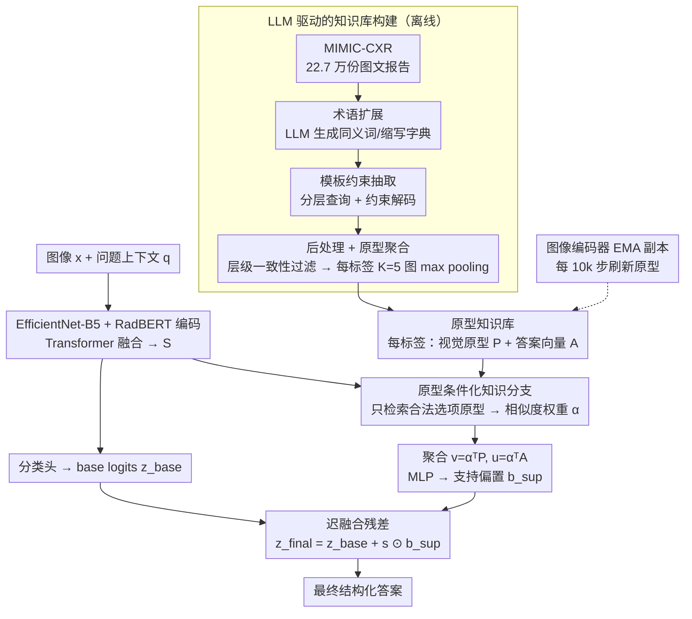

# Prototype-Based Knowledge Guidance for Fine-Grained Structured Radiology Reporting

**会议**: CVPR 2026  
**arXiv**: [2603.11938](https://arxiv.org/abs/2603.11938)  
**代码**: 无（论文声明接收后公开）  
**领域**: 医学影像 / 结构化报告生成  
**关键词**: 结构化放射报告, 原型知识库, LLM知识抽取, 长尾属性, 迟融合

## 一句话总结

提出 ProtoSR，通过 LLM 驱动的管道从 22.7 万篇 MIMIC-CXR 自由文本报告中挖掘模板对齐的视觉原型知识库，并设计原型条件化迟融合模块将检索到的原型证据作为 logit 残差注入层级式结构化报告模型，在 Rad-ReStruct 基准上达到 SOTA，L3 细粒度属性 F1 从 4.3 提升到 7.4（+72.1% 相对提升）。

## 研究背景与动机

**领域现状**：放射学报告是临床诊断的核心沟通方式。自由文本报告虽然灵活，但存在风格不一致、完整性差、难以标准化的问题。结构化报告（SR）通过预定义字段和标准化选项来提升一致性和完整性，但其自动化发展远不如自由文本生成成熟。

**现有痛点**：细粒度 SR 模板包含大量罕见属性（如病变位置、外观、严重程度等），而结构化标注数据集极为有限。Rad-ReStruct 仅有 3,597 个样本，L3 层（477 个问题）的长尾属性几乎没有足够监督。通用医学 VLM（MedGemma、CheXagent）虽能处理多种任务，但在细粒度 SR 上仍不如专用模型。

**核心矛盾**：结构化标注稀缺 vs 自由文本报告丰富。MIMIC-CXR 有超过 22 万对的胸片-自由文本报告，隐式包含丰富的细粒度影像信息，但风格和词汇差异使其难以直接映射到严格的 SR 分类体系。

**本文目标** 如何将大规模自由文本报告中的隐含知识系统性地转化为模板对齐的结构化信号，用于增强数据稀缺下的细粒度属性预测？

**切入角度**：近年来指令微调 LLM 使大规模自动抽取成为可能。将自由文本中的发现-属性信息自动映射到 SR 模板的标签空间，为每个标签构建"视觉原型"（代表该标签的典型影像特征），然后在推理时通过原型检索提供"数据驱动的第二意见"。

**核心 idea**：用 LLM 从自由文本报告中挖掘模板对齐的视觉原型知识库，通过原型条件化的 logit 残差修正来增强细粒度结构化报告预测。

## 方法详解

### 整体框架

ProtoSR 想解决的是「结构化标注太少、细粒度属性几乎没监督」这个矛盾：既然 MIMIC-CXR 有 22 万多份自由文本报告隐含着丰富影像知识，那就把它离线蒸馏成一个「视觉原型知识库」，推理时当作外部证据来托底。整体由三块串起来：一个层级式 SR 基座模型（沿用 Rad-ReStruct 架构）负责常规预测，一个离线构建的原型知识库存放每个标签的典型影像特征，一个原型条件化知识分支在推理时检索原型、把它折算成 logit 残差。图像和问题上下文先经 EfficientNet-B5 与 RadBERT 编码、Transformer 融合得到 base logits；知识分支再从库里检索与当前问题相关的原型，转成一个有选择性的校正信号，经可学习缩放后叠加到 base logits 上，得到最终答案。由于图像编码器在训练中持续微调，库里的原型还会用一份编码器的 EMA 副本定期刷新，保证检索始终发生在同一表示空间里。

### 关键设计

**1. LLM 驱动的知识库构建管道：把自由文本「翻译」成模板对齐的视觉原型**

难点在于自由文本和 SR 模板说的不是一套话——同一个发现在报告里可能写成十几种说法，而模板只认固定选项。管道分三步把这道鸿沟填平。第一步术语扩展，用零样本 LLM 为模板每个标签生成同义词、缩写和替代表达，建一个规范化字典，让后面抽取时能把五花八门的口语表述都归到同一个标签上。第二步模板约束抽取，分层次查询 LLM：先问某个 finding 在不在，在的话再追问它的属性值，并用约束解码把 LLM 的输出强行限制在模板合法选项里，避免它自由发挥编出模板外的词。第三步后处理与原型聚合，先用规则过滤去噪并强制层级一致性（父节点判阴性就把它名下的子标签一并移除），再为每个标签均匀采样 $K=5$ 张代表图像，对它们的 image encoder 嵌入做逐元素 max pooling，聚合成一个原型向量代表该标签的典型影像表现。

这一步里术语扩展是真正撬动质量的杠杆——去掉它各层 F1 会掉 8~13 个点，说明跨数据集的临床用语差异才是知识迁移的主瓶颈；抽取 LLM 用 Qwen2.5-7B 效果最好 ⚠️ 以原文为准。最终知识库覆盖率 L1 达 100%、L2 96%、L3 82%，给原本几乎没监督的长尾属性也铺上了一层原型支持。

**2. 原型条件化知识分支：迟融合残差，只在有证据时改口**

知识注入最怕喧宾夺主，把基座模型本来对的判断带偏。这里的做法是让原型只能以「残差」的身份说话。给定当前图像-问题的融合表征 $S$，先用线性投影把它映射到原型所在的空间，再对每个原型算 cosine 相似度得到权重 $\alpha$——注意只对那些匹配当前问题合法选项的原型计权，无关原型直接不参与。检索结果聚合成两路向量：视觉证据向量 $v = \alpha^\top P$ 和回答倾向向量 $u = \alpha^\top A$，把它们拼起来送进 MLP 得到支持偏置：

$$b_{\text{sup}} = \text{MLP}([v; u]), \qquad z_{\text{final}} = z_{\text{base}} + s \odot b_{\text{sup}}$$

其中 $s$ 是一个可学习的 per-answer 缩放向量，按维度校准每个候选答案受原型影响的力度。关键在于当没有任何匹配原型时 $b_{\text{sup}}=0$，整支分支自动失声、退化回纯基座模型——所以它本质是一份「数据驱动的第二意见」，有料才发言，没料绝不添乱。消融里把它换成 early fusion（直接把知识嵌入拼进输入序列）就完全失效、性能等同基座，正说明残差式的迟融合才是有效的注入位置。

这支分支还要解决一个易被忽略的隐患：原型向量是用图像编码器算出来的，而编码器在端到端训练里持续微调，时间一长，库里冻住的原型嵌入就和当前编码器的表示空间对不上，cosine 相似度检索会逐渐失真。做法是维护一份图像编码器的 EMA（指数滑动平均）副本，每隔 10k 训练步用它把库里所有原型向量重算刷新一遍，让原型始终跟当前编码器站在同一表示空间，检索权重才不会越算越偏。这部分只额外加一个 MLP 和一个 per-answer 缩放向量，分支本身很轻量。

### 一个完整示例：一条 L3 长尾属性是怎么被原型改口的

设当前问题是 L3 层「这处实变（consolidation）位于哪个肺叶」，基座模型因为这类细粒度属性训练样本太少，base logits 把概率几乎平摊在各个候选肺叶上，倾向选最常见的「右下叶」。此时知识分支介入：用当前融合表征 $S$ 去库里检索，只看与「肺叶位置」这个问题合法选项匹配的原型，cosine 相似度把权重 $\alpha$ 大头压在「左上叶」原型上（因为该图像特征更接近那批从自由文本挖来的左上叶代表样本）。聚合出的 $v$、$u$ 经 MLP 得到 $b_{\text{sup}}$，在「左上叶」这一维给出正偏置、在「右下叶」维给出负偏置，乘以可学习缩放 $s$ 后叠加到 base logits，最终把答案从「右下叶」纠正到「左上叶」。而如果换成一个库里压根没有原型的罕见标签，$b_{\text{sup}}=0$，这条预测就完全交还给基座模型，不被任何噪声干扰。

### 损失函数 / 训练策略

与 Rad-ReStruct 相同的多标签损失，作用在 $z_{\text{final}}$ 上。Adam 优化器，lr=1e-5，batch size=8，gradient accumulation=4，训练 34 epochs，单卡 RTX 3090。

## 实验关键数据

### 主实验

| 方法 | Overall F1 | L1-F1 | L2-F1 | L3-F1 | Report Acc. |
|------|-----------|-------|-------|-------|-------------|
| MedGemma | 26.8 | 38.2 | 63.4 | 2.8 | 0.0% |
| CheXagent | 32.4 | 62.1 | 69.8 | 6.2 | 20.3% |
| hi-VQA (Rad-ReStruct) | 32.0 | 64.6 | 71.6 | 4.1 | 32.6% |
| Context-VQA | 32.9 | 67.2 | 71.8 | 3.2 | 39.7% |
| **ProtoSR** | **34.4** | **66.2** | **72.8** | **7.4** | 36.6% |

### 消融实验

| 配置 | Overall F1 | L1-F1 | L2-F1 | L3-F1 |
|------|-----------|-------|-------|-------|
| No knowledge（基座模型） | 32.5 | 64.2 | 71.3 | 4.3 |
| Early Fusion（将知识嵌入序列拼接到输入） | 32.5 | 64.8 | 71.4 | 4.3 |
| Randomized prototypes（高斯噪声替换） | 32.7 | 64.3 | 71.4 | 4.4 |
| **ProtoSR（迟融合残差）** | **34.4** | **66.2** | **72.8** | **7.4** |

### 关键发现

- **L3 提升最大**：从 4.3 → 7.4（+72.1% 相对提升），正是长尾属性最缺监督的层级，证明原型知识库弥补了数据稀缺
- **Early Fusion 无效**：将知识嵌入直接拼入输入序列，模型无法有效利用，性能与基座持平——说明迟融合的残差设计至关重要
- **随机原型等效基线**：用高斯噪声替换原型后性能回落到基线水平，证明 ProtoSR 确实利用了有意义的原型结构而非单纯增加了模型容量
- 通用医学 VLM（MedGemma、CheXagent）在 L3 上表现极差（2.8~6.2），不如专用 SR 模型

## 亮点与洞察

- **LLM 作为知识桥梁**：巧妙地利用指令微调 LLM 将非结构化的自由文本报告"翻译"为结构化标签，这种范式可推广到任何需要从非结构化数据中提取结构化知识的医学 AI 场景
- **残差式二次意见**：知识分支的设计非常优雅——它不替代基座模型的判断，只是在有证据时提供修正。这种"保守增强"策略适用于任何需要额外知识注入但不希望破坏原有行为的场景
- **术语扩展的关键作用**：F1 提升 8~13 个点，证明跨数据集的临床用语差异是知识迁移的主要瓶颈，LLM 驱动的术语标准化是解锁这些知识的关键

## 局限与展望

- **仅在 Rad-ReStruct 一个基准上评估**：该数据集只有 3,597 个样本且仅覆盖胸部 X 光，泛化性未验证
- **Report Acc. 不是最高**：Context-VQA 和 RaDialog 的报告准确率分别为 39.7% 和 39.6%，高于 ProtoSR 的 36.6%——但作者指出这些方法偏向保守策略（默认"无发现"），在异常case上表现差
- **知识库挖掘的噪声**：L3 覆盖率仅 82%，约 18% 的细粒度标签没有原型支持。进一步优化 LLM 抽取管道或引入多数据源可能提升覆盖
- **原型聚合策略简单**：当前用 max pooling 聚合 K=5 张图像为单一原型，更复杂的聚合（如聚类多个原型表示类内多样性）可能更好

## 相关工作与启发

- **vs Context-VQA**：Context-VQA 在训练时利用报告上下文，但推理时不使用外部知识；ProtoSR 通过原型知识库在推理时也能提供额外信息
- **vs RadIR**：RadIR 从自由文本报告中挖掘细粒度监督用于检索，但不处理结构化预测；ProtoSR 将检索证据直接注入离散决策过程
- **vs 通用医学 VLM（MedGemma / CheXagent）**：这些模型在 L3 上表现极差，说明通用能力不能替代针对细粒度模板设计的专用架构和训练目标

## 评分

- 新颖性: ⭐⭐⭐⭐ LLM-knowledge-base-prototype 的完整管道设计巧妙，迟融合残差修正简洁有效
- 实验充分度: ⭐⭐⭐ 仅一个基准数据集，但消融设计扎实
- 写作质量: ⭐⭐⭐⭐ 逻辑清晰，图表直观
- 价值: ⭐⭐⭐⭐ 对长尾医学属性的知识增强提供了可复制的解决方案

<!-- RELATED:START -->

## 相关论文

- [\[CVPR 2026\] Unleashing Video Language Models for Fine-grained HRCT Report Generation](unleashing_video_language_models_for_fine-grained_hrct_report_generation.md)
- [\[CVPR 2026\] Momentum Memory for Knowledge Distillation in Computational Pathology](momentum_memory_for_knowledge_distillation_in_computational_pathology.md)
- [\[CVPR 2026\] MedKCO: Medical Vision-Language Pretraining via Knowledge-Driven Cognitive Orchestration](medkco_medical_vision-language_pretraining_via_knowledge-driven_cognitive_orches.md)
- [\[CVPR 2026\] Parameter-efficient Prompt Tuning and Hierarchical Textual Guidance for Few-shot Whole Slide Image Classification](parameter-efficient_prompt_tuning_and_hierarchical_textual_guidance_for_few-shot.md)
- [\[CVPR 2026\] Residual SODAP: Residual Self-Organizing Domain-Adaptive Prompting with Structural Knowledge Preservation for Continual Learning](residual_sodap_residual_self-organizing_domain-adaptive_prompting_with_structura.md)

<!-- RELATED:END -->
