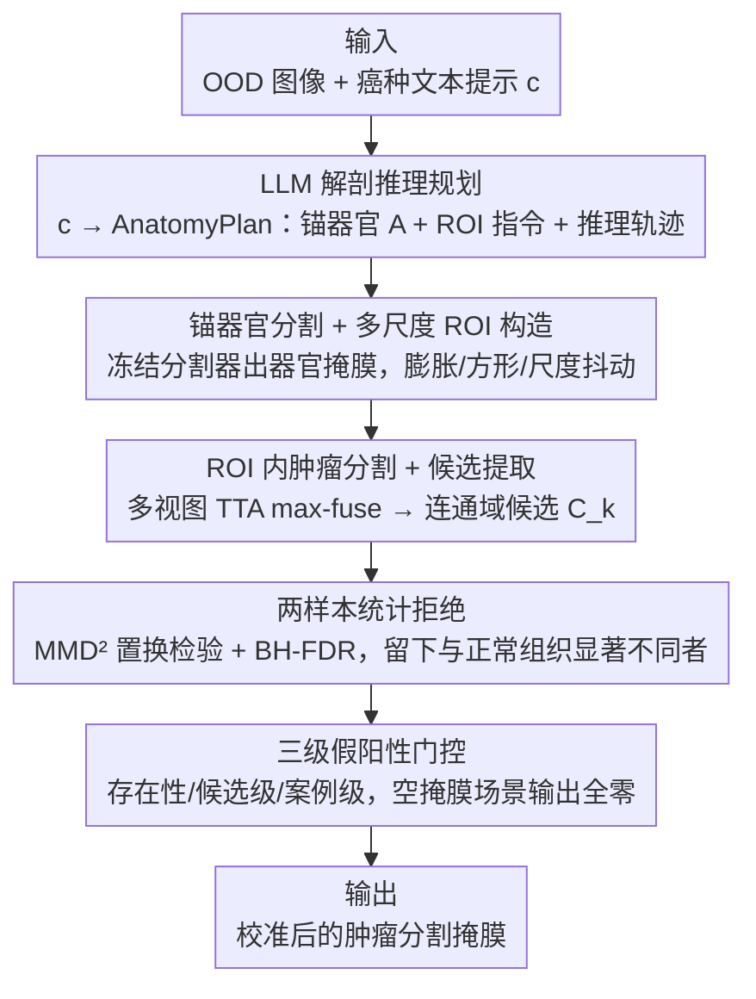

# R2-Seg: Training-Free OOD Medical Tumor Segmentation via Anatomical Reasoning and Statistical Rejection

**会议**: CVPR 2026  
**论文**: [CVF Open Access](https://openaccess.thecvf.com/content/CVPR2026/html/Shen_R2-Seg_Training-Free_OOD_Medical_Tumor_Segmentation_via_Anatomical_Reasoning_and_CVPR_2026_paper.html)  
**代码**: 待确认  
**领域**: 医学图像  
**关键词**: 肿瘤分割, 分布外泛化, 免训练, 测试时自适应, 统计假设检验

## 一句话总结
R2-Seg 是一个**完全不更新参数**的免训练框架，靠"先推理后拒绝"（Reason-and-Reject）两步——先用 LLM 做解剖推理规划出 ROI，再用两样本统计检验（MMD² + FDR 控制）过滤冻结基础模型（BiomedParse）在 ROI 内产生的候选——把分布外（OOD）肿瘤分割的假阳性压下去，从而在多中心多模态肿瘤数据上同时提升 Dice、特异度和敏感度。

## 研究背景与动机
**领域现状**：可提示医学分割已从 SAM、MedSAM 走到文本驱动的 BiomedParse，能用一句文字提示统一做分割/检测/识别，无需专家干预。

**现有痛点**：肿瘤是不规则、尺寸跨度大（毫米到厘米）、强度多样的"异常组织"，同类肿瘤在不同扫描仪、协议、人群间空间异质性极强，造成严重的 OOD 偏移。BiomedParse 在 OOD 下倾向于**过度预测前景**——经常把整个含肿瘤的器官都分出来而不是肿瘤本身，导致假阳性飙升（在 prostate/cervix/uterus/bladder 上 100% 敏感度但 0% 特异度），引发过度诊断、患者焦虑和额外经济负担。

**核心矛盾**：对付 OOD 通常靠微调或测试时自适应（TTA），但医学数据稀缺、标注昂贵；在小肿瘤集上微调基础模型会**灾难性遗忘**、损害泛化；而 TTA（熵最小化、自监督测试时训练）只校准归一化层却仍产生大量小假阳性，且需要访问模型架构/参数——这在很多部署场景不可得。于是问题变成：**能否不改架构、不更新任何参数，就把基础模型适配到 OOD 肿瘤分割？**

**本文目标**：拆成两件事——(1) 提升 OOD 视觉嵌入的可分性（让前景/背景边界别乱）；(2) 校准决策边界、把过度预测的假阳性拒掉。

**切入角度**：作者从嵌入可分性出发——in-distribution 时视觉嵌入可分、文本嵌入能 ground 到前景；OOD 时嵌入难分、边界偏移，背景细节被误判成肿瘤。所以两招对症：用**解剖推理把搜索限制在合理 ROI 内**（恢复可分性），再用**统计检验把"和正常组织没显著差异"的候选拒掉**（校准边界）。

**核心 idea**：用"Reason-and-Reject"原则做**纯免训练**（gradient-free，不更新基础模型参数）的 TTA——LLM 规划 + 局部化提示 + 统计拒绝，天然兼容零更新的测试时增强、且不会灾难性遗忘。

## 方法详解

### 整体框架
R2-Seg 三段串行：**Reason（推理规划）**让 LLM 把自由文本癌种（如 "bladder tumor"）翻译成结构化 AnatomyPlan——锚定器官、ROI 几何规则、推理轨迹；冻结分割器先分出正常器官，据此生成多尺度 ROI。**Segment（局部分割与候选提取）**只在这些 ROI 内提示 BiomedParse，配合多视图测试时增强，max-fuse 出概率图、阈值化、连通域分解得到候选区域 $\{C_k\}$。**Reject（统计拒绝）**对每个候选与正常器官特征做两样本检验（MMD² 置换检验 + BH-FDR 控制），只保留与正常组织显著不同的；再加三级假阳性门控处理空掩膜场景。整条链路无任何参数更新。

### 关键设计

**1. LLM 解剖推理规划与 ROI 构造：把"乱分整个器官"约束回合理区域**

OOD 下 BiomedParse 视觉嵌入难分，会把背景大片误判成肿瘤。R2-Seg 用 LLM 规划器 $\Pi$ 把文本癌种 $c$ 映成 $\Pi(c) \to (A, I_{ROI}, r)$：锚器官集合 $A$、ROI 几何指令 $I_{ROI}$（含 padding $\rho$、尺度抖动集 $\Sigma$、方形约束）和推理轨迹 $r$。对每个锚器官 $a$，冻结分割器出概率图 $P_a = f_\theta(I; c_a, \tau_a)$、二值掩膜 $M_a = \mathbb{1}\{P_a \ge \tau_a\}$；取并集 $M^* = \bigcup_a M_a$ 的轴对齐包围盒 $B_0$，再生成带 padding 的方形多尺度 ROI：
$$B_\sigma = \text{Square}\big(\text{Dilate}(B_0, \lceil\rho/s\rceil\cdot\sigma)\big),\quad \sigma\in\Sigma$$
其中 $s$ 是面内像素间距（像素/毫米）。每个 $B_\sigma$ 裁出一个输入只供后续推理。关键在于：提示始终落在**已知解剖实体的分布内**（让锚器官分割稳），却又能对未见病灶做组合式推理——这正是恢复可分性的来源。

**2. ROI 内肿瘤分割与多视图候选提取：局部化 + TTA 集成**

在每个 ROI 内，冻结分割器做多视图测试时增强并 max-fuse 回原分辨率：
$$\bar P = \max_{g\in G}\big[\text{Inv}(g)\circ f_\theta(g(I|_{B_\sigma}); c_{tumor}, \tau_{tumor})\big]$$
$G=\{g_{id}, g_{lr}, g_{tb}\}$ 为恒等、左右翻、上下翻三种几何变换，$\text{Inv}(g)$ 把预测映回原坐标。阈值化得 $M_{tumor} = \mathbb{1}\{\bar P\ge\tau_{tumor}\}$，连通域分解 $\{C_k\} = \text{Conn}(M_{tumor})$ 抽出空间不相交的候选。局部化把无关大背景排除、TTA 降低单视图不确定性，为后续统计拒绝提供干净的候选集。

**3. 两样本统计拒绝与 FDR 控制：用"显著性"而非"阈值"决定保留谁**

学会拒绝假阳性、重塑决策边界是核心。对每个候选 $C_k$，把其像素级特征 $X=\{\phi(I|_{C_k})\}$ 与正常器官掩膜特征 $Y=\{\phi(I|_{M^*})\}$ 做非参数两样本检验（$\phi$ 取 ROI 内实例级百分位归一化强度）。原假设 $H_0: P_X = P_Y$，用无偏平方最大均值差异（高斯核 $k_\gamma(u,v)=\exp(-\|u-v\|_2^2/2\gamma^2)$）：
$$\widehat{\text{MMD}}^2 = \tfrac{1}{m(m-1)}\sum_{i\ne i'}k_\gamma(x_i,x_{i'}) + \tfrac{1}{n(n-1)}\sum_{j\ne j'}k_\gamma(y_j,y_{j'}) - \tfrac{2}{mn}\sum_{i,j}k_\gamma(x_i,y_j)$$
把合并样本置换 $B$ 次得置换 p 值 $p_k = \frac{|\{b: \widehat{\text{MMD}}^2_{perm,b}\ge\widehat{\text{MMD}}^2_{obs}\}|+1}{B+1}$；再用 Benjamini–Hochberg 校正在水平 $\alpha$ 下控制 FDR（排序 p 值、找 $i^*=\max\{i: p_{(i)}\le\alpha i/|K|\}$、保留前 $i^*$ 个）。BH 定理保证 $H_0$ 下期望 FDR $<\alpha$，复杂度 $O(|K|\cdot B\cdot(m+n)^2)$。这把"哪些候选是真肿瘤"从拍脑袋阈值变成有统计保证的拒绝。

**4. 三级假阳性门控：专治"图里根本没肿瘤却硬分"的空掩膜场景**

文本提示分割器很少输出空掩膜，导致无肿瘤图上假阳性高。作者加三级门控：(L1) **存在性门**——算全局最大概率 $p_{max}$、阳性比例 $\phi$、前/背景概率的 KS 统计 $p_{KS}$，若 $p_{max}<\tau_{max}$ 或 $\phi<\tau_\phi$ 或 $p_{KS}>\tau_{KS}$ 则判为阴性；(L2) **候选级门**——按面积 $|C_k|\ge A_{min}$、平均概率 $\bar P_k\ge\tau_{mean}$、与器官掩膜重叠比 $|C_k\cap M^*|/|C_k|\ge\tau_\cap$ 过滤；(L3) **案例级评分**——$S_k = \bar P_k\sqrt{|C_k|}$，$S^*=\max_k S_k$，若 $S^*<\tau_{case}$ 输出全零掩膜。这是保守的后验校准，在阴性样本占多数时把假阳率压住。

## 实验关键数据

### 主实验
在十个器官特异肿瘤数据集（CT+MR，含 OOD 与 in-distribution）上评测，基线为零样本 BiomedParse（下界）、微调 BiomedParse-FT（上界）、BiomedParse-LoRA（仅 LoRA 微调像素解码器）。下表为五个代表性 OOD 肿瘤类型上的 Dice/敏感度/特异度/准确率/类均准确率（CA）：

| 肿瘤 | 方法 | Dice | Sens. | Spec. | Acc. | CA |
|------|------|------|-------|-------|------|-----|
| Bladder | BiomedParse | 0.069 | 1.000 | 0.000 | 0.976 | 0.546 |
| Bladder | BiomedParse-LoRA | 0.578 | 0.960 | 0.456 | 0.996 | 0.677 |
| Bladder | **R2-Seg** | 0.297 | 0.335 | 0.536 | 0.992 | **0.762** |
| Prostate | BiomedParse | 0.047 | 1.000 | 0.000 | 0.910 | 0.552 |
| Prostate | BiomedParse-LoRA | 0.428 | 0.852 | 0.434 | 0.992 | 0.555 |
| Prostate | **R2-Seg** | **0.465** | 0.645 | 0.587 | 0.971 | **0.890** |
| Cervix | BiomedParse | 0.154 | 1.000 | 0.000 | 0.985 | 0.598 |
| Cervix | BiomedParse-LoRA | 0.485 | 0.949 | 0.359 | 0.996 | 0.686 |
| Cervix | **R2-Seg** | 0.355 | 0.299 | 0.632 | 0.993 | **0.777** |

> 注：BiomedParse 在多个 OOD 类型上"100% 敏感度 / 0% 特异度"，是把整个器官当肿瘤分的典型失效；R2-Seg 牺牲部分敏感度换来显著更高的特异度和 CA（类均准确率），决策边界更校准。Liver/pancreas 这类最难跨域上，R2-Seg 在 Dice 和 CA 上取得 10–30% 相对增益。

### 消融实验
论文未给逐模块加减的标准消融表，而用两套评测制度（全切片 + FROC 权衡）佐证各机制价值：

| 评测/对比 | 关键结果 | 说明 |
|-----------|---------|------|
| 全切片量化（Table 2） | R2-Seg 特异度、CA 全面领先 | 推理规划 + 统计拒绝共同校准边界 |
| FROC 敏感度-假阳权衡 | 激进拒绝下仍保 >80% 敏感度 @10 FP/scan | 拒绝阶段给出有利操作区间，非一味压阳性 |
| 遗忘评测（AMOS22/M&Ms） | 微调模型在 CT/MR 腹部器官（尤其肝）灾难性遗忘 | R2-Seg 不改权重，天然无遗忘 |

### 关键发现
- **过度预测才是 OOD 主病灶**：BiomedParse 的 0% 特异度说明问题不在"分不出肿瘤"而在"分太多"，R2-Seg 的统计拒绝 + 三级门控正对症。
- **免训练胜在不遗忘**：微调/LoRA 虽提 Dice，但在正常器官分割上灾难性遗忘（肝最重，因肿瘤相对正常器官的稀疏性）；R2-Seg 不更新权重，回避了知识遗忘。
- **敏感度-特异度是有意的权衡**：R2-Seg 在 bladder/cervix 上敏感度反而低于 baseline，但换来高特异度与 CA——在临床更看重少过度诊断的场景是更安全的操作点。

## 亮点与洞察
- **把统计假设检验搬进分割后处理**：用 MMD² 两样本检验 + BH-FDR 控制来"拒绝候选"，给假阳性抑制一个有统计保证的判据（$H_0$ 下期望 FDR $<\alpha$），比拍阈值优雅得多，可迁移到任何"前景过度预测"的免训练校准。
- **LLM 当解剖规划器而非分割器**：LLM 只负责把自由文本癌种翻成"锚器官 + ROI 规则"，把提示牢牢钉在分布内的已知解剖上，再让冻结分割器执行——巧妙地用语言先验约束视觉搜索空间。
- **完全零参数更新的 TTA 范式**：兼容零更新测试时增强、不需访问模型架构、不灾难性遗忘，对"只能调用黑盒基础模型 API"的部署极友好。

## 局限与展望
- 敏感度明显下降是隐患：bladder（0.335）、cervix（0.299）等敏感度大跌，临床漏检肿瘤风险需谨慎评估——这是高特异度的代价。
- 强依赖 LLM 规划质量与锚器官分割：若 LLM 给错锚器官或冻结分割器分不出正常器官，ROI 构造和统计检验的"正常组织参照"都会失准。
- 统计检验特征 $\phi$ 取的是实例级归一化强度，较简单；对强度对比弱的肿瘤，MMD² 可能区分不出正常/异常。⚠️ 以原文为准。
- 多套阈值超参（$\tau_{max},\tau_\phi,\tau_{KS},\tau_{mean},\tau_\cap,\tau_{case}$ 等）较多，跨数据集鲁棒性与调参成本待考。

## 相关工作与启发
- **vs BiomedParse（直接零样本）**：同一冻结骨干，R2-Seg 在外面套推理规划 + 统计拒绝，把它"分整个器官"的过度预测纠正成"分肿瘤"，特异度从 0 提到 0.5+。
- **vs BiomedParse-FT / LoRA（微调类）**：微调能提 Dice 但灾难性遗忘正常器官分割；R2-Seg 不动权重、无遗忘，代价是敏感度更保守。
- **vs 传统 TTA（熵最小化 / 自监督测试时训练）**：它们更新归一化层、需访问架构、仍出小假阳性；R2-Seg 纯 gradient-free、黑盒友好、用统计检验显式压假阳。

## 评分
- 新颖性: ⭐⭐⭐⭐⭐ 首个把 LLM 解剖规划 + 两样本统计拒绝组合成纯免训练 OOD 肿瘤分割
- 实验充分度: ⭐⭐⭐⭐ 十数据集多模态 + FROC + 遗忘评测，但缺逐模块标准消融、敏感度代价大
- 写作质量: ⭐⭐⭐⭐ 动机-机制对应清晰、公式完整，三级门控部分超参偏多
- 价值: ⭐⭐⭐⭐ 黑盒基础模型免训练校准，临床抑制过度诊断很实用

<!-- RELATED:START -->

## 相关论文

- [\[CVPR 2026\] PGR-Net: Prior-Guided ROI Reasoning Network for Brain Tumor MRI Segmentation](pgr-net_prior-guided_roi_reasoning_network_for_brain_tumor_mri_segmentation.md)
- [\[CVPR 2026\] A Semi-Supervised Framework for Breast Ultrasound Segmentation with Training-Free Pseudo-Label Generation and Label Refinement](a_semi-supervised_framework_for_breast_ultrasound_segmentation_with_training-fre.md)
- [\[CVPR 2026\] VoxTell: Free-Text Promptable Universal 3D Medical Image Segmentation](voxtell_free-text_promptable_universal_3d_medical_image_segmentation.md)
- [\[CVPR 2026\] Meta-learning In-Context Enables Training-Free Cross Subject Brain Decoding](meta-learning_in-context_enables_training-free_cross_subject_brain_decoding.md)
- [\[CVPR 2026\] OSA: Echocardiography Video Segmentation via Orthogonalized State Update and Anatomical Prior-aware Feature Enhancement](osa_echocardiography_video_segmentation_via_orthogonalized_state_update_and_anat.md)

<!-- RELATED:END -->
