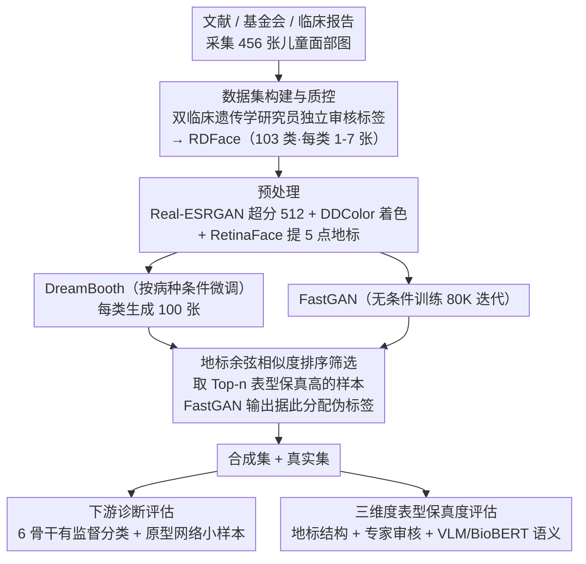

# RDFace: A Benchmark Dataset for Rare Disease Facial Image Analysis under Extreme Data Scarcity and Phenotype-Aware Synthetic Generation

**会议**: CVPR 2026  
**arXiv**: [2604.03454](https://arxiv.org/abs/2604.03454)  
**代码**: [GitHub](https://github.com/Kkathyf/RDFace)  
**领域**: 医学影像 / 人脸分析 / 罕见病诊断  
**关键词**: 罕见病面部识别, 极端数据稀缺, 合成数据增强, 表型对齐, DreamBooth

## 一句话总结

构建了包含 456 张儿童面部图像、覆盖 103 种罕见遗传疾病的标准化基准数据集 RDFace，并系统研究了表型感知的合成数据增强（DreamBooth/FastGAN）在超低样本罕见病诊断中的效果，DreamBooth 增强在极端低数据场景下最高可提升 13.7% 的诊断准确率。

## 研究背景与动机

罕见病（RD）全球影响约 3.5 亿人，已鉴定的罕见病超过 10,000 种。诊断面临重大挑战：
- **诊断延迟**：欧洲研究显示 25% 的罕见病患者在症状出现后 5-30 年才获得正确诊断
- **面部表型价值**：许多遗传综合征在儿童期表现出独特的颅面表型，使面部分析成为有前景的非侵入式诊断线索
- **现有局限**：(1) 缺乏标准化的基准数据集；(2) 现有方法通常聚焦于不到 15 种样本充足的综合征（每类数百张图像），无法应对超低样本场景；(3) 不同疾病表型之间的高相似性增加了区分难度

RDFace 旨在填补这一空白——**每个疾病类别平均仅 4.4 个样本**——这反映了真实临床场景的数据约束。

## 方法详解

### 整体框架

RDFace 本质是"数据集 + 评估协议"，要回答的核心问题是：在每类平均只有 4.4 张图像的极端稀缺下，合成数据增强能否救起罕见病面部诊断。整条流程先做数据采集与质控建成基准，再做预处理与两路合成增强（DreamBooth / FastGAN）、用地标相似度筛选并合回真实数据，最后分两条线检验——下游诊断准确率（6 种预训练骨干有监督分类 + 原型网络小样本）衡量"有没有用"，三维度表型保真度评估衡量"为什么有用"。

### 关键设计

**1. 数据集构建与质量控制：在极端稀缺下保住标签可信度**

罕见病面部数据真正的瓶颈不是没有图，而是图散落在文献、医院基金会和临床报告里、标注质量参差，一旦掺入脏标签，本就稀薄的每类样本会被进一步污染。RDFace 从同行评审文献、医院基金会和经验证的临床报告中收集 456 张大洲均衡的儿童面部肖像（覆盖 46 个国家），每张配标准化元数据（基因关联、疾病缩写、Orphanet 编码），每类 1-7 张、平均年龄 6.36 岁。关键的一步是请两名临床遗传学研究员独立审核每条图像-标签关联的合理性，把质控前置到数据入库阶段，使后续所有评估结论建立在可信标签之上。

**2. 表型对齐的合成增强管道：让生成图像保住疾病特异的颅面表型**

合成增强最大的风险是生成出"像人脸但丢了病征"的图像，反而稀释疾病特异信号。管道先用 Real-ESRGAN 把真实图像超分到 512×512、再用 DDColor 着色做预处理，随后为每个疾病类别独立微调一个 DreamBooth，以 "a child with [disease_abbr] disease" 为文本提示、每类生成 100 张；FastGAN 则用全部训练图像无条件训练 80K 迭代。核心创新在筛选环节：以真实类原型为基准，按 5 点面部地标的余弦相似度对合成图像排序，只保留表型保真度高的样本，FastGAN 的无标签输出也借这套排序完成伪标签分配。把"表型对齐"做成显式的相似度门槛，正是后面"增益来自保真度而非数量"这一结论的根。

**3. 三维度表型保真度评估：从几何、临床、语义三个层面交叉验证合成图像是否还"像这个病"**

光看分类涨点无法解释合成图像究竟保住了什么，因此论文用一套三维度协议从不同角度逼问"生成的脸还携带疾病特异表型吗"。① 几何层面复用前面的地标框架：对每张图算 5×5 的地标两两欧氏距离矩阵，与类内真实图聚合出的平均矩阵做余弦相似度，量化颅面结构的对齐程度；② 临床层面请两名医生用标准化表单独立判定每张合成图对其疾病标签是否"合理"，DreamBooth 有 62-76% 被判合理、Cohen's κ=0.65（实质性一致），FastGAN 仅 2-38%；③ 语义层面用 Qwen2.5-VL 和 LLaVA-NeXT 把真实与合成图各自写成诊断式临床报告（按 5 个面部区域分述），再用 BioBERT 嵌入算报告间余弦相似度，真实-合成达到 0.84、逼近真实-真实基线。三个层面相互印证，共同支撑了"增益来自表型保真度而非单纯样本数量"这一核心结论。

### 损失函数 / 训练策略

- 标准分类：75%/25% 分层分割，5 折交叉验证，交叉熵损失
- 原型网络：600 个训练 episode，100 个验证 episode，欧氏距离度量
- DreamBooth 合成增强按地标相似度排序取 Top-N（N∈{1000,2000,4000,6000}）

## 实验关键数据

### 主实验

有监督分类（仅真实数据）：

| 骨干 | Top-1 | Top-5 | Top-10 | Top-30 |
|------|-------|-------|--------|--------|
| DenseNet-169 | **15.93%** | **33.63%** | **43.01%** | **64.42%** |
| Swin-T | 14.34% | 26.19% | 35.93% | 58.41% |
| VGG-16 | 11.68% | 29.91% | 38.41% | 60.88% |
| FaceNet | 9.91% | 24.60% | 34.87% | 58.23% |
| ResNet-152 | 6.90% | 18.58% | 28.50% | 54.34% |
| CLIP | 3.01% | 12.74% | 19.12% | 42.30% |

DreamBooth 增强后标准分类（Top-1000）：

| 骨干 | Real only | Real+DB | Real+FG | Real+DB+FG |
|------|-----------|---------|---------|------------|
| DenseNet | 15.93% | **17.52%** | 13.27% | 16.46% |
| VGG | 11.68% | **16.64%** | 7.26% | 12.92% |
| FaceNet | 9.91% | **15.04%** | 6.55% | 10.97% |
| CLIP | 3.01% | **9.03%** | 1.42% | 4.25% |

### 消融实验

DreamBooth 缩放效应（DenseNet Top-1）：
- Real only: 15.93% → Top-1000: 17.52% → Top-4000: ~20% → Top-6000: **21.06%**（+5.13%）
- FastGAN 呈持续下降趋势，证明性能增益由表型保真度而非数据量驱动

小样本学习 5-way 1-shot（Real+DB 增强）：
- DenseNet: 26.20% → **29.88%**（+3.68%）
- Swin-T: 22.24% → **26.72%**（+4.48%）

### 关键发现

- 条件生成（DreamBooth）一致性地优于无条件生成（FastGAN），后者甚至导致性能下降
- DreamBooth 图像专家评审：62-76% 被标记为"合理"，Cohen's κ=0.65（实质性一致）；FastGAN 仅 2-38%
- VLM 表型报告：真实-合成相似度与真实-真实相似度可比，跨模型一致性高
- 性能增益来自表型保真度而非单纯的样本数量——DreamBooth 在 Top-6000 时出现饱和

## 亮点与洞察

- **问题定义精准**：聚焦于极端数据稀缺（每类 1-7 样本），这是罕见病 AI 的核心痛点
- **三维度保真度评估**：地标结构相似度 + 临床专家审核 + VLM 语义一致性，形成完整的合成数据质量评估框架
- **反直觉发现**：无条件 GAN 生成反而伤害分类性能，强调了类别条件约束的关键性
- **地标伪标签策略**：巧妙利用面部地标相似度为 FastGAN 的无标签输出分配伪类别

## 局限与展望

- 数据集规模仍有限（456 张图像 / 103 类），部分类仅 1 个样本
- 图像来源异构（网络搜索），部分人口统计学元数据缺失
- 未探索更先进的合成方法（如 ControlNet 条件控制、扩散多样性策略）
- Top-1 准确率最高仅 21.06%，说明 103 类超低样本分类仍极具挑战
- 伦理考量：儿童面部数据的隐私保护方案值得深入讨论

## 相关工作与启发

- **GestaltMatcher**：通过基于检索的匹配扩展到数百种综合征，但仍需充足训练样本
- **GestaltGAN**：用于隐私保护的面部合成，但未评估下游诊断效用
- **启发**：表型对齐的合成增强策略可推广到其他极端低样本医学图像分类场景（如罕见皮肤病、罕见眼底疾病）

## 评分

- **新颖性**: ⭐⭐⭐⭐ — 首个面向极端低样本罕见病面部诊断的标准化基准 + 完整合成增强评估框架
- **实验充分度**: ⭐⭐⭐⭐ — 六种骨干、多种增强设置、三维度保真度评估，实验设计系统全面
- **写作质量**: ⭐⭐⭐⭐ — 结构清晰，数据集描述详尽，评估协议规范
- **价值**: ⭐⭐⭐⭐ — 为罕见病 AI 研究提供了透明、可基准化的数据集和可扩展的评估框架

<!-- RELATED:START -->

## 相关论文

- [\[CVPR 2026\] Few-Shot Synthetic Data Generation with Diffusion Models for Downstream Vision Tasks](few-shot_synthetic_data_generation_with_diffusion_models_for_downstream_vision_t.md)
- [\[CVPR 2026\] Dual-Level Hypergraph Generation for Addressing Feature Scarcity in Whole-Slide Image Classification](dual-level_hypergraph_generation_for_addressing_feature_scarcity_in_whole-slide_.md)
- [\[CVPR 2026\] Gastric-X: A Multimodal Multi-Phase Benchmark Dataset for Advancing Vision-Language Models in Gastric Cancer Analysis](gastric-x_a_multimodal_multi-phase_benchmark_dataset_for_advancing_vision-langua.md)
- [\[CVPR 2026\] BiOTPrompt: Bidirectional Optimal Transport Guided Prompting for Disease Evolution-aware Radiology Report Generation](biotprompt_bidirectional_optimal_transport_guided_prompting_for_disease_evolutio.md)
- [\[AAAI 2026\] A Disease-Aware Dual-Stage Framework for Chest X-ray Report Generation](../../AAAI2026/medical_imaging/a_disease-aware_dual-stage_framework_for_chest_x-ray_report_.md)

<!-- RELATED:END -->
