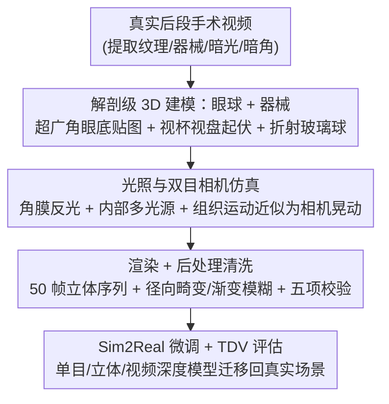

# Real2Sim2Real: RetinalDepth-64K for Depth Estimation in Posterior Segment Ophthalmic Surgery

**会议**: CVPR 2026  
**论文**: [CVF Open Access](https://openaccess.thecvf.com/content/CVPR2026/html/Dong_Real2Sim2Real_RetinalDepth-64K_for_Depth_Estimation_in_Posterior_Segment_Ophthalmic_Surgery_CVPR_2026_paper.html)  
**代码**: 项目页 https://retinaldepth.github.io/  
**领域**: 医学图像 / 深度估计 / 合成数据集  
**关键词**: 眼底手术、深度估计、合成数据、Sim2Real、时序一致性

## 一句话总结
针对眼底（后段）显微手术缺乏深度真值数据这一空白，作者用 Blender 走通一条 Real2Sim2Real 流水线，构建了首个后段眼科手术合成深度数据集 RetinalDepth（44,800 对双目立体序列、896 个场景，带像素级深度/法线/器械分割/相机参数），并提出时序深度方差 TDV 指标衡量视频深度的帧间稳定性，证明在该数据上微调能显著提升单目/立体/视频深度模型在真实眼底手术场景的泛化。

## 研究背景与动机
**领域现状**：深度估计是计算机辅助手术中 3D 重建、术中导航、增强现实的基石。内窥镜场景（腹腔、结肠等）已有结构光（SCARED）、CT（SERV-CT）、立体匹配（Hamlyn）等手段获取深度真值，并积累了一批真实/合成深度数据集。

**现有痛点**：显微镜下的眼科后段手术几乎没有可用的深度真值数据。原因有三：① 后段术野狭小、视场受限，结构光/CT 等设备无法安全靠近娇嫩的眼内组织；② 眼科立体显微镜基线极短，视差范围小，立体匹配误差大；③ 现有唯一的眼科合成集 SMDE 只覆盖前段白内障静态手术，缺少动态器械-组织交互、时序序列与双目视图。结果是后段眼科手术深度估计长期"无米下锅"。

**核心矛盾**：真实采集既不安全也不可行，而已有合成集又不针对后段、不含立体/时序/法线等关键标注——数据的"可得性"与"标注完整性 + 领域贴合度"之间存在缺口。

**本文目标**：造一个专为后段眼科显微手术服务、支持立体/视频/单目深度训练的高保真合成数据集，并验证"在合成数据上微调能迁移到真实手术场景"。

**切入角度**：既然真值采不到，就用图形学把整条采集链路"逆向重建"——从真实手术视频里提炼视觉特征（复杂视网膜纹理、动态器械、昏暗光照、暗角），在 Blender 里造解剖准确的眼球与器械模型把这些特征还原出来，渲染即可得到像素级完美真值。

**核心 idea**：用一条 **Real2Sim2Real**（真实→建仿真→仿真→回真实）闭环流水线生成带完美标注的合成数据，并为视频场景补一个专门衡量帧间稳定性的指标 TDV，把"合成训练 → 真实部署"的 Sim2Real gap 打通。

## 方法详解

### 整体框架
整篇工作是"造数据集 + 给指标"，核心是 Real2Sim2Real 四段式流水线：从真实后段手术视频中提取关键视觉特征（Real）→ 在 Blender 里对眼球和器械做解剖级 3D 建模并配置光照与双目相机（Real2Sim）→ 渲染出带深度/法线/器械分割/相机参数的双目立体序列并做后处理清洗（Sim）→ 用合成数据微调单目/立体/视频深度基础模型并迁移回真实手术场景，配合新指标 TDV 评估时序稳定性（Sim2Real）。最终产出 44,800 对 512×512 立体图，分布在 896 个场景、每场景 50 帧。

### 关键设计

**1. Real-to-Sim 解剖级 3D 建模：把真实眼底"长"进仿真里**

直接拿管状几何体堆视网膜血管会很假，作者改用"贴图 + 雕刻"的方式还原后段眼底。以一个 3D 球面为基底，把**超广角眼底图像作为纹理**贴到球面上，再依据图中视杯/视盘的位置在球面上**雕出凸起与凹陷**，从而在光滑球面上引入真实的深度起伏；用了 10 张代表不同眼病的超广角眼底图来产生多样化的深度图（论文称该数量"待核实其准确性"，⚠️ 以原文为准）。为还原眼睛复杂的光学特性，额外套一个**玻璃球模拟玻璃体**，随机调整颜色（对应不同房水）、折射率与粗糙度，制造跨场景的光学多样性。器械侧单独建模六类眼科器械（抓持镊、剥膜镊、异物镊、眼内磁铁、视网膜脱离气体钩、弯头眼内激光探头），赋金属反光材质，并给镊子做铰接前端，模拟抓取、剥膜等小幅精细动作与抖动轨迹。这一步把"真实手术的视觉/动力学特征"反向编码进可渲染的 3D 资产，是后续完美真值的来源。

**2. 光照与双目相机仿真：还原显微镜视角下的成像条件**

真实后段手术的成像很特殊：外部手术灯打到角膜会形成强反光导致局部过曝、遮挡视网膜细节，而眼内只有有限照明且随器械形变和视角变化而改变。作者据此设计光照仿真——在眼球上方放点光源模拟**角膜反光过曝**，在视网膜纹理上方的左上/右上/左下/右下放一到两个光源模拟眼内照明，并避免固定光照、引入跨场景的亮度与阴影微扰。相机侧用**两台相机**生成立体对模拟显微镜双目视角；针对"视网膜组织受器械力发生细微形变难以精确建模"这一难点，作者把组织相对运动**近似为相机运动**，对两台相机施加同步的晃动与抖动来逼近组织漂移；同时在眼球与相机之间放一个**只开小孔的圆盘**模拟经瞳孔的光路，得到真实手术那种受限视野。这些设置让合成图在光照、视场、动态上贴近真实显微镜输出。

**3. 渲染 + 后处理清洗：拿到像素级完美标注并保证可靠性**

在每个搭好的场景里连续采样，用 Blender 内置 Cycles 渲染器生成**每场景 50 帧**动画（512×512），每帧从两个微偏视角渲染立体 RGB，并同步输出初始深度图、法线图、有效区域掩码与器械掩码；50 帧可当视频序列也可当独立标注图。渲染后做严格清洗：先对动画做**五项校验**（器械-视网膜尺度合理、器械贴近视网膜、运动限制在视场内、器械持续存在、光照范围正常但偶含极端情况以覆盖罕见手术）；再做针对性精修——用掩码盖掉无效深度区域，加**径向镜头畸变** $r = 1 + k\cdot d^2$（其中 $k=0.00001$，$d=\sqrt{(x-x_{center})^2+(y-y_{center})^2}$，坐标按 $x' = x_{center}+(x-x_{center})\cdot r$ 重映射）模拟显微镜成像缺陷，用渐变模糊柔化边缘以匹配真实光照效果（并用器械掩码保护器械清晰度），最后统一校验为 $512\times512\times3$ 格式。最终得到 44,800 对带深度/法线/相机内外参/分割掩码/时序的完整标注立体图（见 Table 1、Table 2），是首个在后段眼科显微术上"标注最全"的合成集。

**4. 时序深度方差 TDV：给视频深度补一个稳定性指标**

已有深度指标只看逐帧精度，不显式量化时序稳定性，但术中导航对帧间抖动极其敏感。作者据此提出 **Temporal Depth Variance（TDV）**：注意到相机固定、只有器械在动，因此**静态视网膜背景的深度本应跨帧不变**，于是用背景区域相邻帧深度差的平方衡量不必要的波动：

$$\text{TDV}_{seq} = \frac{1}{T-1}\sum_{t=1}^{T-1}\frac{1}{N_t}\sum_{p\in\mathcal{B}_t}\bigl(d_t(p)-d_{t+1}(p)\bigr)^2$$

其中 $T=50$ 为序列长度，$d_t(p)$ 为第 $t$ 帧像素 $p$ 的预测深度，$\mathcal{B}_t$ 是 $t$ 与 $t{+}1$ 帧之间的静态背景区域，$N_t=|\mathcal{B}_t|$。背景掩码取器械掩码并集的补集：$\mathcal{B}_t = \neg(m_t \lor m_{t+1})$，$m_t\in\{0,1\}^{H\times W}$。TDV 越低表示时序越稳。它把"逐帧准但跳变大"这种对手术导航有害的现象量化出来——例如逐帧精度最高的 VGGT 反而 TDV 偏高，恰好说明该指标抓到了单帧先验模型的时序短板。

## 实验关键数据

### 主实验
数据集本身用于评测一批 SOTA 深度模型在零样本与微调两种设定下的表现。下表为 RetinalDepth 单图测试集上的**零样本**结果（节选关键指标，↑ 越大越好，↓ 越小越好）：

| 模型 | 类型 | $\delta_{0.5}$↑ | $\delta_1$↑ | Abs Rel↓ | RMSE↓ |
|------|------|------|------|------|------|
| Depth Anything (DA) | 单目 | 0.323 | 0.591 | 0.331 | 0.108 |
| Marigold | 单目 | 0.307 | 0.587 | 0.343 | 0.112 |
| DA V2 | 单目 | 0.281 | 0.547 | 0.376 | 0.119 |
| ZoeDepth | 单目 | 0.273 | 0.428 | 75.463 | 0.223 |
| VGGT | 立体 | 0.332 | 0.612 | 0.322 | 0.107 |
| DUSt3R | 立体 | 0.006 | 0.015 | 0.833 | 0.824 |

零样本下，DA 在单目里最强、Marigold 与 DA V2 紧随，ZoeDepth/MoGE 较弱；立体里 VGGT 一枝独秀、DUSt3R 与 MASt3R 因医学训练数据不足而崩坏。但即便最好的 VGGT/DA，误差仍偏高，说明存在明显领域 gap。

下表为**微调后**单图测试集（按"整图 / 器械"两类区域分别报告，节选）：

| 模型 | 区域 | $\delta_1$↑ | Abs Rel↓ |
|------|------|------|------|
| VGGT（立体） | 整图 | 0.956 | 0.061 |
| DA（单目） | 整图 | 0.975 | 0.055 |
| DA V2（单目） | 器械 | 0.889 | 0.097 |
| VGGT（立体） | 器械 | 0.339 | 93.901 |

在 RetinalDepth 上微调后所有模型整图精度大幅提升（验证数据集有效弥合领域 gap）；整图上立体 VGGT 与单目 DA 都达到顶尖。但**器械深度预测**上立体模型即便微调后仍很差（VGGT/MASt3R 误差极高，疑因反光动态器械表面的立体对应难建），而单目模型微调后在器械上表现良好（DA V2 领先），凸显单目线索在精细器械深度上的灵活性。

### 视频深度估计
利用 RetinalDepth 的时序序列评测视频深度：把单图模型逐帧应用 vs. 视频专用模型零样本。结论是**单图微调模型逐帧应用在空间精度上反超视频专用方法，但后者时序一致性更好**；VGGT 空间精度最佳却 TDV 偏高（时序不稳），正好印证 TDV 抓到了逐帧预测的时序短板。

### 关键发现
- 即便是 DA/VGGT 这类强基础模型，零样本到眼底手术场景也明显掉点，证明后段眼科领域 gap 真实存在、专用数据集有必要。
- 微调后整图精度普涨，但"器械"这一精细动态区域成为分水岭：单目受益、立体受限——为后续"如何在立体下建模反光器械"留下问题。
- 空间精度与时序稳定性是两条不同的轴：逐帧最准的模型未必时序最稳，TDV 让这一矛盾可量化。

## 亮点与洞察
- **用图形学"逆向"采集链路造完美真值**：在无法安全采深度的眼内场景，先从真实视频提特征、再在 Blender 里解剖级还原，把"采不到的真值"变成"渲染即得"，思路对其他难采集的医学/手术场景（如内耳、血管腔内）有迁移价值。
- **把难建模的组织形变近似成相机晃动**：视网膜受力形变难以精确仿真，作者用相机同步晃动来逼近组织漂移，是一个低成本但有效的工程取巧，值得在其他软组织仿真里借鉴。
- **TDV 把"逐帧准但跳变"显式量化**：利用"相机固定、背景应静止"的先验，用背景相邻帧深度差衡量稳定性，给视频深度评测补了一条被忽视的轴，且定义清晰可复现。
- **完整标注矩阵**：双目 + 深度 + 法线 + 器械分割 + 相机内外参 + 时序一次集齐（Table 1 中相对已有医学深度集最全），单一数据集可同时喂单目/立体/视频三类模型。

## 局限与展望
- **合成-真实差距未完全消除**：尽管做了畸变/模糊等后处理，仍是 Blender 渲染图，真实手术的血流、组织半透明、动态高光等细节难以完全还原，真实数据上只做了定性评估（缺真值）。
- **器械深度在立体设定下仍差**：反光、动态、细长的器械表面立体对应困难，微调也救不回来，说明数据集解决了"有没有数据"但没解决"如何建模反光器械"。
- **多处参数"待核实"**：作者自承如"10 张超广角眼底图"等数量需进一步验证准确性（⚠️ 以原文为准），仿真保真度与真实分布的对齐程度仍待更系统验证。
- **TDV 依赖"相机固定 + 背景静止"假设**：一旦真实场景相机移动或背景非刚性，TDV 的可比性会下降，需配合背景估计或运动补偿。
- 展望：补充真实标注子集做定量 Sim2Real 验证、引入更强的器械材质/反光建模、把 TDV 推广到相机运动场景。

## 相关工作与启发
- **vs SMDE（唯一眼科合成深度集）**: SMDE 只覆盖前段白内障静态手术、单目、无时序/法线/立体；本文专攻后段、提供双目立体 + 时序 + 法线 + 器械分割，标注与场景维度全面更广。
- **vs 内窥镜真实深度集（SCARED / SERV-CT / Hamlyn）**: 它们靠结构光/CT/立体匹配在腹腔等大视场场景采真值，但这些手段在狭小、短基线的眼内场景不可用；本文用合成渲染绕开物理采集限制。
- **vs 通用深度基础模型（Depth Anything / Marigold / VGGT / DUSt3R）**: 这些模型零样本到眼底手术明显掉点，本文不造新模型而是造数据集——证明"专用合成数据微调"是弥合医学领域 gap 的有效路径。

## 评分
- 新颖性: ⭐⭐⭐⭐ 首个后段眼科手术合成深度集 + Real2Sim2Real 闭环 + TDV 指标，问题与方案都新；但单项技术（Blender 合成、Sim2Real）非首创。
- 实验充分度: ⭐⭐⭐⭐ 覆盖单目/立体/视频三类、零样本与微调两设定、多指标，较系统；但真实数据仅定性评估、缺真实定量 Sim2Real 验证。
- 写作质量: ⭐⭐⭐⭐ 流水线与动机清晰、表格完整；个别参数自承"待核实"，公式排版在原文中略有 OCR 噪声。
- 价值: ⭐⭐⭐⭐ 填补眼科后段手术深度数据空白，对手术导航/3D 重建/新手训练有实用价值，数据集与指标可被社区直接复用。

<!-- RELATED:START -->

## 相关论文

- [\[CVPR 2026\] Depth Any Endoscopy: Towards Self-Supervised Generalizable Depth Estimation in Monocular Endoscopy](depth_any_endoscopy_towards_self-supervised_generalizable_depth_estimation_in_mo.md)
- [\[CVPR 2026\] X-PCR: A Benchmark for Cross-modality Progressive Clinical Reasoning in Ophthalmic Diagnosis](x-pcr_a_benchmark_for_cross-modality_progressive_clinical_reasoning_in_ophthalmi.md)
- [\[CVPR 2026\] EchoPOSE: 6D Pose Estimation of Sparse Echocardiograms for Left-Ventricular 3D Shape Reconstruction](echopose_6d_pose_estimation_of_sparse_echocardiograms_for_left-ventricular_3d_sh.md)
- [\[CVPR 2026\] Factorized Context Aggregation for Robust Cancer Risk Estimation via Soft Re-Ranked Retrieval and Hierarchical Anchors](factorized_context_aggregation_for_robust_cancer_risk_estimation_via_soft_re-ran.md)
- [\[CVPR 2026\] Semi-supervised Echocardiography Video Segmentation via Anchor Semantic Awareness and Continuous Pseudo-label Reforging](semi-supervised_echocardiography_video_segmentation_via_anchor_semantic_awarenes.md)

<!-- RELATED:END -->
