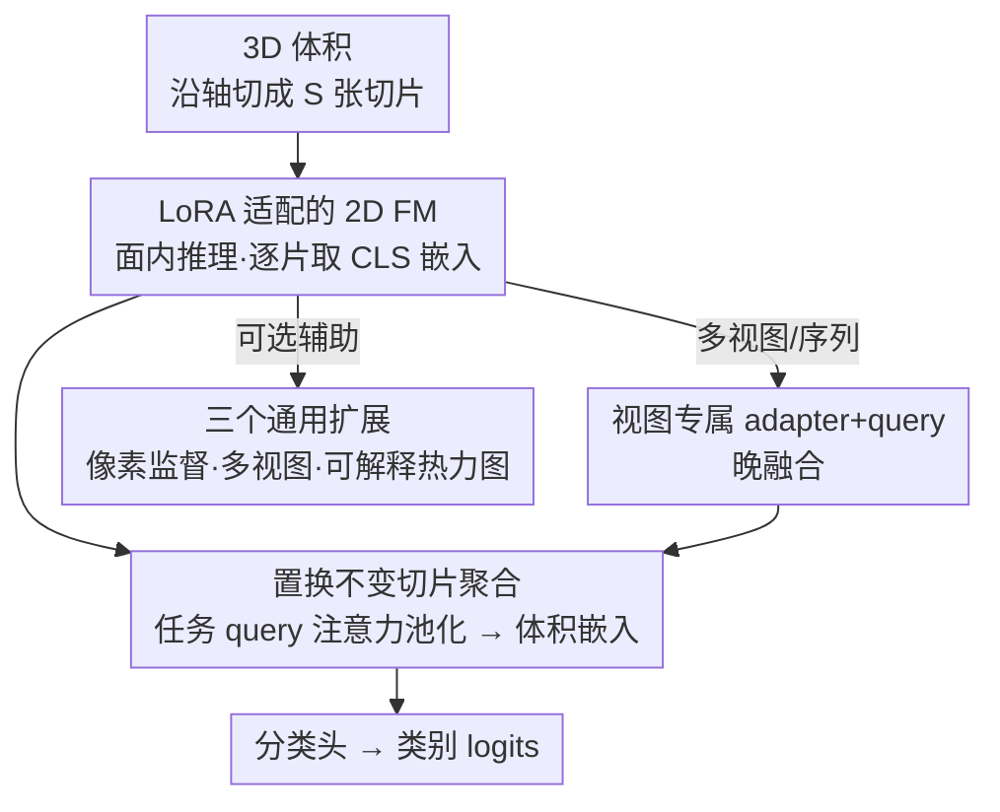

# Revisiting 2D Foundation Models for Scalable 3D Medical Image Classification

**会议**: CVPR 2026  
**论文**: [CVF Open Access](https://openaccess.thecvf.com/content/CVPR2026/html/Liu_Revisiting_2D_Foundation_Models_for_Scalable_3D_Medical_Image_Classification_CVPR_2026_paper.html)  
**代码**: 待确认  
**领域**: 医学图像  
**关键词**: 3D医学分类, 2D基础模型, LoRA适配, 切片注意力聚合, 可扩展性

## 一句话总结
在冻结的 2D 基础模型上只加约 1M 参数的轻量任务插件（LoRA 适配 + 置换不变的切片注意力聚合），就能让单一框架在 12 个不同病灶/部位/模态的 3D 医学分类任务上达到 SOTA（含 VLM3D 挑战赛第一），并系统揭示了「2D 方法在 3D 分类上优于 3D 架构、通用 FM 适配后能追平医学 FM」等反直觉结论。

## 研究背景与动机
**领域现状**：3D 医学图像分类（创伤分诊、疾病诊断、严重程度分级）是临床流程的核心。传统做法把 2D 卷积网络（ResNet、DenseNet）扩展到 3D 来捕捉切片间依赖，但 3D 网络几乎没有可用预训练权重，只能从头训练。近年医学基础模型（FM）兴起，3D 医学 FM 被默认为 3D 任务的标准方案，2D FM 则主要用于 2D 任务。

**现有痛点**：作者指出已有研究存在三个被普遍忽视的「坑」。**P1 数据规模偏差**：现有评测多在 few-shot / 低数据量下做，此时适配过的 FM 虽然比从头训练强，但绝对性能远低于临床可接受水平，且 FM 的优势会随数据量增加而消失——低数据量评测无法反映真实部署价值。**P2 适配不充分**：现有把 2D FM 用于 3D 的主流做法是「冻结 backbone 抽切片特征 + 平均/中值池化」，作者发现仅把这个适配策略换成自己的方法，同一个 DINOv3 backbone 的 AUC 就能涨 0.11，说明 FM 的潜力被严重低估。**P3 任务覆盖不足**：现有评测往往局限在单一模态或单一解剖区域，无法判断 FM 是真正可扩展还是只在特定任务上好用。

**核心矛盾**：可扩展性（快速部署、最小训练成本）与临床精度要求之间的张力。「一个任务一个模型」的范式扩展性极差；而单纯冻结 FM 当特征提取器虽然可扩展，却因为通用特征抓不住医学影像里极细微的诊断征象而性能受限。

**本文目标**：(1) 拆掉这三个坑，建立覆盖真实数据规模、多模态多部位的 benchmark；(2) 找到能真正释放 2D FM 潜力的适配策略，用单一可扩展框架替代一堆任务专用 3D 模型。

**切入角度**：把「面内特征提取」和「穿面（切片间）推理」解耦——面内交给 2D FM（LoRA 轻量适配），穿面交给一个置换不变的轻量聚合模块。

**核心 idea**：在冻结 2D FM 上只挂约 1M 参数的任务插件，就能可扩展地适配任意 3D 医学分类任务，无需为每个任务单独训 3D 模型。

## 方法详解

### 整体框架
AnyMC3D 把一个 3D 体积 $x \in \mathbb{R}^{C\times H\times W\times S}$ 沿某一轴切成 $S$ 张 2D 切片，逐片送进**冻结的 2D FM**（用 LoRA 适配），取每片最后一层的 class token 作为切片嵌入 $\mathbf{h}_s\in\mathbb{R}^d$；再用一个**任务 query 驱动的置换不变注意力池化**把 $S$ 个切片嵌入融合成一个体积嵌入 $\mathbf{v}$，最后过分类头出 logits。对一个新任务，只需新增 LoRA adapter $\psi_t$、任务 query $\mathbf{q}_t$ 和分类头这些「橙色插件」（约 1.3M 参数），2D backbone 始终冻结。框架还支持三个可选扩展：多视图/多序列融合、像素级辅助监督、可解释 3D 热力图。

### 关键设计

**1. LoRA 适配的 2D FM 面内推理：用低秩更新唤醒被冻结的通用特征**

痛点直指 P2：以往把 2D FM 当冻结特征提取器，通用预训练特征抓不住医学影像里极细微的征象（如出血、小结节），性能被压死。AnyMC3D 把整个 2D backbone $f_\theta$ 冻结，只在 patch embedding 和所有 self-attention 投影层上加任务专属的 LoRA 低秩更新：$\mathbf{W}' = \mathbf{W} + \Delta\mathbf{W}_t$，其中 $\Delta\mathbf{W}_t = \tfrac{\alpha}{r}\mathbf{B}_t\mathbf{A}_t$，秩 $r\ll\min(d_{in},d_{out})$ 控制可学容量，$\alpha$ 缩放更新幅度；$\mathbf{B}_t$ 零初始化以在训练初期保留预训练行为（论文设 $r=8,\alpha=16$）。每片切片 $\mathbf{x}^s$ 经适配后的 FM 编码，取 class token 得切片嵌入 $\mathbf{h}_s=\tilde f_{\theta,\psi_t}(\mathbf{x}^s)$。关键在于「解耦」——面内的纹理/边界识别交给强大的 2D FM，LoRA 只微调中间特征去贴合具体任务，既保住了预训练知识又能抓住任务特异的诊断细节，且每个任务只动极少参数。

**2. 置换不变的切片注意力聚合：不强加切片顺序先验**

痛点：以往用 RNN/Transformer 做切片融合会强加「有序序列」先验，但 3D 医学影像常有各向异性间距、覆盖范围不一，严格的序列建模对采集差异过于敏感。本文改用**任务 query 驱动的注意力池化**：把切片嵌入堆成 $\mathbf{H}=[\mathbf{h}_1,\dots,\mathbf{h}_S]^\top\in\mathbb{R}^{S\times d}$，用一个可学习任务 query $\mathbf{q}_t$ 算注意力权重并加权平均：

$$\boldsymbol{a} = \operatorname{softmax}\!\Big(\tfrac{\mathbf{H}\mathbf{q}_t}{\sqrt{d}}\Big)\in\mathbb{R}^{S}, \qquad \mathbf{v} = \boldsymbol{a}^{\top}\mathbf{H}\in\mathbb{R}^{d}$$

这样融合对切片排列不变，自动给「任务相关切片」更高权重，既不被采集顺序带偏，又参数极轻。消融显示注意力池化在更少参数下优于平均/中值池化和序列建模（LSTM、Transformer），后者徒增计算却无收益。这个 $\mathbf{q}_t$ 顺带还充当了后面「热力图」里每片重要性分数的来源。

**3. 三个通用扩展：让同一框架覆盖真实临床的多样输入与可解释需求**

为了让框架真正「通用」，作者加了三个即插即用扩展。**多视图/序列学习**：MRI 常有多视角（矢状/冠状）或多序列（T1/T2/FLAIR），每个视图用各自的 LoRA adapter $\psi^{(i)}$ 和 query $\mathbf{q}^{(i)}$ 先算出视图嵌入 $\mathbf{v}^{(i)}$，再用任务 query 注意力池化做晚融合；每个视图只新增轻量组件，可扩展到任意视图数。**像素级辅助监督**：仅图像级标签训练对细微病灶很难，作者把每片 patch token 重排成 2D 特征图、沿切片轴堆成伪 3D token 体积，再用轻量 3D 解码器映射到体素级 logits，训练时加一项只在有分割掩膜子集 $\mathcal{I}$ 上计算的辅助分割损失 $\mathcal{L}_{total}=\mathcal{L}_{cls}+\lambda_{seg}\cdot\tfrac{1}{|\mathcal{I}|}\sum_{i\in\mathcal{I}}\mathcal{L}_{seg}(\hat{\mathbf{Y}}_i,\mathbf{Y}_i)$，推理时可丢掉分割分支零额外开销。**可解释 3D 热力图**：对每片取最后一层 class-to-patch 注意力（多头平均、reshape 成 patch 网格再上采样）得 2D 热力图 $\mathcal{M}_s$，再用设计 2 里的任务 query 算出每片重要性分数，把各片 2D 热力图按重要性加权堆叠成 3D 热力图——能定位创伤损伤、甚至高亮 PDAC 的次级征象（胰管扩张）。

## 实验关键数据

### 主实验
benchmark 含 12 个任务（T1–T12），覆盖腹部创伤（肠/肝/肾/脾损伤）、PDAC 早检、肺结节、肩关节 MRI、胸部/头部多异常等，模态含 CECT/CT/MRI，刻意保留真实类别不平衡（如肠损伤仅 104 个阳性 / 4679 例）。下表为 10 个任务上与 SOTA 3D 分类方法的对比（AUROC）：

| 方法 | 可训练参数(M) | 冻结backbone | 平均AUC | 平均Rank |
|------|------|------|------|------|
| 3D DenseNet（从头训） | 11.24 | ✗ | 0.833 | 6.4 |
| MST（全微调 DINOv2 + 切片融合） | 23.05 | ✗ | 0.869 | 4.0 |
| RSNA-Kaggle（2.5D + BiLSTM） | 25.04 | ✗ | 0.810 | 6.8 |
| VoCo（3D 医学 FM, 全微调） | 50.49 | ✗ | 0.793 | 7.0 |
| MII（冻结 + 线性探测） | 0.03 | ✓ | 0.785 | 8.7 |
| **AnyMC3D (MII)** | **1.32** | ✓ | **0.894** | **1.7** |
| **AnyMC3D (DINOv3)** | **1.20** | ✓ | **0.894** | **2.0** |

AnyMC3D 用比 MST 少 10–40×、比 VoCo 少 40–50× 的可训练参数，平均 AUC 反超所有基线。在 PDAC 早检（T5）上 AnyMC3D(DINOv3) 仅用分类标签就把 AUC 从 PanDx 的 0.949 提到 0.962，再叠加像素辅助监督进一步到 0.973；在胸部 CT 多异常（CT-RATE, 18 种）上 AnyMC3D(DINOv2) 的平均 AUC 达 0.882，超过 CT-Net(0.631) 与 CT-CLIP(0.768)，并以约 0.5M 可训练参数在 118 支队伍的 VLM3D 挑战赛中夺冠。

### 消融实验
| 配置 | 结论 | 说明 |
|------|------|------|
| 切片融合：注意力池化 vs 平均/中值/LSTM/Transformer | 注意力池化最优 | 更少参数即超越，序列建模徒增开销无收益 |
| backbone 尺寸 ViT-S/B/L | 越大越好 | 推荐新任务先用 ViT-S，再按需放大 |
| DINOv2 vs DINOv3 | 差异可忽略 | DINOv3 的预训练改进不转化为 3D 医学分类增益 |
| 适配方式：线性探测 → AnyMC3D | MII 0.785→0.894，MedGemma 0.690→0.866 | 验证「适配策略至关重要、线性探测远不足」 |
| 数据规模 20%（T3） | DenseNet 0.741 → AnyMC3D 0.924（+0.18） | 20% 数据即超 DenseNet 用 60% 数据，3× 数据效率 |

### 关键发现
- **适配 > 预训练范式**：同一医学 FM 仅换适配策略（线性探测→AnyMC3D）AUC 大涨，说明 FM 潜力此前被严重低估；通用 FM（DINOv3）适配后能追平甚至超过专门做医学预训练的 MedGemma——「医学预训练」本身不保证更好。
- **2D 方法优于 3D 架构**：从头训的 3D 模型（11–33M 参数）只有 0.683–0.833 AUC，连最好的 DenseNet 都落后顶级 2D 方法 6.1 点；即便大参数的 3D 医学 FM（MedicalNet、VoCo）也跑不过。作者推测分类任务靠逐片决策聚合即可（像放射科医生逐片浏览），不像分割那样依赖精细的切片间关系。
- **预训练与适配缺一不可**：冻结的 2D/3D 医学 FM 表现都不佳，因为诊断征象极细微，需要对中间特征做任务专属适配，而非依赖冻结的通用表示。

## 亮点与洞察
- **「轻量插件 + 冻结主干」把可扩展性和精度同时拿下**：每任务约 1M 参数即 SOTA，真正实现「一个框架适配任意 3D 医学分类任务」，对早期数据稀缺、阳性样本少的临床场景尤其友好（3× 数据效率）。
- **置换不变聚合的设计动机很扎实**：抓住了 3D 医学影像「各向异性、覆盖不一」的特性，不盲目套序列建模，且任务 query 一举两用（融合 + 热力图重要性）。
- **反直觉结论有迁移价值**：「2D + 切片融合 > 3D 架构」与过去五年 3D 分类挑战赛获胜方案全是 2D/2.5D 的经验吻合；这提示架构选择应匹配任务的空间推理需求（分类靠逐片聚合、分割靠切片间精细关系），而非简单匹配输入维度。
- **像素辅助监督即插即用**：训练时借少量分割掩膜提升分类，推理时整条分割分支可丢，零额外开销——这种「训练增强、推理瘦身」的思路可迁移到其他弱标签任务。

## 局限与展望
- 作者承认结论只基于本文评测的几个 FM，其他 FM 的适配特性可能不同；全部 benchmark 任务都是域内 CT/MR，FM 对域外模态（如 PET）的泛化未探索。
- 像素辅助监督依赖昂贵的体素级标注，作者提出可用更弱的监督（bounding box、放射报告 + 视觉-语言对齐）替代。
- DINOv3 的 Gram anchoring 带来的增强空间特征在 3D 分类上没体现优势（与 DINOv2 持平），但作者推测可能利好可扩展的 3D 密集预测任务——本文未验证。
- 自己发现的局限：方法把 3D 体积当成「切片集合」处理，虽对分类够用，但对真正需要 3D 连续结构推理的任务（如精细分割、血管追踪）这种解耦可能损失信息；论文也明确把方法定位为「研究用途，非临床」。

## 相关工作与启发
- **vs 3D 医学 FM（MedicalNet / VoCo）**：他们用 3D 编码器原生处理体积、全微调（参数 46–50M），本文用 2D FM + 轻量切片融合（约 1M），在更少参数下反超——挑战了「3D 任务必须用 3D FM」的默认假设。
- **vs 冻结 2D FM + 平均/中值池化（Liu et al. / Zhang et al. / Codella et al.）**：他们冻结 backbone 抽特征后简单池化，通用特征抓不住细微征象；本文用 LoRA 适配 + 任务 query 注意力池化，同一 backbone 即涨 0.11 AUC。
- **vs MST（全微调 DINOv2 + 切片 Transformer）**：MST 全微调代价大、用序列建模；本文冻结 backbone、用置换不变聚合，参数少一个量级且平均 AUC 更高、对采集变化更鲁棒。
- **vs LoRA-DINOv2 单结节分类（Veasey et al.）**：他们只取三张正交切片、把 3D 当 2D 处理，丢了完整 3D 上下文；本文逐片编码全体积再聚合，保留空间信息。

## 评分
- 新颖性: ⭐⭐⭐⭐ 方法组件（LoRA、注意力池化）本身不新，但「解耦面内/穿面 + 系统性揭坑」的视角和反直觉结论很有价值
- 实验充分度: ⭐⭐⭐⭐⭐ 12 任务跨模态/部位 benchmark + 多组消融 + 挑战赛夺冠，证据链扎实
- 写作质量: ⭐⭐⭐⭐ 三坑→方法→洞察的逻辑清晰，结论提炼到位
- 价值: ⭐⭐⭐⭐⭐ 给 3D 医学分类提供了强基线和可落地的可扩展范式，纠正了领域多个常见误区

<!-- RELATED:START -->

## 相关论文

- [\[ICML 2025\] Raptor: Scalable Train-Free Embeddings for 3D Medical Volumes Leveraging Pretrained 2D Foundation Models](../../ICML2025/medical_imaging/raptor_scalable_train-free_embeddings_for_3d_medical_volumes_leveraging_pretrain.md)
- [\[CVPR 2026\] Delving Aleatoric Uncertainty in Medical Image Segmentation via Vision Foundation Models](delving_aleatoric_uncertainty_in_medical_image_segmentation_via_vision_foundatio.md)
- [\[CVPR 2026\] Are General-Purpose Vision Models All We Need for 2D Medical Image Segmentation? A Cross-Dataset Empirical Study](are_general-purpose_vision_models_all_we_need_for_2d_medical_image_segmentation_.md)
- [\[CVPR 2026\] Forging a Dynamic Memory: Retrieval-Guided Continual Learning for Generalist Medical Foundation Models](forging_a_dynamic_memory_retrieval-guided_continual_learning_for_generalist_medi.md)
- [\[CVPR 2026\] Attention Consistent Longitudinal Medical Visual Question Answering Guided by Vision Foundation Models](attention_consistent_longitudinal_medical_visual_question_answering_guided_by_vi.md)

<!-- RELATED:END -->
