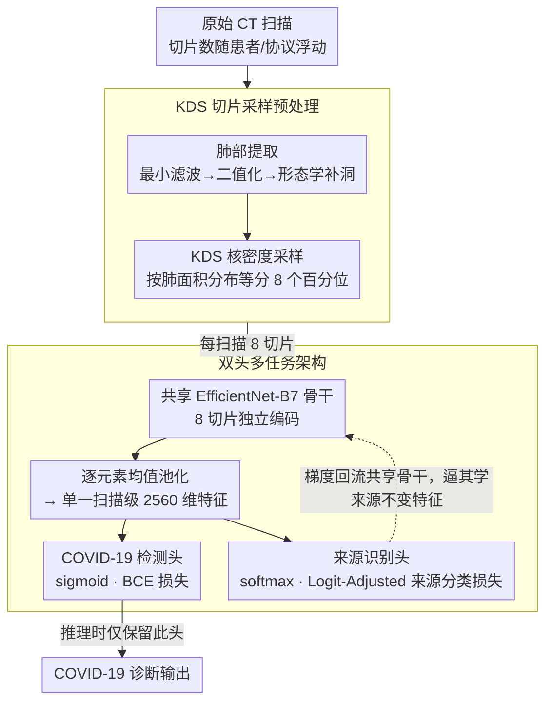

# Robust Multi-Source Covid-19 Detection in CT Images

**会议**: CVPR 2026  
**arXiv**: [2604.03320](https://arxiv.org/abs/2604.03320)  
**代码**: [https://github.com/Purdue-M2/-multisource-covid-ct](https://github.com/Purdue-M2/-multisource-covid-ct)  
**领域**: 医学图像  
**关键词**: COVID-19检测, 多源域, 多任务学习, 对数调整损失, CT图像

## 一句话总结

提出一种多任务学习框架，在共享 EfficientNet-B7 骨干上同时训练 COVID-19 诊断头和来源医院识别头（使用 logit-adjusted 损失），推动特征提取器学习跨机构不变的表示，在多源 CT 数据集上 F1 达到 0.9098。

## 研究背景与动机

1. **领域现状**：深度学习在 COVID-19 CT 检测上表现优异，但大多数方法假设训练和测试数据来自同一机构。多中心场景下，不同扫描仪、成像协议、患者群体引入的域偏移会显著降低模型性能。

2. **现有痛点**：(1) 现有方法仅优化 COVID vs non-COVID 的单一目标，不感知数据来源，导致特征偏向贡献数据最多的中心；(2) 数据量在各中心之间分布不均（3 个中心各约 330 例，1 个中心仅 234 例），进一步加剧偏差。

3. **核心矛盾**：单任务训练中，骨干网络可以自由利用医院特有的伪特征（如重建核、亮度分布）来最小化损失，这些特征在跨中心时完全失效。

4. **本文目标** 让共享特征提取器学习跨机构不变的疾病表示，同时防止来源分布不均导致的隐性偏差。

5. **切入角度**：引入来源医院识别作为辅助任务，迫使骨干网络同时"理解"来源差异，从而学习区分疾病和来源的解耦表示。

6. **核心 idea**：在疾病检测头之外添加 logit-adjusted 损失监督的来源分类头，迫使骨干编码器学习来源不变的特征。

## 方法详解

### 整体框架

输入：每个 CT scan 经肺部提取和 KDS（核密度切片采样）处理后固定选取 8 个代表性切片。8 个切片独立通过共享的 EfficientNet-B7 骨干编码为 2560 维特征向量，逐元素均值池化为单一扫描级表示。两个分类头分别输出 COVID-19 诊断概率（二分类，sigmoid）和来源医院预测（四分类，softmax）。推理时仅使用疾病检测头。

### 关键设计

**1. KDS 切片采样预处理：把变长 CT 压成固定 8 切片，又不丢诊断信息**

一次 CT 扫描的切片数随患者和协议浮动，但骨干网络需要定长输入。最朴素的均匀采样会在解剖结构上"一视同仁"，结果是变化平缓的肺尖区被反复采到，而肺门、肺底这些截面剧烈变化、病灶信息最密集的区域反而被稀疏掠过。KDS（核密度切片采样）改用肺部面积来衡量"哪里值得看"：先算出每个有效切片的肺部面积，用高斯核密度估计（Scott's rule 自动定带宽）拟合面积沿切片轴的分布，再把累积分布函数等分成 8 个百分位区间，每个区间取最接近中点的那一张切片；扫描太短时用末切片重复补齐到 8 张。这样采样密度自动随解剖变化率走——肺截面快速变化的区域被加密采样，平缓区域被稀释，固定 8 切片里保留的诊断价值因此最大化。

**2. 双头多任务架构：用来源识别当隐式域正则化，逼骨干学不依赖医院的特征**

跨中心泛化失败的根子在于：单任务训练里骨干网络可以偷懒，把"这是哪家医院"（重建核、亮度分布等机构指纹）当成最小化疾病损失的捷径，可这些伪特征一换中心就失效。本文不引入显式的域对齐目标（MMD、对抗训练），而是在 COVID-19 检测头之外挂一个来源识别头，两头共享同一个 2560 维扫描级特征。关键在于这个共享：一旦来源头也要用这份特征去分医院，骨干就不能再把医院身份偷偷编码成疾病捷径——同一组特征要同时服务两个目标，梯度信号互相约束，自然被推向"对两个任务都有用、却不偏向任何单一来源"的解耦表示。推理时来源头直接丢弃，只留疾病头，不增加部署开销。

**3. Logit-Adjusted 来源分类损失：拉平不均来源的梯度贡献，别让多数中心绑架骨干**

第 2 点埋了个隐患：来源本身分布不均（3 个中心各约 330 例、1 个中心仅 234 例），标准交叉熵下来源头会偏向多数中心，这份偏差又顺着共享骨干渗回疾病特征。解法是把 Menon et al. 的 logit-adjusted 损失从"类别不平衡"迁移到"来源不平衡"：在 softmax 之前，给每个来源的 logit 加一个 $\log(p(d))$ 偏移，其中 $p(d)$ 是该来源在训练集里的先验频率，

$$\ell_{\text{LA}} = -\log \frac{e^{f_d(x) + \log(p(d))}}{\sum_{d'} e^{f_{d'}(x) + \log(p(d'))}}.$$

频率越高的来源被加上越大的偏移，模型要把它预测对所需的原始置信度反而更低，等价于把梯度从多数来源"匀"给少数来源，让稀有中心持续拿到有意义的学习信号。理论上这给均衡误差提供了 Fisher 一致性保证；实验里它也正是把标准 CE 多任务从"无效"翻盘成"超过基线"的关键开关。

### 损失函数 / 训练策略

总损失：$\ell = \ell_{\text{ce}}(h(f(x)), y) + \gamma \cdot \ell_{\text{LA}}$。超参 $\gamma$ 在 {0.1, 0.2, 0.5, 1.0} 中搜索，最优值 $\gamma=0.5$。Adam 优化器，学习率 $1 \times 10^{-4}$，权重衰减 $5 \times 10^{-4}$，batch size 10，混合精度训练。数据增强包括随机翻转、平移缩放旋转、色调饱和度抖动、亮度对比度调整、粗粒度 dropout。训练 8 epochs，保留最高验证 F1 的检查点。单卡 A100。

## 实验关键数据

### 主实验

| 配置 | γ | F1 ↑ | AUC ↑ | 敏感度 | 特异度 | Final Score ↑ |
|------|---|------|-------|--------|--------|--------------|
| Baseline (BCE) | - | 0.8915 | 0.9627 | 0.8984 | 0.9167 | 0.8008 |
| Multi-task (CE) best | 0.1 | 0.8889 | 0.9683 | 0.9062 | 0.9056 | 0.7996 |
| **Multi-task + LA** | **0.5** | **0.9098** | 0.9647 | 0.9062 | **0.9389** | **0.8194** |

Multi-task + LA 相比单任务基线 Final Score 提升 1.86 个百分点，相比标准 CE 多任务提升 1.98 个百分点。

### 消融实验（按来源 F1）

| 方法 | Src 0 | Src 1 | Src 2 | Src 3 | Final Score |
|------|-------|-------|-------|-------|-------------|
| Baseline | 0.9221 | 0.8776 | 0.9269 | 0.4767 | 0.8008 |
| MT CE (γ=0.1) | 0.8888 | 0.9000 | 0.9389 | 0.4706 | 0.7996 |
| **MT + LA (γ=0.5)** | **0.9555** | 0.8888 | **0.9756** | 0.4578 | **0.8194** |

### 关键发现

- **标准 CE 多任务反而无效**：所有 $\gamma$ 下 CE 多任务的 Final Score 均低于或持平单任务基线，说明不加 logit 调整的多任务会将来源偏差引入骨干。
- **LA 的增益集中在特定来源**：Source 2 提升 4.87 个百分点（→0.9756），Source 0 提升 3.34 个百分点（→0.9555），说明 logit 调整重新分配了跨中心的梯度贡献。
- **Source 3 分数低是结构性问题**：验证集中 Source 3 全部 45 例均为 non-COVID，COVID F1 算为 0，拉低了均值。Source 3 的 non-COVID F1 在 MT+LA 下达到 0.9888。
- **$\gamma$ 敏感性呈非单调趋势**：$\gamma=0.5$ 最优，$\gamma=0.2$ 反而低于基线（梯度干扰但信号不足），$\gamma=1.0$ 来源目标压倒疾病目标。

## 亮点与洞察

- **用来源分类作为隐式域正则化**：不需要显式的域自适应目标（如 MMD、对抗训练），仅通过辅助分类任务即可推动来源不变表示的学习，方法简洁有效。
- **Logit 调整的巧妙应用**：将 Menon et al. 的 logit-adjusted 损失从类别不平衡迁移到来源不平衡场景，理论上保证了均衡误差的 Fisher 一致性。
- **KDS 切片采样值得借鉴**：基于核密度估计的自适应采样策略可推广到任何需要从可变长度序列中提取固定长度表示的场景。

## 局限与展望

- **方法过于简单**：本质上只是 EfficientNet-B7 + 辅助 4 分类头 + logit-adjusted loss，技术贡献有限
- 假设训练时来源标签可用，完全匿名化场景不适用
- 仅 4 个来源、~1200 训练样本，规模太小，结论的泛化性存疑
- 验证集设计不合理——Source 3 无 COVID 阳性样本，导致指标有结构性天花板
- 未与真正的域自适应方法（DANN、CORAL）和域泛化方法（DRO、SWAD）对比
- 可以考虑无监督域发现替代显式来源标签

## 相关工作与启发

- **vs Hsu et al. (SSFL+KDS)**: 本文沿用其预处理管线，在此基础上添加多任务头，证明了来源感知对跨中心泛化的重要性
- **vs 域自适应方法**: 本文不做显式域对齐，而是通过辅助任务间接实现，更简单但理论保证更弱
- **vs Li et al. (3D + weighted CE)**: Li 用 3D 体数据 + 类别加权，本文用 2D 切片采样 + 来源加权，两种方向互补

## 评分

- 新颖性: ⭐⭐ 多任务 + logit-adjusted loss 都是已有技术的直接组合，缺乏方法创新
- 实验充分度: ⭐⭐⭐ 消融充分，但数据集太小（~1500 样本），缺少与域自适应方法的对比
- 写作质量: ⭐⭐⭐⭐ 动机推导清晰，实验分析细致（特别是 per-source 分析和 $\gamma$ 敏感性分析）
- 价值: ⭐⭐ 方法过于简单，场景（COVID-19 CT）已不再前沿，实际影响力有限

<!-- RELATED:START -->

## 相关论文

- [\[CVPR 2026\] Robust Fair Disease Diagnosis in CT Images](robust_fair_disease_diagnosis_in_ct_images.md)
- [\[CVPR 2026\] SemiTooth: a Generalizable Semi-supervised Framework for Multi-Source Tooth Segmentation](semitooth_a_generalizable_semisupervised_framework.md)
- [\[CVPR 2026\] MedGRPO: Multi-Task Reinforcement Learning for Heterogeneous Medical Video Understanding](medgrpo_multi-task_reinforcement_learning_for_heterogeneous_medical_video_unders.md)
- [\[CVPR 2026\] CURE: Curriculum-guided Multi-task Training for Reliable Anatomy Grounded Report Generation](cure_curriculum-guided_multi-task_training_for_reliable_anatomy_grounded_report_.md)
- [\[CVPR 2026\] The Invisible Gorilla Effect in Out-of-distribution Detection](the_invisible_gorilla_effect_in_out-of-distribution_detection.md)

<!-- RELATED:END -->
