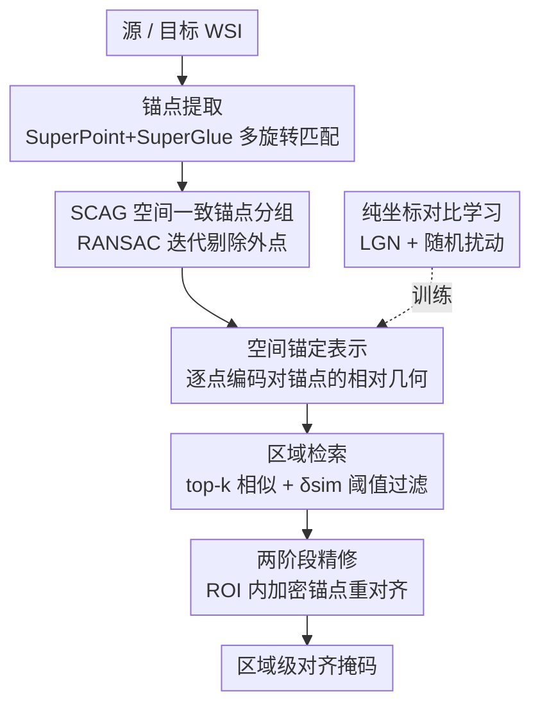

# SAR2Net: Learning Spatially Anchored Representations for Retrieval-Guided Cross-Stain Alignment

**会议**: CVPR 2026  
**论文**: [CVF Open Access](https://openaccess.thecvf.com/content/CVPR2026/html/Shen_SAR2Net_Learning_Spatially_Anchored_Representations_for_Retrieval-Guided_Cross-Stain_Alignment_CVPR_2026_paper.html)  
**代码**: https://github.com/Shentl/SAR2Net  
**领域**: 医学图像  
**关键词**: 跨染色对齐, 全切片图像(WSI), 病理配准, 特征检索, 空间锚定表示

## 一句话总结
SAR2Net 把 HE↔IHC 全切片图像（WSI）的跨染色对齐从"估计形变变换"重构为"区域级特征检索"——给每个点学一套只依赖坐标、对锚点相对几何编码的"空间锚定表示"，无需任何全局粗对齐就能在严重组织形变和断裂下完成稳健的区域对应，在自建活检数据集上 mIoU 从最强基线的 0.691 提到 0.899。

## 研究背景与动机
**领域现状**：病理诊断常把同一组织的相邻切片做不同染色——HE 染色显示形态、IHC 染色显示分子表达。要联合解读这两类信息，就得在两张不同染色、千兆像素的 WSI 之间建立空间对应。主流做法把它当成图像配准（registration）：先在低倍下做粗略的仿射/刚性预对齐，再在高倍下做非刚性细化，靠 MI/NCC/NGF 等相似度或 SuperPoint+SuperGlue 这类特征匹配来驱动。

**现有痛点**：所有这些方法——无论是传统多级 pipeline（VALIS、RegWSI）还是直接回归变换参数的网络——都建立在一个共同假设上：**两张切片能先被大致预对齐**。可活检（biopsy）标本里组织常常碎裂成多个互不相连的片段、发生大幅非线性扭曲、甚至多出一块对照组织。作者统计自己的数据约 35% 属于这种情况。一旦初始仿射对齐之后大块组织都对不上，后续的细化或学习模型就失去了可靠的起点，整条 pipeline 直接崩。

**核心矛盾**：配准范式的本质是"先全局后局部"，它依赖一个全局一致的对应关系存在；而真实活检里恰恰是全局对应被破坏、只剩局部小块还保持几何关系。把对齐绑死在全局变换上，就注定在这些最难的样本上失效。

**本文目标**：在不依赖任何粗预对齐的前提下，做到稳健的**区域级**（region-level，诊断解读通常只需区域级就够）跨染色对应，且对组织碎裂、大形变都鲁棒。

**切入角度**：作者的关键观察是——即使整片组织被扭曲、撕裂，一个点相对于它**周围少数几个解剖地标（landmark）的局部几何关系**，在两张相邻切片上仍然大致保持不变。于是不去估计"怎么把 A 变到 B"，而是给每个点学一个编码"它相对周围锚点的相对位置"的描述子；只要这个描述子在两张片子上对同一解剖位置是一致的，对应就能靠检索建立。

**核心 idea**：用"对锚点的相对几何编码"（空间锚定表示）替代"显式形变变换"，把跨染色对齐变成**逐点特征检索**问题。

## 方法详解

### 整体框架
SAR2Net 的输入是一对源/目标 WSI，输出是源切片各区域在目标切片上对应的区域掩码。整条流水线分推理与训练两条线：推理时先用 SuperPoint+SuperGlue 在缩略图上提取成对地标作为**空间锚点**，对每个待对齐窗口用 RANSAC 做空间一致的锚点分组，然后用 SAR2Net 给两张片子上所有点计算"空间锚定表示"，靠特征检索找区域对应，最后做两阶段精修；训练这条线则完全不碰真实图像，只用合成的 2D 坐标做对比学习，让网络学会"点—锚点相对几何"这件事本身。

### 关键设计

**1. 空间锚定表示：把跨染色对齐重构为特征检索**

针对"配准范式依赖全局预对齐、在碎裂大形变下崩盘"这个痛点，SAR2Net 干脆不估计变换，而是给任意查询点 $x\in\mathbb{R}^2$ 学一个只依赖它与一组锚点 $A=\{a_i\}_{i=1}^K$ 相对几何的描述子。具体做法是先算相对位置 $r_i = x - a_i$，把它和锚点自身坐标拼成 4 维位置描述子 $p_i=[r_i, a_i]\in\mathbb{R}^4$，过一个 MLP $\phi_\theta$ 得到每个锚点视角下的嵌入 $h_i=\phi_\theta(p_i)\in\mathbb{R}^{256}$。然后用一个门控注意力把多个锚点的视角聚合成该点的最终表示：

$$f(x, A) = \sum_{i=1}^{K} \alpha_i h_i,\quad \alpha_i = \frac{\exp\{W(\tanh(Vh_i)\odot\mathrm{sigm}(Uh_i))\}}{\sum_{j=1}^{K}\exp\{W(\tanh(Vh_j)\odot\mathrm{sigm}(Uh_j))\}}$$

这种聚合让靠近查询点的锚点贡献细粒度的局部变化、远处的锚点提供稳定的全局约束。之所以有效，是因为相对几何在相邻切片间天然比绝对像素外观更稳定：即便组织被整体平移、旋转、撕开，一个点"夹在哪几个地标之间、离它们多远"基本不变。于是同一解剖位置在两张片子上会得到相近的 $f$，对应就退化为"在目标片里检索最相似的源点"，绕开了所有需要全局起点的环节。

**2. 纯合成坐标的对比学习与局部几何负采样(LGN)**

要让 $f$ 真的只编码几何、不被染色外观干扰，作者**完全不用真实图像训练**，而是直接在 2D 坐标空间做对比学习。每个迭代随机采 $K+1$ 个点，$K$ 个当锚点、剩一个当查询 $x$；对整组施加一个刚性变换 $T(\cdot)$ 得到正样本对 $((x,A),(T(x),T(A)))$——它表示同一空间结构在不同摆放下应当对齐；负样本则在同一锚点集下重采满足 $\|x^-_j - T(x)\| > \delta_{neg}$ 的查询点，保证几何上足够分离，用 InfoNCE（$\tau=0.3$）拉近正、推开负。

光这样还不够：当查询点离某个锚点非常近时，网络容易偷懒，只盯着"我贴着某个锚点"这一点，而忽略整体锚点几何。为此作者设计了**局部几何感知负采样（LGN）**：把最近的锚点当参考，用它的若干邻居锚点围出一个局部凸包，然后在凸包的**对侧、与参考距离相近**的位置对称地采负样本。这样负样本和正样本"离参考锚点一样近"，模型就没法靠"是否贴着锚点"来区分，被逼着去分辨凸包内外这种真正的局部几何差异。论文可视化（Fig.3）显示：不加 LGN 时相似度图在参考锚点和其它锚点周围都亮成一片（只学到"靠近某锚点"）；加了 LGN 后高相似度区被约束在凸包内、其它锚点周围的虚假响应也被压下去。训练时约 10% 的查询点采在锚点附近专门触发 LGN。

**3. 随机扰动：逼模型从刚性匹配走向形变鲁棒**

前面的对比学习只用刚性变换造正样本，模型有过拟合到"刚性匹配"的风险——而真实组织切片是非线性形变的。作者的解法很轻量：给所有采样坐标加一个均匀随机扰动 $\epsilon\sim U(-\sigma,\sigma)$（实现里 $\sigma=5$），模拟切片中常见的细微非线性变形。它的作用在消融里被证明是**三个组件里最关键的一个**：不加扰动时模型的相似度图会出现明显的同心环干扰、高亮区塌缩成围绕"查询—锚点固定距离"的窄环，暴露出僵硬的刚性匹配倾向；加了扰动后模型仍能找对位置，但激活变得平滑、空间上更有弹性，更贴合真实形变。一句话：扰动把"几何匹配"从"距离要严格对上"放松成"局部结构对上即可"，这正是非线性形变下泛化的关键。

**4. 检索引导的区域对齐流水线：锚点提取→SCAG分组→检索→两阶段精修**

有了表示，推理端要把它串成一条能处理整片 WSI 的流水线。**锚点提取**：在低分辨率缩略图上跑预训练的 SuperPoint+SuperGlue 取成对地标当锚点；因为这俩不具旋转不变性而切片旋转各异，作者把源图每 15° 旋一次、各自提锚点，选有效对应最多的那个旋转作为主锚点集，再把其它旋转里满足 $\max(\|a^s_j-a^s_i\|,\|a^t_j-a^t_i\|)<\delta_{merge}$ 的锚点对并进来，从而在多区域、大畸变时也能覆盖到不同局部。**空间一致锚点分组(SCAG)**：区域对齐假设"查询与近邻锚点的相对关系局部稳定"，但大形变和组织断裂会打破它——同一窗口里的锚点可能来自不同组织碎片或含误匹配。于是对每个待对齐窗口滑窗取最近的至多 $K$ 个锚点，再用 RANSAC 做迭代几何共识，把共享同一局部变换的锚点聚到一起、逐步剔除外点直到阈值 $\delta_{split}$ 下无有效模型，每个子集成为一个稳定的几何基底。**区域检索**：对窗口内两张片子所有点用同组锚点算表示，对每个目标点取 top-k 最相似源点，若它们集中落在某源窗口掩码内就把该目标点判给这个区域；为防止"目标区在源片里根本没有对应"（组织丢失/碎裂）时 top-k 仍落在附近却整体相似度很低造成误匹配，加一个相似度阈值 $\delta_{sim}=0.7$，只有最大相似度超过它才赋区域标签。**两阶段精修**：首轮已建立可靠的区域级对应，但窗口大、锚点稀，局部还有非线性形变和边界偏移；于是把每个匹配区域当作新 ROI，在其内提取更密的锚点重跑一遍对齐，分层地修正残余误差。

### 损失函数 / 训练策略
训练只用合成 2D 坐标 + InfoNCE 损失（温度 $\tau=0.3$），Adam，学习率 $1\times10^{-4}$，batch size 256，输出维度 $d=256$。每个 batch 内锚点数 $K$ 固定、跨 batch 从 $\{4,\dots,10\}$ 随机；负采样最小间隔 $\delta_{neg}=20$、每样本 $N=500$ 个负查询；坐标扰动 $\sigma=5$。推理时锚点合并 $\delta_{merge}=5$、分裂 $\delta_{split}=10$，滑窗大小 100、步长 50、每窗最多 15 个最近锚点，区域判定 top-5 + $\delta_{sim}=0.7$。

## 实验关键数据

### 主实验
自建活检数据集（西京医院 154 例、370 对 HE–IHC、79 种 IHC 染色），区域级标注。对比两个全自动多级 WSI 配准框架 VALIS 与 RegWSI。

| 方法 | mIoU ↑ | mDice ↑ | aw-IoU ↑ | aw-Dice ↑ |
|------|--------|---------|----------|-----------|
| VALIS | 0.635 | 0.705 | 0.647 | 0.716 |
| RegWSI | 0.691 | 0.786 | 0.699 | 0.794 |
| Ours (single，仅首轮检索) | 0.891 | 0.938 | 0.893 | 0.939 |
| Ours (second，含两阶段精修) | **0.899** | **0.942** | **0.901** | **0.944** |

鲁棒性用成功率 SR（区域 IoU/Dice 超过阈值 $t$ 的比例）衡量：

| 方法 | SR0.75IoU ↑ | SR0.85IoU ↑ | SR0.75Dice ↑ | SR0.85Dice ↑ |
|------|------|------|------|------|
| VALIS | 0.594 | 0.429 | 0.690 | 0.606 |
| RegWSI | 0.545 | 0.324 | 0.740 | 0.574 |
| Ours (single) | 0.899 | 0.768 | 0.971 | 0.910 |
| Ours (second) | **0.939** | **0.812** | **0.974** | **0.946** |

### 消融实验
三个组件：随机扰动(pertu)、局部几何感知负采样(LGN)、两阶段精修(sec)。

| 配置 | mIoU ↑ | mDice ↑ | aw-IoU ↑ | 说明 |
|------|--------|---------|----------|------|
| ✗pertu, ✓LGN, ✗sec | 0.847 | 0.911 | 0.852 | 去掉随机扰动，掉得最多 |
| ✓pertu, ✗LGN, ✗sec | 0.888 | 0.936 | 0.890 | 去掉 LGN |
| ✓pertu, ✓LGN, ✗sec | 0.891 | 0.938 | 0.893 | 单轮完整模型 |
| ✓pertu, ✓LGN, ✓sec | **0.899** | **0.942** | **0.901** | 加两阶段精修 |

### 关键发现
- **随机扰动是最关键的组件**：去掉它 mIoU 从 0.891 掉到 0.847（−0.044），远大于去掉 LGN（−0.003）或精修（+0.008）的幅度。原因是扰动把模型从僵硬的刚性匹配中解放出来、相似度图变得平滑而有弹性，正好对上真实切片的非线性形变。
- **均值指标与面积加权指标极接近是关键卖点**：VALIS/RegWSI 的 aw 指标明显高于均值指标，说明它们只对少数大区域对得好、中小区域大量失配（因为依赖初始全局对齐、偏向大块的全局拟合）；SAR2Net 两者几乎无差，证明它对不同尺寸区域都一致地对得准，具备"尺寸鲁棒性"。
- **两阶段精修的增益集中在高阈值区**（IoU 0.7–0.9、Dice 0.8–0.9）：首轮检索建立强全局对应、二轮在 ROI 内修正细尺度形变和边界偏移，正好把"差不多对上"的区域推进到"高质量对上"。

## 亮点与洞察
- **把配准换成检索的范式转换很巧**：配准必须有全局起点，检索只需逐点比相似度，天然绕开了"碎裂/大形变下没有可靠预对齐"这个死结——这是本文能在最难样本上不崩的根本原因。
- **纯坐标合成训练，零真实标注**：网络只学"点—锚点相对几何"，不碰染色外观，于是训练完全靠模拟坐标生成，既规避了跨染色外观差异的干扰，又省掉了昂贵的配准标注；这个"把几何先验从图像里剥离出来单独学"的思路可迁移到任何需要形变不变描述子的对应任务。
- **LGN 的负样本设计点睛**：在凸包对侧、等距离处采负样本，精准堵住"只学贴近锚点"的捷径——这种"用几何约束构造 hard negative 来逼模型学真正想要的不变量"的技巧，在对比学习里很有借鉴价值。
- **门控注意力聚合天然实现"近细远粗"**：靠数据驱动地让近锚点管局部、远锚点管全局，不需要手工设计多尺度结构。

## 局限与展望
- **只做到区域级对齐**：标注与评测都在 region-level，对需要像素/细胞级精确对应的下游（如单细胞配对分析）可能不够；作者以"诊断解读通常区域级足够"为由回避了这一点。
- **强依赖 SuperPoint+SuperGlue 提锚点**：锚点是整条流水线的几何基石，若缩略图上地标提取失败或成对匹配稀疏（极端染色差异、严重组织缺失），后续 SCAG 与检索都会受连累；多旋转穷举也带来额外计算。
- **评测面偏窄**：只对比了 VALIS、RegWSI 两个基线，且全在单一自建数据集上，缺与基于深度学习的变换回归方法（如 Wodzinski、Roy 等）以及公开 WSI 配准基准的直接比较，泛化性证据有限。
- **超参数较多**（$\delta_{neg},\delta_{merge},\delta_{split},\delta_{sim}$、窗口/步长、旋转步长等）且多为经验设定，跨数据集是否稳定未充分验证。

## 相关工作与启发
- **vs 传统多级配准 (VALIS, RegWSI)**：它们走"特征/强度驱动的刚性初始化 + 非刚性细化"，本质依赖全局预对齐；本文不估变换、用检索建对应，因此在全局对齐失效的碎裂大形变样本上优势巨大（mIoU 0.899 vs 0.691），且对区域尺寸更鲁棒。
- **vs 直接回归变换参数的方法 (Wodzinski 用 ResNet 估仿射、Roy 用 FCN 生成多尺度形变场 + CycleGAN 合成 IHC)**：这类方法仍假设切片能被大致预对齐，本文从根上去掉了这个假设；不过本文未与它们做直接定量比较，是证据上的缺口。
- **vs SuperPoint/SuperGlue 关键点匹配**：本文不是用它们直接做最终对应，而是把它们当成低分辨率下提取锚点（地标）的工具，再在锚点之上学形变不变的空间锚定表示——把"稀疏关键点匹配"升级成"稠密区域检索"。

## 评分
- 新颖性: ⭐⭐⭐⭐⭐ 把跨染色对齐从配准重构为基于空间锚定表示的特征检索，是一个干净且切中痛点的范式转换。
- 实验充分度: ⭐⭐⭐ 主结果和消融都到位、有成功率分布分析，但基线只两个、单数据集、缺与深度配准法的直接对比。
- 写作质量: ⭐⭐⭐⭐ 动机—方法—实验逻辑清晰，图示（相似度图/成功率曲线）有效支撑论点。
- 价值: ⭐⭐⭐⭐ 解决了活检 WSI 跨染色对齐的真实硬骨头（无预对齐、碎裂大形变），且训练零标注、代码开源，实用价值高。

<!-- RELATED:START -->

## 相关论文

- [\[CVPR 2026\] Learning Generalizable 3D Medical Image Representations from Mask-Guided Self-Supervision](learning_generalizable_3d_medical_image_representations_from_mask-guided_self-su.md)
- [\[CVPR 2026\] Forging a Dynamic Memory: Retrieval-Guided Continual Learning for Generalist Medical Foundation Models](forging_a_dynamic_memory_retrieval-guided_continual_learning_for_generalist_medi.md)
- [\[CVPR 2026\] Interpretable Cross-Domain Few-Shot Learning with Rectified Target-Domain Local Alignment](interpretable_cross-domain_few-shot_learning_with_rectified_target-domain_local_.md)
- [\[CVPR 2026\] Cross-Modal Guided Visual Synthesis for Data-Efficient Multimodal Depression Recognition](cross-modal_guided_visual_synthesis_for_data-efficient_multimodal_depression_rec.md)
- [\[CVPR 2026\] TAlignDiff: Automatic Tooth Alignment assisted by Diffusion-based Transformation Learning](taligndiff_automatic_tooth_alignment_assisted_by_diffusion-based_transformation_.md)

<!-- RELATED:END -->
