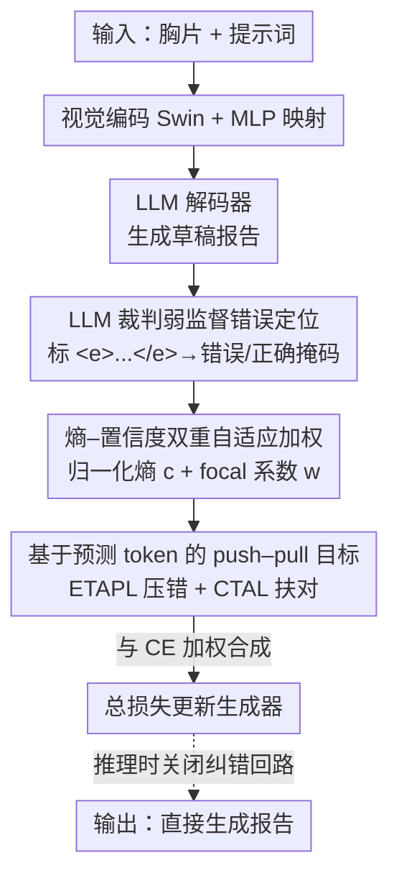

# SAT-RRG: LLM-Guided Self-Adaptive Training for Radiology Report Generation with Token-Level Push–Pull Optimization

**会议**: CVPR 2026  
**论文**: [CVF Open Access](https://openaccess.thecvf.com/content/CVPR2026/html/Liu_SAT-RRG_LLM-Guided_Self-Adaptive_Training_for_Radiology_Report_Generation_with_Token-Level_CVPR_2026_paper.html)  
**代码**: 无  
**领域**: 医学图像  
**关键词**: 放射报告生成, token 级监督, push–pull 优化, LLM 弱监督, 自适应训练

## 一句话总结
SAT-RRG 用一个冻结的 LLM 当"裁判"逐 token 标出生成报告里的语义错误，再用一对"推-拉"损失（压低错词、强化对词）配合熵-置信度自适应加权，把交叉熵训练改造成能自我纠错的过程，在 MIMIC-CXR 与 IU-Xray 上同时刷高语言指标和临床指标，且推理零额外开销。

## 研究背景与动机
**领域现状**：放射报告生成（RRG）目前主流是 encoder–decoder 或视觉特征 + LLM 解码器（如 R2GenGPT、Bootstrapping），用交叉熵（CE）逐 token 训练，能产出流畅的报告文本。

**现有痛点**：这些模型常常"读起来通顺，但临床上错了"——漏掉关键发现、把"无积液"写成"有积液"、出现局部前后矛盾。根因在 CE 本身：它只抬高 ground-truth token $y^*$ 的概率，**不直接压低模型当前选错的那个 token $\hat{y}$**，而且对所有位置一视同仁，导致"该重点纠正的地方"没有被优先对待。

**核心矛盾**：报告里真正致命的语义错误是**稀疏**的（实测仅占约 12.5% 的 token），但 CE 把梯度均摊到每个位置，既不知道哪里错、也没有"把错的压下去"的机制。已有的 token 级反馈方法（强化学习 SCoRe/Reflexion、对比目标、事后纠错）又依赖人工奖励、额外标注或独立纠错网络，在标注昂贵的医学场景里难以扩展。

**本文目标**：在不引入推理开销、不需要人工 token 标注的前提下，让模型在训练时能**定位**自己报告里的语义冲突，并**优先、用力**地纠正这些稀疏关键位置。

**切入角度**：作者发现一个冻结的 LLM 已经具备足够的语义判断力，可以对比"生成报告"和"参考报告"、把意义被改变的片段标出来——这只是**弱监督触发信号**，LLM 本身不是贡献。把这种粗粒度的文本分歧转成可微的、token 级的梯度调制，就能把"自我检查"嵌进训练循环。

**核心 idea**：用"LLM 标错 → push–pull 损失"取代纯 CE——错词被显式推低概率、对词被强化，强度由熵和置信度自适应决定，让梯度精准流向临床上要命的 token。

## 方法详解

### 整体框架
SAT-RRG 在标准"视觉编码 + LLM 解码"的报告生成器之上，叠加一个**训练期才启用**的自我纠错回路。给定胸片 $X_v$，Swin Transformer 提取视觉特征 $Z_v=\text{Swin}(X_v)$，经 MLP 视觉映射器投到 LLM 词嵌入空间得到 $H_v$，再与提示词 $P$、参考报告拼接喂给 LLaMA3-3B 解码器，在 CE 下生成报告。训练时，同一个（冻结的）LLM 被再次调用，对比草稿与参考报告，用 `<e>...</e>` 标签把语义冲突片段框出来，得到稀疏的错误/正确 token 掩码；掩码配合熵-置信度权重，驱动 ETAPL（压错）和 CTAL（扶对）这对 push–pull 损失，再与 CE 加权合成最终目标更新生成器。**推理时整条纠错回路关闭**，只用图像 + 系统提示直接出报告，不再调用任何 LLM 裁判，因此零额外推理开销。

### 关键设计

**1. LLM 裁判弱监督的错误 span 定位：把"哪里错"交给冻结 LLM，而不是人**

痛点是医学场景拿不到逐 token 的错误标注，而 CE 又压根不知道报告哪里语义出错。SAT-RRG 让同一个冻结 LLM 同时看参考报告和模型草稿，用 few-shot 提示让它只标**改变了意义**的片段，套上 `<e>...</e>`，语义等价的换词不标。例如草稿"right lower lobe pneumonia"与参考"no evidence of pneumonia"矛盾、"no pleural effusion"与"small right and moderate left pleural effusion"冲突，都被标为错误；而"no evidence of pneumonia"对"no focal consolidation concerning for pneumonia"虽措辞不同但语义一致，**不标**。由此得到一对互斥的稀疏掩码 $m^{err}_t$、$m^{cor}_t$，把粗粒度文本分歧转成 token 级监督。关键在于"标错"只是弱触发信号、且只在训练用，作者也实验证明对噪声/不完美标签鲁棒。

**2. 熵–置信度双重自适应加权：区分"自信地错"和"含糊地错"**

只知道哪里错还不够——同样是错词，有的是模型**高置信地错**（over-confident mistake），有的是**含糊不定地错**，两者该用不同力度纠正。作者引入两个互补权重共同调制 token 梯度。其一是归一化熵作全局不确定性权重：对温度缩放后的概率 $p_{b,t}$ 算香农熵 $H_{b,t}$ 再除以 $\log V$ 得 $\tilde{H}_{b,t}\in[0,1]$，错词取 $c^{err}_{b,t}=\tilde{H}_{b,t}$、对词取 $c^{cor}_{b,t}=1-\tilde{H}_{b,t}$，于是越不确定的错词罚得越重、越确定的对词强化得越多。其二是 focal 系数作局部置信度调制：设 $p_{b,t}(\hat{y}_{b,t})$ 为模型所选 token 的概率，

$$w^{err}_{b,t}=\big(p_{b,t}(\hat{y}_{b,t})\big)^{\gamma},\qquad w^{cor}_{b,t}=\big(1-p_{b,t}(\hat{y}_{b,t})\big)^{\gamma}.$$

熵刻画**整词表分布层面**的模糊度、focal 反映**对所选 token 的**置信度，二者结合就能把"自信的错误"和"含糊的预测"区分开。所有 $w$、$c$ 都 detach、不回传梯度，只当系数。实测错词集中在中置信区间（0.6–0.75），印证"该重点处理的正是这些拿不准的位置"。

**3. 基于预测 token 的 push–pull 目标（ETAPL + CTAL）：直接压低当前错词、强化当前对词**

CE 的根本缺陷是只盯 $\log p_{b,t}(y^*)$，永远不碰模型自己选的那个 token。SAT-RRG 改为对模型**预测 token 的对数概率** $\log p^{pred}_{b,t}=\log p_{b,t}(\hat{y}_{b,t})$ 下手，形成"推-拉"机制。对错误 token（$m^{err}=1$）用 ETAPL：

$$\ell^{ETAPL}_{b,t}=+\,w^{err}_{b,t}\log p^{pred}_{b,t},$$

正号翻转梯度、把错词概率推下去；对正确 token（$m^{cor}=1$）用 CTAL：$\ell^{CTAL}_{b,t}=-\,w^{cor}_{b,t}\log p^{pred}_{b,t}$，强化可靠预测。梯度符号分析显示：对词 logit 收到 $-(1-p_{b,t}(\hat{y}))$ 的负梯度（概率被拉高），错词收到 $+(1-p_{b,t}(\hat{y}))$ 的正梯度（概率被压低），二者合成一个平滑可微的 push–pull 动力，行为类似对比学习但直接作用在模型自己的预测分布上。两个损失各自在带权掩码上归一化（$E=\sum m^{err}c^{err}$、$C=\sum m^{cor}c^{cor}$）以应对错误稀疏，合成 EA-FE 损失 $\mathcal{L}_{EA\text{-}FE}=\lambda_{err}\mathcal{L}_{ETAPL}+\mathcal{L}_{CTAL}$。

### 一个完整示例
以一句草稿走一遍流程：模型生成 "consolidation is present, no pleural effusion"，参考报告是 "no pleural effusion or consolidation"。冻结 LLM 比对后标注 `<e>consolidation is present</e>, no pleural effusion`。于是 (consolidation, is, present) 被 ETAPL 罚、(no, pleural, effusion) 被 CTAL 扶，力度由熵-focal 权重决定（越自信的错罚越狠）。反传一步后 token 概率更新（论文 Table 1）：consolidation 0.80→0.55、is 0.30→0.15、present 0.61→0.42 被压低；no 0.92→0.96、pleural 0.79→0.86、effusion 0.71→0.83 被抬高——错的被推走、对的被拉稳。

### 损失函数 / 训练策略
最终目标把 EA-FE 与 CE 加权融合，保留似然学习的稳定性：

$$\mathcal{L}_{total}=\alpha\,\mathcal{L}_{CE}+(1-\alpha)\,\mathcal{L}_{EA\text{-}FE}.$$

$\alpha$ 大则 CE 主导、$\alpha$ 小则自我纠错更强。实现用 LLaMA3-3B + Swin、损失平衡系数 $\lambda=0.5$、focal 聚焦参数 $\gamma=1.5$（消融最优），双 A6000 训练、推理用 beam=3。EA-FE 只在训练期生效，推理无任何额外 LLM 调用。

## 实验关键数据

### 主实验
在两个最常用的 RRG 数据集上对比 SOTA（@B 表示 BLEU）：

| 数据集 | 方法 | B-1 | B-4 | METEOR | ROUGE-L |
|--------|------|-----|-----|--------|---------|
| MIMIC-CXR | R2GenGPT (7B) | 0.411 | 0.134 | 0.160 | 0.297 |
| MIMIC-CXR | Bootstrapping (7B) | 0.402 | 0.128 | 0.175 | 0.291 |
| MIMIC-CXR | **本文 (3B)** | **0.428** | **0.143** | 0.167 | **0.303** |
| IU-Xray | EKAGen | 0.497 | 0.190 | 0.210 | 0.399 |
| IU-Xray | **本文 (3B)** | **0.504** | **0.196** | **0.222** | **0.400** |

尽管只用 3B LLM，BLEU 相对 7B 的 R2GenGPT / Bootstrapping 分别提升约 7.5% / 12.5%。临床指标（MIMIC-CXR）同样领先：RadGraph F1 0.205、BERTScore 0.422、RadCliQ 1.150（↓更好）、GREEN 0.310、RaTEScore 0.540，多数为最优或次优。

> 指标说明：RadGraph F1 衡量生成报告与参考在临床实体/关系图上的一致性；RadCliQ 是综合临床质量复合指标（越低越好，内部标准化整合 CheXBert）；RaTEScore / GREEN 为 LLM-based 语义保真度评分。作者因历史计算口径不一致而排除 CheXBert 直接对比。

### 消融实验
损失组件消融（MIMIC-CXR）：

| ETAPL | CTAL | B-4 | ROUGE-L | 说明 |
|:---:|:---:|-----|---------|------|
| ✗ | ✗ | 0.131 | 0.289 | 仅 CE 基线 |
| ✓ | ✗ | 0.136 | 0.294 | 只压错词 |
| ✗ | ✓ | 0.141 | 0.301 | 只扶对词 |
| ✓ | ✓ | **0.143** | **0.303** | 完整 push–pull |

加权分量与 $\gamma$ 消融：

| 配置 | B-4 | METEOR | 说明 |
|------|-----|--------|------|
| Full model | 0.143 | 0.167 | focal + entropy 都用 |
| w/o Focal | 0.139 | 0.165 | 去 focal，强调难 token 能力下降 |
| w/o Entropy | 0.141 | 0.166 | 去熵分支，流畅性/语义一致性下降 |
| $\gamma=1.0$ | 0.139 | 0.165 | 聚焦太弱、低估难样本 |
| $\gamma=1.5$ | **0.143** | **0.167** | 最优折中 |
| $\gamma=2.0$ | 0.141 | 0.166 | 过度聚焦、轻微退化 |

### 关键发现
- ETAPL 与 CTAL 单独都能超基线，**合用最佳**，印证"压错"和"扶对"互补；其中 CTAL 单用收益略大于 ETAPL 单用。
- focal 和熵两个权重缺一不可：去任一都掉点，说明"自信地错"和"含糊地错"确实需要分别处理。
- $\gamma=1.5$ 是聚焦强度与梯度稳定性的甜点；过大反而过罚不确定预测。
- 错词仅占约 12.5% token，且多落在中置信区间——证实把梯度集中到稀疏关键位置的设计前提成立。

## 亮点与洞察
- **把 LLM 降格为"弱监督触发器"**：明确声明 LLM 不是贡献、只在训练期提供标签信号，推理零开销——既蹭到 LLM 的语义判断力，又避开了多次解码/外部纠错器的延迟，工程上很干净。
- **对预测 token 而非 ground-truth token 下手**：push–pull 直接操纵模型"当前相信什么"，这点比 CE 更接近"自我纠错"的本质，是和一众 token 级反馈方法（靠 RL/对比/事后改）拉开差距的关键。
- **熵 × focal 双轴解耦不确定性**：用全局分布熵 + 局部所选 token 置信度两个正交信号，把"过度自信的错"和"含糊的错"分开处理，这套加权可迁移到任何需要"哪里该用力学"的序列生成任务。
- 架构无关、即插即用：只改训练目标不动网络，理论上可挂到任意 RRG 生成器上。

## 局限与展望
- **强依赖冻结 LLM 的标注质量**：错误 span 由 LLM few-shot 标出，虽称对噪声鲁棒，但裁判 LLM 的语义偏差/漏标会直接污染监督信号，论文未深入分析裁判换成更弱模型时的退化曲线。
- **只验证了胸片报告生成**：MIMIC-CXR / IU-Xray 都是胸片，跨器官、跨模态（CT/MRI 报告）能否同样有效未知。
- **训练成本上升**：每个训练样本都要额外跑一次 LLM 裁判做 token 标注，训练吞吐相比纯 CE 会下降（推理虽零开销）。
- **$\alpha$、$\lambda_{err}$、$\gamma$ 多个超参需调**：push–pull 与 CE 的平衡点对结果有影响，迁移到新数据集时可能需重新搜参。

## 相关工作与启发
- **vs CE 基线**: CE 只抬升 ground-truth token 概率、对所有位置同等对待；本文额外压低模型当前错词、并把梯度按错误稀疏性重加权，差别在"会不会主动纠错 + 会不会优先纠关键位"。
- **vs RL / 对比 / 事后纠错（SCoRe、Reflexion、Self-Refine、TAPO）**: 它们靠人工奖励、额外标注、独立纠错器或多遍解码，扩展性差且常增推理延迟；本文是**全可微、训练期**的 token 级梯度调制，无 RL、无外部纠错器、推理无开销。
- **vs 知识增强 RRG（EKAGen、KiUT、METransformer）**: 这些靠注入疾病知识/专家 token 改架构，但缺少 token 级反馈来区分语义对错；本文正是补上"训练期自我语义检查"这一环。

## 评分
- 新颖性: ⭐⭐⭐⭐ 把"LLM 标错 + 对预测 token 的 push–pull + 熵-focal 加权"组合成训练期自纠错框架，角度新颖但各组件源自已有思想。
- 实验充分度: ⭐⭐⭐⭐ 双数据集、NLG + 临床多指标、损失/权重/γ 多维消融较扎实；但仅限胸片、缺跨模态验证。
- 写作质量: ⭐⭐⭐⭐ 动机—公式—示例—梯度分析链条清晰，Table 1 的 token 概率走查很直观。
- 价值: ⭐⭐⭐⭐ 即插即用、推理零开销、3B 超 7B，对落地 RRG 有实际吸引力。

<!-- RELATED:START -->

## 相关论文

- [\[CVPR 2026\] BiOTPrompt: Bidirectional Optimal Transport Guided Prompting for Disease Evolution-aware Radiology Report Generation](biotprompt_bidirectional_optimal_transport_guided_prompting_for_disease_evolutio.md)
- [\[CVPR 2026\] CURE: Curriculum-guided Multi-task Training for Reliable Anatomy Grounded Report Generation](cure_curriculum-guided_multi-task_training_for_reliable_anatomy_grounded_report_.md)
- [\[CVPR 2026\] TIM: Temporal Decoupling with Iterative Mutual-Refinement Model for Longitudinal Radiology Report Generation](tim_temporal_decoupling_with_iterative_mutual-refinement_model_for_longitudinal_.md)
- [\[CVPR 2026\] OraPO: Oracle-educated Reinforcement Learning for Data-efficient and Factual Radiology Report Generation](orapo_oracle-educated_reinforcement_learning_for_data-efficient_and_factual_radi.md)
- [\[AAAI 2026\] SPA: Achieving Consensus in LLM Alignment via Self-Priority Optimization](../../AAAI2026/medical_imaging/spa_achieving_consensus_in_llm_alignment_via_self-priority_optimization.md)

<!-- RELATED:END -->
