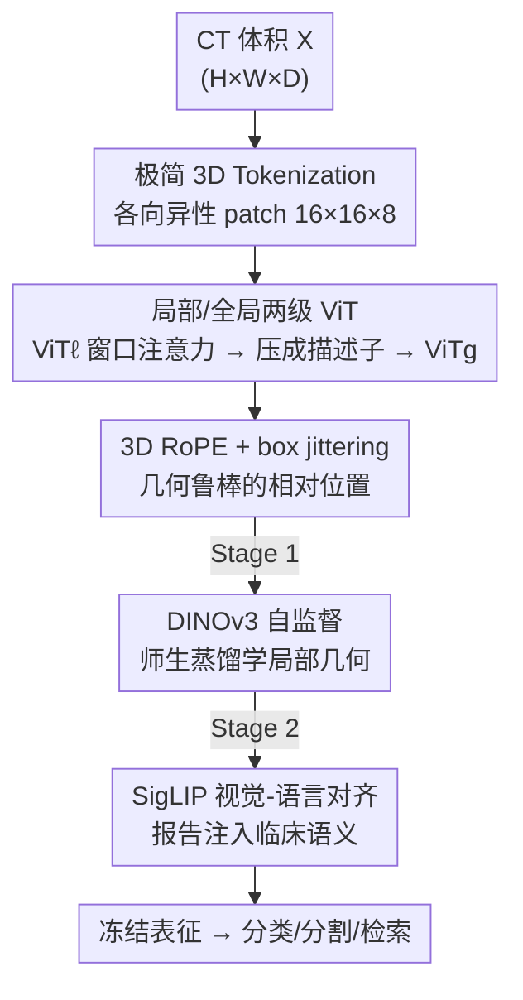

# SPECTRE：面向体积 CT Transformer 的自监督与跨模态预训练

**会议**: CVPR 2026  
**论文**: [CVF Open Access](https://openaccess.thecvf.com/content/CVPR2026/html/Claessens_Scaling_Self-Supervised_and_Cross-Modal_Pretraining_for_Volumetric_CT_Transformers_CVPR_2026_paper.html)  
**代码**: https://github.com/cclaess/SPECTRE  
**领域**: 医学图像 / 3D视觉 / 自监督 / 多模态VLM  
**关键词**: CT 基础模型, 3D Vision Transformer, 自监督, 视觉-语言对齐, 几何感知

## 一句话总结
SPECTRE 是一个**纯 Transformer 的体积 CT 基础模型**：用各向异性 3D tokenization + 局部/全局两级 ViT + 3D RoPE 解决体积 CT「token 立方爆炸、几何各向异性、临床监督弱噪」三大难题，再用「DINOv3 自监督 → SigLIP 视觉-语言对齐」两阶段预训练，**只用公开 CT 数据**就在生物标志物分类、分割、跨模态检索上超过既有 CT 基础模型。

## 研究背景与动机
**领域现状**：在 2D 自然图像与 2D 医学图像上，自监督学习（SSL，如 DINO 系）与视觉-语言对齐（VLA，如 CLIP 系）已能学到可迁移的通用表征，ViT 因其灵活、可扩展的注意力成为主流骨干。

**现有痛点**：这些配方搬到体积 CT 上「开箱即坏」。CT 基础模型要么是单区域、单模态的 VLA（CT-CLIP 只对胸部、Merlin 只对腹部），要么是纯图像 SSL（CT-FM、FMCIB，缺临床语义），要么是依赖密集体素标注的分割模型（VISTA3D、SuPreM）——没有一个能同时兼顾「细粒度 3D 几何 + 广义临床语义 + 可扩展」。

**核心矛盾**：体积 CT 把技术问题往几个根本方向上推：① **token 立方爆炸**——3D patch 的 token 数随分辨率约立方增长，而自注意力对 token 数是二次复杂度，全局注意力/大 batch 这些「规模红利」直接用不了；② **几何异质性**——体素间距各向异性、视野（FOV）可变、扫描仪重建核不同，假设各向同性的位置编码会错误表征跨扫描几何；③ **临床监督弱噪**——报告是自由文本、稀疏标签、研究级标注，且一份报告常列多个共病，使得 CLIP 式对比损失的「负样本」频繁与正样本共享语义，对比信号被削弱。

**本文目标**：把这三件事当作**核心技术问题**而非次要工程约束来解，造一个可扩展、可泛化的 3D CT 基础模型。

**切入角度**：尽量贴近朴素 ViT，只引入「为 CT 量身定做」的最小必要改动——几何感知的 tokenization、3D RoPE、两级注意力，再叠加经过 3D 适配的 SSL + VLA 预训练。

**核心 idea**：用「局部 ViT 抓细粒度几何 + 全局 ViT 抓整扫描语义」的两级架构压住 token 复杂度，并用「先 SSL 打几何底子、再 VLA 注入临床语义」的两阶段预训练，把强 3D 细节与广义临床理解装进同一个 backbone。

## 方法详解

### 整体框架
SPECTRE 的输入是一个体积 CT $X \in \mathbb{R}^{H \times W \times D}$（可选配套放射报告），输出是任务无关的体积表征，可冻结后做生物标志物分类、分割、文本-图像检索。整体管线分两条主线：**架构侧**用「极简 3D tokenization → 局部窗口注意力 ViTℓ → 把每个窗口压成一个描述子 → 全局注意力 ViTg」逐级聚合，把整扫描的注意力变得可计算；**预训练侧**先在 ViTℓ 上跑 DINOv3 式自监督学几何感知的局部特征（Stage 1），再用整模型 + Qwen3 文本编码器跑 SigLIP 视觉-语言对齐注入临床语义（Stage 2）。

### 关键设计

**1. 极简各向异性 3D Tokenization：让 token 编码体素几何而非盲目立方膨胀**

朴素地把 3D 体积切成各向同性 patch，会让 token 数随分辨率立方增长，还会无视 CT「层间体素间距通常约为面内的两倍」这一物理事实。SPECTRE 把每个 patch 取成 $H_p \times W_p \times D_p = 16 \times 16 \times 8$ 体素——**深度方向只取面内的一半**，正好匹配各向异性体素间距，让一个 patch 在物理空间里近似各向同性。嵌入维度 $d=1080$，对应压缩因子 $\frac{2048}{1080} \approx 1.896$。对一个典型 $128\times128\times64$ 的 crop，这样只产生 512 个 token——恰好等于一张 $256\times256$ 图按 $16\times16$ patch 的 token 数。这一步把「3D 的 token 预算」拉回到「2D 可承受」的量级，是后续所有注意力可行的前提。

**2. 局部 / 全局两级注意力：用窗口描述子把整扫描注意力从立方拍回线性**

整扫描直接做全局自注意力在 3D 下不可行。SPECTRE 把 token 网格切成 $G$ 个窗口（每个对应一个 3D crop，含 $m$ 个 token），**局部编码器 ViTℓ 只在窗口内做注意力**，每个窗口前置一个可学习的 `[cls]` 令牌 $c_w$ 汇总窗口级上下文。整扫描的逐层代价 $\text{Cost} = G \cdot O(m^2 d)$ 对固定 $m$ 是关于 $G$ 线性的。关键是怎么把窗口「压扁」交给全局：先对窗口内 patch token 取均值 $\bar{t}_w = \frac{1}{m-1}\sum_{i=2}^{m} T^{(\ell)}_{w,i}$，再与 `[cls]` 拼成 $u_w = [c_w \| \bar{t}_w] \in \mathbb{R}^{2d}$，线性投回 $d$ 维堆成 $\tilde{U}$，前置整扫描级 `[cls]` 令牌 $c_g$，**全局编码器 ViTg 只在 $G+1$ 个窗口描述子上做完整注意力**。因为 $G \ll m$，全局注意力代价被压得很低，却仍能聚合整扫描语义与长程依赖——这正是「细节交给局部、上下文交给全局」的分工。

**3. 3D RoPE + box jittering：用旋转式相对位置抗住可变体素间距与 FOV**

可学习的绝对位置编码在分辨率、FOV、窗口数变化时会失真。SPECTRE 用 3D 旋转位置编码（RoPE）：不加学习向量，而是按连续轴坐标旋转 query/key，天然保留相对位置且跨分辨率可迁移。约束每个头维度 $d_k \equiv 0 \pmod 6$，给每个轴分配 $L = d_k/6$ 个频率槽；轴角 $\theta^{(a)}_i = 2\pi \langle \tilde{r}^{(a)}_i, p \rangle$（$a \in \{h,w,d\}$）。为进一步抗体素间距/FOV 变化，借鉴 DINOv3 做 **RoPE-box jittering**：对归一化坐标施加全局随机缩放 $s \sim U(0.5, 2.0)$ 再算角度。ViTℓ 与 ViTg 都用 RoPE，保证对局部窗口大小、分辨率、每扫描窗口数都鲁棒。

**4. 两阶段「SSL 打底 → VLA 注入语义」预训练：先学几何、再学临床，化解密集与全局目标的张力**

密集目标（掩码重建）教空间精度、全局对齐目标（对比）教语义一致，二者在 3D 弱噪监督下相互拉扯，硬塞进一个目标里会两败俱伤。SPECTRE 拆成两阶段。**Stage 1（自监督局部表征）**：在 ViTℓ 上跑 DINOv3 师生框架，多 crop 策略采 2 个全局 + 8 个局部视图，联合优化 DINO + iBOT + KoLeo（权重 $1{:}1{:}0.1$，刻意省掉只在十亿级模型才重要的 Gram loss）。其中 iBOT 掩码比例提到 $\rho \sim U(0.2, 0.7)$（高于 DINOv3 的 $U(0.1,0.5)$），因为 3D 每个 token 邻居更多、任务更易；原型数 $K=C=65536$。**Stage 2（全局临床对齐）**：把整扫描切成 $G=36$ 个 $128\times128\times64$ 窗口，整模型编码出 $d=1080$ 特征；文本侧用 Qwen3-0.6B Embedding + LoRA（$r=16,\alpha=64$）编码放射报告，图文都投到共享 512 维空间并 L2 归一化。用 **SigLIP** 而非 CLIP 的 softmax InfoNCE——sigmoid 二元交叉熵更适配临床「一扫描对多描述」的多对多、含噪结构，且对小 batch 不敏感。定义缩放相似度 $\text{sim}(v,t) = \langle v,t\rangle / \tau$，图到文方向损失为：

$$\mathcal{L}_{v \to t} = -\frac{1}{N}\sum_{i=1}^{N}\left[\log\sigma(\text{sim}(\tilde{v}_i, \tilde{t}_i)) + \frac{1}{N-1}\sum_{j \neq i}\log(1 - \sigma(\text{sim}(\tilde{v}_i, \tilde{t}_j)))\right]$$

总损失对称平均 $\mathcal{L}_{\text{SigLIP}} = \frac{1}{2}(\mathcal{L}_{v\to t} + \mathcal{L}_{t\to v})$。为高效算全部图文对相似度，文本嵌入跨设备 shuffle、图像嵌入留本地，从而用上大量负样本而不付出过多通信开销。

## 实验关键数据

### 主实验
全程用「冻结编码器 + 无微调」协议评估表征质量。

**生物标志物分类（6 个基准，kNN on frozen embeddings）**：与 11 个 CT 基础模型比较，SPECTRE 在 6 个里的 **4 个**取得最高（含 LUNA16/DLCS 恶性判别、NSCLC/KiTS/肝转移两年生存预测），整体最优。

**语义分割（Dice %，本文 SEoMT 无重型 decoder）**：

| 数据集 | nnU-Net ResEnc L | Primus-M | SPECTRE |
|--------|------------------|----------|---------|
| KiTS23 | 88.06 | 86.13 | 86.64 |
| LiTS | 81.20 | 79.52 | 80.14 |
| WORD | 85.79 | 83.19 | 83.31 |

SPECTRE 超过所有 Transformer 基础模型（Primus/UNETR/SwinUNETRv2 等），并在不用 decoder-heavy 设计下与卷积 nnU-Net 接近。

**零样本文本→图像检索（CT-RATE 验证集，N=1564）**：

| 方法 | R@5 | R@10 | R@50 | R@100 |
|------|-----|------|------|-------|
| CT-CLIP | 2.9 | 5.0 | 18.0 | 28.8 |
| SPECTRE | **17.5** | **25.5** | **48.9** | **59.9** |
| 随机 | 0.3 | 0.6 | 3.2 | 6.4 |

全报告检索大幅超过 CT-CLIP（R@10 5.0→25.5）。

### 跨报告章节分析（Merlin 测试集，R@1 %）

| 章节 | 方法 | N=32 | N=64 | N=128 |
|------|------|------|------|-------|
| Findings | Merlin | 77.6 | 68.7 | 59.4 |
| Findings | SPECTRE | 55.5 | 43.8 | 33.0 |
| Impressions | Merlin | 38.4 | 27.7 | 19.4 |
| Impressions | SPECTRE | **43.2** | **32.9** | **24.0** |
| 全报告(FR) | SPECTRE | 66.4 | 55.7 | 44.8 |

### 关键发现
- Merlin 在结构化的 Findings 上最强，但在更具解读性的 Impressions 上吃力；SPECTRE **反过来在 Impressions 上最优**，且合并 Findings+Impressions 后进一步提升——作者归因于 SigLIP 预训练中的语言改写与文本增强，使其对报告风格/结构变化更鲁棒。
- 仅用**公开 CT 数据**就达到 SOTA，说明高质量可泛化表征不必依赖私有数据。
- 分割头只做三线性插值上采样，预测平滑且解剖连贯，但会丢高分辨率细节——是已知短板。

## 亮点与洞察
- **各向异性 patch（16×16×8）匹配体素物理几何**：一个看似简单的「深度减半」就让 token 在物理空间近似各向同性，是把 CT 先验「设计进」模型而非指望它默认存在的典范，可迁移到任何各向异性体素模态（如某些 MRI）。
- **窗口 cls + 池化拼接的两级聚合**：把「窗口级摘要（cls）」与「patch 级均值」拼起来再投影，既保住全局上下文又把 token 数从 $m$ 压到 1，是控制 3D 注意力显存的实用 trick。
- **SigLIP 替 CLIP 对临床多对多天然友好**：放射报告里共病共现导致「负样本其实是正样本」，sigmoid 二元项不像 softmax 那样强行把所有非配对项当纯负，正好对上临床数据的噪声结构。
- **两阶段解耦把「教几何」与「教语义」分开**，避免密集与全局目标在弱监督下互相拉扯——这个拆法对其他弱标注 3D 模态有借鉴意义。

## 局限与展望
- **预训练语料偏胸部**：胸部相关任务（肺）表现明显强于腹部，泛化受语料分布偏置影响。
- **依赖临床报告引入噪声与偏置**：报告完整度、术语跨机构差异大，弱监督信号本身不稳。
- **encoder-only 分割输出过于平滑**：优雅高效，但会模糊小/淡病灶，需要更精细的高分辨率恢复路径。⚠️ 作者将多数实现细节（数据管线、超参、硬件）放在 Supplementary，正文未给完整训练规模数字。
- **训练成本高**：基础模型规模训练耗算力大，作者以开源权重缓解重复训练负担。

## 相关工作与启发
- **vs CT-CLIP / Merlin（VLA）**：它们用 CLIP 式对比对齐单区域 CT（胸/腹），SPECTRE 用 SigLIP + 多区域 SSL 打底，跨章节检索更鲁棒、覆盖更广，全报告检索大幅领先 CT-CLIP。
- **vs CT-FM / FMCIB / VoCo（纯 SSL）**：它们只学图像特征、缺临床语义；SPECTRE 在 SSL 之上叠 VLA 注入语义，兼顾结构与临床含义。
- **vs Primus / SwinUNETRv2（3D ViT 骨干）**：同样是体积 Transformer，但 SPECTRE 用各向异性 patch + 3D RoPE box jittering + 两级注意力，并在基础模型规模上预训练，分割超过所有 Transformer 对手。
- **vs VISTA3D / SuPreM（监督分割）**：它们靠密集体素标注、聚焦解剖；SPECTRE 是任务无关 backbone，冻结即可迁移到分类/检索/分割。

## 评分
- 新颖性: ⭐⭐⭐⭐ 单点组件多为已有技术的 3D 适配，但「几何感知 tokenization + 两级注意力 + 两阶段 SSL→VLA」的系统组合针对体积 CT 三大难题，整体新意扎实。
- 实验充分度: ⭐⭐⭐⭐ 覆盖分类/分割/检索三类任务、与 11 个基础模型对比，统一冻结协议公平；但关键训练规模/消融多放在 Supplementary。
- 写作质量: ⭐⭐⭐⭐ 把三大技术难题讲得清晰，方法与动机对应紧密。
- 价值: ⭐⭐⭐⭐⭐ 只用公开数据、全开源的可扩展 3D CT 基础模型，降低医学影像研究门槛，复用价值高。

<!-- RELATED:START -->

## 相关论文

- [\[CVPR 2026\] Diffusion MRI Transformer with a Diffusion Space Rotary Positional Embedding (D-RoPE)](diffusion_mri_transformer_with_a_diffusion_space_rotary_positional_embedding_d-r.md)
- [\[CVPR 2026\] Splat-Based Metal Artifact Reduction in Cone-Beam CT via Compact Attenuation Modeling](splat-based_metal_artifact_reduction_in_cone-beam_ct_via_compact_attenuation_mod.md)
- [\[CVPR 2026\] GraPHFormer: A Multimodal Graph Persistent Homology Transformer for the Analysis of Neuroscience Morphologies](graphformer_a_multimodal_graph_persistent_homology_transformer_for_the_analysis_.md)
- [\[CVPR 2026\] CRFT: Consistent-Recurrent Feature Flow Transformer for Cross-Modal Image Registration](crft_consistent-recurrent_feature_flow_transformer_for_cross-modal_image_registr.md)
- [\[CVPR 2026\] VesMamba: 3D Pulmonary Vessel Segmentation from CT images via Mamba with Structural Perception and Scale-aware Filtering](vesmamba_3d_pulmonary_vessel_segmentation_from_ct_images_via_mamba_with_structur.md)

<!-- RELATED:END -->
