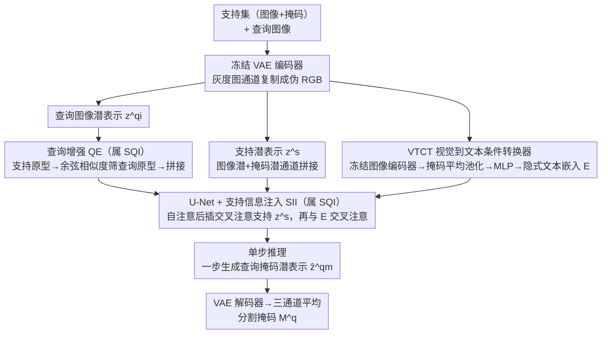

# SD-FSMIS: Adapting Stable Diffusion for Few-Shot Medical Image Segmentation

**会议**: CVPR 2026  
**arXiv**: [2604.03134](https://arxiv.org/abs/2604.03134)  
**代码**: 无  
**领域**: 医学图像分割  
**关键词**: few-shot segmentation, medical imaging, stable diffusion, cross-domain, foundation model

## 一句话总结

提出 SD-FSMIS，一个将预训练 Stable Diffusion 适配到少样本医学图像分割的框架，通过支持-查询交互模块和视觉到文本条件转换器实现高效适配，在跨域场景中表现尤为突出。

## 研究背景与动机

少样本医学图像分割（FSMIS）旨在仅用极少量标注样本就能分割新类别，解决医学影像中数据稀缺和领域迁移的核心挑战。现有方法主要聚焦设计更精巧的匹配网络，如原型网络和注意力机制，但这些从头训练的架构在跨域场景中表现脆弱。

作者提出范式转换：不再设计越来越复杂的任务特定架构，而是利用大规模预训练生成模型（如 Stable Diffusion）中蕴含的丰富视觉先验。扩散模型从海量数据（如 LAION-5B）中学习了丰富的纹理、形状和上下文表示，这些先验对密集预测任务有巨大潜力但在 FSMIS 中尚未被充分探索。

核心问题：如何高效、直接地将 SD 的通用视觉先验适配到 FSMIS 任务？

## 方法详解

### 整体框架

SD-FSMIS 的核心主张是范式转换：少样本医学分割与其从头堆更复杂的匹配网络，不如直接借用 Stable Diffusion 在 LAION-5B 上学到的通用视觉先验。框架复用 SD 的条件生成架构，把支持集和查询集都用冻结 VAE 编码到潜空间（灰度图通道复制成伪 RGB），再让 U-Net 在"由支持集翻译来的文本条件"下，单步生成查询掩码的潜表示、解码回像素。三个设计分别解决：怎么让查询看到支持（SQI，含支持信息注入 SII 与查询增强 QE 两部分）、怎么把视觉线索变成 SD 听得懂的条件（VTCT）、怎么免迭代地出结果（单步推理）。

### 关键设计

**1. 支持-查询交互模块（SQI）：用最小改动让 SD 的自注意力学会少样本匹配**

SD 原生不知道"支持-查询"这回事，硬接一个复杂匹配头又回到老路。SQI 选择最小化改动 U-Net：在标准自注意力之后插入一层额外交叉注意力（支持信息注入 SII），让查询特征以支持特征为 Key 和 Value 去注意，再走原始的文本交叉注意力，整块运算即 $\hat{z}^q = \text{FFN}(\text{CAttn}(\text{CAttn}(\text{SAttn}(z^q), z^s), E))$；并配合查询增强（QE），先用支持集掩码平均池化得前景原型，再算它与查询潜表示的余弦相似度、取相似度超阈值（0.7）的位置平均出查询原型，拼回查询潜表示强化匹配信号。这样既复用了 SD 预训练注意力的表达力，又以最小代价注入了少样本匹配能力。

**2. 视觉到文本条件转换器（VTCT）：把支持图像翻译成 SD "理解的语言"**

SD 的条件接口是文本嵌入，而支持集给的是视觉线索，二者不对齐。VTCT 用冻结图像编码器提取支持图像特征，经掩码平均池化得到类别原型，再用一个可学习 MLP 把原型投射到文本嵌入空间，当作条件喂给扩散模型。消融里"视觉条件 vs 空文本"明显占优，说明这种"视觉转文本样条件"比直接塞空 prompt 携带了多得多的类别引导信息。

**3. 单步推理设计：免迭代扩散，一步出分割掩码**

诊断式分割不需要扩散那种逐步采样的多样性，迭代反而拖慢推理。SD-FSMIS 推理时跳过迭代扩散过程，单步生成查询掩码的潜表示，经 VAE 解码器映射回像素空间、取三通道平均得到最终分割掩码，在保持精度的同时把推理压到一步。

### 损失函数 / 训练策略

用查询掩码潜表示与预测之间的 MSE 损失训练，采用基于 episode 的元学习策略（1-way 1-shot），并用超体素聚类生成伪标签作为训练标注、无需显式人工标注；VAE 权重全程冻结，仅训练少量新增参数。

## 实验关键数据

### 主实验

| 数据集 | 指标 (Dice %) | 本文 | 之前 SOTA (DIFD) | 提升 |
|--------|-------------|------|-----------------|------|
| Abd-MRI Setting 1 | Mean Dice | 83.16 | 84.12 | 接近 |
| Abd-CT Setting 1 | Mean Dice | 83.66 | 80.19 | +3.47 |

### 消融实验

| 配置 | 关键指标 | 说明 |
|------|---------|------|
| 无 SQI | Dice 下降 | 支持-查询交互对适配至关重要 |
| 无 VTCT（null text） | Dice 下降 | 视觉条件比空文本嵌入信息量更大 |
| 无 QE | Dice 下降 | 查询增强提供了有益的原型匹配信号 |

### 关键发现

- 在标准 FSMIS 设置下取得有竞争力的结果
- 在更具挑战性的跨域场景中显著优于 SOTA 方法，展现了出色的泛化能力
- 验证了大规模生成模型的视觉先验对数据高效医学分割的巨大潜力

## 亮点与洞察

- 范式创新：从设计任务特定网络转向适配预训练基础模型，是 FSMIS 领域的重要转变
- 框架设计极简但有效，仅对 SD 做最小修改就实现了 FSMIS 适配
- VTCT 模块将视觉线索翻译为 SD "理解的语言"的思路巧妙
- 跨域泛化能力突出，说明 SD 的通用视觉先验在医学领域确实有价值

## 局限与展望

- 依赖于 SD 对灰度医学图像的适配（通过通道复制），可能不够优雅
- 目前仅在腹部 MRI/CT 数据上验证，需更多器官和模态的验证
- 单步推理虽然高效但可能牺牲了迭代精修的机会

## 相关工作与启发

- 与 DiffewS 类似利用扩散模型做少样本分割，但 DiffewS 面向自然图像，SD-FSMIS 专门适配医学场景
- 对其他需要跨域泛化的密集预测任务有启发价值

## 评分

- 新颖性：⭐⭐⭐⭐ — 首次系统探索 SD 在 FSMIS 中的应用
- 技术深度：⭐⭐⭐⭐ — SQI 和 VTCT 设计合理
- 实验充分度：⭐⭐⭐ — 数据集范围可以更广
- 实用价值：⭐⭐⭐⭐ — 跨域泛化能力有实际应用价值

<!-- RELATED:START -->

## 相关论文

- [\[CVPR 2026\] Focus on Background: Exploring SAM's Potential in Few-shot Medical Image Segmentation with Background-centric Prompting](focus_on_background_exploring_sams_potential_in_few-shot_medical_image_segmentat.md)
- [\[CVPR 2026\] Few-Shot Synthetic Data Generation with Diffusion Models for Downstream Vision Tasks](few-shot_synthetic_data_generation_with_diffusion_models_for_downstream_vision_t.md)
- [\[CVPR 2026\] Universal-to-Specific: Dynamic Knowledge-Guided Multiple Instance Learning for Few-Shot Whole Slide Image Classification](universal-to-specific_dynamic_knowledge-guided_multiple_instance_learning_for_fe.md)
- [\[CVPR 2026\] Interpretable Cross-Domain Few-Shot Learning with Rectified Target-Domain Local Alignment](interpretable_cross-domain_few-shot_learning_with_rectified_target-domain_local_.md)
- [\[CVPR 2025\] Noise-Consistent Siamese-Diffusion for Medical Image Synthesis and Segmentation](../../CVPR2025/medical_imaging/noise-consistent_siamese-diffusion_for_medical_image_synthesis_and_segmentation.md)

<!-- RELATED:END -->
