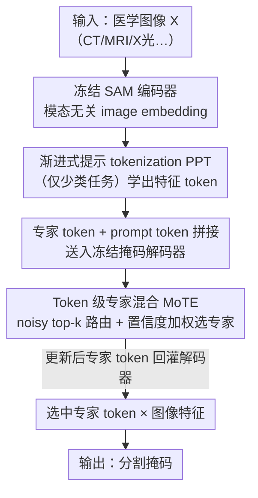

# SegMoTE: Token-Level Mixture of Experts for Medical Image Segmentation

**会议**: CVPR 2026  
**论文**: [CVF Open Access](https://openaccess.thecvf.com/content/CVPR2026/html/Lu_SegMoTE_Token-Level_Mixture_of_Experts_for_Medical_Image_Segmentation_CVPR_2026_paper.html)  
**代码**: 无  
**领域**: 医学图像  
**关键词**: 医学图像分割, SAM 适配, token 级专家混合, 模态自适应, 低标注成本

## 一句话总结
SegMoTE 冻结整个 SAM、只在掩码解码器里塞进一组可学习"专家 token"和一个 token 级 MoE 路由（MoTE），按成像模态动态选专家，再配一个渐进式提示 tokenization（PPT）实现免交互分割；仅训练 17M 参数、用不到现有数据集 1% 规模的 MedSeg-HQ（约 0.15M mask），就在多模态医学分割上达到 SOTA。

## 研究背景与动机
**领域现状**：把 SAM 这类自然图像基础模型迁到医学分割是当前主流，做法是 MedSAM 全参微调、IMIS 微调解码器层、或各种参数高效微调（PEFT），再堆超大数据集（SAM-Med2D 4.6M 图、IMed-361M）。

**现有痛点**：两个瓶颈。其一，**缺模态/任务自适应**——CT、MRI、X 光异质性大，把多模态数据不加区分地灌进 SAM，原始输出 token 在训练中逐渐"同质化"，模态间的判别力被磨平，OOD 泛化差。其二，**无差别堆数据**——为追性能而扩数据集会引入大量监督噪声和冗余，表征被拽向新分布、损害 SAM 原有能力（distribution shift / 负迁移），进步沦为"比谁数据多"而非表征设计。

**核心矛盾**：想要模态特异的判别表征，却用统一的输出 token 去硬扛所有模态；想要泛化，却靠扩数据反而破坏了预训练能力。本质是"用一套表征服务异质模态"和"保住 SAM 原能力"之间的冲突。

**本文目标**：在**几乎不动 SAM、极低标注成本**的前提下，让模型对不同模态/解剖任务做自适应处理，并尽量减少对人工提示的依赖。

**切入角度**：MoE 的"按输入选专家"天然适配"按模态选表征"——既能模态特异，又只加少量参数、保住冻结主干。再把稀疏前景类任务的"提示"也学出来，就能进一步免交互。

**核心 idea**：用 token 级 MoE（MoTE）替代统一输出 token，按模态动态激活专家 token；用渐进式提示 tokenization（PPT）把"人给提示"换成"模型自己学提示"。

## 方法详解

### 整体框架
SegMoTE 在冻结的 SAM 上扩出 token 级专家路由。冻结的 SAM 编码器先抽取模态无关的图像 embedding；对前景-背景清晰的少类数据集（如皮肤镜 ISIC、胸片 SZ-CXR），PPT 模块把潜在特征图转成语义对齐的"特征 token"（多类任务不用 PPT）。这些 token 与一组可学习专家 token、原始 prompt token 拼接，送进掩码解码器的 decoder layer 1/2：每层先做自注意力、再做 token↔image 双向注意力与图像 embedding 交互，然后把专家 token 交给 MoTE 做动态专家选择与 token 更新；更新后的专家 token 回灌解码器，最终只用被选中的强化 token 与图像特征逐点相乘出分割掩码。训练时 SAM 主干全冻，只更新 MoTE（10M）和 PPT（7M）共 17M 参数，损失由分割 Dice 和路由负载均衡损失加权而成。

### 关键设计

**1. 专家 token：给每个模态一支专属 token，替代 SAM 同质化的统一输出 token**

痛点是 SAM 原始 mask 预测只靠少数 output token、面对异质医学模态适配能力有限，训练中还会同质化。SegMoTE 引入一组 $[N\times 256]$ 的可学习专家 token（$N$ 取决于模态数/任务复杂度），与原始 SAM output token $[4\times256]$ 和 prompt token 沿序列维拼接送进解码器。专家 token 先在每个解码层做自注意力，再经双向注意力（token→image 吸收视觉特征、image→token）更新：token→image 阶段它整合图像视觉特征、prompt token 的几何语义、其他 token 的掩码表征，然后交给 MoTE 动态更新权重。最终**只用被选中的那支专家 token**做预测，从而在同一 batch 内对多模态图像做差异化处理——既保留 SAM 统一输出建模能力，又获得模态自适应。

**2. MoTE 混合 token 专家：noisy top-k 路由 + 置信度加权，按模态动态选专家**

光有专家 token 还不够，关键是推理时**为每张图选对那支 token**。MoTE 在 token 级做动态专家选择与融合。给定专家 token $x\in\mathbb{R}^{B\times T\times D}$，路由先算 logits $L=XW_g\in\mathbb{R}^{B\times T\times E}$（$E$ 为专家数）；训练时用 noisy top-k 门控注入噪声防止过早收敛到单一专家：$\tilde{L}=L+(\text{softplus}(XW_n)+\varepsilon)\odot Z,\ Z\sim\mathcal{N}(0,1)$。对每个 token 取 top-k 专家分数 $s_{b,t}$，用其最大 logit 作 token 置信度 $c_{b,t}=\max_j s_{b,t}[j]$、对应索引 $\text{idx}_{b,t}=\arg\max_j s_{b,t}[j]$，再 softmax 得 token 权重 $G(\cdot)_{b,t}$ 作可靠性度量去显式加权表征 $\tilde{z}_{b,t}=G(\cdot)_{b,t}\cdot h^{(\text{idx}_{b,t})}_{b,t}$，放大高置信 token、抑制低置信 token。最终预测只走被强化的路由 token，由确定性路由（$\text{idx}$）和置信加权路由（$G$）共同驱动专家选择与信息聚焦。消融显示不同模态确实学到偏好（CHAOS-T1 多激活 token 0、ISIC 偏 token 2、SZ-CXR 偏 token 1、AMOS-CT 偏 token 3），印证专家学到了判别性的模态-任务表征。

**3. 负载均衡损失：用平方变异系数约束，防专家"过载/闲置"**

token 级路由容易让少数专家被挤爆、其余长期闲置，损害训练稳定与泛化。SegMoTE 定义专家 $e$ 的重要度 $\text{imp}_e=\sum_{b,t}G_{b,t,e}$ 和负载 $\text{load}_e=\sum_{b,t}\mathbb{1}(G_{b,t,e}>0)$，用平方变异系数 $CV^2=\text{std}(x)^2/(\frac{1}{N}\sum_i x_i)^2$ 构造均衡损失 $\mathcal{L}_{balance}=CV^2(\{\text{imp}_e\})+CV^2(\{\text{load}_e\})$。$CV^2$ 越小代表各专家被用得越均匀，从而鼓励均衡利用、提升稳定性与泛化；该项以小权重 $\lambda_{balance}=0.01$ 并入总损失，保证不喧宾夺主、分割任务仍是主目标。

**4. 渐进式提示 tokenization（PPT）：把"人给提示"学成"模型自生提示"，实现免交互分割**

像 ISIC、SZ-CXR 这类只有背景 + 单一目标的稀疏类任务，传统交互分割仍要用户点/框，操作负担大。PPT 把 mask 和 text prompt 当作前景信息的具体载体，**随机采样** mask/text prompt，用可学习 query $Q$ 经多头注意力去关注归一化后的图像特征，让特征 token 在训练中逐步学会区分前景/背景、捕捉关键分布线索；注意力增强表征再经 MLP 投影 + 残差融合，生成"特征条件化"的 prompt token，作为与模态/解剖结构上下文对齐的自适应提示，从而在推理时**无需任何人工干预**完成分割。作者明确把 PPT 限定在二分类（前景-背景清晰）任务，因为多类分割存在类间干扰会让 prompt token 映射变难。

### 损失函数 / 训练策略
分割用 Dice 损失 $\mathcal{L}_{seg}(y^E,y)=1-\frac{2\sum_i y^E_i y_i}{\sum_i y^E_i+\sum_i y_i}$，总损失把它和负载均衡损失加权：$\mathcal{L}_{total}=\mathcal{L}_{seg}+\lambda_{balance}\cdot\mathcal{L}_{balance}$，$\lambda_{balance}=0.01$。训练数据为自建 MedSeg-HQ（整合 12 个公开数据集、约 154,569 个高质量 mask、6 种模态 100+ 语义类，经 5 位专家按清晰度/对比度/熵/前景比/连通区域质检筛选）。图像统一缩放到 512×512、9:1 划分且病人级独立，Adam（lr 1e-4，第 7/12 epoch 减半），8×RTX 4090、总 batch 10，默认 SAM-Base、主干全冻。

## 实验关键数据

### 主实验
OOD 零样本分割（box 提示，Dice，节选）：

| 数据集 | 类别 | SAM | SAM-Med2D | IMIS | 本文 |
|--------|------|-----|-----------|------|------|
| ISLES | 缺血性卒中病灶 | 55.00 | 67.93 | 71.24 | **77.30** |
| SegThor | 平均（4 类） | 76.55 | 79.06 | 80.52 | **83.39** |
| TotalSeg(MRI) | 平均（12 腹部器官） | 67.11 | 66.72 | 70.62 | **71.48** |

二分类 ISLES 较次优提升约 7%，多类 SegThor / TotalSeg(MRI) 分别约 +1% / +2%；整体比第二名提升 1%~6%。

解冻解码器联合训练（box 提示，Dice，节选）：

| 数据集 | SAM | SAM-Med2D | IMIS | 本文 |
|--------|-----|-----------|------|------|
| ISIC2018 | 86.15 | 88.32 | 88.93 | **93.02** |
| SZ-CXR | 86.72 | 88.72 | 92.03 | **95.04** |
| CHAOS(T1) | 82.67 | 86.14 | 86.92 | **89.00** |
| BTCV | 77.82 | 80.52 | 82.24 | **84.51** |

解冻后二分类任务比基线提升 3%~7%。

### 消融实验
参数规模与专家配置：

| 配置 | 关键指标 | 说明 |
|------|---------|------|
| SAM(Large) | 308M 可学习 | 全量训练，资源重 |
| MedSAM(Base) | 93M | 全解码器微调 |
| IMIS(Base) | 29M | 微调解码器 |
| **SegMoTE(Base)** | **17M（MoTE 10M + PPT 7M）** | 仅约 SAM 总参 1.4%，性能反超 |
| 专家数 N:M=4:1 | OOD 最优 | 4 模态时最佳；N=12 显著掉点（专家数 > 模态数） |
| PPT，Q=2 | ISIC2018 87.68 | 默认配置，Q=2 足够 |
| w/o PPT | ISIC2018 84.87 / ISLES 59.00 | 去 PPT，OOD ISLES 掉约 6% |

### 关键发现
- **少而精胜过多而杂**：仅 0.15M mask（不足现有数据集 1%）训出的 SegMoTE，在 in/out-domain 都超过用超大混合数据训练的基线，验证"数据质量 + 表征设计 > 盲目扩数据"。
- **专家数要匹配模态数**：N:M=4:1 最优，专家数远超模态数（N=12）反而退化——四个专家足以覆盖核心特征，多出来的模态（如 MR FLAIR）也能被吸收。
- **专家学到模态特异路由**：不同数据集稳定偏好不同 token，热力图显示稀疏、离散的"责任区域"，具备可解释性。
- **PPT 在 OOD 上收益最大**：ISLES（OOD 二分类）去掉 PPT 掉约 6%，说明用图像特征自生提示对跨域泛化尤其有效；$Q=2$ 即够用。

## 亮点与洞察
- **"冻主干 + 换 token"是低成本适配 SAM 的优雅范式**：不碰编码器、不全量微调解码器，只把"统一输出 token"升级成"专家 token + MoE 路由"，就拿到模态自适应，还保住 SAM 原能力，17M 参数打赢百兆级方法。
- **把 MoE 的"按输入选专家"对齐到"按模态选表征"**：这个映射很自然，且 noisy top-k + 置信加权让路由既探索又稳定，专家偏好可视化让"黑盒路由"变得可解释。
- **PPT 把"提示"也学出来**：随机采样 mask/text 当弱前景先验、用可学习 query 学到自适应 prompt token，实现二分类任务的免交互推理，思路可迁移到其他"想去掉人工提示"的交互式分割。
- **负载均衡用 $CV^2$ 直接约束 importance 与 load 两条统计量**，简单有效地避免专家坍缩。

## 局限与展望
- **PPT 仅适用二分类**：作者承认多类分割存在类间干扰、prompt token 映射变难，PPT 只在前景-背景清晰任务有效，多器官场景还得靠交互提示。
- **专家数需按模态预设**：N 与模态数强相关（N=12 退化），换数据集/模态组合可能要重新调专家配置，缺自动确定 N 的机制。
- **仅 2D、SAM-Base**：实验主要在 2D 切片、SAM-Base 上，作者展望但未验证 3D 数据与医学视频。
- **依赖自建 MedSeg-HQ 的质检**：高性能部分归功于专家质检筛出的高质量 mask，该质量评估系统（清晰度/对比度/熵等 5 维 + 5 专家交叉验证）成本不低，复现门槛偏高。

## 相关工作与启发
- **vs MedSAM / IMIS（全/部分微调 SAM）**: 它们靠全参或解码器微调 + 扩数据，参数大、易分布漂移损害原能力；本文冻结主干、只加 17M token 级模块，用 1% 数据反超，差别在"改表征 vs 堆数据"。
- **vs 既有医学 MoE（MoSE、M4oE、PAMoE、ConvLoRA）**: 多数仍用统一输出表征、未直面模态/任务差异；本文做 **token 级模态感知路由**，把输入分配到专属专家路径，表征更判别。
- **vs 传统交互式分割（点/框提示）**: 依赖用户逐张给提示、操作负担重；本文 PPT 在二分类任务自生提示、免交互推理，且 OOD 泛化更好。

## 评分
- 新颖性: ⭐⭐⭐⭐ token 级专家 token + MoE 路由适配 SAM、并把提示也学出来，组合新颖；MoE 与 SAM 适配各自非首创。
- 实验充分度: ⭐⭐⭐⭐ in/out-domain 多数据集、冻结/解冻两种设置、专家数/Q/PPT 多维消融较全；3D 与视频缺验证。
- 写作质量: ⭐⭐⭐⭐ 动机—模块—公式—可视化链条清晰，专家路由热力图和偏好统计有说服力。
- 价值: ⭐⭐⭐⭐ 极低标注/参数成本适配 SAM 到多模态医学分割，对落地很有吸引力。

<!-- RELATED:START -->

## 相关论文

- [\[CVPR 2026\] Divide, Conquer, and Aggregate: Asymmetric Experts for Class-Imbalanced Semi-Supervised Medical Image Segmentation](divide_conquer_and_aggregate_asymmetric_experts_for_class-imbalanced_semi-superv.md)
- [\[CVPR 2026\] From Infusion to Assimilation Distillation for Medical Image Segmentation](from_infusion_to_assimilation_distillation_for_medical_image_segmentation.md)
- [\[NeurIPS 2025\] Mamba Goes HoME: Hierarchical Soft Mixture-of-Experts for 3D Medical Image Segmentation](../../NeurIPS2025/medical_imaging/mamba_goes_home_hierarchical_soft_mixture-of-experts_for_3d_medical_image_segmen.md)
- [\[CVPR 2026\] SAT-RRG: LLM-Guided Self-Adaptive Training for Radiology Report Generation with Token-Level Push–Pull Optimization](sat-rrg_llm-guided_self-adaptive_training_for_radiology_report_generation_with_t.md)
- [\[CVPR 2026\] PMRNet: Physics-informed Multi-scale Refinement Network for Medical Image Segmentation](pmrnet_physics-informed_multi-scale_refinement_network_for_medical_image_segment.md)

<!-- RELATED:END -->
