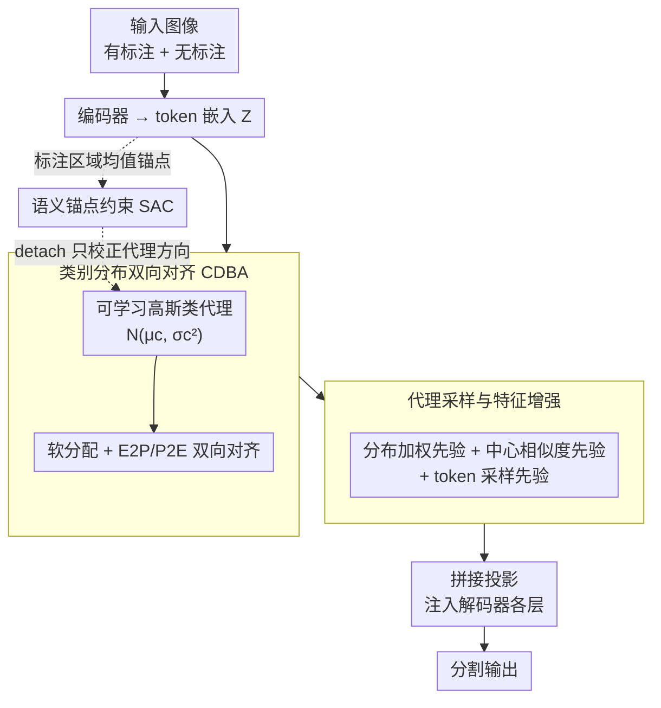

# Semantic Class Distribution Learning for Debiasing Semi-Supervised Medical Image Segmentation

**会议**: CVPR 2026  
**arXiv**: [2603.05202](https://arxiv.org/abs/2603.05202)  
**代码**: [GitHub](https://github.com/Zyh55555/SCDL)  
**领域**: 医学图像  
**关键词**: 半监督分割、类别不平衡、分布学习、代理分布、语义锚点

## 一句话总结

本文提出 SCDL（Semantic Class Distribution Learning），一个即插即用模块，通过类别分布双向对齐（CDBA）学习结构化的类条件特征分布并与可学习类代理双向对齐，结合语义锚点约束（SAC）利用标注数据引导代理学习正确语义，缓解了半监督医学图像分割中的监督偏差和特征表示偏差，在尾类器官上取得了显著提升。

## 研究背景与动机

1. **领域现状**：半监督医学图像分割（SSMIS）利用少量标注数据+大量无标注数据进行训练，主流方法包括一致性正则化、对比学习和伪标签等。然而，医学图像数据集普遍存在严重的类别不平衡——大器官（如肝脏）占据大量像素，小器官（如食管、肾上腺）像素极少。

2. **现有痛点**：类别不平衡与半监督机制的结合导致两个层面的偏差。（1）监督信号偏差：大类占主导的像素级梯度、伪标签的自增强效应都使监督偏向头部类。（2）特征表示偏差：现有方法（重加权、输出校准）仅在损失层或输出层操作，缺乏对类条件特征分布的直接约束，导致头部类特征紧凑而尾部类发散，特征空间中尾类被头类"吞噬"。

3. **核心矛盾**：无标注数据主要用于局部一致性正则化，很少被用来显式纠正类条件特征分布的倾斜——因此无标注数据并未帮助少数类建立良好的特征表示，不平衡持续存在。

4. **本文目标**：如何在特征空间层面直接缓解类别不平衡导致的表示偏差，而非仅在损失或输出层面（治标不治本）。

5. **切入角度**：为每个语义类学习一个代理分布（高斯分布），通过双向对齐约束使嵌入靠近对应代理、代理远离非目标嵌入，同时用标注区域的语义锚点为代理提供正确的语义监督。

6. **核心 idea**：通过学习类条件代理分布并双向对齐，在特征空间中直接重塑类别分布结构，使少数类也能获得稳定的表示学习信号。

## 方法详解

### 整体框架

SCDL 是一个挂在现有半监督分割网络上的即插即用模块，整条链路围绕「在特征空间里给每个类建一份代理分布」展开：编码器输出 token 嵌入后，CDBA 为每个语义类维护一个可学习的高斯代理分布，并把嵌入与代理双向对齐；接着从代理分布中采样、构造结构化先验注入解码器各层，让尾类也能拿到稳定的表示；与此同时，SAC 从标注区域抽取语义锚点，为这些随机初始化的代理校正出正确的语义方向。整套机制不改基线架构，只在嵌入空间额外加一组约束。

### 关键设计

**1. 类别分布双向对齐（CDBA）：让特征空间里的少数类不再被头部类吞噬**

现有方法大多只在损失层或输出层做重加权，从没碰过类条件特征分布，结果是头类特征紧凑、尾类发散，尾类在特征空间里被头类"吞噬"。CDBA 改在嵌入空间直接动手：为每个语义类 $c$ 维护一个可学习的高斯代理分布 $p(u|c) = \mathcal{N}(\mu_c, \text{diag}(\sigma_c^2))$，再算每个 token 嵌入对各代理的软分配 $P(c|z_{i,l}) = \text{softmax}_c(\cos(z_{i,l}, \mu_c))$。对齐是双向的——Embedding-to-Proxy 把嵌入往它软分配到的代理拉，Proxy-to-Embedding 则让每个代理学会区分属于和不属于该类的嵌入：

$$\mathcal{L}_{E2P} = \sum P(c|z) \cdot [1 - \cos(z, \mu_c)], \qquad \mathcal{L}_{P2E} = \frac{1}{C}\sum \exp\big(-(\mathcal{E}_c^+ - \mathcal{E}_c^-)\big).$$

之所以能纠偏，关键全在那个软分配：每个嵌入都按权重参与所有代理的梯度更新，所以即便食管这种像素极少的尾类，它的代理也能持续收到学习信号，不会因为频率低就被淹没掉。E2P 给代理吸引力、P2E 给区分力，两股力合起来才把各类分布在特征空间里重新撑开。

**2. 代理采样与特征增强：把学到的分布变成能注入解码器的语义先验**

光把分布学出来还不够，得让它真正帮到分割解码。这一步从代理分布里采样，构造三种互补先验喂给解码器：分布加权先验 $\mathbf{r}^{dist}$ 从代理分布采 $S$ 个样本，用嵌入与采样点的平均余弦相似度作权重去加权组合代理均值，因此保留了方差、带有不确定性信息；中心相似度先验 $\mathbf{r}^{center}$ 直接用嵌入与各代理均值的余弦相似度加权，提供互补的确定性信号；token 采样先验 $\mathbf{z}^{sam}$ 则对每个 token 做局部扰动采样以增强鲁棒性。三者拼接后过一个轻量投影层注入解码器各阶段。分布先验管不确定性、中心先验管确定性，一软一硬正好互补，使头部和尾部类都能往解码器贡献结构化信息。

**3. 语义锚点约束（SAC）：给随机初始化的代理一个正确的语义起点**

代理是随机初始化的，没有约束很容易学歪、学到错误的类对应关系。SAC 用标注数据来兜底：对每个类，先用 ground-truth 掩码遮掉非目标区域再过编码器，取标注区域类感知嵌入的均值当语义锚点 $\text{anchor}_c = \frac{1}{|\mathcal{Z}_c|}\sum_{z \in \mathcal{Z}_c} z$，再用余弦相似度损失把代理均值拉向锚点：

$$\mathcal{L}_{SAC} = \frac{1}{C}\sum [1 - \cos(\mu_c, \text{anchor}_c)].$$

锚点在反向传播里被 detach，所以 SAC 只更新代理、不会反过来扰动编码器。它依赖的是少量标注数据的"确定性信号"——哪怕标注极少也够用，因为只要锚点把代理方向定对，精度完全可以在后续训练里慢慢磨。这一点在消融里得到印证：CDBA 单独上时 DSC 涨了但 ASD 反而升高，正是缺了语义监督导致对齐不稳；SAC 一加进来 ASD 就骤降，说明把代理方向锚定对，对边界几何质量影响很大。

### 损失函数 / 训练策略

总损失 = 基线分割损失 + $\mathcal{L}_{E2P}$ + $\mathcal{L}_{P2E}$ + $\mathcal{L}_{SAC}$。SCDL 模块的权重衰减设为 1e-4。其他配置随基线方法不同而变化（如 GenericSSL、DHC、GA-CPS 等）。batch size 为 4，在 NVIDIA A40 GPU 上训练。

## 实验关键数据

### 主实验

Synapse（20% 标注）和 AMOS（5% 标注）数据集结果：

| 方法 | Synapse DSC↑ | Synapse ASD↓ | AMOS DSC↑ | AMOS ASD↓ |
|------|-------------|-------------|----------|----------|
| GenericSSL 基线 | 55.94 | 6.14 | 35.73 | 45.82 |
| SCDL-GenericSSL | **58.90 (+2.96)** | **5.79** | **47.35 (+11.62)** | **22.84** |
| DHC 基线 | 46.16 | 10.04 | 40.11 | 40.65 |
| SCDL-DHC | **49.17 (+3.01)** | 10.59 | **49.28 (+9.17)** | **17.47** |
| GA-CPS 基线 | 66.29 | 5.44 | 50.90 | 13.77 |
| SCDL-GA-CPS | **67.50 (+1.21)** | **3.32** | **61.57 (+10.67)** | 10.08 |
| GA-MagicNet 基线 | 66.00 | 3.42 | 59.15 | 8.66 |
| SCDL-GA-MagicNet | **66.75 (+0.75)** | 3.65 | **62.16 (+3.01)** | **5.65** |

尾类器官的显著提升（Synapse, SCDL-DHC 相比 DHC）：

| 器官 | DHC | SCDL-DHC | 提升 |
|------|-----|----------|------|
| 门静脉和脾静脉 (PSV) | 30.7 | 42.6 | +11.9 |
| 食管 (Es) | 14.7 | 23.5 | +8.8 |
| 右肾上腺 (RAG) | 27.9 | 36.7 | +8.8 |

AMOS 上更极端的恢复（SCDL-DHC）：右肾上腺 0%→33.9%，左肾上腺 0%→30.3%。

### 消融实验

在 Synapse 上（GA-CPS 基线）：

| 配置 | DSC↑ | ASD↓ | 说明 |
|------|------|------|------|
| 基线 | 66.29 | 5.44 | GA-CPS |
| + CDBA | 66.77 (+0.48) | 6.24 | DSC 提升但 ASD 上升 |
| + CDBA + SAC | **67.50 (+1.21)** | **3.32** | SAC 加入后 ASD 骤降 2.92 |

### 关键发现

- CDBA 单独使用能提升 DSC 但可能损害 ASD（边界质量），SAC 的加入至关重要——它不仅进一步提升 DSC，还大幅改善边界精度
- SCDL 的增益主要集中在尾类/小器官上：在 AMOS 5% 标注下，DHC 的右/左肾上腺 Dice 从 0% 恢复到 33.9%/30.3%，说明 SCDL 有效防止了极度少数类被完全忽视
- 在强基线（如 GA-MagicNet DSC=66.00）上提升幅度适中（+0.75%），但在弱基线上提升显著（GenericSSL AMOS +11.62%），说明 SCDL 更善于纠正严重的类别偏差
- ASD 的改善在加入 SAC 后尤为显著（从 6.24 降至 3.32），表明语义锚点约束有助于改善边界几何质量

## 亮点与洞察

- **即插即用的设计**：SCDL 可以无缝集成到任何现有 SSMIS 方法中，无需修改基线架构，这极大提升了其实用价值
- **软分配机制消除类频率偏差**：与硬分配不同，每个嵌入按软权重影响所有代理的学习，少数类代理即使在极少样本下也能持续接收梯度信号
- **三种先验的互补设计很有想法**：分布加权先验考虑方差（不确定性），中心先验考虑均值（确定性），token 采样先验增加鲁棒性
- **将无标注数据用于分布级学习**而非仅用于一致性正则化，是一个重要的范式转变——无标注数据参与了全局类分布的建模

## 局限与展望

- 代理使用各向同性高斯假设（对角协方差矩阵），可能不够灵活表示复杂的类边界形状
- SAC 的语义锚点取均值简单但粗糙，对于多模态分布（如一个器官在不同切面的外观差异大）可能不足
- 消融中 CDBA 单独使用时 ASD 反而上升，说明仅有分布对齐而缺乏语义监督可能引入不稳定性
- 仅在 CT 多器官分割上验证，缺少 MRI、病理、视网膜等其他模态的实验

## 相关工作与启发

- **vs DHC**: DHC 使用动态混合课程学习处理半监督不平衡，SCDL-DHC 在其基础上 DSC 提升 3%+，且对尾类改善更大
- **vs GA-MagicNet/GA-CPS**: GA 系列使用几何感知增强处理不平衡，SCDL 提供了正交的分布级解决方案，二者可以叠加
- **vs CLD**: CLD 使用对比分布学习但主要在输出层面操作，SCDL 在嵌入空间直接约束类条件分布

## 评分

- 新颖性: ⭐⭐⭐⭐ 类代理分布的双向对齐+语义锚点约束是新的组合
- 实验充分度: ⭐⭐⭐⭐ 两个数据集四种基线方法的系统验证，但缺少非 CT 模态
- 写作质量: ⭐⭐⭐⭐ 问题定义清晰，三层偏差分析（监督/表示/分布）有深度
- 价值: ⭐⭐⭐⭐ 即插即用模块对半监督医学分割社区有直接价值

<!-- RELATED:START -->

## 相关论文

- [\[CVPR 2026\] Divide, Conquer, and Aggregate: Asymmetric Experts for Class-Imbalanced Semi-Supervised Medical Image Segmentation](divide_conquer_and_aggregate_asymmetric_experts_for_class-imbalanced_semi-superv.md)
- [\[CVPR 2026\] SemiGDA: Generative Dual-distribution Alignment for Semi-Supervised Medical Image Segmentation](semigda_generative_dual-distribution_alignment_for_semi-supervised_medical_image.md)
- [\[CVPR 2026\] Semi-supervised Echocardiography Video Segmentation via Anchor Semantic Awareness and Continuous Pseudo-label Reforging](semi-supervised_echocardiography_video_segmentation_via_anchor_semantic_awarenes.md)
- [\[CVPR 2026\] A Semi-Supervised Framework for Breast Ultrasound Segmentation with Training-Free Pseudo-Label Generation and Label Refinement](a_semi-supervised_framework_for_breast_ultrasound_segmentation_with_training-fre.md)
- [\[CVPR 2026\] Adaptation of Weakly Supervised Localization in Histopathology by Debiasing Predictions](adaptation_of_weakly_supervised_localization_in_histopathology_by_debiasing_pred.md)

<!-- RELATED:END -->
