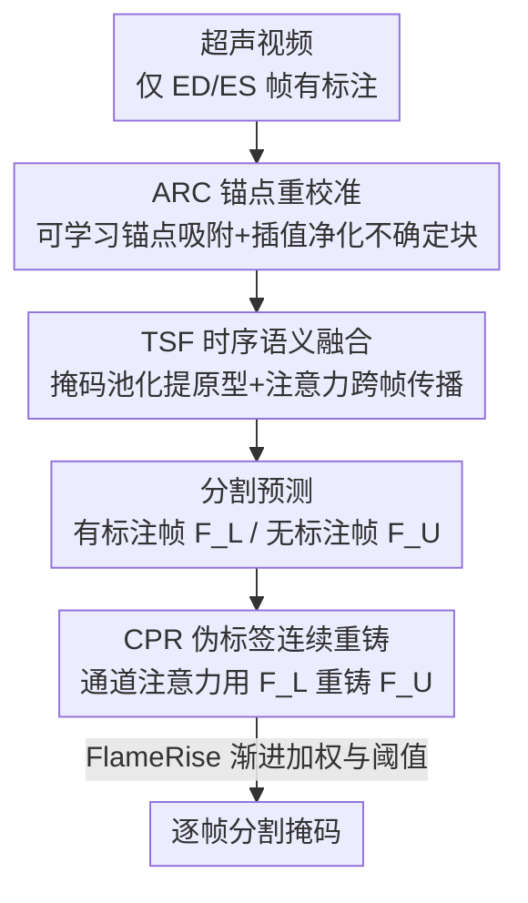

# Semi-supervised Echocardiography Video Segmentation via Anchor Semantic Awareness and Continuous Pseudo-label Reforging

**会议**: CVPR 2026  
**论文**: [CVF Open Access](https://openaccess.thecvf.com/content/CVPR2026/html/Fang_Semi-supervised_Echocardiography_Video_Segmentation_via_Anchor_Semantic_Awareness_and_Continuous_CVPR_2026_paper.html)  
**代码**: https://github.com/YunPeng-Fang/EchoForge  
**领域**: 医学图像  
**关键词**: 超声心动图分割, 半监督视频分割, 可学习锚点, 伪标签, 时序一致性

## 一句话总结
EchoForge 用一组可学习锚点重校准超声噪声区域、跨帧传播解剖语义原型，再用"渐进重铸"的伪标签策略充分利用未标注帧，从而在只有 ED/ES 两帧标注的极稀疏监督下实现实时且精准的超声心动图视频分割。

## 研究背景与动机

**领域现状**：超声心动图（echocardiography）是心血管疾病一线检查手段，自动分割左心室内膜等结构是测量射血分数（EF）、舒张末/收缩末容积（EDV/ESV）等临床指标的前提。主流方法从早期逐帧 2D CNN，发展到引入光流保时序一致，再到近期借助 SAM 等基础模型的强表征。

**现有痛点**：超声图像本身被斑点噪声（speckle noise）和伪影污染，目标边界模糊；心脏在收缩-舒张中形状/尺度大幅变化；而人工标注极其昂贵，临床数据常常**只标注舒张末（ED）和收缩末（ES）两帧**。逐帧 CNN 忽略时序、对噪声敏感；光流在超声低信噪比下产生错误运动场；直接套用 SAM 又抓不到时序动态。

**核心矛盾**：监督信号极度稀疏（一段视频只有两帧标签）与"要在整个心动周期都给出准确分割"之间的矛盾。现有伪标签方法虽然想利用中间帧，却存在**初期噪声伪标签被不断传播放大**的致命缺陷；teacher-student / 交叉伪监督又容易被标注关键帧严重带偏，学不到鲁棒的未标注帧表征。

**本文目标**：在仅 ED/ES 标注的半监督设定下，(1) 压制斑点噪声、稳住模糊边界；(2) 跨帧保持解剖结构的时空一致；(3) 让中间未标注帧的伪标签可用且越训越好。

**切入角度**：作者不直接相信全局注意力（会被噪声分散），而是引入一小组"像磁铁"的可学习锚点向量，主动吸附最像前景/背景的特征块来稳定不确定区域；同时把已标注帧当作可信参考源，去"重铸"未标注帧的伪标签。

**核心 idea**：用**锚点语义感知（ASA）**把噪声敏感的不确定区域校准到可靠原型上，再用**伪标签连续重铸（CPR）+ FlameRise 课程式调度**，把稀疏标注的信息持续注入未标注帧。

## 方法详解

### 整体框架
EchoForge 是一个半监督超声心动图视频分割框架，输入是一段超声视频（仅 ED/ES 两帧有标注），输出整段视频每帧的分割掩码。整体分两大模块串联：先由 **ASA（Anchor Semantic Awareness）** 对编码特征做空间净化与时序传播，它内部含两个子模块——ARC（锚点重校准）抑噪、TSF（时序语义融合）保一致；在 ASA 之上再接 **CPR（Continuous Pseudo-label Reforging）**，用已标注帧特征去重铸未标注帧的伪标签，并配合 **FlameRise** 训练策略渐进放开伪标签监督。

### 关键设计

**1. ARC 锚点重校准：用可学习锚点把噪声不确定区域"吸"回可靠原型**

针对斑点噪声让全局注意力被干扰、边界模糊的痛点，ARC 不用候选框，而是维护一组**可学习的前景/背景锚点向量**，它们携带初步前景/背景信息，像磁铁一样吸附超声背景里最像目标的特征块。锚点初始化时，对编码特征图 $X\in\mathbb{R}^{C\times H\times W}$ 做 $1\times1$ 卷积加通道 softmax 得到前景/背景权重 $M_i(x,y)$，再用全局加权平均池化聚合出初始锚点 $a_i^{(0)}=\frac{\sum_{x,y}M_i(x,y)X(x,y)}{\sum_{x,y}M_i(x,y)}$。随后用 KNN 为每个锚点筛出特征空间中最近的 $K$ 个像素邻居集 $N_i$，把 $N_i$ 与 $a_i^{(0)}$ 一起送入 Feature Fusion 模块做交叉注意力 + 残差，得到更新后的锚点 $a_i$。最后把特征图切成不重叠 patch，算每个 patch 与两锚点的余弦相似度得到前景/背景概率 $s^{FG}_k, s^{BG}_k$：高置信 patch 保留原特征，落在不确定区间 $[0.4,0.6]$ 的 patch 则按相似度差动态加权、向置信更高的锚点线性插值。这样只对"拿不准"的区域做校准，既净化噪声又不破坏已确定的结构。

**2. TSF 时序语义融合：跨帧传播解剖原型，稳住形变中的左心室**

针对左心室在心动周期内形状剧烈变化导致时序不一致的痛点，TSF 在 ARC 之上提取并传播关键解剖原型。它先对参考帧特征 $F_r$ 及其掩码 $m_i^r$ 做掩码池化，得到一组语义标签 $t_{\mathrm{sem},i}=\frac{1}{\sum_{u,v}m_i^r(u,v)}\sum_{u,v}m_i^r(u,v)F_r(u,v)$，堆成 $T_{sem}\in\mathbb{R}^{N\times C}$。然后用一个 In-context Fusion（Transformer 块：自注意力+交叉注意力+FFN）建模参考帧与目标帧 $F_t$ 的关联——语义 token $T_{sem}$ 作 query、目标 patch token 作 key/value，互为键值融合后输出增强目标特征 $F'_t$ 与语义原型 $P_{sem}$。再让一组可学习 query $Q$ 与 $P_{sem}$ 做深度交互（先各自自注意力，query 分支以 $F'_t$ 为 value 做掩码交叉注意力，最后 FFN），得到 $Q_{final}, P_{final}$ 联合生成预测掩码。本质是把"上一帧确认过的解剖语义"以注意力方式注入当前帧，既提边界精度又保时空一致。

**3. CPR 伪标签连续重铸 + FlameRise：让未标注帧的伪标签越训越干净**

针对现有伪标签方法初期噪声被不断放大、模型被关键帧带偏的痛点，CPR 用一个轻量通道注意力把"标注帧的可靠语义"重铸进未标注帧。它把预测特征分为有标注帧 $F^L$ 与无标注帧 $F^U$，以 $F^L$ 为 query、$F^U$ 为 key/value 做**通道级**交叉注意力：$A=\mathrm{softmax}(\mathrm{IN}(Q^TK))$，$\hat{F}^U=AV^T$（$Q,K,V$ 分别由 $F^L,F^U,F^U$ 线性映射），重构特征经语义对齐得到新伪标签 $\hat{y}^U$。但仅靠 CPR、全程都用伪标签仍会过拟合早期噪声预测，于是 FlameRise 让伪标签监督"像火苗渐旺"地逐步加入：伪标签权重 $\lambda(e)$ 在 burn-in 轮 $E_0$ 前为 0，$E_0$ 到 $E_1$ 线性升到 $\lambda_{\max}$；置信阈值 $\tau(e)$ 则从 $\tau_0$ 线性降到 $\tau_1$，只在高置信像素上计无监督损失。早期严卡阈值、少用伪标签，后期模型变强再放开——避免初期错误被锁死传播。

### 损失函数 / 训练策略
总损失由有标注帧的 Dice 损失、边界细化的 BCE 损失，以及未标注帧的无监督损失三部分组成：

$$\mathcal{L}_{\text{total}}=\mathcal{L}_{\text{bce}}(P_i,G_i)+\mathcal{L}_{\text{dice}}(P_i,G_i)+\mathcal{L}_{U(e)}(P_i,\hat{y}^U)$$

其中 $\hat{y}^U$ 为 CPR 重铸出的伪标签，$\mathcal{L}_{U(e)}$ 的权重与置信阈值由 FlameRise 调度（见关键设计 3）。骨干用 ImageNet 预训练 ResNet-50，Adam 优化、50 epoch、多项式学习率衰减（初始 $1\times10^{-4}$，power 0.9），视频统一采样 10 帧。

## 实验关键数据

数据集为 CAMUS（500 例，全帧标注，但训练时只用 ED/ES）与 EchoNet-Dynamic（10,030 段，仅 ED/ES 标注）。从 CAMUS 派生两个评测变体：CAMUS-Semi（仅在 ED/ES 帧评测）、CAMUS-Full（全帧评测）。指标含 mDice（平均 Dice，越高越好）、mHD（平均 Hausdorff 距离，越低越好）、ASD（平均表面距离，CAMUS 为毫米/EchoNet 为像素，越低越好），以及 LVEF 的 Pearson 相关 corr（越高越好）与 mean bias（越接近 0 越好）。⚠️ 具体指标定义以原文为准。

### 主实验

| 数据集 | 方法 | mDice↑ | mHD↓ | ASD↓ | corr↑ | bias |
|--------|------|--------|------|------|-------|------|
| CAMUS-Semi | DSA (2024, 前最强) | 93.65 | 3.45 | 1.25 | 0.891 | 0.52 |
| CAMUS-Semi | MemSAM (2024, SAM 系) | 93.26 | 4.04 | 1.49 | 0.788 | 4.78 |
| CAMUS-Semi | **EchoForge** | **94.89** | **3.12** | **1.18** | **0.913** | 0.23 |
| EchoNet-Dynamic | DSA (2024) | 92.75 | 3.22 | 1.15 | 0.871 | -0.63 |
| EchoNet-Dynamic | **EchoForge** | **93.63** | **3.05** | **1.02** | **0.887** | -0.51 |

EchoForge 在两个基准的全部标准指标上均超过 Cutie、VideoMamba、CLAS、TCS、PKEchoNet、DSA、MemSAM、P-Mamba 等不同类型 SOTA；mDice 的 Wilcoxon 秩和检验 P 值均 <0.05，提升具统计显著性。CAMUS-Full（全帧评测）mDice 仅比 CAMUS-Semi 下降约 0.5%（94.36 vs 94.89），说明它在整个心动周期都保持了时序一致。

### 消融实验

| 配置 | TSF | ARC | CPR | mDice↑ | mHD↓ | ASD↓ |
|------|-----|-----|-----|--------|------|------|
| I（基线） |  |  |  | 88.52 | 6.32 | 2.15 |
| II | ✓ |  |  | 92.36 | 4.02 | 1.60 |
| III | ✓ | ✓ |  | 93.43 | 3.38 | 1.34 |
| IV（完整） | ✓ | ✓ | ✓ | **94.89** | **3.12** | **1.18** |

另有锚点数量消融：1/2/3/4 个锚点 mDice 为 94.52/94.89/94.96/94.91，但 FPS 从 92 急降到 23——锚点越多精度边际递增却严重拖慢速度，作者选 2 个锚点作精度/效率折中。

### 关键发现
- 三个组件逐级叠加均带来稳定增益：TSF 把基线 88.52 拉到 92.36（+3.84，贡献最大，说明时序语义传播是核心）；ARC 再 +1.07；CPR 再 +1.46。三者缺一不可。
- 效率上 EchoForge 67M 参数、125G FLOPs、46 FPS，满足临床实时（>25 FPS）需求；相比 MemSAM（257M、13 FPS）在精度更高的同时快了 3 倍多，取得更好的精度-效率折中。
- 锚点数量存在明显边际递减：从 2 到 3 个 mDice 只涨 0.07 却让 FPS 从 46 掉到 35，说明少量锚点已能覆盖前景/背景的语义重心。

## 亮点与洞察
- **"可学习锚点 + 仅校准不确定区"**很巧：把全局注意力的"无差别响应"换成对 $[0.4,0.6]$ 置信带的定向插值，既净化斑点噪声又不破坏已确定结构，是处理低信噪比医学图像的可复用思路。
- **FlameRise 课程式伪标签调度**直击半监督痛点——伪标签早期最脏，先 burn-in、严阈值、低权重，等模型变强再"火苗渐旺"放开，避免初期错误被锁死，这套权重/阈值双调度可迁移到任何伪标签自训练任务。
- **把已标注帧当"语义重铸源"**（CPR 用 $F^L$ 做 query 重铸 $F^U$）是对稀疏标注信息的高效再利用，比 teacher-student 单纯生成伪标签更能抵抗被关键帧带偏。

## 局限与展望
- 方法在 ED 帧首、ES 帧尾的固定裁剪假设下训练评测，对采集不规范/帧序不齐的真实临床视频鲁棒性未充分验证。
- 仅在左心室相关分割与 CAMUS/EchoNet 两个数据集验证，对右心室、瓣膜等更复杂结构及不同超声设备的泛化性待考。
- 锚点数量、FlameRise 的 $E_0,E_1,\lambda_{\max},\tau_0,\tau_1$ 等超参较多，跨数据集是否需重新调参、对最终精度的敏感度，作者未给出系统分析。

## 相关工作与启发
- **vs 逐帧 2D CNN / 光流系（CLAS、TCS）**：它们要么忽略时序、要么靠对噪声敏感的光流；EchoForge 用 TSF 的语义原型传播替代显式运动估计，在超声低信噪比下更稳。
- **vs SAM 系（MemSAM）**：MemSAM 借基础模型强表征但抓不准时序、参数大速度慢；EchoForge 以更轻的结构（46 FPS vs 13 FPS）取得更高精度，更贴合临床实时。
- **vs 其它伪标签法（CLAS、TCS）**：它们初期噪声伪标签易被传播放大；EchoForge 用 CPR 通道注意力重铸 + FlameRise 渐进调度，把伪标签从"越训越脏"扭转为"越训越干净"。

## 评分
- 新颖性: ⭐⭐⭐⭐ 可学习锚点重校准 + 伪标签连续重铸的组合在超声半监督分割里较新颖，但各组件均借鉴自注意力/自训练成熟思路。
- 实验充分度: ⭐⭐⭐⭐ 两基准、八个 SOTA、含统计检验与效率/锚点数消融，较扎实；缺跨设备与更多结构的泛化分析。
- 写作质量: ⭐⭐⭐⭐ 模块动机清晰、图表完整，但公式排版与部分符号需对照原文确认。
- 价值: ⭐⭐⭐⭐ 在仅 ED/ES 标注下达实时高精度分割，对降低临床标注成本有实用价值。

<!-- RELATED:START -->

## 相关论文

- [\[CVPR 2026\] A Semi-Supervised Framework for Breast Ultrasound Segmentation with Training-Free Pseudo-Label Generation and Label Refinement](a_semi-supervised_framework_for_breast_ultrasound_segmentation_with_training-fre.md)
- [\[CVPR 2026\] Semantic Class Distribution Learning for Debiasing Semi-Supervised Medical Image Segmentation](semantic_class_distribution_learning_for_debiasing.md)
- [\[CVPR 2026\] Divide, Conquer, and Aggregate: Asymmetric Experts for Class-Imbalanced Semi-Supervised Medical Image Segmentation](divide_conquer_and_aggregate_asymmetric_experts_for_class-imbalanced_semi-superv.md)
- [\[AAAI 2026\] ProPL: Universal Semi-Supervised Ultrasound Image Segmentation via Prompt-Guided Pseudo-Labeling](../../AAAI2026/medical_imaging/propl_universal_semi-supervised_ultrasound_image_segmentation_via_prompt-guided_.md)
- [\[CVPR 2026\] OSA: Echocardiography Video Segmentation via Orthogonalized State Update and Anatomical Prior-aware Feature Enhancement](osa_echocardiography_video_segmentation_via_orthogonalized_state_update_and_anat.md)

<!-- RELATED:END -->
