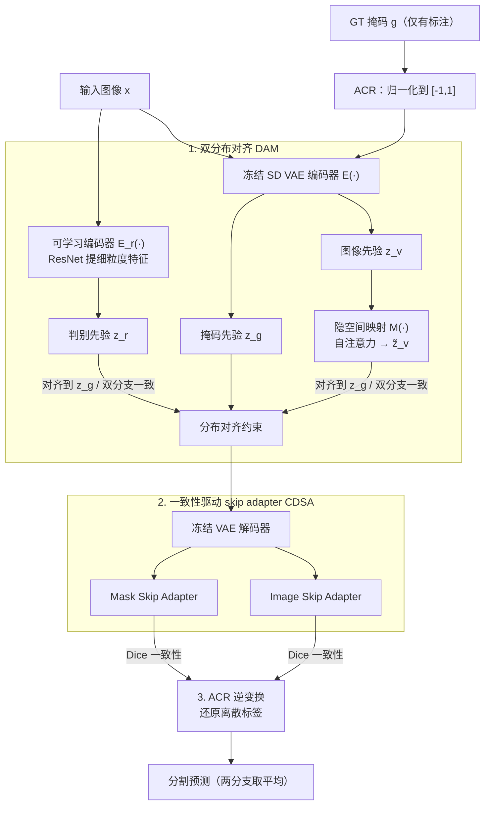

# SemiGDA: Generative Dual-distribution Alignment for Semi-Supervised Medical Image Segmentation

**会议**: CVPR 2026  
**arXiv**: [2604.23274](https://arxiv.org/abs/2604.23274)  
**代码**: https://github.com/taozh2017/SemiGDA (有)  
**领域**: 医学图像 / 半监督分割 / 生成式分割  
**关键词**: 半监督医学分割、生成式分割、隐空间分布对齐、Stable Diffusion VAE、一致性学习

## 一句话总结
SemiGDA 把半监督医学图像分割从"逐像素判别"换成"生成式范式"：用两个结构不同的编码器分别建模图像和掩码的隐空间先验分布并强制对齐，再借冻结的 Stable Diffusion VAE 解码器配合轻量 skip adapter 直接"生成"分割掩码，在结肠镜、皮肤镜、病理、超声四类数据集的 10%/30% 标注设定下全面超过 11 个 SOTA 半监督方法（如 BUSI 10% 标注下 Dice 比次优高 10 个点）。

## 研究背景与动机
**领域现状**：医学图像分割的全监督范式需要大量专家标注，成本高、难获取。半监督医学分割（SMIS）因此成为主流替代，用少量标注 + 大量无标注数据训练。现有 SMIS 几乎都建立在两条技术线上：伪标签（用初始模型给无标注数据打标签再迭代精化）和一致性学习（在输入/特征扰动下强制输出不变，代表是 Mean Teacher 师生框架，以及双流网络互学习）。

**现有痛点**：这些方法本质都是**判别式范式**——做逐像素分类，只用分割掩码作监督，忽略了特征层面的分布约束。这带来两个具体问题：一是在标注极少时，判别模型容易过拟合、泛化差，学不到鲁棒的语义表征；二是面对复杂分割任务时，难以捕捉图像的全局结构、整合上下文语义信息。伪标签还会被初始预测的噪声拖累训练稳定性。

**核心矛盾**：判别式分割天生只学"哪个像素属于哪个类"的决策边界，而不学数据本身的结构化分布；标注一少，决策边界就没有足够样本去支撑，模型只能记住有限的硬标签，无法对无标注数据做自适应建模。已有的生成式尝试（GAN/VAE 做对抗式让无标注预测分布逼近有标注分布）又常常面临对抗训练收敛困难的问题。

**本文目标 + 切入角度**：作者提出，与其在判别空间里硬凑决策边界，不如把图像和掩码都映射到隐空间、对齐它们的**先验分布**，再用对齐后的隐变量去"合成"高质量分割掩码。这样监督信号从"掩码级"上升到"特征分布级"，信息量更大，少量标注也能学到结构化的语义一致性。为了让生成式分割在半监督下跑起来，需要解决三件事：(1) 怎么建模图像→掩码的分布变换并对齐；(2) 生成式解码器全局上下文够但细粒度语义不足，怎么补；(3) 离散的 GT 掩码维度和 VAE 输入不匹配，怎么适配。

**核心 idea**：用"双分布对齐 + 生成式解码"替代"逐像素判别"——两个异构编码器把图像和掩码先验在隐空间对齐，冻结的 SD VAE 解码器 + 轻量 skip adapter 把对齐后的隐变量解码成掩码，无标注数据靠双分支一致性约束。

## 方法详解

### 整体框架
SemiGDA 的输入是图像 $x\in\mathbb{R}^{H\times W\times 3}$（有标注的还带 GT 掩码 $g$），输出是分割图。整体思路是：让"图像走两条编码路径分别得到隐空间分布 → 把这两条分布都对齐到掩码的先验分布 → 用冻结的 VAE 解码器配 skip adapter 解码成掩码 → 再逆变换还原成离散标签"。

具体有三条编码/对齐路线协同。第一条：图像 $x$ 过**冻结的 SD VAE 编码器** $\mathcal{E}(\cdot)$ 得到图像先验 $p(z_v|x)$，再过一个**隐空间映射模型** $\mathcal{M}(\cdot)$（用自注意力捕捉图像与掩码间的全局依赖）映射成 $\tilde z_v$。第二条：同一张图像 $x$ 过一个**可学习编码器** $E(\cdot)$（ResNet backbone）提取细粒度判别特征 $z_r$，给出与第一条结构差异显著的"第二视角"。第三条（仅有标注数据）：GT 掩码 $g$ 也过同一个 VAE 编码器 $\mathcal{E}$ 得到掩码先验 $z_g$，作为前两条分布要对齐的"锚"。这三条共同构成 **DAM（双分布对齐模块）**。对齐后的特征送入冻结 VAE 解码器，解码时由 **CDSA（一致性驱动 skip adapter）** 的两个并行 adapter（Image / Mask）注入多尺度特征。GT 掩码进出 VAE 前后由 **ACR（标注转换与逆转换）** 做无参数的归一化/反归一化。训练分两阶段（先预训练映射网络和可学习编码器，再整体微调），推理时取两条分支预测的平均。

### 关键设计

**1. DAM 双分布对齐模块：用异构双编码器把图像/掩码先验对齐到同一隐空间**

这是全文的核心，针对"判别式只用掩码级监督、特征分布不受约束、少标注下学不到结构化表征"这个痛点。作者不沿用以往"复用同一解码器"的做法，而是用两个结构差异显著的编码器去建模图像→掩码的分布变换。冻结 SD VAE 编码器 $\mathcal{E}$ 把图像编码成高斯先验 $p(z_v|x)=\mathcal{N}(z_v;\mu_{z_v},\sigma_{z_v})$，再经自注意力映射网络 $\mathcal{M}$ 得到 $p(\tilde z_v|z_v)$，把图像特征推到一个能捕捉图像-掩码全局依赖的低维流形；另一路可学习编码器 $E$ 给出 $p(z_r|x)$，专注细粒度判别特征。GT 掩码同样过 VAE 得到锚分布 $z_g$。

关键是**分布对齐损失把监督从掩码级提升到特征分布级**（作者强调特征级监督比掩码级信息量更大）。有标注数据上，让两条图像分支分布都贴近掩码先验：

$$\mathcal{L}_{sup}^{p}=\|\tilde z_v^{l}-z_g\|_2^2+\|z_r^{l}-z_g\|_2^2$$

无标注数据上没有 $z_g$，就靠两条分支互相对齐做一致性约束：

$$\mathcal{L}_{unsup}^{p}=\|\tilde z_v^{u}-z_r^{u}\|_2^2$$

之所以有效：异构双编码器提供互补视角（VAE 路偏全局生成先验、可学习路偏细粒度判别），在隐空间用 MSE 把它们拉到掩码流形上，既给了无标注数据一个"软监督"（双分支互为伪监督），又避免了对抗训练的收敛困难——本质是把"逼近分布"从对抗博弈换成了直接的特征距离最小化。Fig.1(b) 还指出映射网络的作用是把 SD 先验对齐到有效流形上，防止特征坍塌、稳定训练。

**2. CDSA 一致性驱动 skip adapter：给生成式解码器补多尺度细粒度语义**

DAM 解决了特征级一致性，但生成式 VAE 解码器有个老问题——擅长全局上下文、不擅长分割所需的细粒度多尺度细节，而且图像分布与掩码分布在语义粒度、域特异性上本就不同。CDSA 在解码器的 skip connection 处插入两个并行的轻量卷积 adapter：**Image Skip Adapter** 处理来自 VAE 编码器的多尺度特征 $S_v=\{\mathcal{E}^{(i)}(x)\}$（保留图像分布特性），**Mask Skip Adapter** 处理来自可学习编码器的多尺度特征 $S_r=\{E^{(i)}(x)\}$（因被掩码特征分布直接约束，继承掩码分布属性）——adapter 的命名正是按各自特征分布的内在差异来定的。

对齐用 Dice 损失 $\mathcal{L}_{dice}(\hat y,y)=1-\frac{2\sum(\hat y\odot y)}{|\hat y|_1+|y|_1}$。有标注数据上两个 adapter 输出都由 GT 监督：$\mathcal{L}_{sup}^{s}=\mathcal{L}_{dice}(\hat y_v^{l},y)+\mathcal{L}_{dice}(\hat y_r^{l},y)$；无标注数据上直接在两个 adapter 输出之间做双向 Dice 一致性：$\mathcal{L}_{unsup}^{s}=\mathcal{L}_{dice}(\hat y_v^{u},\hat y_r^{u})+\mathcal{L}_{dice}(\hat y_r^{u},\hat y_v^{u})$。这样以很低的计算量在解码阶段保住了细粒度细节和粗粒度语义，并在无标注样本上再加一层跨分支一致性，强化了对稀疏标注的利用。

**3. ACR 标注转换与逆转换：无参数解决离散 GT 与 VAE 连续输入的不匹配**

生成式分割要把 GT 掩码喂给为自然图像设计的 VAE，但 GT 是 $0\sim K-1$ 的离散类别图，维度/取值和 VAE 期望的连续输入对不上。ACR 用一个两步无参数变换解决：先把原始像素除以类别数 $K$ 归一化到 $[0,1]$，再线性映射到 VAE 要求的 $[-1,1]$：

$$G'=2\cdot\frac{G}{K}-1$$

逆变换直接镜像这个前向过程，保证完全可逆。它不引入任何可学习参数（training-free），却保证了掩码处理与还原流程严格一致、全程保留分割掩码的语义完整性，让生成式管线能端到端地用离散标签做监督。

### 损失函数 / 训练策略
总损失分有/无监督两部分。监督部分 $\mathcal{L}_{sup}=\mathcal{L}_{sup}^{p}+\mathcal{L}_{sup}^{s}$（分布对齐 + 分割），无监督部分 $\mathcal{L}_{unsup}=\mathcal{L}_{unsup}^{p}+\mathcal{L}_{unsup}^{s}$（分布一致 + 输出一致），合起来：

$$\mathcal{L}_{total}=\mathcal{L}_{sup}+\lambda_u\mathcal{L}_{unsup}$$

其中 $\lambda_u(t)=\beta\cdot e^{-5(1-t/t_{max})^2}$ 是高斯 warm-up 调度，$\beta=0.1$，$t_{max}$ 为总迭代数，让无监督项随训练逐渐加权进来。训练分两阶段：先预训练映射网络 $\mathcal{M}$ 和可学习编码器 $E$（200 epochs）稳定隐空间，再整体微调（350 epochs）。VAE 编/解码器全程冻结，用 SD VAE 预训练权重借其强零样本泛化。batch=4（2 标注 + 2 无标注），输入 resize 到 $224\times224$，两块 4090；推理时取两条分支预测平均。

## 实验关键数据

### 主实验
在四类共六个医学数据集上，对比 11 个 SOTA 半监督方法，指标为 Dice / IoU / 95HD，标注比例 10% 和 30%。SemiGDA 在所有设定下领先。下面摘 10% 标注下的代表性结果（次优来自 UnCo[TMI'25] / CSCPA[CVPR'25] / SKCDF[CVPR'25] 等）：

| 数据集（10% 标注） | 指标 | 本文 | 次优 SOTA | 提升 |
|--------------------|------|------|-----------|------|
| Kvasir（结肠镜） | Dice | 83.03 | 81.19 (UnCo) | +1.84 |
| CVC-ClinicDB（结肠镜） | Dice | 79.37 | 78.75 (CSCPA) | +0.62 |
| ISIC-2018（皮肤镜） | Dice | 86.28 | 85.75 (CSCPA) | +0.53 |
| BCSS（病理） | Dice / IoU | 74.05 / 62.68 | 71.95 / 59.48 (CSCPA) | +2.10 / +3.20 |
| BUSI（超声） | Dice | 75.57 | 65.16 (CSCPA) | **+10.41** |

跨域稳定性是亮点：在病理（BCSS）和超声（BUSI）这两个与自然图像差异更大的域上提升最显著，BUSI 10% 标注下几乎甩开次优 10 个点，30% 标注也有 78.74 vs 73.78（CDMA）的领先；说明生成式范式在低标注、复杂域下比判别式更鲁棒。

### 消融实验

组件消融（Tab.3，baseline = 去掉特征层约束和 skip adapter、只留最终掩码监督）：

| 配置 | ClinicDB 10% Dice | Kvasir 10% Dice | BUSI 10% Dice |
|------|-------------------|-----------------|---------------|
| Baseline | 74.23 | 77.01 | 70.48 |
| + DAM | 75.92 | 80.02 | 73.07 |
| + CDSA | 76.83 | 81.84 | 75.25 |
| + DAM + CDSA（Full） | 79.37 | 83.03 | 75.57 |

双 adapter 消融（Tab.4，在已加 DAM 的基础上）：

| 配置 | ClinicDB 10% | Kvasir 10% | BUSI 10% |
|------|--------------|------------|----------|
| 无 adapter | 75.92 | 80.02 | 73.07 |
| 仅 Image Adapter | 76.98 | 81.95 | 74.92 |
| 仅 Mask Adapter | 77.14 | 81.79 | 73.91 |
| 双 adapter | 79.37 | 83.03 | 75.57 |

损失消融（Tab.5）：在保留 $\mathcal{L}_{sup}^{s}+\mathcal{L}_{sup}^{p}$ 基础上加无监督项，Kvasir 10% 从 79.34 → 83.03，且 95HD 从 4.63 → 4.39；ClinicDB 同时加 $\mathcal{L}_{unsup}^{s}+\mathcal{L}_{unsup}^{p}$ 后 95HD 从 4.97 大幅降到 3.88。

### 关键发现
- **DAM 与 CDSA 互补、缺一不可**：单加任一组件都有稳定增益，两者叠加才到最佳；Fig.5 的隐特征可视化显示，baseline 特征散乱含噪，DAM 把分布"矫正"到聚焦病灶，CDSA 再锐化边界。
- **两个 skip adapter 都有用且互补**：单用 Image 或 Mask adapter 各有偏好（ClinicDB 上 Mask 略好、Kvasir/BUSI 上 Image 略好），合用才统一到最优——印证两者分别承载图像分布与掩码分布特性。
- **无监督一致性损失贡献突出**：在无标注数据上同时约束分布级和输出级一致性，把伪标签质量和边界精度（95HD）一起提上来。
- **极低标注下优势更大**：Fig.6 显示在 BUSI 上即使 1% 标注，SemiGDA 仍稳定超过 MC-Net / UnCo / CSCPA，凸显生成式分割在低标注场景对判别式的鲁棒性优势。

## 亮点与洞察
- **范式切换很干脆**：把半监督医学分割从"逐像素判别"整体迁到"隐空间分布对齐 + 生成式解码"，并用特征分布级监督替代掩码级监督——这个"监督信号上移一层"的视角，是它在少标注下不易过拟合的根因。
- **借力冻结 SD VAE 是聪明的工程取舍**：直接复用 Stable Diffusion VAE 的预训练隐空间表征拿零样本泛化，只训练映射网络、可学习编码器和轻量 adapter，既省算力又稳训练，还回避了 GAN 对抗训练的收敛难题。
- **ACR 这种 training-free 小技巧可迁移**：任何想把离散标签塞进为连续自然图像设计的生成模型（VAE/扩散）的任务，都可以借用"按类别数归一化 → 线性映射到 [-1,1] → 可逆还原"这套无参数适配。
- **双分支一致性既当正则又当伪监督**：异构编码器天然提供两个视角，无标注数据上互相对齐就同时拿到了一致性正则和软伪标签，比单独造伪标签更稳。

## 局限与展望
- **强依赖预训练 SD VAE**：整套方法建立在冻结 SD VAE 的隐空间上，若目标模态（如 3D 体数据、非 RGB 模态）与 SD 训练分布相差太远，借来的先验可能失效；论文只验证了 2D RGB 化的医学图像。
- **两阶段训练 + 双编码器 + 双解码分支**带来不小的训练/推理开销（推理还要跑两条分支取平均），论文未给出与判别式方法的参数量/推理速度对比，"低计算量"的说法缺乏量化支撑。
- **隐空间映射机制偏经验**：映射网络用自注意力对齐到"有效流形"防特征坍塌，但为何这样能防坍塌、对齐到的流形是什么，更多是定性可视化，缺理论刻画。
- **仅 2D、仅二/少类分割**：实验集中在前景/背景或肿瘤区域，未涉及多器官、多类别或 3D 体素分割，泛化边界待验证。

## 相关工作与启发
- **vs 判别式 SMIS（UA-MT / MC-Net / Mean Teacher 系）**：它们做逐像素分类 + 师生/双流一致性，只有掩码级监督；本文换成生成式 + 特征分布级监督，少标注下更鲁棒、跨域（病理/超声）提升尤其明显。
- **vs 对抗式生成半监督（GAN/VAE + 判别器）**：以往用判别器让无标注预测分布逼近有标注分布，常遇对抗训练收敛困难；本文用 MSE 直接最小化隐空间特征距离做分布对齐，绕开对抗博弈。
- **vs 生成式分割（GMS / GSS / GMMSeg）**：这些把分割建模为掩码生成/后验建模，但多在全监督或单分布下；本文专门为半监督设计"双分布对齐 + 跨分支一致性 + ACR 适配"，把生成式分割落到了少标注场景。
- **vs UnCo / CSCPA / SKCDF 等近期 CVPR'25 SOTA**：它们仍在判别式框架内改进一致性/对比策略；本文从范式层面换路，BUSI 等难域上拉开明显差距。

## 评分
- 新颖性: ⭐⭐⭐⭐⭐ 首个用"双分布对齐 + 生成式范式"系统性解决半监督医学分割过拟合/泛化差问题，范式切换清晰。
- 实验充分度: ⭐⭐⭐⭐ 四类六个数据集、11 个 SOTA、两种标注比例、三组消融 + 可视化，覆盖面足；缺效率（参数/速度）对比和 3D/多类验证。
- 写作质量: ⭐⭐⭐⭐ 动机—方法—实验逻辑顺畅，公式完整；映射网络防坍塌等机制偏定性。
- 价值: ⭐⭐⭐⭐ 思路可迁移（特征级监督、SD VAE 复用、ACR 适配），代码开源，对低标注医学分割有实用参考价值。

## 评分
- 新颖性: 待评
- 实验充分度: 待评
- 写作质量: 待评
- 价值: 待评

<!-- RELATED:START -->

## 相关论文

- [\[CVPR 2026\] Semantic Class Distribution Learning for Debiasing Semi-Supervised Medical Image Segmentation](semantic_class_distribution_learning_for_debiasing.md)
- [\[CVPR 2026\] Divide, Conquer, and Aggregate: Asymmetric Experts for Class-Imbalanced Semi-Supervised Medical Image Segmentation](divide_conquer_and_aggregate_asymmetric_experts_for_class-imbalanced_semi-superv.md)
- [\[CVPR 2026\] GenTract: Generative Global Tractography](gentract_generative_global_tractography.md)
- [\[CVPR 2026\] SD-FSMIS: Adapting Stable Diffusion for Few-Shot Medical Image Segmentation](sd_fsmis_adapting_stable_diffusion_for_few_shot_medical_image_segmentation.md)
- [\[ICML 2026\] Are We Overconfident in Models and Results for Semi-Supervised 3D Medical Image Segmentation?](../../ICML2026/medical_imaging/are_we_overconfident_in_models_and_results_for_semi-supervised_3d_medical_image_.md)

<!-- RELATED:END -->
