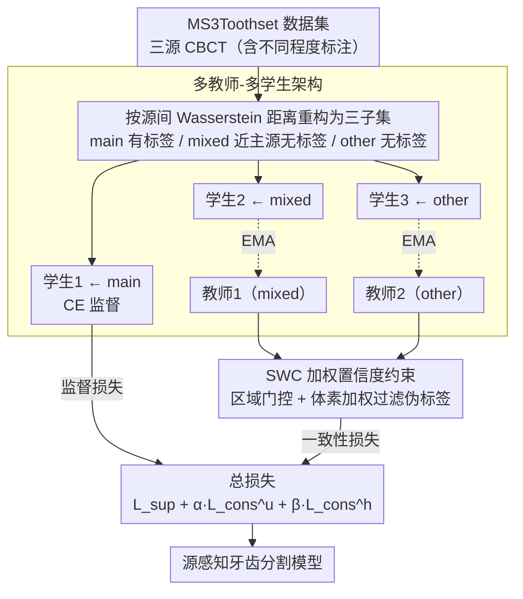

# SemiTooth: a Generalizable Semi-supervised Framework for Multi-Source Tooth Segmentation

**会议**: CVPR 2026  
**arXiv**: [2603.11616](https://arxiv.org/abs/2603.11616)  
**代码**: 无  
**领域**: 分割 / 医学图像  
**关键词**: 半监督学习, 多源数据, 牙齿分割, CBCT, 伪标签

## 一句话总结
本文提出SemiTooth框架，通过多教师-多学生架构和更严格的加权置信度约束（SWC），解决多源CBCT数据在半监督牙齿分割中的分布差异问题，在构建的MS3Toothset数据集上取得SOTA。

## 研究背景与动机

1. **领域现状**：CBCT（锥束CT）牙齿结构分割是临床口腔诊疗的基础任务，全监督方法取得了不错进展，但体素级标注耗时昂贵，大量去标识化的未标注CBCT数据未能有效利用。
2. **现有痛点**：半监督医学图像分割（SSMIS）方法如Mean Teacher可以利用无标签数据，但主要针对单源数据设计。实际中不同医院/设备采集的CBCT存在显著分布差异（密度、强度、特征分布都不同），直接混用会导致模型泛化能力差。且公开的多源CBCT牙齿分割数据集稀缺。
3. **核心矛盾**：多源数据之间的域差距（domain gap）导致统一训练困难——单教师-单学生的简单框架无法同时兼顾多个数据源的特征差异，伪标签质量在跨源场景下严重退化。
4. **本文目标** ①构建一个多源半监督CBCT牙齿分割数据集；②设计一个能处理多源分布差异的半监督框架。
5. **切入角度**：针对不同数据源分配不同的学生网络进行专门学习，用各自对应的教师网络提供监督，同时设计区域级置信度约束过滤噪声伪标签。
6. **核心 idea**：多教师-多学生分支式框架 + 区域级严格置信度约束，让每个数据源都能在半监督学习中被有效利用。

## 方法详解

### 整体框架
SemiTooth将所有数据源重构为三个子集：main（有标签的主源数据）、other（其他源的无标签数据）、mixed（分布与主源相似的无标签样本，通过Wasserstein距离度量源间相似度归入）。设置3个学生网络分别处理三个子集，2个教师网络分别监督mixed和other子集的学生网络。教师通过EMA更新：$\theta_t^{(k)} \leftarrow \gamma \theta_t^{(k-1)} + (1-\gamma) \theta_s^{(k)}$。整体上是「先建多源数据集 → 三分支学生各学一种源 → 教师以EMA提供伪标签、并经SWC过滤噪声 → 汇总三路损失」的串行流程。

### 关键设计

**1. MS3Toothset 数据集：补上多源半监督CBCT牙齿分割缺失的评测基准**

现有公开的CBCT牙齿数据集稀缺，而且通常是单源的，方法做出来无处验证"跨源"这件事。本文把ShanghaiTech的半标注数据和PKU-SS、AFMC两家的无标注私有数据融合、筛选、统一处理，最终得到98个有标签样本（其中20个作测试集）和438个无标签样本，让多教师-多学生这类多源方法第一次有了标准化的开发与评测平台。数据集还顺带量化了"源间差距"——通过核密度估计、Hounsfield强度曲线和t-SNE都能看到三源的分布明显分簇，这正是后面要靠分支架构和置信度约束去化解的难点。

**2. 多教师-多学生架构：让每个数据源在专属学生网络里被"源感知"地学习**

经典的Mean Teacher是单教师-单学生，所有数据共用一套参数。把不同医院、不同设备采集的CBCT一股脑塞进去，模型会被互相矛盾的密度和强度分布拉扯，跨源伪标签质量随之退化。SemiTooth的做法是按子集拆分支：main（有标签主源）、other（其他源无标签）、mixed（分布与主源相近的无标签样本）各配一个学生网络，再让两个教师分别监督mixed和other两路学生。教师不参与反传，而是以EMA方式从对应学生缓慢吸收参数，$\theta_t^{(k)} \leftarrow \gamma \theta_t^{(k-1)} + (1-\gamma) \theta_s^{(k)}$，从而提供比学生自身更平滑、更稳定的伪标签。三个学生共享相似架构以便知识互相迁移，但各自只面对一种源风格，于是能学到"源感知"的表示，而不是被迫拟合一个所有源的折中分布。其中mixed子集起的是分布桥梁的作用——它和主源相近，把主源的标签知识平滑地传导到差异更大的other源上。

**3. 更严格的加权置信度约束（SWC）：先按区域门控、再按体素加权，两级过滤噪声伪标签**

直接对教师-学生预测做一致性正则化，在异构CBCT上会把大量噪声当成监督信号灌进去，牙齿边界、牙根这类难区域尤其严重。SWC把这件事拆成粗细两层。先把预测概率图切成互不重叠的立方体区域 $\{r\}$，对每个区域算教师的平均最大类概率作为区域置信度 $c(r) = \mathbb{E}_{i \in r}[\max_c P_{i,c}^T]$，凡是低于阈值 $\tau$ 的整块区域直接丢弃（记为 $\mathcal{R}_u$），这一步先把不可靠的密集噪声区从监督中剔除。在保留下来的可靠区域 $\mathcal{R}_\tau$ 里，再退回到体素粒度，用每个体素自己的置信度 $c_i = \max_c P_{i,c}^T$ 去加权教师-学生的对齐项：

$$\mathcal{SWC}(P^S, P^T) = \mathbb{E}_{r \in \mathcal{R}_\tau}\big[\mathbb{E}_{i \in r}[c_i \cdot \mathcal{A}(P_i^S, P_i^T)]\big]$$

区域级门控保证了结构上的可靠性（不会被一整块坏预测带偏），体素级加权又保住了精度（可靠区里仍区分置信高低），两层叠起来正好契合3D CBCT这种结构连续、又对边界精度敏感的数据。

### 损失函数 / 训练策略
总损失为三部分之和：有标签数据的监督损失 $\mathcal{L}_{sup} = CE(P^S(x^l), y)$，以及两个SWC一致性损失对应other源和mixed源：

$$\mathcal{L}_{total} = \mathcal{L}_{sup} + \alpha \mathcal{L}_{cons}^u + \beta \mathcal{L}_{cons}^h$$

其中 $\alpha = \beta = 0.5$，SWC阈值 $\tau = 0.9$，EMA衰减率 $\gamma = 0.99$。backbone使用V-Net，Adam优化器，学习率0.0001，训练300 epochs。

## 实验关键数据

### 主实验

| 方法 | 发表 | 年份 | mIoU | Dice | Recall | Acc |
|------|------|------|------|------|--------|-----|
| V-Net | IEEE 3DV | 2016 | 61.36 | 73.65 | 70.77 | 66.75 |
| MT | NeurIPS | 2017 | 67.69 | 78.72 | 78.06 | 73.68 |
| UA-MT | MICCAI | 2019 | 68.37 | 79.18 | 80.42 | 76.17 |
| ASDA | IEEE TIP | 2022 | 73.75 | 83.63 | 80.93 | 78.79 |
| CMT | ACM MM | 2024 | 76.14 | 85.07 | 87.14 | 84.32 |
| Uni-HSSL | CVPR | 2025 | 75.76 | 85.42 | 84.26 | 81.88 |
| **SemiTooth** | - | 2025 | **76.67** | **85.69** | **88.66** | **86.44** |

### 消融实验

| Exp | V-Net | MT | ST | SWC | mIoU | Dice | Recall | Acc |
|-----|-------|----|----|-----|------|------|--------|-----|
| 1 | ✓ | | | | 61.36 | 73.65 | 70.77 | 66.75 |
| 2 | ✓ | ✓ | | | 67.69 | 78.72 | 78.06 | 73.68 |
| 3 | ✓ | ✓ | | ✓ | 69.94 | 80.29 | 79.67 | 75.34 |
| 4 | ✓ | ✓ | ✓ | | 75.37 | 84.56 | 83.07 | 80.48 |
| 5 | ✓ | ✓ | ✓ | ✓ | **76.67** | **85.69** | **88.66** | **86.44** |

### 关键发现
- 从Exp2到Exp4看，SemiTooth的多教师-多学生架构贡献最大（mIoU +7.68%），说明多分支设计是核心。
- SWC约束在MT基础上提升2.25% mIoU（Exp2 vs Exp3），在SemiTooth基础上提升1.3%（Exp4 vs Exp5），说明SWC在已有强框架上仍有稳定增益。
- t-SNE可视化证实SemiTooth能有效压缩多源特征分布的差距，实现跨源域泛化。
- 定性结果显示SemiTooth在牙根区域和相邻牙齿边界粘连问题上效果最好。

## 亮点与洞察
- **区域级 + 体素级的分层置信度过滤**是最精巧的设计：先用区域级粗粒度排除噪声密集区，再在可靠区域内用体素级细粒度加权。这种层次化过滤思路可以迁移到其他3D半监督分割任务中。
- **mixed子集作为分布桥梁**的设计值得注意：通过Wasserstein距离从无标签数据中找出与有标签源分布相似的样本，作为连接不同源的纽带。
- 整体框架相对简洁，没有引入过多复杂组件，但通过合理的分支设计和约束机制取得了不错效果。

## 局限与展望
- 数据集规模偏小（98有标签 + 438无标签），实验验证的说服力有限。
- 仅验证了V-Net作为backbone，未测试更强的3D分割backbone（如nnU-Net、Swin UNETR）。
- 多教师-多学生架构的计算和内存开销相对单教师更大（3个学生 + 2个教师），实际部署需考虑资源限制。
- mixed子集的划分依赖Wasserstein距离阈值的选取，文中未详细讨论这一超参的敏感性。
- 可以考虑引入对比学习进一步拉近跨源特征表示。

## 相关工作与启发
- **vs Mean Teacher [15]**: MT只有单教师-单学生，无法感知多源分布差异，SemiTooth通过多分支设计和专用教师显著提升跨源性能（mIoU +9%）。
- **vs CMT [20]**: CMT使用多学生共享权重的Co-training但无教师监督，缺乏稳定的伪标签指导，SemiTooth在mIoU上超过0.53%。
- **vs ASDA [12]**: ASDA是为多源半监督设计的域自适应方法，SemiTooth在Recall上大幅超过（+7.73%），说明对临床敏感性指标更友好。

## 评分
- 新颖性: ⭐⭐⭐ 多教师-多学生思路属于合理推进，SWC约束有新意但改进幅度有限
- 实验充分度: ⭐⭐⭐ 消融和对比较完整，但数据集偏小、backbone单一
- 写作质量: ⭐⭐⭐⭐ 结构清晰，图示丰富直观
- 价值: ⭐⭐⭐ 对多源半监督医学分割有参考意义，但泛化性待更多验证

<!-- RELATED:START -->

## 相关论文

- [\[CVPR 2026\] A Semi-Supervised Framework for Breast Ultrasound Segmentation with Training-Free Pseudo-Label Generation and Label Refinement](a_semi-supervised_framework_for_breast_ultrasound_segmentation_with_training-fre.md)
- [\[CVPR 2026\] Addressing Data Scarcity in 3D Trauma Detection through Self-Supervised and Semi-Supervised Learning with Vertex Relative Position Encoding](addressing_data_scarcity_in_3d_trauma_detection_through_self-supervised_and_semi.md)
- [\[AAAI 2026\] ProPL: Universal Semi-Supervised Ultrasound Image Segmentation via Prompt-Guided Pseudo-Labeling](../../AAAI2026/medical_imaging/propl_universal_semi-supervised_ultrasound_image_segmentation_via_prompt-guided_.md)
- [\[CVPR 2026\] Uncertainty-Aware Concept and Motion Segmentation for Semi-Supervised Angiography Videos](uncertainty-aware_concept_and_motion_segmentation_for_semi-supervised_angiograph.md)
- [\[CVPR 2026\] Semantic Class Distribution Learning for Debiasing Semi-Supervised Medical Image Segmentation](semantic_class_distribution_learning_for_debiasing.md)

<!-- RELATED:END -->
