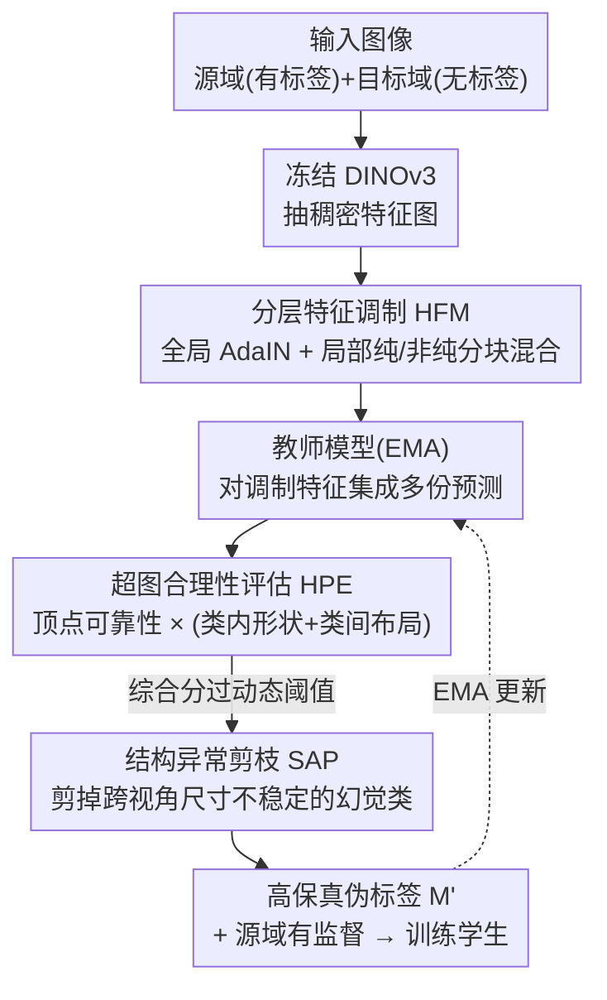

# SHAPE: Structure-aware Hierarchical Unsupervised Domain Adaptation with Plausibility Evaluation for Medical Image Segmentation

**会议**: CVPR 2026  
**论文**: [CVF Open Access](https://openaccess.thecvf.com/content/CVPR2026/html/Zhou_SHAPE_Structure-aware_Hierarchical_Unsupervised_Domain_Adaptation_with_Plausibility_Evaluation_for_CVPR_2026_paper.html)  
**代码**: https://github.com/BioMedIA-repo/SHAPE  
**领域**: 医学图像 / 无监督域适应 / 图像分割  
**关键词**: 无监督域适应, 医学图像分割, 伪标签, 超图, 解剖合理性

## 一句话总结
SHAPE 把跨模态医学分割的无监督域适应从「局部像素正确」重塑为「全局解剖合理」：在冻结的 DINOv3 上做类感知的分层特征调制（HFM）生成高保真特征，再用超图合理性评估（HPE）从解剖形状与布局两个层面给伪标签打分、用结构异常剪枝（SAP）剔除幻觉类别，从而只用通过合理性检验的高质量伪标签做自训练，在心脏与腹部跨模态基准上刷新 SOTA。

## 研究背景与动机

**领域现状**：医学分割模型在跨成像设备/模态部署时性能会大幅下滑，无监督域适应（UDA）通过把有标签源域的知识迁到无标签目标域来避免重新标注。现有 UDA 大致分两类：基于对齐的方法（在图像外观、特征分布或输出预测上对齐源/目标域）和基于伪标签的方法（用源域模型给目标域生成伪标签做自训练）。

**现有痛点**：本文指出这两类都有根本缺陷。第一，**特征对齐是语义无感知的**——AdaIN、谱归一化这类单体（monolithic）策略对整张特征图施加统一变换，把不同解剖结构的风格特征「平均化」，无法生成类特定风格信息，导致对齐不精确、分布保真度差。第二，**伪标签验证忽视全局解剖约束**——现有方法靠像素级置信度（预测熵）或局部一致性筛伪标签，无法阻止「解剖学上不可能」的伪标签（形状畸形、空间排布错误）混入训练，反过来污染模型。

**核心矛盾**：自训练的质量上限由伪标签质量决定，而像素级指标只能保证「局部像素对」，保证不了「整体器官形状/相对位置合理」。一个心脏分割可能每个像素置信度都很高，整体却长成了解剖学上不存在的形状。

**本文目标**：把适配目标从局部像素正确性转向全局解剖合理性，需要同时解决「特征对齐要保结构」和「伪标签验证要看全局」两件事。

**切入角度**：标准图只能表达成对（pairwise）关系，捕捉不了多个解剖结构之间的整体相互作用；而**超图（hypergraph）**天然能表达高阶关系，可同时建模单结构的类内形状和全解剖的类间空间排布。

**核心 idea**：用类感知的分层特征调制生成保结构的高保真特征，再把每张预测建模成超图、从形状与布局两层面打「合理性分」当作伪标签的质量门，最后剪掉跨视角不稳定的幻觉类别——三级级联只把「既像素准、又解剖合理」的伪标签喂给自训练。

## 方法详解

### 整体框架
SHAPE 建立在冻结的 DINOv3 ViT-S/16 编码器上，下游接一个可训练的 UNet 风格解码器，整体是「特征调制 → 多级验证 → 自训练」的级联。给定输入图，编码器抽出稠密特征图；**HFM** 对源/目标特征做双粒度（全局风格 + 局部结构感知）调制，产出四组高保真特征（原始、跨域风格化、局部混合）；这些特征经教师模型（学生的 EMA）集成出多份目标域预测，送入 **HPE** 把每份预测建成超图、从顶点可靠性 + 类内形状 + 类间布局算出综合合理性分，按动态阈值门控选样；通过的伪标签再过 **SAP**，用跨视角的类别尺寸稳定性剪掉幻觉类别；最终只有「通过合理性检验 + 剪枝」的高保真伪标签 $M'$ 才作为目标域监督信号，配合源域有监督损失一起训练学生。

### 关键设计

**1. 分层特征调制 HFM：用类感知、空间分化的混合替代单体对齐**

针对「单体对齐把不同解剖结构的风格平均化」这一痛点，HFM 做双粒度调制。**全局**层面用 AdaIN 把源特征 $F_s$ 的通道统计对齐到目标 $F_t$，得到风格化图 $F_{s\to t}=\sigma(F_t)\frac{F_s-\mu(F_s)}{\sigma(F_s)+\epsilon}+\mu(F_t)$。**局部**层面先把特征上采样到更细网格（$N=4HW$ 个 token），对每个 token 的标签子块算「纯度分」$P(m_i)=\max_k \frac{\sum_{v\in m_i}\mathbb{I}(v=k)}{|m_i|}$，按阈值 $\tau_p$ 把 token 分成纯语义核（$T_{pure}$）和非纯结构边界（$T_{impure}$）；对纯 token 做同类目标 token 的 Mixup $(1-\lambda)f_s^i+\lambda f_t^j$（$f_t^j$ 从按接近目标类均值排序的池里选代表性样例），对非纯边界 token 则做基于边界统计的 AdaIN 式对齐。这样在「语义核做插值、边界做统计对齐」的分化策略下，既对齐了分布又保住了类间可分性——t-SNE 可视化显示全局 AdaIN 会把各类目标特征无差别聚成一团（分布坍缩），而 HFM 在对齐质心的同时保留了每类的内在方差和相对组织。

**2. 超图合理性评估 HPE：从顶点/形状/布局三层给伪标签打全局合理性分**

针对「像素级指标管不了全局解剖合理性」，HPE 把每张预测分割图建成多级结构超图 $G=(V,E)$：顶点集 $V$ 是所有前景像素，超边集是「类超边」$E_C$（编码每类的类内形状）加一条「布局超边」$e_l$（编码类间空间排布）。三层打分依次为：(1) **顶点分** $S_{vertex}=\frac{1}{|V|}\sum_p w_p$，权重 $w_p$ 由教师集成的平均熵（确定性）和 JSD（一致性）联合给出；(2) **类内形状分** $S_{intra}$，用各类掩码的等周比 $\phi(e_k)=4\pi\cdot\text{Area}/(\text{Perimeter}^2+\epsilon)$ 算 Z-score、再 $S_{\phi,k}=\exp(-|z_k|)$，并用 softmax 加权重罚畸形离群类；(3) **类间布局分** $S_{inter}$，用类质心间相对方向余弦 $\psi_{ij}$ 做同样的 Z-score 评估。三者按 $S_{final}=S_{vertex}\cdot(\alpha S_{intra}+(1-\alpha)S_{inter})$ 融合——结构分作为**乘性门**，让「像素置信高但解剖结构差」的预测被压低。只有 $S_{final}$ 超过当前 epoch 内 top-$\rho$ 百分位动态阈值的样本才进自训练。

**3. 结构异常剪枝 SAP：用跨视角尺寸稳定性剔除幻觉类别**

即便整张图通过 HPE，仍可能存在个别类的幻觉区域（在不同增强视角下时有时无、尺寸剧烈波动）。SAP 把某类 $k$ 的「结构签名」定义为它在 $N_{ens}$ 份教师预测中的像素计数向量 $c_k$，用变异系数算结构不稳定分 $\Upsilon(k)=\frac{\text{std}(c_k)}{\bar c_k+\epsilon}$：稳健的解剖结构签名方差低，而模型幻觉表现为高波动。不稳定分超过动态阈值 $\theta_A$（batch 内显著前景类不稳定分的 $q$ 分位）的类被判为异常 $K_{anom}$，最终把已过 HPE 的共识伪标签图里所有属于 $K_{anom}$ 的像素置为 ignore index，得到精炼图 $M'$。这一步是 HPE「整图门控」之外的「类级精修」，确保喂给学生的标签保真度最高。

### 损失函数 / 训练策略
总损失 $L_{total}=L_{sup}+\gamma_{unsup}L_{unsup}$。源域有监督损失对原始与 HFM 调制特征集合 $\mathcal{F}_s=\{F_s,F_{s\to t},F_{s,cross}\}$ 取平均分割损失 $L_{sup}=\frac{1}{|\mathcal{F}_s|}\sum_{F'\in\mathcal{F}_s}L_{seg}(D(F'),L_s)$，以增强域鲁棒性。目标域无监督损失只在通过合理性检验的子集 $B_{sel}$ 上、以像素确定性 $w_p$ 加权地用高保真伪标签 $M'$ 监督学生预测。$L_{seg}$ 为 Dice + Focal 组合，教师 $D_{ema}$ 是学生解码器的 EMA（动量 0.9），$\gamma_{unsup}$ 用 ramp-up 渐增。关键超参：纯度阈值 $\tau_p=1$、融合权重 $\alpha=0.25$、选择百分位 $\rho$ 从 0.1 sigmoid 上升、异常阈值 $\theta_A$ 取第 50 百分位、$\gamma_{unsup}=1$。

## 实验关键数据

数据集：心脏用 MMWHS（20 CT + 20 MRI，分割 AA/LAC/LVC/MYO），腹部用 MICCAI 2015 腹部 CT（30 例）+ CHAOS T2SPIR MRI（20 例，分割 LIV/RK/LK/SPL）。指标为 Dice（DSC，越高越好）和平均表面距离（ASD，越低越好）。

### 主实验

心脏数据集平均 DSC（%，越高越好）对比，SHAPE 在两个方向均为最佳：

| 方法 | 类型 | MRI→CT DSC | CT→MRI DSC |
|------|------|------|------|
| W/o adaptation | 下界 | 45.91 | 36.91 |
| SIFA | 对齐类 | 74.63 | 63.78 |
| UPL-SFDA | 伪标签类 | 79.18 | 74.06 |
| IPLC | 伪标签类 | 80.91 | 76.07 |
| DDFP | 对齐类 | 84.46 | 75.37 |
| **SHAPE** | 本文 | **90.08** | **78.51** |
| Supervised | 上界 | 93.37 | 84.41 |

腹部数据集平均 DSC（%）对比：

| 方法 | Abd MRI→CT DSC | Abd CT→MRI DSC |
|------|------|------|
| W/o adaptation | 40.08 | 41.54 |
| SIFA | 83.35 | 84.17 |
| UPL-SFDA | 85.07 | 85.06 |
| DDFP | 85.17 | 86.27 |
| **SHAPE** | **87.48** | **86.89** |

在心脏 MRI→CT 上 SHAPE 达 90.08% DSC，比次优 DDFP（84.46%）高 5.62 个百分点，与有监督上界（93.37%）的差距缩到仅 3.29 个百分点。

### 消融实验（心脏数据集，在含 DINOv3 骨干的强基线上逐步加模块）

| 配置 | HFM | HPE | SAP | MRI→CT DSC | CT→MRI DSC |
|------|-----|-----|-----|------|------|
| (a) Baseline | | | | 82.02 | 71.58 |
| (b) +HFM | ✓ | | | 85.67 | 75.46 |
| (c) +HPE | | ✓ | | 82.71 | 72.09 |
| (d) +HFM+HPE | ✓ | ✓ | | 85.80 | 75.81 |
| (e) +HFM+SAP | ✓ | | ✓ | 86.03 | 76.23 |
| (f) SHAPE (Full) | ✓ | ✓ | ✓ | **90.08** | **78.51** |

### 关键发现
- **HFM 是单模块贡献最大者**：单加 HFM 就把 MRI→CT 从 82.02% 提到 85.67%（+3.65 点），印证「从全局对齐转向类感知、保结构调制」的重要性；单加 HPE 也有稳定增益（82.71%），说明验证伪标签解剖合理性本身就有效。
- **三模块是协同而非简单叠加**：(d)/(e) 两两组合只到 85.8/86.0%，而三者全开跃升到 90.08%，远超任意子集之和应有的水平，说明特征质量提升与多级伪标签验证存在协同效应。
- **特征对齐机制可视化佐证**：t-SNE 显示全局 AdaIN 把目标特征坍缩成团、破坏类间可分性，HFM 则在对齐质心的同时保留各类内在方差，从机制上解释了为何 HFM 优于单体对齐。
- **超参敏感性**：融合权重 $\alpha$、异常阈值等在合理范围内变化时性能稳定，方法对关键超参不敏感。

## 亮点与洞察
- **把「合理性」做成可微/可计算的监督信号**：用超图的等周比（形状）+ 质心方向余弦（布局）把「解剖学上像不像」量化成分数，再当乘性门去筛伪标签，这是把领域先验注入自训练的一个干净范式，思路可迁移到任何有强结构先验的分割任务。
- **整图门控 + 类级剪枝双保险**：HPE 管整张预测合不合理、SAP 管单个类稳不稳定，两级粒度互补，比单一像素置信度筛选鲁棒得多。
- **跨视角尺寸方差即幻觉信号**：用「同一类在多份扰动预测里像素计数的变异系数」识别幻觉，是个低成本又直观的稳定性度量。

## 局限与展望
- **依赖冻结 DINOv3 的先验质量**：方法建立在 DINOv3 提供的强语义先验上，对先验偏弱或与医学影像差距更大的编码器，HFM 的「保结构」前提是否成立有待验证。
- **超图打分引入多个阈值/温度超参**：纯度阈值、融合权重、选择百分位、异常阈值、温度 $\tau$ 等需要调，虽报告了鲁棒性，但跨数据集的可迁移性仍需更多验证（⚠️ 部分阈值的最优取值以原文为准）。
- **仅在心脏/腹部 4 类结构上验证**：目标都是少类别、结构规整的器官分割，超图的形状/布局先验在类别更多、形态更不规则（如病灶、血管树）场景下是否依然有效，尚未检验。

## 相关工作与启发
- **vs SIFA（图像+特征双向对齐）**: SIFA 用对抗学习做单体的图像/特征协同对齐，仍是内容无感知的全局映射；SHAPE 的 HFM 做类感知、空间分化的局部混合，保住了类间可分性。
- **vs UPL-SFDA / IPLC（伪标签 + 不确定性筛选）**: 它们靠像素级不确定性/一致性筛伪标签，挡不住全局解剖不合理的预测；SHAPE 用超图从形状和布局两层打分，是「全局结构」级的质量门。
- **vs 基于 GNN 的结构建模**: GNN 只能表达成对关系，建模不了多结构整体相互作用；SHAPE 用超图表达高阶关系，首次把超图当作 UDA 里伪标签的质量门来用。

## 评分
- 新颖性: ⭐⭐⭐⭐⭐ 把超图首次用作伪标签合理性门控、配类感知分层特征调制，范式上从「像素正确」转向「解剖合理」，立意清晰。
- 实验充分度: ⭐⭐⭐⭐ 心脏/腹部双数据集双方向、对齐类与伪标签类多基线对比 + 三模块消融 + 可视化，但仅 4 类结构、规模有限。
- 写作质量: ⭐⭐⭐⭐⭐ 动机的两条根本缺陷、三模块级联与公式交代清晰，消融与可视化支撑到位。
- 价值: ⭐⭐⭐⭐ 跨模态医学分割 UDA 上实打实刷新 SOTA 且开源，但超参较多、对强先验编码器有依赖。

<!-- RELATED:START -->

## 相关论文

- [\[CVPR 2026\] Tell2Adapt: A Unified Framework for Source Free Unsupervised Domain Adaptation via Vision Foundation Model](tell2adapt_a_unified_framework_for_source_free_unsupervised_domain_adaptation_vi.md)
- [\[CVPR 2026\] CoFiDA-M: Concept-Aware Feature Modulation for Cross-Domain Adaptation with Image-Only Inference](cofida-m_concept-aware_feature_modulation_for_cross-domain_adaptation_with_image.md)
- [\[CVPR 2026\] Sketch2CT: Multimodal Diffusion for Structure-Aware 3D Medical Volume Generation](sketch2ct_multimodal_diffusion_for_structure-aware_3d_medical_volume_generation.md)
- [\[CVPR 2026\] Personalized Longitudinal Medical Report Generation via Temporally-Aware Federated Adaptation](personalized_longitudinal_medical_report_generation_via_temporally-aware_federat.md)
- [\[CVPR 2026\] MedCLIPSeg: Probabilistic Vision-Language Adaptation for Data-Efficient and Generalizable Medical Image Segmentation](medclipseg_probabilistic_vision-language_adaptation_for_data-efficient_and_gener.md)

<!-- RELATED:END -->
