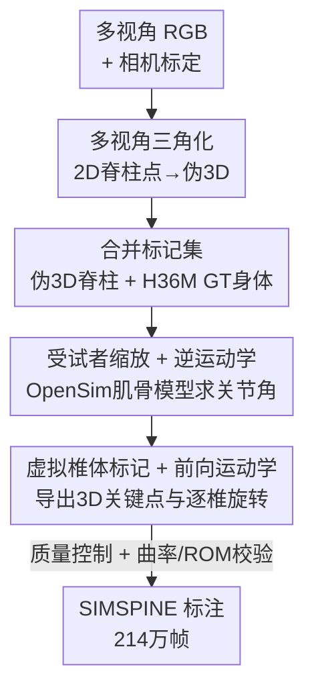

# SIMSPINE: A Biomechanics-Aware Simulation Framework for 3D Spine Motion Annotation and Benchmarking

**会议**: CVPR 2026  
**论文**: [CVF Open Access](https://openaccess.thecvf.com/content/CVPR2026/html/Khan_SIMSPINE_A_Biomechanics-Aware_Simulation_Framework_for_3D_Spine_Motion_Annotation_CVPR_2026_paper.html)  
**代码**: https://saifkhichi96.github.io/research/simspine/ （项目页，宣称将开源）  
**领域**: 医学图像 / 3D视觉 / 人体姿态  
**关键词**: 脊柱运动、生物力学、肌骨建模、3D关键点、数据集

## 一句话总结
作者把现成的 2D 脊柱检测器、多视角几何三角化和 OpenSim 肌骨逆运动学串成一条"生物力学感知"的模拟标注流水线，给 Human3.6M 自动补上 15 个解剖一致的椎体级 3D 关键点与逐椎旋转，做出首个开放的 3D 脊柱运动数据集 SIMSPINE（214 万帧），并配齐 2D/3D 基线把室内脊柱跟踪的 AUC 从 0.63 提到 0.80。

## 研究背景与动机
**领域现状**：人体运动捕捉和 3D 姿态估计已经能很好地追踪四肢这种大尺度运动（动作识别、人机交互都靠它），主流 2D→3D lifting 模型基本都在 Human3.6M 上训练。

**现有痛点**：但这些方法只盯着关节几何，完全忽略了脊柱——脊柱由 24 节可动椎骨组成、每节有 3 个旋转自由度，运动高度非线性且椎间耦合，而椎体旋转、姿态摆动、骨盆代偿这些"微动作"恰恰决定脊柱稳定性、载荷分布和损伤风险（对运动损伤预防、人体工学、康复至关重要）。现有 RGB 路线要么靠贴运动学胶带做标记（需暴露皮肤、只能受控环境），要么像 SpineTrack 那样停留在 2D、标注不透明、生物力学可信度低。

**核心矛盾**：要学椎体级运动得有大规模 3D 脊柱标注，但 in vivo 测量（双荧光透视、EOS、动态 MRI）精度高却昂贵、剂量大、只能小样本静态采集；而纯视觉又拿不到椎体级 ground truth——精度和规模之间没法兼得。

**本文目标**：在不约束受试者（不限定静止、近距裸露视角或固定机位）的自然全身运动下，拿到解剖有效、临床相关的 3D 脊柱运动标注。

**切入角度**：作者跟随 SpineTrack 的判断——解决这个问题的第一步是先攒出一个全面的 3D 脊柱运动数据集。关键观察是：脊柱微动其实和全身姿态变化耦合，而肌骨模型（OpenSim）早已能把关节轨迹反解成符合解剖约束的椎体运动，只是从没和视觉打通做大规模图像标注。

**核心 idea**：用"生物力学感知的关键点模拟"代替昂贵的 in vivo 测量——让肌骨逆运动学去给已有姿态数据集"补标"椎体级 3D 关键点，把肌骨仿真和计算机视觉桥接起来。

## 方法详解

### 整体框架
方法本质是一条**离线数据生成流水线**（不是要训练一个新网络），输入是 Human3.6M 的同步多视角 RGB + 相机标定 + 官方 3D 身体标记，输出是每一帧上解剖一致的椎体级 3D 脊柱关键点 + 逐椎欧拉旋转。整条管线分五步：先用现成 2D 脊柱检测器在多视角图上预测脊柱点并三角化成"伪 3D"，把它和 Human3.6M 的 GT 身体标记合并成统一标记集，用受试者缩放后的 OpenSim 肌骨模型对该标记集做逆运动学（IK）求关节角，再在椎体上挂虚拟标记、用前向运动学（FK）算出 3D 轨迹，最后做质量控制与曲线校验。这里的精妙在于：单视角检测器给不了可靠 3D，但把它当作"弱监督"喂给带解剖约束的 IK，模型会被肌骨结构"拉回"到生物力学合理的解上。

### 关键设计

**1. 多视角三角化把 2D 检测拔到伪 3D**

第一步要先有一个 3D 起点，但没有任何椎体级 3D 真值。作者用 SpinePose 这个预训练 2D 检测器在每个同步帧的每个视角 $v$ 上预测 9 个脊柱 2D 点 $\hat{u}_{v,t}$，再借 Human3.6M 的标定内外参 $\{K_v, R_v, t_v\}$ 做鲁棒三角化，求让重投影误差最小的伪 3D 点：

$$\tilde{X}_t = \arg\min_X \sum_{v\in V} \rho\big(\|\Pi(K_v[R_v|t_v]X) - \hat{u}_{v,t}\|_2^2\big)$$

其中 $\Pi(\cdot)$ 是透视投影，$\rho$ 取 Huber 鲁棒惩罚以压制离群检测；再用视角一致性、重投影误差阈值剔点，并做零相位低通滤波抑制帧间抖动。这一步的产物只是"伪标签"（带噪声），它本身不可靠——所以才需要后面用解剖约束去净化它，而不是直接拿来当标注。

**2. 合并标记集 + 受试者缩放逆运动学（核心）**

这是整条管线"把噪声拉回解剖合理"的关键。作者把伪 3D 脊柱点 $\tilde{X}_t$ 和 Human3.6M 的 GT 身体标记 $Y_t$ 通过语义对应、时间同步、缺失视角短时插值，合并成统一 OpenSim 标记集 $Z_t = \{Y_t, \tilde{X}_t\}$；身体模型基于 Rajagopal 全身模型、腰椎细节取自 Beaucage-Gauvreau 模型，按受试者身高/体重缩放。然后逐帧解一个加权最小二乘 IK：

$$q_t^\star = \arg\min_{q_t} \sum_{m\in M} w_m \|z_{m,t} - \hat{z}_m(q_t)\|_2^2 + \lambda\|Dq\|_2^2$$

$\hat{z}_m(q_t)$ 是关节状态 $q_t$ 经 FK 得到的模型标记位置，$w_m$ 是逐标记置信度——这里有个巧思：**给可信的 Human3.6M 身体标记高权重、给噪声大的伪脊柱点低权重**，让解剖结构主导而非被噪声带偏；$D\|Dq\|$ 惩罚关节速度/加速度保证时序平滑。模型只让腰椎（T12–L1 到 L5–S1）全 3-DOF 铰接、颈胸交界用单个 3-DOF 聚合关节、其余胸/颈椎当刚体——这是为了在"RGB 输入可辨识"和"近似胸廓肋骨约束"之间取舍，否则自由度太多会从 RGB 反解不出唯一解。

**3. 虚拟椎体标记 + 前向运动学导出关键点与旋转**

IK 给的是关节角 $q_t^\star$，但下游要的是 3D 关键点坐标。作者在椎体质心挂上虚拟标记，用 FK 从 $q_t^\star$ 算出它们的 3D 轨迹，得到沿脊柱分布（骶骨基底到下颈段）的 3D 脊柱关键点；同时导出逐椎绕解剖轴的欧拉旋转（屈伸、侧弯、轴向旋转）作为生物力学参数。最终每帧 37 个标记（12 个 H36M 肢体点 + 15 个新增高精度脊柱点 + 10 个足/面伪标签）、62 个运动学轴（含 56 个欧拉角）。这一步让数据集不只给"点在哪"，还给"每节椎骨转了多少度"，这是纯视觉标注给不出的。

**4. 生物力学有效性校验让"模拟标注"可信**

模拟数据最大的质疑是"会不会编出物理上不可能的脊柱"。作者用统计分析 + 对照生物力学文献来证伪：用 Cobb 法在 L1–S1 和 T3–T12 端板间算腰椎前凸角（LLA）和胸椎后凸角（TKA），结果均值落在 32–41° 和 28–39°，正好在正常成人范围内，还复现了动作相关趋势（坐姿前凸减小、抬臂动作后凸减小）；逐椎腰椎活动度（ROM）随椎位的梯度（屈伸在 L4–L5 达峰后在 L5–S1 回落、侧弯中腰椎最大、轴向旋转整体偏小）与 White & Panjabi (1978) 的经典报告吻合——而这些梯度是纯姿态先验难以复现的，它们的出现说明 IK 解同时尊重了形态和运动约束。这一节不是实验，而是方法的一部分：它把"自动生成的标注"从"看起来对"升级成"经得起生物力学对照"。

## 实验关键数据

作者用 SIMSPINE 建了三个任务的基线：2D 脊柱姿态估计、多视角 3D 三角化重建、单目 3D lifting。

### 主实验：2D 脊柱姿态估计

把 SpinePose 在 SpineTrack(室外) + SIMSPINE(室内) 混合数据上微调，室内用 AUC of PCK、室外用 COCO 风格 AP/AR（B=全身、S=脊柱子集）：

| 模型 | 训练数据 | 室外 AP_S | 室内 AUC |
|------|---------|----------|---------|
| SpinePose-m (原版) | SpineTrack | 0.914 | 0.633 |
| SpinePose-l-ft | +SIMSPINE | 0.917 | **0.803** |
| SpinePose-m-ft | +SIMSPINE | **0.928** | 0.798 |
| ViTPose-b | +SIMSPINE | 0.921 | 0.794 |

室内脊柱跟踪 AUC 从 0.633 直接拉到 0.80（论文摘要表述为 0.63→0.80），室外 AP_S 从 0.91→0.93，代价是全身 AP_B 相对最强预训练版略降。

### 多视角三角化 / 单目 lifting

| 任务 | 配置 | 指标 | 数值 |
|------|------|------|------|
| 多视角三角化 | 微调检测器 | MPJPE(全脊柱) | 38.5 mm |
| 多视角三角化 | 微调检测器 | P-MPJPE | 29.5 mm |
| 多视角三角化 | GT 2D(oracle) | P-MPJPE | 亚毫米级(0.67 mm) |
| 单目 lifting | 脊柱-only(检测2D) | P-MPJPE | 18.6 mm |
| 单目 lifting | 全身(检测2D) | P-MPJPE | **16.3 mm** |
| 单目 lifting | 全身(GT 2D) | P-MPJPE | **13.5 mm** |

GT 2D 下三角化达到亚毫米级 P-MPJPE，证明几何一致性；检测器版停在 20–40 mm，说明瓶颈在 2D 检测噪声而非几何。单目 lifting 里**全身关键点训练全面优于只用脊柱点**（18.6→16.3、17.5→13.5），说明全局上下文有助于椎体定位。

### 消融实验：混合比例与策略

| SIMSPINE 占比 | 室内 AUC | 室外 AP | 说明 |
|--------------|---------|--------|------|
| 0% | 0.61 | 高 | 纯室外，室内差 |
| 2% (≈31k 图) | ≈0.79 | ≈0.84 | 近饱和，默认配置 |
| 10% | 0.79 | ≈0.84 平台 | 室内继续微升，室外已饱和 |

### 关键发现
- **只用 2% 的 SIMSPINE（约 3.1 万张室内图，正好匹配 SpineTrack 的 3.3 万室外图）就把室内 AUC 从 0.61 推到约 0.79**，更多合成数据收益递减——高质量小样本比海量更有效。
- **per-batch(PB) 混合优于 per-epoch(PE) 交替**：PB 让优化器每个 iteration 同时看到两域样本，AdamW 的梯度统计和动量更平滑，避免偏向单一域；PE 会以牺牲一域为代价偏向另一域。
- 检测器是整条 3D 链路的瓶颈：GT 2D 下能到亚毫米，换成检测 2D 立刻退化到几十毫米。

## 亮点与洞察
- **把"弱监督 + 物理先验"做成标注引擎**：单视角脊柱检测器本身不可信，但用解剖约束的 IK 当"正则化器"去净化它，等于让肌骨结构替你纠错——这套"噪声检测 → 物理模型拉回"的范式可迁移到任何缺 3D 真值但有结构先验的标注任务（如手部、足部生物力学）。
- **逐标记置信度加权 IK 很关键**：给可信 GT 高权重、给噪声伪标签低权重，是让脊柱不被检测噪声带歪的核心 trick，简单但有效。
- **把"数据可信度验证"写进方法**：用 Cobb 角和椎位 ROM 梯度对照经典文献，而不是只报数字，给"模拟标注"提供了可证伪的可信度证据——这是合成数据论文值得学的做法。

## 局限与展望
- **仅运动学、未做动力学验证**：OpenSim 只解了 IK，没有强制肌肉激活、地面反力、载荷平衡，所以轨迹几何合理但未经物理验证；未来可耦合逆动力学/最优控制做力一致的运动生成。
- **解剖建模被大幅简化**：只铰接 5 个腰椎间关节 + 单个 3-DOF 颈胸聚合关节，其余胸/颈椎当刚体，忽略肋骨耦合、软组织、椎间平移和腰骶耦合（lumbopelvic rhythm），颈椎只有约一半的真实 ROM 覆盖。
- **视觉域受限**：所有运动都来自 Human3.6M 室内固定机位、15 个动作，外观多样性和临床病理不在范围内，对真正 in-the-wild 场景的泛化存疑。
- **隐含健康人假设**：仅按身高/体重缩放，未建模年龄/性别/病理导致的矢状面对齐差异——作者明确定位它为"大规模预训练资源"而非临床测量，下游应在小规模生物力学验证集上再微调。
- 数据集自带的**角度标注尚未被基准化**（表示/归一化/解释属于正交设计选择），是明确的待办。

## 相关工作与启发
- **vs SpineTrack [31]**：SpineTrack 是真实 RGB 但停留在 2D、标注不透明、生物力学验证有限；SIMSPINE 用它的检测器当起点，但通过 IK/FK 升到解剖一致的 3D + 逐椎旋转，并补上曲率/ROM 的生物力学校验。
- **vs in vivo 测量（双荧光透视 + MBT / EOS / 动态 MRI）**：那些方法精度可达亚毫米但昂贵、剂量大、只能小样本静态采集；SIMSPINE 牺牲绝对精度换规模（214 万帧、自然全身运动），定位为可扩展的方法开发与基准代理。
- **vs 主流 2D→3D lifting（MotionBERT / MotionAGFormer 等）**：它们做全身重建却忽视解剖有效性和椎间一致性；本文证明把脊柱当成解剖约束的子结构、并用全身上下文辅助，能更准地定位椎体。

## 评分
- 新颖性: ⭐⭐⭐⭐ 首个把肌骨逆运动学和视觉打通做大规模 3D 脊柱标注的开放资源，范式新但部件多为现成组合
- 实验充分度: ⭐⭐⭐⭐ 三任务基线齐全 + 生物力学校验 + 混合比例消融，但角度标注未基准化、无 in vivo 绝对精度对照
- 写作质量: ⭐⭐⭐⭐ 流水线讲得清楚，局限交代非常诚实
- 价值: ⭐⭐⭐⭐ 填补了视觉里脊柱级 3D 标注的空白，对生物力学/康复/数字人是有用的预训练资源

<!-- RELATED:START -->

## 相关论文

- [\[CVPR 2026\] A Supervised Multi-task Framework for Joint cryo-ET Restoration Enabled by Generative Physical Simulation](a_supervised_multi-task_framework_for_joint_cryo-et_restoration_enabled_by_gener.md)
- [\[CVPR 2026\] Prospective Dynamic 3D MRI Reconstruction via Latent-Space Motion Tracking from Single Measurement](prospective_dynamic_3d_mri_reconstruction_via_latent-space_motion_tracking_from_.md)
- [\[CVPR 2026\] Benchmarking Endoscopic Surgical Image Restoration and Beyond](benchmarking_endoscopic_surgical_image_restoration_and_beyond.md)
- [\[CVPR 2026\] Sketch2CT: Multimodal Diffusion for Structure-Aware 3D Medical Volume Generation](sketch2ct_multimodal_diffusion_for_structure-aware_3d_medical_volume_generation.md)
- [\[CVPR 2026\] VesMamba: 3D Pulmonary Vessel Segmentation from CT images via Mamba with Structural Perception and Scale-aware Filtering](vesmamba_3d_pulmonary_vessel_segmentation_from_ct_images_via_mamba_with_structur.md)

<!-- RELATED:END -->
