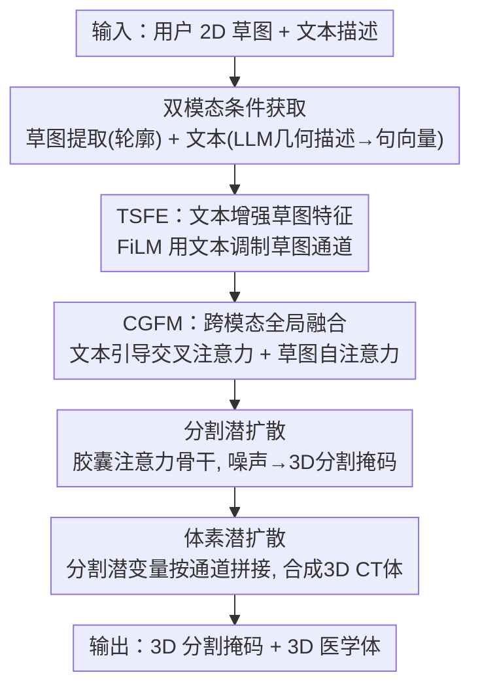

# Sketch2CT: Multimodal Diffusion for Structure-Aware 3D Medical Volume Generation

**会议**: CVPR 2026  
**论文**: [CVF Open Access](https://openaccess.thecvf.com/content/CVPR2026/html/An_Sketch2CT_Multimodal_Diffusion_for_Structure-Aware_3D_Medical_Volume_Generation_CVPR_2026_paper.html)  
**代码**: https://github.com/adlsn/Sketch2CT  
**领域**: 医学图像  
**关键词**: 医学图像合成, 潜空间扩散, 草图与文本条件, 3D体生成, 数据增广

## 一句话总结
Sketch2CT 让用户用一张 2D 草图加一段文本描述，先经双模态融合生成解剖一致的 3D 分割掩码、再用分割条件的潜扩散合成对应的 3D CT 体，实现低成本、可控、保结构的医学体数据增广。

## 研究背景与动机
**领域现状**：医学影像因隐私、采集成本和专家标注稀缺而长期面临数据匮乏，扩散模型凭借高保真和稳定训练成为医学图像合成的主力，并可通过文本、分割掩码、草图等辅助模态做条件生成。

**现有痛点**：现有医学合成路线各有硬伤——(1) 2D 切片扩散视觉逼真但相邻切片间缺乏解剖连续性，拼不出一致的 3D 体；(2) 直接做全 3D 扩散能保空间连贯，却算力/显存开销巨大，限制分辨率和可扩展性；(3) 分割引导的条件模型依赖预先给定的分割掩码，输出的多样性和可控性都受限。

**核心矛盾**：要可控就得给条件，但纯分割掩码条件要么需要现成掩码、要么（如 MedGen3D 先随机生成掩码再合成体）因掩码随机而失去结构控制；单一草图又缺深度和体积语境，从一张投影很难还原完整 3D 分割。可控性、3D 一致性、计算成本三者难以兼得。

**本文目标**：把问题拆成两步——先从低成本草图+文本可控地生成解剖一致的 3D 分割掩码，再用该掩码条件合成高保真 3D CT 体。

**切入角度**：作者观察到草图与文本天然互补——草图给出器官的粗结构轮廓（结构蓝图），文本给出草图缺失的深度/体积/几何语义（如对称性、拓扑连续性）；把二者融合就能在潜空间高效生成保结构的 3D 体。

**核心 idea**：用"草图+文本"双模态条件，经局部（FiLM 文本调制草图）与全局（两级注意力）两层融合驱动两阶段潜扩散，先生成 3D 分割掩码、再据此合成 3D 医学体。

## 方法详解

### 整体框架
Sketch2CT 是清晰的两阶段潜空间扩散流水线。第一阶段做"分割掩码生成"：从 3D 分割提取 2D 草图捕捉轮廓、用 LLM 把几何度量转成文本描述、把草图与文本经 TSFE+CGFM 两层融合，再喂给胶囊注意力骨干的分割潜扩散模型，从噪声生成解剖一致的 3D 分割掩码。第二阶段做"医学体生成"：把生成的分割潜变量按通道拼进体的潜扩散模型作结构先验，合成与分割对齐的高保真 3D CT 体。两阶段都在 MONAI 的 3D AutoencoderKL 压缩出的潜空间里做扩散，并采用 v-prediction 参数化。

### 关键设计

**1. 双模态条件获取：草图给结构、文本补 3D 语义**

痛点在于单一草图缺深度和体积语境，从一张 2D 投影难以还原完整 3D 分割，而多视角草图又会大幅增加用户负担。作者让两种廉价模态互补：**草图侧**——在 3D Slicer 里渲染器官表面投影（体积型器官如肝/心取轴位、管状器官如主动脉取矢状位以贴合主轴），再经灰度化、直方图均衡、双边滤波、Canny 边缘检测和形态学细化得到干净连续的轮廓草图；通过调阈值/核大小可控制抽象程度。**文本侧**——沿轴/冠/矢三轴生成 2D 快照，并从分割掩码算出体积、表面积、主轴长度、最大/最小直径、球度、紧致度、中心线长度等几何度量，把快照+度量喂给 GPT-4o-mini 当"几何描述专家"，只输出形状/表面光滑度/对称性/拓扑连续性等几何 JSON（显式排除任何诊断/临床信息，因此无需医学专用 LLM），再用预训练 sentence transformer 编码成文本嵌入。其有效性在于：草图提供直观结构先验、文本补上草图缺失的 3D 几何语义，且推理时用户可自由编辑文本，无需参考分割就能交互式控制生成。

**2. TSFE：文本增强的草图特征提取（局部调制）**

痛点在于草图稀疏、只有边缘，纹理/阴影信息少且边界常因投影或噪声而断续，直接用卷积骨干编码会导致特征歧义、结构线索丢失。TSFE 用文本语义先验来"加固"稀疏草图：草图先经卷积骨干 + 主胶囊 + 注意力路由编码成胶囊嵌入 $f_s \in \mathbb{R}^{d_s}$，文本经句向量编码为 $f_t \in \mathbb{R}^{d_t}$；再用 FiLM 机制由文本生成逐通道的缩放和平移参数 $\gamma, \beta = g(f_t)$，对草图特征做调制 $\tilde{f}_s = \gamma \odot f_s + \beta$（$\odot$ 为逐元素乘）。这样文本能自适应放大语义相关的草图通道、抑制无关通道，产出更稳定、信息量更高的草图嵌入。它有效是因为把"文本懂什么器官"这一全局语义直接注入到草图的通道级表示里，缓解了稀疏边缘的特征歧义。

**3. CGFM：跨模态全局融合（两级注意力对齐）**

光有局部调制还不够全局对齐，CGFM 用两级注意力做跨模态联合推理：先以文本引导的**交叉注意力**整合细粒度语义，$F_{local} = \text{Attention}(\tilde{f}_s, f_t, f_t)$，捕捉草图轮廓与文本语义的局部对应；再用草图引导的**自注意力**聚合成全局表示 $F_{global} = \text{SelfAttn}(F_{local})$，概括器官整体几何与语义；最后拼接投影得到联合多模态特征 $z_{fusion} = \text{Proj}([F_{local} \| F_{global}])$ 作为分割潜扩散的条件输入。TSFE 做局部通道调制、CGFM 做全局层次对齐，二者互补地弥合了模态鸿沟，产出几何感知的稳健多模态嵌入。

**4. 两阶段潜空间扩散（分割 LDM → 体 LDM）**

痛点在于直接在体素空间做 3D 扩散算力/显存吃不消。两阶段都先用 MONAI 的 3D AutoencoderKL 把数据压到紧致潜空间再扩散。**分割阶段**：把分割体 $x_0$ 编码为 $z_0 = E_{seg}(x_0)$，前向加噪 $q(z_t|z_{t-1}) = \mathcal{N}(\sqrt{\alpha_t} z_{t-1}, (1-\alpha_t)I)$，反向用 UNet 去噪网络 $\epsilon_\theta$ 在多层经交叉注意力注入条件 $z_{fusion}$；采用 v-prediction 参数化，目标速度 $v_t = \sqrt{\alpha_t}\,\epsilon - \sqrt{1-\alpha_t}\,z_0$，损失 $L_{diff} = \mathbb{E}_{t,z_0,\epsilon}[\|\epsilon_\theta(z_t,t,z_{fusion}) - v_t\|_2^2]$，去噪得潜变量再解码出 3D 分割掩码。**体生成阶段**：把上一步分割掩码编码成 $z_{seg}$ 当结构先验，与带噪图像潜变量按通道拼接 $z_{t-1} = \epsilon_\theta(z_t \| z_{seg}, t)$ 引导去噪，使合成体既保解剖几何、又能生成真实组织纹理。其有效性在于：潜空间扩散把全 3D 生成的算力压下来，而"分割潜变量作结构先验"在几何与纹理之间建立了强约束，保证图像与解剖结构对齐。

### 损失函数 / 训练策略
两阶段扩散均用 v-prediction 参数化、最小化预测速度与目标速度的 MSE（式 9）。AutoencoderKL 用三级分辨率、通道宽 (32,64,64)、每级一个残差块、仅最深层加空间注意力；扩散训练时冻结自编码器只当潜编解码器。去噪 3D UNet 通道宽 (32,64,64)、每级一个残差块、最后两级加空间注意力，交叉注意力条件维 1024、每个注意力层一层 transformer。用 DDPM 调度 1000 步，Adam 学习率 $1\times10^{-4}$、batch 10、混合精度，训练 300 epoch（单张 NVIDIA H200）。所有体重采样到 $128\times128\times128$，数据集按 8:2 划分训练/测试。

## 实验关键数据

在三个公开 CT 数据集 + 一个 MRI 数据集上评测：CHAOS liver（20 CT，肝）、AVT aorta（56 CT，主动脉）、Decathlon liver（131 CT，肝）、Decathlon heart（20 MRI，心）。

### 主实验：合成图像质量（Table 1，FID↓ / LPIPS↑）

| 方法 | CHAOS肝 FID/LPIPS | AVT主动脉 FID/LPIPS | Decathlon肝 FID/LPIPS | Decathlon心 FID/LPIPS |
|------|------|------|------|------|
| Med-DDPM | 114.4 / 0.220 | 119.6 / 0.213 | 115.3 / 0.207 | 128.7 / 0.192 |
| MedGen3D | 43.6 / 0.300 | 47.1 / 0.294 | 45.7 / 0.296 | 96.8 / 0.248 |
| Seg-Diff | 37.8 / 0.310 | 38.9 / 0.313 | **34.8 / 0.335** | 68.4 / 0.265 |
| **Sketch2CT** | **33.7 / 0.332** | **36.9 / 0.321** | 36.5 / 0.328 | **65.1 / 0.269** |

Sketch2CT 在多数数据集上 FID/LPIPS 最优；在含噪、各方法都更难的 Decathlon 心脏上仍明显领先。Seg-Diff 仅在数据量更大的 Decathlon 肝上 FID 略胜（其 2D 扩散受益于更多数据），但缺轴向连续性；Sketch2CT 在保全 3D 空间信息的同时达到了与 2D 方法相当的图像质量。

### 下游有用性实验

**(a) 对输入掩码的忠实度（Table 2，Dice）**：用辅助分割网络在生成图上预测分割，与输入掩码 $m$ 及真实图预测的分割 $m^{pred}_{real}$ 比 Dice，Sketch2CT 全数据集最高（如 CHAOS 肝 0.868/0.852、Decathlon 肝 0.912/0.904），表明合成图最忠实地保留了空间结构。

| 配置 / 指标 | CHAOS肝 Dice(gen,m) | Decathlon肝 Dice(gen,m) | 说明 |
|------|------|------|------|
| Med-DDPM | 0.501 | 0.512 | 结构保真最差 |
| MedGen3D | 0.814 | 0.821 | — |
| Seg-Diff | 0.827 | 0.892 | 2D 单切片强 |
| **Sketch2CT** | **0.868** | **0.912** | 3D 结构忠实度最高 |

**(b) 下游分割泛化（Table 3，Dice）**：用各方法合成图训练分割网络、在真实数据上测。Sketch2CT 全数据集最接近"真实训练集"上界（CHAOS 肝 0.893 vs 真实 0.897；Decathlon 肝 0.904 vs 0.912），说明其合成图最逼真地复刻了解剖细节，最适合做数据增广。

### 关键发现
- **3D 一致性是 Sketch2CT 的核心优势**：2D 方法（Seg-Diff）单切片质量高但缺轴向连续性，Sketch2CT 在保全 3D 空间连贯的前提下追平 2D 的图像质量。
- **草图+文本双模态可控且低成本**：实验用真值导出的草图/文本，以及"手绘草图+轻量文本"两种来源各造 20 对，验证用户廉价手绘也能驱动生成。
- **合成数据真能涨点**：用 Sketch2CT 合成图训练的分割模型逼近真实数据上界，证明其作为数据增广手段的实际价值；两位医学影像专家也从解剖真实性、结构连续性、临床合理性上做了定性确认。

## 亮点与洞察
- **"先掩码后体"两阶段把可控性和 3D 一致性同时拿下**：分割阶段保证解剖结构受草图+文本控制，体阶段把结构先验翻译成纹理，避免了纯随机掩码（MedGen3D）失控、也避免了纯 2D 拼接断层。
- **用 LLM 当"纯几何描述器"很巧**：只让 GPT-4o-mini 输出形状/对称/拓扑等几何 JSON、显式排除临床诊断，既补足了草图缺的 3D 语境、又规避了对医学专用 LLM 的依赖——这套"把分割当通用 3D 物体来描述"的思路可迁移到任何形状条件生成。
- **局部 FiLM + 全局两级注意力的双层融合**：TSFE 在通道级注入文本语义先验稳住稀疏草图，CGFM 再做跨模态全局对齐，互补地弥合模态鸿沟，是处理"稀疏结构模态 + 语义文本模态"融合的可复用范式。

## 局限与展望
- 当前实现仅覆盖少数器官、且专注单器官合成，未做多器官联合生成（作者承认）。
- 潜空间压缩会损失部分细尺度细节；作者认为对医学分析而言全局解剖一致性比细节更关键，但这对需要细微病灶的任务可能不够。
- 草图提取依赖 3D Slicer/PyVista 渲染 + 一串 OpenCV 手工算子（阈值、核大小需调），自动化与鲁棒性有限，对不同器官需重新调参。
- 评测以分割忠实度/下游泛化为主，缺乏放射科医生的大规模盲评与病理多样性验证；作者计划扩到多器官、引入疾病特异草图编辑模拟病理变化，并做更广的专家评估。

## 相关工作与启发
- **vs MedGen3D [24]**: 它先随机生成 3D 分割掩码再合成体，掩码随机导致结构控制弱；Sketch2CT 用草图+文本可控地生成掩码，结构忠实度和下游泛化都更高。
- **vs Seg-Diff [29]**: 它是分割引导的 2D 扩散、单切片质量好但缺轴向连续、且自身不能生成分割掩码；Sketch2CT 直接生成 3D 掩码并保全体一致性，仅在数据量最大的单数据集上 FID 被其略超。
- **vs Med-DDPM [13]**: 纯 3D/切片扩散无多模态结构条件，结构保真度（Dice ~0.50）远低；Sketch2CT 借双模态条件大幅提升解剖一致性。
- **vs 点云草图+文本方法（Wu et al. [57]）**: 同样用胶囊注意力联合处理草图与文本，但目标是彩色 3D 点云生成；Sketch2CT 把这一思路迁移到医学体的两阶段潜扩散，并补上分割掩码这一医学下游关键的结构中介。

## 评分
- 新颖性: ⭐⭐⭐⭐ 首个把草图+文本双模态扩散用于结构感知 3D 医学体生成，两阶段+双层融合设计清晰
- 实验充分度: ⭐⭐⭐⭐ 四数据集、FID/LPIPS + 忠实度 + 下游泛化三类评测扎实；但消融在正文缺席（放补充材料）
- 写作质量: ⭐⭐⭐⭐ 动机与方法叙述清楚、公式完整；部分模块细节偏简
- 价值: ⭐⭐⭐⭐ 提供低成本可控的医学体数据增广路径，下游分割接近真实数据上界

<!-- RELATED:START -->

## 相关论文

- [\[CVPR 2026\] MR-RAG: Multimodal Relevance-Aware Retrieval-Augmented Generation for Medical Visual Question Answering](mr-rag_multimodal_relevance-aware_retrieval-augmented_generation_for_medical_vis.md)
- [\[CVPR 2026\] SHAPE: Structure-aware Hierarchical Unsupervised Domain Adaptation with Plausibility Evaluation for Medical Image Segmentation](shape_structure-aware_hierarchical_unsupervised_domain_adaptation_with_plausibil.md)
- [\[CVPR 2026\] Masked-Diffusion Autoencoders for 3D Medical Vision Representation Learning](masked-diffusion_autoencoders_for_3d_medical_vision_representation_learning.md)
- [\[CVPR 2026\] Personalized Longitudinal Medical Report Generation via Temporally-Aware Federated Adaptation](personalized_longitudinal_medical_report_generation_via_temporally-aware_federat.md)
- [\[CVPR 2026\] MedGEN-Bench: Contextually Entangled Benchmark for Open-Ended Multimodal Medical Generation](medgen-bench_contextually_entangled_benchmark_for_open-ended_multimodal_medical_.md)

<!-- RELATED:END -->
