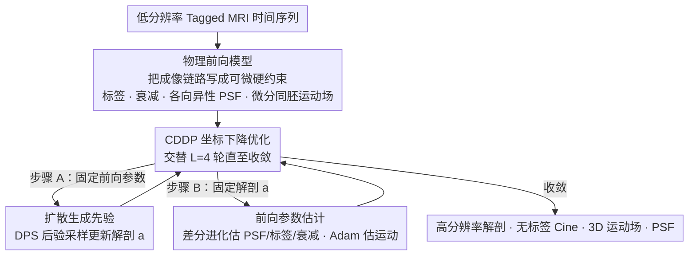

# Solving a Nonlinear Blind Inverse Problem for Tagged MRI with Physics and Deep Generative Priors

**会议**: CVPR 2026  
**arXiv**: [2603.00882](https://arxiv.org/abs/2603.00882)  
**代码**: 无  
**领域**: 医学图像  
**关键词**: Tagged MRI, 逆问题, 扩散先验, 运动估计, 图像超分辨

## 一句话总结

提出 InvTag 框架，首次将 MR 物理前向模型与预训练扩散生成先验结合，统一解决 3D Tagged MRI 的解剖恢复、Cine 合成和运动估计三大子任务，且无需任何额外训练数据。

## 研究背景与动机

Tagged MRI 通过在组织上施加周期性标签来追踪内部运动，广泛应用于心脏运动分析和脑生物力学研究。然而，其后处理面临三大挑战：

**标签干扰**：标签的存在使得常规解剖分割方法无法直接应用

**标签衰减 (Tag Fading)**：由于 T1 弛豫，标签对比度随时间急剧降低，违反光流法的亮度恒定假设

**低分辨率**：为加速采集，Tagged MRI 的空间分辨率通常低于标准结构 MRI

传统方法将运动追踪、Cine 合成和超分辨率作为独立任务分别处理，但这三者本质上是耦合的：可靠的运动追踪需要处理标签衰减和频谱重叠，而解决频谱重叠又需要分离解剖结构和标签模式。作者提出应以统一框架联合求解。

## 方法详解

### 整体框架

InvTag 把 Tagged MRI 分析整体当成一个**非线性盲逆问题**来解：给定一段低分辨率的 Tagged MRI 时间序列，它要一次性反推出四样东西——高分辨率解剖图像 $a$、无标签的 Cine 序列、3D 微分同胚运动场 $\{\phi_t\}$，以及成像系统未知的各向异性点扩散函数 (PSF)。之所以"非线性"，是因为可变形空间变换本身是非线性的；之所以"盲"，是因为 PSF 和标签衰减参数事先都不知道。框架由三块拼起来：一个把这些未知量映回观测的**物理前向模型**（硬约束）、一个提供解剖先验的**扩散生成先验**（软约束），以及一个在两者之间交替求解的 **CDDP 坐标下降优化器**。

### 关键设计

**1. 基于物理的前向模型：把 MR 成像过程写成可微分的硬约束**

传统方法把运动追踪、Cine 合成、超分辨当成三件独立的事，但它们其实纠缠在一起——要可靠追踪运动得先处理标签衰减和频谱重叠，而分离频谱重叠又得先把解剖结构和标签模式拆开。InvTag 干脆用一个前向模型把整条成像链路写清楚：

$$g_t^{\Box} = h_\gamma^{\Box} * \phi_{\theta_t}^* [a \cdot f_{\beta_t}(q_\alpha^{\Box})] + n_t^{\Box}$$

其中 $a$ 是参考帧解剖图，$q_\alpha^{\Box}$ 是用 SPAMM 物理参数化的正弦标签模式，$f_{\beta_t}$ 是仿射衰减模型，$h_\gamma^{\Box}$ 是各向异性高斯 PSF，$\phi_{\theta_t}$ 是基于 PINN 的微分同胚变形场（通过指数映射 $\phi_t = \exp\{v_t\}$ 保证微分同胚性，不会出现折叠）。关键在于所有时间帧共享同一个解剖 $a$，帧间差异只由 $\phi_t$ 产生，时序一致性就被天然约束住了，不用额外加正则。

**2. 扩散生成先验：用解剖流形把欠定问题拉回合理解**

盲逆问题本身是欠定的，光靠数据保真容易跑飞。InvTag 用一个在 80,000+ 张 1mm 各向同性 T1w 3D 头部体积上预训练好的扩散模型当解剖先验，通过 DPS (Diffusion Posterior Sampling) 把数据保真项塞进反向扩散 SDE 里：

$$da_\tau = -\eta_\tau \Big[\frac{1}{2}a_\tau + s_\vartheta(a_\tau, \tau) - \rho \nabla_{a_\tau} \mathcal{L}_{\text{rec}}(\hat{a}_0(a_\tau))\Big] d\tau + \sqrt{\eta_\tau} d\bar{w}$$

扩散得分项 $s_\vartheta$ 负责把采样往解剖流形上拉，数据保真项的梯度则让重建结果和观测对得上，两股力量在每一步同时作用。这样既不需要任何 Tagged/Cine 配对数据，又能借生成先验补足分辨率和缺失信息。

**3. 坐标下降与扩散先验 (CDDP)：让解剖和物理参数交替收敛**

解剖 $a$ 和前向模型参数互相依赖，同时优化会陷入强非凸的耦合景观。CDDP 把它拆成交替两步：(A) 固定前向参数，用扩散后验采样更新解剖 $a$；(B) 固定 $a$，对前向模型做最大似然估计。其中低维参数 ($\gamma, \alpha, \beta_t$) 因为景观高度非凸，用有界差分进化优化器搜；高维运动参数 $\theta_t$ 则用 Adam。第一帧先联合估出 $(a^\star, \alpha^\star, \gamma^\star)$ 并固定下来，后续帧只更新衰减和运动参数，既省算力又避免标签周期匹配的歧义。消融里把 CDDP 换成纯联合优化会让 PSNR 直接掉 6.35，可见这个交替策略才是盲逆问题能解开的关键。

### 损失函数 / 训练策略

- **数据重建损失**：$\mathcal{L}_{\text{rec}}(a) = \sum_t \sum_{\Box} \|g_t^{\Box} - \mathcal{A}_t^{\Box}(a)\|_2^2$
- **扩散先验**：预训练权重冻结，使用 256 步 DDIM 采样
- **CDDP 迭代**：$L=4$ 轮坐标下降，运动初始化为前一时间步状态（避免周期标签匹配歧义）
- 无需外部 Tagged 或 Cine 训练数据，无配对监督或微调

## 实验关键数据

### 主实验

**Tag-to-Cine 合成**（160 测试用例，20 AIBL + 20 Sleep 被试 × 4 成像设置）：

| 方法 | PSNR ↑ (t=1) | SSIM ↑ (t=1) | PSNR ↑ (t=6) | SSIM ↑ (t=6) |
|------|-------------|-------------|-------------|-------------|
| LowpassFuse | 26.43 | 0.62 | 26.68 | 0.66 |
| HARP Demod. | 24.28 | 0.52 | 23.93 | 0.54 |
| **InvTag (Ours)** | **28.38** | **0.83** | **28.41** | **0.84** |

**运动估计**：

| 方法 | EPE ↓ | EPE@95 ↓ | NegDet(%) ↓ |
|------|-------|----------|-------------|
| LKUnet | 1.35 | 2.94 | 0.043 |
| DeepTag | 1.27 | 2.97 | 0.060 |
| SyN | 1.06 | 2.41 | <0.001 |
| DRIMET | 0.79 | 1.61 | <0.001 |
| **InvTag (Ours)** | **0.60** | **1.31** | **<0.001** |

### 消融实验

| 配置 | PSNR ↑ | SSIM ↑ | EPE ↓ | EPE@95 ↓ |
|------|--------|--------|-------|----------|
| 无 PSF 估计 | 27.27 | 0.69 | 0.62 | 1.41 |
| 无衰减估计 | 28.21 | 0.80 | 0.71 | 1.56 |
| 无 CDDP（联合优化） | 22.05 | 0.46 | 1.57 | 2.73 |
| **完整模型** | **28.40** | **0.83** | **0.60** | **1.31** |

### 关键发现

- 去掉 CDDP 改用联合优化会导致严重失败（PSNR 降 6.35），说明交替优化对盲逆问题求解至关重要
- PSF 估计对合成质量贡献显著，衰减估计对运动追踪更关键
- 在真实旋转凝胶体模数据上（扩散先验仅在合成椭圆上训练），仍能成功恢复解剖和运动
- 5 次随机初始化运行的 PSF/标签参数方差可忽略，确认 CDDP 收敛可靠

## 亮点与洞察

- **首个统一框架**：同时解决 Tagged MRI 的三大核心任务，利用任务间耦合互相增强
- **非线性盲逆问题**：将 MR 物理作为硬约束、扩散先验作为软约束，解决此前扩散模型求解逆问题中假设线性/已知前向算子的局限
- **零样本泛化**：完全无需任何 Tagged/Cine 训练数据，仅依赖 T1w 扩散先验
- CDDP 策略在非凸优化中展现出良好的稳定性和收敛鲁棒性

## 局限与展望

- **运行时间长**：单帧需 1.2 小时（单张 A40 GPU），重复扩散采样和 PINN 优化是瓶颈
- 仅假设正弦标签，不支持网格标签和高阶标签
- 仅在脑部 Tagged MRI 上验证，未扩展到心脏 MR 标记等更广泛应用
- 缺乏不确定性量化，可能影响临床可信度

## 相关工作与启发

- 与传统 HARP/SinMod 等频域方法相比，InvTag 不需要预设标签频率，自动估计
- 相比 DPS 等通用扩散逆问题求解器，InvTag 处理了更复杂的非线性+盲设定
- CDDP 交替优化策略可推广到其他涉及未知前向模型的医学成像逆问题

## 评分

- 新颖性: ⭐⭐⭐⭐⭐ — 首次将 MR 物理与扩散先验结合解决非线性盲逆问题
- 实验充分度: ⭐⭐⭐⭐ — 160 测试用例 + 真实数据验证 + 完整消融，但缺少心脏数据
- 写作质量: ⭐⭐⭐⭐⭐ — 数学推导清晰严谨，物理建模完备
- 价值: ⭐⭐⭐⭐ — 方法优雅，但运行效率限制了实际临床部署

<!-- RELATED:START -->

## 相关论文

- [\[CVPR 2026\] KLIP: localized distribution shift detection via KL-divergence with diffusion priors in Inverse Problems](klip_localized_distribution_shift_detection_via_kl-divergence_with_diffusion_pri.md)
- [\[AAAI 2026\] Unsupervised Multi-Parameter Inverse Solving for Reducing Ring Artifacts in 3D X-Ray CBCT](../../AAAI2026/medical_imaging/unsupervised_multi-parameter_inverse_solving_for_reducing_ring_artifacts_in_3d_x.md)
- [\[CVPR 2026\] GenTract: Generative Global Tractography](gentract_generative_global_tractography.md)
- [\[CVPR 2026\] Dynamic Stream Network for Combinatorial Explosion Problem in Deformable Medical Image Registration](dynamic_stream_network_for_combinatorial_explosion_problem_in_deformable_medical.md)
- [\[CVPR 2026\] PMRNet: Physics-informed Multi-scale Refinement Network for Medical Image Segmentation](pmrnet_physics-informed_multi-scale_refinement_network_for_medical_image_segment.md)

<!-- RELATED:END -->
