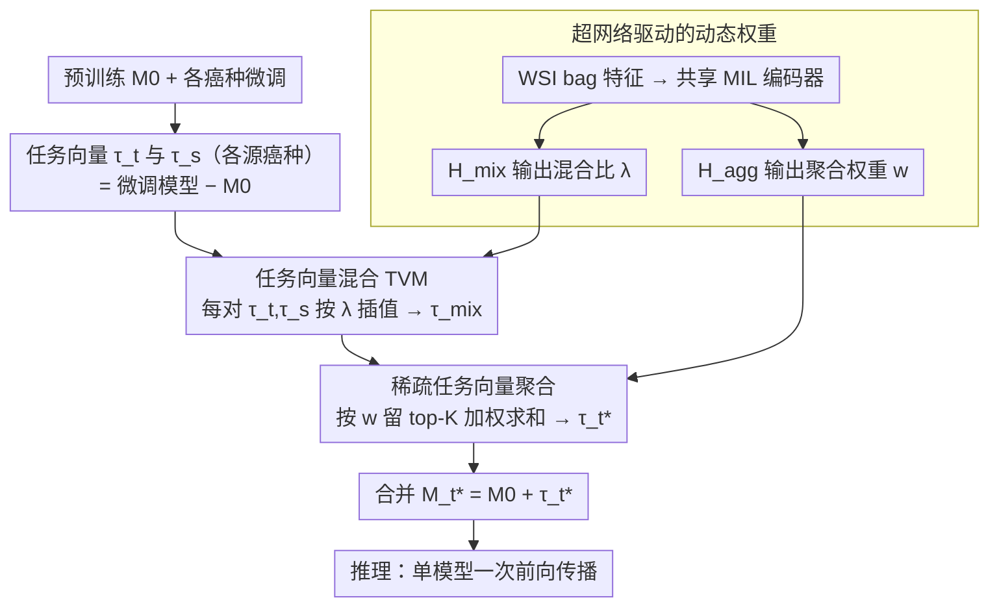

# STEPH: Sparse Task Vector Mixup with Hypernetworks for Efficient Knowledge Transfer in WSI Prognosis

**会议**: CVPR 2026  
**arXiv**: [2603.10526](https://arxiv.org/abs/2603.10526)  
**代码**: [GitHub](https://github.com/liupei101/STEPH)  
**领域**: 医学图像 / 计算病理学  
**关键词**: 全切片图像, 生存分析, 跨癌种知识迁移, 任务向量, 超网络, 模型合并

## 一句话总结

STEPH 提出基于任务向量混合（TVM）+ 超网络驱动稀疏聚合的模型合并方案，将多个癌种特定预后模型的知识高效融入目标癌种模型，在 13 个 TCGA 数据集上 C-Index 平均 0.6949（+5.14% vs 癌种特定学习、+2.01% vs ROUPKT），且推理仅需单模型前向传播，远低于多模型表示迁移方案。

## 研究背景与动机

**领域现状**：病理全切片图像（WSI）为 gigapixel 级，是癌症预后（生存分析）的核心数据源。基于多实例学习（MIL）的癌种特定模型是主流框架，但每个癌种训练样本仅约 1000 例，加上肿瘤异质性高，泛化性受限。

**现有痛点**：(1) **癌种特定学习**——数据量少、异质性高，单癌种模型泛化差；(2) **多癌种联合训练**——WSI 体量巨大导致计算成本极高，且存在隐私风险；(3) **表示迁移（ROUPKT）**——用多个源模型的 WSI 表示做路由聚合，但推理时需跑所有源模型，开销随源模型数线性增长。

**核心矛盾**：如何用单一模型高效吸收跨癌种知识，而不需要联合训练（计算高）或多模型推理（推理高）？

**本文目标** 通过模型合并（model merging）将多个癌种的预后知识"融入"目标癌种模型，实现轻量高效的跨癌种迁移。

**切入角度**：任务向量 $\tau_t = \mathcal{M}_t - \mathcal{M}_0$ 编码了该癌种的预后知识。不同于 MTL 中模型合并旨在保留多任务能力（需解决任务干扰），WSI 预后的目标是增强目标任务的泛化性——通过 mixup 插值混合源/目标任务向量来获得更好的优化方向。

**核心 idea**：对每个源-目标任务向量对做 mixup 插值以吸收有益知识，再用超网络学习输入自适应的稀疏聚合权重，最终合并为单一增强模型。

## 方法详解

### 整体框架

STEPH 想解决的是一个很实际的矛盾：每个癌种只有约 1000 例 WSI、模型泛化差，但联合训练（计算贵）和多模型推理（推理贵）都不划算。它的思路是在**参数空间**而不是数据空间做知识迁移。先用预训练模型 $\mathcal{M}_0$ 把每个癌种各自微调出一个专属模型，相减得到该癌种的"任务向量" $\tau_t = \mathcal{M}_t - \mathcal{M}_0$，这个向量编码了该癌种的预后知识。接着把目标癌种的 $\tau_t$ 分别与每个源癌种 $\tau_{s_i}$ 做 mixup 插值，得到一批混合向量；再让超网络挑出其中最有益的几个加权求和成 $\tau_t^*$；最终把它加回初始模型 $\mathcal{M}_t^* = \mathcal{M}_0 + \tau_t^*$ 就得到增强后的目标模型。整套流程合并完只剩一个模型，推理时一次前向传播就够。混合比 $\lambda$ 和聚合权重 $w$ 都不是手调常数，而是由两个共享 MIL 编码器的超网络读入当前 WSI 特征后自适应输出。

### 关键设计

**1. 任务向量混合（TVM）：在参数空间做 mixup，把源癌种知识"拌"进目标模型**

经典 mixup 是在输入或特征上插值，STEPH 把它搬到了任务向量上。对每个源-目标配对 $(\tau_t, \tau_{s_i})$ 做线性插值 $\tau_{\text{mix}} = \lambda_i \tau_t + (1-\lambda_i)\tau_{s_i}$，得到一个既带目标知识又吸了源知识的优化方向。关键是 $\lambda_i$ 不是手调的固定值，而是由超网络 $\mathcal{H}_{\text{mix}}$ 读入当前 WSI 的 bag-of-patches 特征后自适应输出（mean-MIL 编码 + sigmoid 约束到 $[0,1]$）——不同样本能拿到不同的混合比例。之所以敢这么"拌"，作者从 VRM（邻域风险最小化）角度给了理由：任务向量本质是微调过程累积下来的梯度，对它做 mixup 近似于在"虚拟混合数据"上训练得到的梯度，因此能换来更好的泛化。损失景观可视化和 SAR 分析也印证了这点——$\lambda$ 落在 $[0.7, 0.8]$ 区间时训练和测试损失都更低。

**2. 稀疏任务向量聚合：不是所有源癌种都该听，只挑 top-K 个有益的**

把目标和 12 个源癌种两两 mixup 会得到一批混合向量，但它们质量参差不齐——有的源模型本身没训好，有的癌种和目标存在固有冲突，全都平均进来反而会被噪声拖累。STEPH 借鉴 MoE 的稀疏路由，用另一个超网络 $\mathcal{H}_{\text{agg}}$（与 $\mathcal{H}_{\text{mix}}$ 共享 MIL 编码器、只换独立输出头）打分出非负权重 $w=\{w_i \ge 0\}$，只保留 top-$K$ 个做加权求和 $\tau_t^* = \sum_j w_j \tau_{\text{mix},j}$，其余直接丢弃。权重同样是输入自适应的，因为不同 WSI 样本可能从不同源癌种受益，比全局固定一套权重更灵活。为防止个别权重无限膨胀，再加一个辅助损失 $\mathcal{L}_{\text{agg}} = (\log\sum_i e^{w_i})^2$ 把权重整体压住。可视化里能看到这套机制确实在工作：目标为 BRCA 时，KIPAN、COADREAD、BLCA 三个癌种被分到较大的 $w_i$，说明 BRCA 确实从这几个特定癌种里捞到了有用知识。

**3. 超网络驱动的动态权重：在小数据上替代易过拟合的网格搜索**

前两个设计里的 $\lambda$ 和 $w$ 都交给超网络来出，而不是 grid search 出一组全局常数，这正是 STEPH 在小样本场景下的关键稳健性来源。WSI 预后每癌种才约 1000 例，靠固定参数在小验证集上搜超参极容易过拟合；让超网络根据每个输入动态生成混合比例和聚合权重，等于把"该信谁、信多少"这件事变成可学习的、随样本而变的决策。两个超网络共享一个 mean-MIL 编码器以省参数，各自接独立的全连接头。训练时除了主任务的 NLL 生存损失，还配两个正则项：$\mathcal{L}_{\text{mix}} = \sum_j \lambda_j^2 / K$ 鼓励模型多吸收源知识，$\mathcal{L}_{\text{agg}} = (\log\sum_i e^{w_i})^2$ 防止聚合权重爆炸。这套超网络方案的通用性很强——单把它接到已有的模型合并方法上，平均就能带来 14.5% 的提升。

### 损失函数 / 训练策略

NLL 生存分析损失 + 辅助损失（$\beta=0.05, \gamma$ 交叉验证）；$K=5$；$m=12$（12 个源癌种）；5-fold CV；UNI 提取 patch 特征。

## 实验关键数据

### 主实验——13 个 TCGA 数据集 C-Index 平均

| 方法 | 类别 | C-Index 均值 |
|------|------|-------------|
| Vanilla（癌种特定） | 癌种特定 | 0.6609 |
| Fine-tuned（癌种特定） | 癌种特定 | 0.6611 |
| ROUPKT | 表示迁移 | 0.6812 |
| Model Avg. | 模型合并 | 0.5804 |
| AdaMerging | 模型合并 | 0.5689 |
| TIES AM | 模型合并 | 0.6396 |
| Surgery AM | 模型合并 | 0.5943 |
| Iso-C AM | 模型合并 | 0.5699 |
| **STEPH** | **模型合并** | **0.6949** |

### 消融实验

| 配置 | C-Index 均值 |
|------|-------------|
| w/o mixup, fix $\lambda=0$（仅源） | 0.6860 |
| w/o mixup, fix $\lambda=1$（仅目标） | 0.6851 |
| w/ mixup, trainable $\lambda$ | 0.6921 |
| w/ mixup, **hypernetwork $\lambda$** | **0.6949** |
| w/o sparsity | 0.6912 |
| w/ sparsity, trainable $w$ | 0.6490 |
| w/ sparsity, **hypernetwork $w$** | **0.6949** |

### 超网络方案提升已有方法

| 方法 | 原始 | +超网络聚合 | 提升 |
|------|------|-----------|------|
| AdaMerging | 0.5689 | 0.6877 | +20.9% |
| TIES | 0.6396 | 0.6802 | +6.3% |
| Surgery | 0.5943 | 0.6668 | +12.2% |
| Iso-C | 0.5699 | 0.6761 | +18.6% |

### 关键发现

- STEPH 在 13 个数据集中 12 个优于癌种特定学习，平均提升 5.14%，最大单数据集提升 11.4%（BRCA）
- 现有通用模型合并方法（AdaMerging/TIES 等）在 WSI 预后任务上表现很差（0.57~0.64），因为它们设计目标是多任务而非单任务增强
- 超网络驱动的输入自适应权重是核心——将其应用到任何已有方法上都能获得平均 14.5% 的改善
- SAR 分析发现：TVM 的改进主要来自注意力层（attention layer）而非嵌入层，说明 MIL 中注意力聚合比实例编码更受益于跨癌种知识
- $\lambda$ 训练动态可视化：KIPAN、COADREAD、BLCA 三个癌种的 $\lambda_i < 0.3$ 且 $w_i$ 较大，说明 BRCA 确实从这些特定癌种中获取了有益知识

## 亮点与洞察

1. **模型合并用于单任务增强而非 MTL**：与主流模型合并研究（旨在获得多任务能力）不同，STEPH 的目标是增强单个任务的泛化——这种用途转变带来了全新的方法论需求（从解决任务干扰转向挖掘有益知识）
2. **VRM 理论框架为 TVM 提供理论支撑**：任务向量 mixup 不是简单的参数平均，而是近似了在混合虚拟数据上训练的效果，有理论根基
3. **超网络的通用增强能力**：将超网络驱动的聚合方案应用到 4 种已有方法上平均提升 14.5%，说明输入自适应机制本身就具有很强的通用性

## 局限与展望

1. 依赖 TCGA 数据集，某些癌种样本极少（<400 例），模型评估可能偏差较大
2. 实验基于通用 attention-based MIL 架构，更先进的 MIL 方法（如 graph-based）未验证
3. STEPH 仍需要训练数据来学习合并权重，training-free 的模型合并方案是未来方向
4. $K=5$（top-5 混合向量）为全局固定，未探索自适应 K 值

## 相关工作与启发

- **vs ROUPKT**：ROUPKT 在推理时需跑所有源模型得到表示再路由聚合，开销随源模型数线性增长。STEPH 训练时合并为单模型，推理时仅一次前向传播，效率质的飞跃
- **vs AdaMerging/TIES**：通用模型合并方法关注多任务+解决干扰，STEPH 关注单任务增强+挖掘有益知识，目标不同导致方法论差异显著
- **vs data mixup**：经典 mixup 是在输入/特征空间做插值，STEPH 在参数空间（任务向量）做 mixup，是 mixup 思想的有趣延伸

## 评分

⭐⭐⭐⭐

- **新颖性** ⭐⭐⭐⭐：模型合并用于单任务增强的视角新颖，TVM 有 VRM 理论支撑
- **实验充分度** ⭐⭐⭐⭐⭐：13 个数据集、多类 baseline、消融、可视化、超参分析均完备
- **写作质量** ⭐⭐⭐⭐：问题定义清晰，理论分析+可视化辅助证据充分
- **价值** ⭐⭐⭐⭐：为计算病理学的跨癌种知识迁移提供了高效方案，超网络聚合具有通用性

<!-- RELATED:START -->

## 相关论文

- [\[CVPR 2026\] GaussianPile: A Unified Sparse Gaussian Splatting Framework for Slice-based Volumetric Reconstruction](gaussianpile_a_unified_sparse_gaussian_splatting_framework_for_slice-based_volum.md)
- [\[CVPR 2026\] Momentum Memory for Knowledge Distillation in Computational Pathology](momentum_memory_for_knowledge_distillation_in_computational_pathology.md)
- [\[CVPR 2026\] Forecasting Epileptic Seizures from Contactless Camera via Cross-Species Transfer Learning](forecasting_epileptic_seizures_from_contactless_ca.md)
- [\[CVPR 2026\] MedGRPO: Multi-Task Reinforcement Learning for Heterogeneous Medical Video Understanding](medgrpo_multi-task_reinforcement_learning_for_heterogeneous_medical_video_unders.md)
- [\[CVPR 2026\] Prototype-Based Knowledge Guidance for Fine-Grained Structured Radiology Reporting](prototypebased_knowledge_guidance_for_finegrained.md)

<!-- RELATED:END -->
