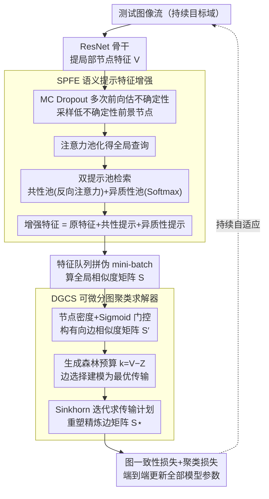

# SPEGC: Continual Test-Time Adaptation via Semantic-Prompt-Enhanced Graph Clustering for Medical Image Segmentation

**会议**: CVPR2026  
**arXiv**: [2603.11492](https://arxiv.org/abs/2603.11492)  
**代码**: [Jwei-Z/SPEGC-for-MIS](https://github.com/Jwei-Z/SPEGC-for-MIS)  
**领域**: 医学图像分割  
**关键词**: 持续测试时自适应, 图聚类, 语义提示, 最优传输, 域偏移, 视网膜/息肉分割

## 一句话总结

提出 SPEGC 框架，通过语义提示增强特征 + 可微分图聚类求解器，将原始相似度矩阵精炼为高阶结构表示，用于指导医学图像分割模型在持续变化的目标域上自适应，有效缓解误差累积与灾难性遗忘。

## 研究背景与动机

**临床部署的域偏移难题**：医学图像因采集设备、操作者、扫描协议不同，导致预训练模型在新目标域上性能严重退化，无法直接用于临床。

**CTTA 场景更贴近现实**：传统 TTA 假设静态目标域，而真实临床数据是连续到达的分布不断变化的流，持续测试时自适应 (CTTA) 更具实际意义。

**现有 CTTA 方法依赖不可靠监督信号**：基于熵最小化或像素级/实例级信号的方法在严重域偏移下容易产生误导性梯度，触发"自增强误差累积"的恶性循环。

**Prompt 方法表达力受限**：冻结骨干网络仅学习输入空间的轻量 prompt，核心参数未更新，性能天花板较低。

**局部特征对噪声敏感**：域偏移下未标注测试样本的局部特征极易受噪声和风格变化干扰，直接计算的相似度矩阵不可靠。

**缺乏高阶结构监督**：现有方法未充分利用数据内部的聚类级结构信息来引导自适应，决策边界无法动态调整。

## 方法详解

### 整体框架

SPEGC 想解决的是持续测试时自适应 (CTTA) 里"自增强误差累积"的死循环——熵或像素级信号在严重域偏移下不可靠，越自适应越错。它的思路是不依赖这些脆弱信号，转而从测试数据**内部的高阶聚类结构**里找监督。整条流程是：ResNet 骨干提局部特征，用 MC Dropout 估不确定性、采样出可信的前景节点；语义提示特征增强 (SPFE) 给这些节点注入全局语境；增强后的特征入队拼成伪 mini-batch、算出全局相似度矩阵；可微分图聚类求解器 (DGCS) 把这个矩阵当作最优传输问题端到端精炼成干净的结构表示；最后用图一致性损失 + 聚类损失把这套结构信号回灌给模型，指导它在不断变化的目标域上自适应。

### 关键设计

**1. SPFE — 语义提示特征增强：用解耦提示池给易受噪声的局部特征补全局语境**

域偏移下未标注样本的局部特征极易被噪声和风格变化带偏，直接算出的相似度矩阵不可信。SPFE 的前置一步是用 MC Dropout 多次前向、按位置特征方差估出不确定性图，只挑不确定性最低的 $p\%$ 前景节点入图，把噪声节点挡在外面（消融里这一步单独带来约 1.9% 提升）。对选出的节点，SPFE 先用注意力池化把它们聚成全局查询 $\hat{q}_i$，再从两个解耦的提示池里检索语境：**异质性提示池** $P_{HE}$ 走标准 Softmax 注意力，检索与查询匹配的域特异信息，抓的是类别区分模式；**共性提示池** $P_{CO}$ 反着来，用 ReLU 截断负匹配分数的反向注意力检索与查询**不**匹配的跨域共享语义，保住核心判别知识不被域风格冲掉。两路提示作为解耦的上下文偏置叠回原始节点特征：$V_i^* = V_i + p_{CO}(i) + p_{HE}(i)$。消融显示单加异质性提示反而掉点（无约束噪声），共性提示配上聚类损失才带来 4.55% 的提升，正说明这种"区分信息 + 共享知识"的解耦是必要的。

**2. DGCS — 可微分图聚类求解器：把边稀疏化变成可微的最优传输**

有了相似度矩阵还不够，得把它精炼成可靠的聚类结构。DGCS 先用可学习投影 $W_q, W_k$ 算全局相似度矩阵 $S$（故意不加 Softmax，保留高置信信号），再结合节点密度 $D(v_i)$ 和 Sigmoid 门控构出有向边相似度矩阵 $S'$。核心洞察是图论里的一条事实：$Z$ 个连通分量的生成森林恰好有 $k = V - Z$ 条边，于是稀疏化预算可以直接定下来。它把"选哪些边"建模成二元最优传输问题，用 Sinkhorn 算法迭代求解熵正则化的传输计划 $\Gamma^*$，再把 $\Gamma^*$ 的第二列重塑成精炼后的边相似度矩阵 $S^\star$。整个过程可微，聚类结构因此能端到端参与训练，而不是当成离线后处理。

### 损失函数

$$L = L_G + \lambda L_C$$

- **图一致性损失** $L_G$：若两节点在 $S^\star$ 中结构相似，就强制它们的语义预测一致（KL 散度 + stop-gradient），把结构信号转成对模型的约束
- **聚类损失** $L_C$：约束共性提示池，让 batch 内所有图像的共性提示在语义空间里彼此靠近（余弦距离），显式锁住跨域共享知识
- $\lambda=0.2$

## 实验

### 数据集与设置

- **视网膜眼底分割** (OD/OC)：5 个公开数据集 (RIM-ONE, REFUGE, ORIGA, REFUGE-Test, Drishti-GS)，交叉域评估
- **息肉分割**：4 个公开数据集 (BKAI-IGH, CVC-ClinicDB, ETIS, Kvasir)
- 骨干：ResNet-50 + ResUNet-50，ImageNet 预训练
- 在线单样本自适应，无标签，单卡 NVIDIA 3090

### 主要结果

| 方法 | OD/OC 平均 DSC | 息肉平均 DSC |
|------|:---:|:---:|
| No Adapt | 72.75 | 71.49 |
| SAR (ICLR'23) | 73.44 | 69.21 |
| VPTTA (CVPR'24) | 73.40 | 73.40 |
| NC-TTT (CVPR'24) | 79.23 | 75.44 |
| GraTa (AAAI'25) | 78.66 | 76.24 |
| TTDG (CVPR'25) | 82.88 | 76.20 |
| **SPEGC (Ours)** | **84.37** | **78.27** |

### 消融实验

| 配置 | 平均 DSC |
|------|:---:|
| No Adapt (基线) | 72.75 |
| + 图聚类 | 74.64 |
| + MC Dropout 不确定性采样 | 76.52 |
| + 仅异质性提示 (无约束) | 75.39 (↓) |
| + 仅共性提示 + $L_C$ | 81.07 |
| + 共性 + 异质性提示 (完整) | **84.37** |

### 关键发现

- **结构驱动优于熵最小化**：SAR 等熵方法在息肉任务上甚至低于 No Adapt 基线，因"隐蔽目标"导致过度自信的错误预测；SPEGC 依赖数据内部结构避开此陷阱
- **长期 CTTA 稳定性优异**：5 轮连续自适应实验中，SPEGC 达到最高平均 DSC (83.10%)，性能退化仅 1.27%，兼顾抗遗忘和抗误差累积
- **共性提示是关键**：单独加异质性提示反而降低性能 (75.39 < 76.52)，说明无约束提示引入噪声；共性提示 + 聚类损失带来 4.55% 的显著提升
- **特征池大小的效率-性能权衡**：池大小 7 时 DSC 最高 (85.24%) 但 FLOPs 增至 21.7G；选择池大小 3 (84.37%, 5.8G FLOPs) 为最优平衡点

## 亮点

- 将图聚类引入 CTTA，用高阶结构信息替代不可靠的像素级/熵信号，思路新颖
- 共性/异质性提示池的解耦设计巧妙：反向注意力捕获跨域共享知识，标准注意力获取域特异信息
- 将边稀疏化建模为最优传输问题并用 Sinkhorn 求解，实现端到端可微分图聚类
- 在两个医学分割基准上全面超越 SOTA，长期 CTTA 实验充分验证了对灾难性遗忘和误差累积的鲁棒性

## 局限性

- DGCS 的相似度矩阵计算复杂度为 $O(V^2)$，特征池增大时 FLOPs 急剧增长（池大小 15 时达 120G），限制了可扩展性
- 聚类数 $Z$ 为人工超参数，不同任务需要调参
- 仅在 ResNet-50/ResUNet-50 上验证，未测试更强骨干 (如 ViT/Swin) 或更大规模数据集
- 单样本在线自适应场景，未探讨 mini-batch 到达的场景
- 共性提示池依赖聚类损失约束，该损失假设连续数据共享核心语义，在极端域偏移下可能不成立

## 相关工作

- **基于聚类的分割**：Yu et al. 将交叉注意力重构为聚类求解器；Liang et al. 提出循环交叉注意力迭代聚类；Ding et al. 将聚类扩展到 3D 体数据。但这些方法是静态域内的后处理，无法利用动态图结构指导自适应
- **CTTA 方法**：SAR (熵过滤)、DomainAdaptor (BN 统计)、VPTTA (视觉提示 + BN 对齐)、NC-TTT (噪声估计)、GraTa (梯度对齐)、TTDG (图匹配 + 预训练先验)。SPEGC 与 TTDG 最相关，但 TTDG 依赖源域原型对齐，SPEGC 完全从目标数据内部结构出发

## 评分

- 新颖性: ⭐⭐⭐⭐ — 提示解耦 + 最优传输图聚类的组合在 CTTA 领域是新的
- 实验充分度: ⭐⭐⭐⭐ — 两个基准、多域交叉、长期 CTTA、消融、超参分析、t-SNE 可视化
- 写作质量: ⭐⭐⭐⭐ — 结构清晰，公式推导完整，动机阐述充分
- 价值: ⭐⭐⭐⭐ — 对医学影像部署场景有实际意义，但计算开销是落地障碍

<!-- RELATED:START -->

## 相关论文

- [\[ICCV 2025\] Progressive Test Time Energy Adaptation for Medical Image Segmentation](../../ICCV2025/medical_imaging/progressive_test_time_energy_adaptation_for_medical_image_segmentation.md)
- [\[CVPR 2026\] MedCLIPSeg: Probabilistic Vision-Language Adaptation for Data-Efficient and Generalizable Medical Image Segmentation](medclipseg_probabilistic_vision-language_adaptation_for_data-efficient_and_gener.md)
- [\[AAAI 2026\] Cross-Sample Augmented Test-Time Adaptation for Personalized Intraoperative Hypotension Prediction](../../AAAI2026/medical_imaging/cross-sample_augmented_test-time_adaptation_for_personalized_intraoperative_hypo.md)
- [\[ICML 2026\] MedCRP-CL: Continual Medical Image Segmentation via Bayesian Nonparametric Semantic Modality Discovery](../../ICML2026/medical_imaging/medcrp-cl_continual_medical_image_segmentation_via_bayesian_nonparametric_semant.md)
- [\[CVPR 2026\] Semantic Class Distribution Learning for Debiasing Semi-Supervised Medical Image Segmentation](semantic_class_distribution_learning_for_debiasing.md)

<!-- RELATED:END -->
