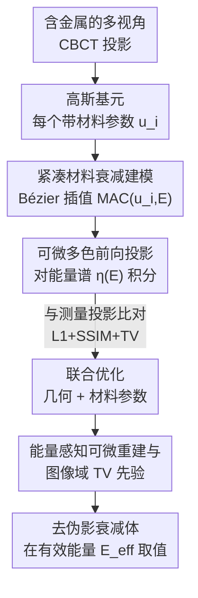

# Splat-Based Metal Artifact Reduction in Cone-Beam CT via Compact Attenuation Modeling

**会议**: CVPR 2026  
**论文**: [CVF Open Access](https://openaccess.thecvf.com/content/CVPR2026/html/Choi_Splat-Based_Metal_Artifact_Reduction_in_Cone-Beam_CT_via_Compact_Attenuation_CVPR_2026_paper.html)  
**代码**: 无  
**领域**: 医学图像 / 3D 重建  
**关键词**: 锥束 CT、金属伪影去除、高斯泼溅、多色 X 射线、可微重建

## 一句话总结
把"能量依赖的材料衰减"压缩成每个高斯一个标量参数（沿 Bézier 曲线插值 MAC），并将可微多色 Beer–Lambert 前向投影嵌入高斯泼溅，从而在**不需要金属 mask**的前提下联合优化几何与材料，CBCT 金属伪影去除比 Polyner 等神经场方法又快一个数量级、结构保真度还更高。

## 研究背景与动机
**领域现状**：锥束 CT（CBCT）单圈旋转就能重建出 3D 体数据，是医疗诊断和工业检测的主力。传统重建（FDK、解析反投影）假设 X 射线是单色（monochromatic）的，衰减与能量无关。近期更先进的做法转向"可微前向投影 + 神经场"：SAX-NeRF、NAF、R2-Gaussian 等用连续表示（NeRF / instant-NGP / 高斯泼溅）去拟合投影测量。

**现有痛点**：真实 X 射线源是**多色（polychromatic）**的——光子能量是一个谱，而衰减系数 $\mu$ 同时随能量 $E$ 和材料成分变化。当扫描区域含牙科填充物、骨科植入物这类高衰减金属时，低能光子被优先吸收（beam hardening，束硬化），探测到的投影呈现强非线性失真，重建结果出现暗条纹、阴影、强度畸变。单色假设在这里彻底失效。已有的物理建模方法各有短板：Polyner 用 NeRF backbone 且依赖金属分割 mask，噪声放大、收敛慢；Diner 把衰减简化成能量无关，丢掉了关键的多色行为；Park et al. 假设衰减线性依赖能量，过度简化物理、残留伪影明显。

**核心矛盾**：要准确去金属伪影，就得**忠实建模能量依赖的衰减** $\mu(l, E)$；但直接优化"每个空间点 × 每个能量"的高维衰减场，要么计算量在 3D 锥束几何下爆炸（神经场），要么需要额外的金属 mask 把金属区域切出来单独处理。物理保真度与可优化性之间存在张力。

**切入角度**：作者观察到一个关键的物理事实——临床相关的生物组织（水、蛋白、脂肪、骨）和金属（钛、铁、铝、铬、钴、镍）的**质量衰减系数（MAC）曲线**虽然绝对量级差很多，但**形状（随能量的变化趋势）高度相关、平滑**，整体落在一个**低维流形**上（论文 Figure 3 用 NIST 数据库验证）。既然如此，没必要为每个体素优化一条完整的高维 MAC 曲线，用一个标量沿这条流形插值就够了。

**核心 idea**：给每个高斯基元额外配一个**紧凑材料参数** $u_i \in [0,1]$，用它在一条二次 Bézier 曲线上插值出该基元的 MAC 曲线，把"能量依赖衰减"塞进高斯泼溅的可微多色前向模型里，几何参数和材料参数一起 mask-free 地联合优化。

## 方法详解

### 整体框架
方法建立在 R2-Gaussian 的高斯泼溅 CBCT 重建之上：衰减场被表示成 $M$ 个各向异性高斯基元之和 $\mu(x)=\sum_i \delta_i \exp(-\tfrac12(x-p_i)^\top \Sigma_i^{-1}(x-p_i))$，每个基元有中心 $p_i$、协方差 $\Sigma_i$、密度 $\delta_i$。本文做三件事把它从"单色重建"升级成"多色金属伪影去除"：（1）给每个高斯加一个标量材料参数 $u_i$，用二次 Bézier 曲线把它映射成一条能量依赖的 MAC 曲线 $\mu_\rho(u_i,E)$；（2）把单色 Beer–Lambert 前向投影换成对能量谱 $\eta(E)$ 积分的**多色前向投影**；（3）整条重建管线设计成完全可微，从而能在体素域加 SSIM/TV 这类图像域先验，再用 L1+SSIM+TV 的损失联合优化 $\{p_i,\Sigma_i,\delta_i,u_i\}$。整个过程不需要任何金属 mask，也不需要配对监督。

### 关键设计

**1. 紧凑材料衰减建模：用一个标量沿 Bézier 曲线插值出整条 MAC 曲线**

针对的痛点是：要建模多色物理就得知道每个位置的衰减如何随能量变化，但逐基元优化一条高维 MAC 向量既不稳定、又会产生空间上不一致的衰减估计。作者把线性衰减系数按密度分解 $\mu(E)=\rho\,\mu_\rho(E)$——其中 MAC $\mu_\rho(E)$ 是只由元素组成和光子能量决定的**材料内禀量**（NIST 有现成表），密度 $\rho$ 才是随结构变化的、由高斯的密度参数 $\delta_i$ 承载。由于真实材料的 MAC 曲线落在低维流形上，作者用一条**二次 Bézier 曲线**逼近它：取所有材料里 MAC 的最小、中间、最大向量 $(b_s, b_m, b_f)$ 作为控制点，

$$\mu_\rho(u_i, E) = (1-u_i)^2 b_s(E) + 2(1-u_i)u_i\, b_m(E) + u_i^2 b_f(E),$$

其中 $u_i \in [0,1]$ 是连续标量，沿材料流形平滑插值。这样做有效是因为：材料之间的差异主要在量级和曲率，而非复杂的高频模式，所以一个标量就够表达"物理上相关的那部分变化"；它把材料优化降到一维，既稳定了多色衰减的优化、又避免了每个基元各自乱跑导致的空间不一致。Figure 3 用 NIST 真实曲线对比 Bézier 近似，量级和形状都贴合得很好（论文给出的代表性取值：水 $u\approx0$、骨 $u\approx0.33$、钛 $u\approx0.80$、铁 $u\approx0.94$、镍 $u\approx1.0$）。

**2. 可微多色前向投影：把 Beer–Lambert 谱积分直接嵌进高斯泼溅**

基线 R2-Gaussian 只把单色 Beer–Lambert 重写成高斯前向投影，无法表达造成金属伪影的能量依赖衰减。本文把它扩展成完整的多色模型，对 X 射线谱 $\eta(E)$ 显式积分：

$$P(\hat{x}, E) = -\log \sum_{E=0}^{E_{\max}} \eta(E)\exp\!\Big(-\sum_{i=1}^{M} f_P(\hat{x}\mid p_i,\Sigma_i)\,\delta_i\,\mu_\rho(u_i,E)\Big),$$

其中 $f_P(\hat{x}\mid p_i,\Sigma_i)$ 是第 $i$ 个高斯投影到像素 $\hat{x}$ 的权重（来自投影协方差的解析表达），$\delta_i$ 是密度，$\mu_\rho(u_i,E)$ 就是上面那条由 $u_i$ 控制的能量依赖衰减。谱 $\eta(E)$ 用 SPEKTR 模拟器生成（沿用 Polyner 等的做法），默认取 $N=15$ 个均匀能量采样。这一步的意义在于：它把"多色束硬化"的物理直接写进了可微的高斯泼溅前向过程，于是 $u_i$ 和所有几何参数能端到端联合优化，模型自适应地为不同组织/金属学到不同的衰减行为，从根上解释金属诱发的非线性，而**不靠 mask 把金属区域抠出来特殊处理**。

**3. 能量感知可微重建与图像域 TV 正则：mask-free 联合优化收敛又快又稳**

光有可微前向还不够——作者把**重建**也设计成可微，衰减体按 $\mu(x,E)=\sum_i f_R(x\mid p_i,\Sigma_i)\,\delta_i\,\mu_\rho(u_i,E)$ 聚合（$f_R$ 是高斯在空间点的权重），从而能在体素域施加图像域先验。总损失结合投影域的 L1 + SSIM 和体素域的 TV：

$$\mathcal{L}_{\text{total}} = \mathcal{L}_1(P_{GT}, P) + \lambda_0 \mathcal{L}_{\text{SSIM}}(P_{GT}, P) + \lambda_1 \mathcal{L}_{\text{TV}}(\mu(V, E_{\text{eff}})),$$

其中 $\lambda_0=0.25$、$\lambda_1=3.0$，TV 在随机采样的体素点上计算。最终图像在有效能量 $E_{\text{eff}}=\sum_i \eta(E_i)E_i$ 处取值。之所以有效：可微重建让结构（几何）和材料（$u_i$）一起被优化，几何先收敛带动材料估计、材料反过来解释非线性，二者互相约束，优化稳定、收敛加速；而高斯泼溅本身的稀疏/解析投影避免了神经场那种逐射线密集 MLP 查询，于是在保留高频结构（不被 TV 过度平滑）的同时把计算量压到一个数量级以下。消融（Table 4）显示多色模型贡献了绝大部分增益，TV 只是锦上添花。

### 损失函数 / 训练策略
优化 per-Gaussian 参数 $\{p_i, \Sigma_i, \delta_i, u_i\}$；高斯初始化沿用 R2-Gaussian。前向/重建梯度通过基于 CUDA 的可微投影管线端到端反传（完整梯度推导在补充材料）。Bézier MAC 基底由水、铁、铝三种材料的 NIST 曲线在 10–90 keV 谱下构造，谱响应 $\eta(E)$ 用 SPEKTR 生成，$N=15$。

## 实验关键数据

### 主实验
合成数据集 Lung（含 Fe）、Teeth（含 Ti）、Broccoli（含 Al），分别基于 LIDC / X-plant / ZCB100 构建并按既有合成投影管线插入金属。报告 3D PSNR 与 SSIM。

| 数据集 | 指标 | 本文 | Polyner（次优） | FDK |
|--------|------|------|----------------|-----|
| Lung (Fe) | PSNR3D / SSIM3D | **28.96 / 0.994** | 20.63 / 0.977 | 17.21 / 0.905 |
| Teeth (Ti) | PSNR3D / SSIM3D | **27.40 / 0.993** | 20.74 / 0.970 | 17.71 / 0.885 |
| Broccoli (Al) | PSNR3D / SSIM3D | **27.76 / 0.997** | 21.60 / 0.990 | 18.00 / 0.963 |

本文在三个场景上 PSNR 比次优的 Polyner 高出 6~8 dB。值得注意的是监督式后处理方法（ACDNet / DICDNet / OSCNet）由于域差，PSNR 反而掉到 13 左右甚至更低，完全无法泛化；Park et al. 在 Broccoli 上崩溃（PSNR 0.07，强度尺度全错）。真实数据（核桃、大蒜、鸡肉、牛油果、金针菇、蓝莓等，用 Bruker SKYSCAN 1273 在 90 kVp + 1.0 mm 铝滤波下扫描，金属/无金属配对）上定性结论一致：FDK 强条纹、LIMAR 残留、Polyner 过平滑丢细节，本文最忠实。

效率对比（Table 1，Intel Xeon 4214R + RTX A6000）：

| 场景 | Polyner | Park et al. | 本文 |
|------|---------|-------------|------|
| Broccoli | 1h50m | 1h49m | **29m** |
| Garlic | 1h30m | 1h27m | **20m** |
| Chicken | 2h03m | 2h10m | **24m** |
| Blueberry | 1h33m | 1h28m | **19m** |

跨所有场景普遍提速约一个数量级。

### 消融实验
| 配置 | PSNR3D | SSIM3D | 说明 |
|------|--------|--------|------|
| Baseline (R2-Gaussian) | 23.22 | 0.984 | 单色高斯泼溅 |
| Baseline + Poly | 27.97 | 0.994 | 加多色模型，+4.75 dB |
| Baseline + Poly + TV | 28.04 | 0.995 | 再加 TV，+0.07 dB |

光谱采样数 N 的影响（Table 3）：N = 7 / 15 / 31 / 63 对应 PSNR3D 28.01 / 28.04 / 27.93 / 27.99，SSIM 几乎不变。

### 关键发现
- **多色模型是绝对主力**：从单色基线到加多色模型，PSNR 一口气涨 4.75 dB（23.22→27.97），而 TV 只补了 0.07 dB——说明性能提升几乎全来自"把能量依赖衰减建对"，而非正则技巧。
- **紧凑材料模型对光谱采样密度极不敏感**：N 从 7 到 63，PSNR 波动 < 0.15 dB。这反向印证了"MAC 落在低维平滑流形上"的假设——既然衰减行为本身简单，粗采样就能抓住，故作者选 N=15 平衡精度与速度。
- **mask-free + 紧凑材料带来数量级提速**：相比依赖金属 mask、用 NeRF 密集查询的 Polyner，本文用稀疏高斯 + 一维材料参数，把 1~2 小时的重建压到 20~40 分钟，且结构保真度不降反升。
- **监督式后处理在分布外彻底失效**：ACDNet/DICDNet/OSCNet 在不同成像几何/材料下 PSNR 掉到 13 上下，凸显物理驱动、无需训练数据方法的泛化优势。

## 亮点与洞察
- **"低维流形"假设转化成一个可优化标量**：把"材料种类"这种离散、高维的概念，压缩成一个 $[0,1]$ 的连续插值参数 $u_i$，让金属/组织共享同一套可微参数化——既物理可解释（控制点来自 NIST 真实 MAC），又把优化维度降到一维，这是全文最巧的一笔。
- **mask-free 是真正的工程价值**：临床上做金属分割本身就难且易错，绕开 mask 意味着对金属的大小、形状、位置不敏感，鲁棒性直接上一个台阶。
- **可迁移思路**：用"低维 Bézier/样条曲线 + 单标量插值"去参数化任何"落在低维流形上的物理量谱线"，这套路可迁到光谱成像、材料分解 CT（dual-energy/photon-counting）、甚至高光谱重建——只要目标量随某个连续变量平滑变化、且不同类别形状高度相关。
- 让人"啊哈"的点：去金属伪影的难点一直被当成"怎么识别并修复金属区域"，本文却把它重述为"怎么把多色物理建对"，一旦物理对了，金属伪影作为非线性的后果自然被解释掉、不需要专门处理金属。

## 局限与展望
- **作者承认**：紧凑材料模型只覆盖落在低维流形上的常见材料，对 MAC 曲线显著偏离流形的异常材料/化合物无能为力；X 射线谱无法直接测量（用的是能量积分探测器），只能靠 SPEKTR 物理模拟，谱/滤波建模不准会引入残余伪影或全局强度偏置；高斯泼溅的效果依赖基元密度与摆放，超大体积或强各向异性结构可能要调参；评估只覆盖静态 CBCT。
- **自己看到的局限**：合成实验只用了 Fe/Ti/Al 三种金属、三个场景，材料覆盖偏窄；真实数据用蔬果/鸡肉等"仿生体模"代替真人解剖，临床真实植入物（多金属混合、大体积钛网）下的表现仍待验证；TV 增益极小，意味着图像域先验这条线没被充分挖掘。
- **改进方向**：把动态/有限角度采集纳入（作者也点了）；让 Bézier 控制点本身可学习以适配流形外材料；引入 photon-counting 探测器的实测谱替代模拟谱以消除谱偏置。

## 相关工作与启发
- **vs R2-Gaussian（基线）**：同样用高斯泼溅做 CBCT，但 R2-Gaussian 假设单色衰减、无法处理束硬化；本文给每个高斯加材料参数 $u_i$ 并换成多色前向，消融里正是它把 PSNR 从 23.22 抬到 28，是直接的"物理升级"。
- **vs Polyner**：都做物理驱动的多色 MAR，但 Polyner 用 NeRF backbone + 金属 mask，噪声放大、收敛 1~2 小时；本文 mask-free、稀疏高斯，PSNR 高 6~8 dB 且快一个数量级。
- **vs Park et al. / Diner**：这两者分别用"线性能量依赖"和"能量无关"来简化衰减；本文用 Bézier 曲线在"简化"和"高维"之间找到甜点——比线性更贴合真实 MAC 曲率，又比逐点高维优化稳定，避免了它们的强度尺度错误与残留伪影。
- **vs 监督式后处理（ACDNet/DICDNet/OSCNet）**：那一类靠成对训练数据学图像域去伪影，换成像几何/材料就失效；本文无需任何训练数据、按场景自优化，泛化性是结构性优势。

## 评分
- 新颖性: ⭐⭐⭐⭐⭐ 把"低维 MAC 流形"洞察压成单标量 Bézier 参数并嵌入可微高斯泼溅多色前向，角度新且物理扎实
- 实验充分度: ⭐⭐⭐⭐ 合成+真实双线、含效率与多组消融，但金属/场景种类偏窄、缺真实临床解剖验证
- 写作质量: ⭐⭐⭐⭐ 物理推导清晰、图表自洽，Bézier 设计动机讲得透；部分符号密集需对照公式
- 价值: ⭐⭐⭐⭐⭐ mask-free + 数量级提速 + SOTA 保真，对 CBCT 金属伪影去除有直接落地价值，并提供新数据集

<!-- RELATED:START -->

## 相关论文

- [\[CVPR 2026\] SPECTRE：面向体积 CT Transformer 的自监督与跨模态预训练](scaling_self-supervised_and_cross-modal_pretraining_for_volumetric_ct_transforme.md)
- [\[CVPR 2026\] GH-NAF: Grid-Adaptive Hash-Level-Attended Neural Attenuation Fields for Discrepancy-Aware CBCT](gh-naf_grid-adaptive_hash-level-attended_neural_attenuation_fields_for_discrepan.md)
- [\[CVPR 2026\] Modeling the Brain's Grammar: ROI-Guided fMRI Pretraining for Transferable and Interpretable Vision Decoding](modeling_the_brains_grammar_roi-guided_fmri_pretraining_for_transferable_and_int.md)
- [\[CVPR 2026\] PETAR: Localized Findings Generation with Mask-Aware Vision-Language Modeling for PET Automated Reporting](petar_localized_findings_generation_with_mask-aware_vision-language_modeling_for.md)
- [\[CVPR 2026\] VesMamba: 3D Pulmonary Vessel Segmentation from CT images via Mamba with Structural Perception and Scale-aware Filtering](vesmamba_3d_pulmonary_vessel_segmentation_from_ct_images_via_mamba_with_structur.md)

<!-- RELATED:END -->
