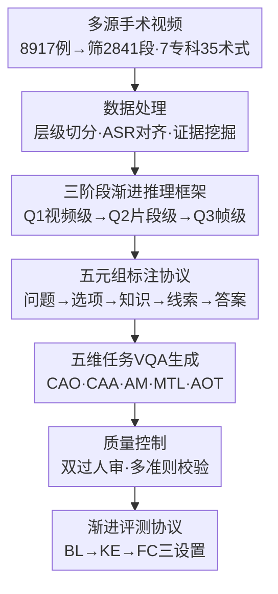

# SurgCoT: Advancing Spatiotemporal Reasoning in Surgical Videos through a Chain-of-Thought Benchmark

**会议**: CVPR 2026  
**论文**: [CVF Open Access](https://openaccess.thecvf.com/content/CVPR2026/html/Wang_SurgCoT_Advancing_Spatiotemporal_Reasoning_in_Surgical_Videos_through_a_Chain-of-Thought_CVPR_2026_paper.html)  
**代码**: https://github.com/CVI-SZU/SurgCoT  
**领域**: 医学图像 / 视频理解 / 多模态VLM  
**关键词**: 手术视频, 时空推理, 链式思维, 评测基准, 多模态大模型

## 一句话总结
本文构建了首个跨专科的手术视频时空推理基准 SurgCoT（7 个外科专科、35 种术式、2841 段视频、19345 主问题 + 59177 子问题），用「三阶段渐进推理 + 五元组标注协议（Question→Option→Knowledge→Clue→Answer）」把手术 CoT 推理拆成「视频级→片段级→帧级」层级链，评测 10 余个主流 MLLM，发现它们在细粒度时空推理上普遍存在显著差距，而该结构化协议能稳定提升渐进推理准确率。

## 研究背景与动机
**领域现状**：手术视频是围手术期诊疗与教学的核心数据，富含动态解剖与流程信息。近年 MLLM 被引入手术场景做手术阶段识别、器械识别、组织检测、手术理解等任务，随之需要评测框架来衡量其真实临床效用。

**现有痛点**：现有手术基准分两类——通用基准覆盖面广但只问「阶段/器械」这类通用 QA；专科基准聚焦窄领域（眼科、内镜）但停留在帧/片段级 VQA，把视频当离散片段处理，**忽略跨时间依赖、无法评测时空或因果推理**。而外科医生恰恰需要追踪细微、快速的时空变化来做细粒度推断与决策。

**核心矛盾**：MLLM 的评测停留在「孤立帧的识别」层面，而临床推理本质是「渐进式时空 + 因果」的——要先判断「有没有出血」，再定位「何时何处出现」，最后精确到「哪一帧哪个解剖点」。现有基准既没有这种层级结构，也没有可验证的中间证据，无法回答「MLLM 能否达到专家级渐进时空推理」这一关键问题。

**本文目标**：（1）建一个跨专科、覆盖完整术式、带定位监督和临床参考标准的统一手术视频推理基准；（2）设计一套能强制 MLLM 做层级 CoT 推理的标注协议与评测协议；（3）系统评测主流 MLLM，揭示其能力边界。

**切入角度**：把临床诊断流程显式拆成「视频级理解→片段级定位→帧级定位」三阶段，每阶段用五元组标注把「背景知识」和「时空线索」分离并串联起来。

**核心 idea**：用「三阶段渐进推理框架 + 五元组标注协议」把手术 CoT 推理结构化、可验证化，让评测既能打分又能审计推理链，逐步收窄时空范围。

## 方法详解

### 整体框架
SurgCoT 是一个评测基准而非新模型，其核心是「数据集构建管线 + 三阶段五元组推理协议 + 渐进式评测协议」。构建管线四步：数据处理（多源视频采集、层级切分、证据挖掘）→ 三阶段渐进推理 + 五元组标注 → VQA 生成（按结构化模板 + 本体驱动产出 78522 个 QA 对）→ 质量控制（双过人审 + 多准则校验）。评测时把每道主问题分解成 Q1→Q2→Q3 三个递进子问题，并在三种设置（BL 仅视频+主问题 / KE 加临床知识 / FC 加完整视频+知识+线索）下评估，看 MLLM 能否随着脚手架增强而渐进提升。

### 关键设计

**1. 数据处理与证据挖掘：把无标注手术视频转成时空可定位的监督单元**

针对「现有基准缺乏帧级定位与跨时间证据」的痛点，作者从 YouTube、ASVIDE、十个开源库与临床档案采集 8917 例，按流程完整性、临床有效性、双语旁白（用于时间对齐）筛出 2841 段高质量视频（占原始 31.9%），全部去标识化。再做标准化切分：用视觉场景/器械组织转换/ASR 锚点的层级线索融合切出语义连贯片段，ASR 对齐产出毫秒级精准字幕，本体驱动归一化把表层术语映射到规范实体。最关键的是端到端**证据挖掘**——以 ASR 字幕为语义锚点标注术式/阶段；空间证据用 YOLOv10 做组织检测、SAM2 做器械分割、ByteTrack 做跨帧追踪；时间证据从外观变化指标检测动作起始，异常用 track 标注起始时间与最小 ROI。所有证据与 ASR 时间戳双向对齐，从而支撑「三阶段窗口收窄 + 区域级定位」的渐进推理。

**2. 五元组标注协议：用 Knowledge/Clue 分离实现「先讲道理再下结论」的可验证推理**

每个阶段标注五个字段：Question（贴合手术流程的临床问题）、Option（互斥候选，用来区分相似现象如「器械反光 vs 真实出血」、约束假设空间）、Knowledge（提供独立于视频内容的领域先验，如颜色/血流模式、典型解剖、器械行为）、Clue（提供视频内可定位的证据，如时间窗、空间 ROI、地标）、Answer（裁定后的目标）。设计精妙处在于把 Knowledge 与 Clue **显式拆开并按序前置于 Answer**：Knowledge 供给临床「为什么」，Clue 锚定「何处/何时」，形成透明且视频接地的思维链。更关键的是 Answer 被**前向携带**作为下一阶段的条件上下文，强制因果依赖与时空收窄——这把「黑盒答题」改造成可逐字段审计的结构化推理。

**3. 三阶段渐进推理：用「视频级→片段级→帧级」的级联条件化模拟临床诊断流程**

把复杂时空诊断拆成三个层级互依的阶段，每阶段都在前一阶段已验证的证据上收窄子问题。Q1 视频级理解：识别高层临床事件（如「是否存在活动性出血」），建立全局假设空间。Q2 片段级分析：在 Q1 验证输出下做时空定位，判断目标事件「何时」首次出现、「何处」发生（ROI 粒度），把假设空间从视频级剪到时空片段。Q3 帧/块级定位：严格条件于 Q2 的时空边界，要求像素/bbox 级精确定位起始帧与解剖位点（如「缝合孔 vs 邻近组织」）。三阶段通过三种依赖机制串联——语义约束传播（每阶段输出是下一阶段不可改的前提）、时空范围细化（视频分钟级→片段秒级→帧亚秒级）、证据累积与验证（Knowledge 从一般解剖 K1 演进到病灶特异 K3，Clue 从时间地标 C1 到空间区域 C2 到像素证据 C3）。形式化为 $(Q_1,O_1,K_1,C_1)\!\Rightarrow\!A_1 \to (Q_2,O_2,K_2,C_2,A_1)\!\Rightarrow\!A_2 \to (Q_3,O_3,K_3,C_3,A_2)\!\Rightarrow\!A_3$，保证诊断决策（如手术建议 A3）必须接地于已确认的病灶位置（A2）和已确立的病理（A1），形成可审计、不确定性逐步下降的推理链。

**4. 五维临床推理任务：覆盖从正常流程到异常处理的认知闭环**

在临床专家协助下定义五类时空推理任务，每类都走三阶段框架生成含空间/时间/语义干扰项的 VQA：CAO（Causal Action Ordering，因果动作排序，判定手术微动作的因果先后）、CAA（Cue-Action Alignment，线索-动作对齐，把术前线索对齐到微动作的时空起始点）、AM（Affordance Mapping，可供性映射，用时空证据 grounding 工具-组织交互）、MTL（Micro-Transition Localization，微转换定位，识别微阶段间的帧级边界）、AOT（Anomaly Onset Tracking，异常起始追踪，定位异常起始与早期轨迹）。前四者评测正常流程推理，AOT 评测异常场景处理，五维共同构成手术推理的整体评估闭环。

### 损失函数 / 训练策略
本文是评测基准，不训练新模型，无损失函数。评测用统一 zero-shot 模板与固定解码（temperature=0.0, top_p=1.0, max_new_tokens=4096, repetition_penalty=1.0），主指标为准确率（accuracy）；本地开源模型用 Torch 2.9.0 + Transformers 4.57.1、CUDA 12.4、bf16，跑在 8× NVIDIA A100 80GB 上。⚠️ 评测模型数量原文 abstract 写「10 leading MLLMs」、正文另处写「12」，以原文为准。

## 实验关键数据

### 主实验
五大推理任务（CAO/CAA/AM/MTL/AOT）在三种设置（BL→KE→FC）下的平均准确率（%），下表取各模型 Avg. 列代表值：

| 模型 | 类别 | BL | KE | FC |
|------|------|----|----|----|
| GPT-5 | 商用 | 76.62 | 80.54 | **87.58** |
| Claude-Sonnet-4.5 | 商用 | 74.10 | 78.87 | 87.54 |
| Gemini-2.5-Pro | 商用 | 70.02 | 81.83 | 87.20 |
| MedGemma-27B-IT | 医学专用 | 70.96 | 76.37 | 86.37 |
| LLaVA-Med-7B | 医学专用 | 68.15 | 75.22 | 81.73 |
| Qwen3-VL-8B | 开源 | 75.44 | 81.48 | 86.92 |
| InternVL-8B | 开源 | 67.95 | 73.58 | 82.32 |
| Qwen2.5-VL-7B | 开源 | 68.85 | 71.22 | 79.45 |

观察：(1) 商用模型整体领先开源与医学专用模型；(2) 所有模型在细粒度时空理解上都有显著局限；(3) 随着 KE、FC 脚手架加入，准确率稳定渐进提升，验证五元组协议有效。

### 消融 / 渐进设置分析
把同一主问题拆成 Q1/Q2/Q3 子问题，观察主问题（Q）准确率与子问题准确率的落差：

| 模型 | 主问题 Q (FC) | 子问题 Q3 (FC) | 说明 |
|------|--------------|---------------|------|
| GPT-5 | 76.62（BL Q） | 47.60 | 主问题强但深层子问题骤降，暴露 CoT 推理断层 |
| 各商用模型 | 高 | 显著下降 | 普遍存在中间步骤掉点 |

LLaVA-Med-7B 从 BL→KE 平均提升近 7%，说明显式知识增强能补偿领域局限；GPT-5 仅提升约 4%，说明其更强的内在语言推理已能较顺滑地整合知识。KE→FC 阶段，Qwen2.5-VL-7B 提升 8.23%、Claude-Sonnet-4.5 提升约 13.44%，凸显时空 grounding（Clue）对细粒度推理的关键作用。

### 关键发现
- **CoT 推理断层**：模型在主问题上表现尚可，但拆到中间子问题（尤其 Q3 帧级定位）准确率骤降（GPT-5 主问题 76.62% → Q3 仅 47.60%），说明它们做的更像「直觉跳答」而非真正的渐进推理。
- **脚手架有效但替代不了能力**：五元组协议（KE/FC）能稳定抬升准确率，医学专用模型从知识增强中获益更大；但即便加满脚手架，细粒度时空定位仍是公认短板。
- **商用 > 开源 ≈ 医学专用**：在跨专科、需多模态时空融合的任务上，通用商用大模型的强语言推理反而占优，医学专精预训练未必带来时空推理优势。

## 亮点与洞察
- **把临床诊断流程显式映射成「视频级→片段级→帧级」三阶段级联**，并用 Answer 前向携带强制因果依赖，是这篇基准最「啊哈」的设计——它让 CoT 不再是黑盒，而是可逐字段审计的推理链。
- **Knowledge/Clue 分离**这一标注思路可迁移到任何需要「领域先验 + 实例证据」分工的推理评测（如病理、放射、工业质检），用结构化字段把「为什么」和「在哪/何时」解耦。
- **用 YOLOv10+SAM2+ByteTrack 的证据挖掘管线**把无标注手术视频转成时空可定位监督单元，提供了一条低成本扩展手术视频标注的工程路径。
- **「主问题对、子问题错」的诊断性发现**，对 MLLM 评测有方法论价值：只看终答会高估模型，分解到中间步骤才暴露真实推理缺陷。

## 局限与展望
- 基准本身只评测、不提供训练范式，「协议能提分」是 prompt/上下文层面的提升，并未训练出能内化层级推理的模型，离临床级推理仍有差距。
- 数据虽跨 7 专科 35 术式，但仍含长尾稀有术式，部分专科样本可能不均衡；视频来源混合公开平台与私有档案，分布偏置难以完全排除。
- 评测模型数量在 abstract（10）与正文（12）表述不一致 ⚠️ 以原文为准；BL/KE/FC 跨设置、跨任务难度不同，平均值横比需谨慎。
- 评测以 accuracy 为唯一主指标，对推理链的临床合理性、可解释性缺乏更细的人工评分维度。

## 相关工作与启发
- **vs 通用手术基准（SSG-VQA / SurgVLM-Bench / SurgBench）**: 它们覆盖广但停留在帧/片段级、缺时空与渐进推理；SurgCoT 在 ST（时空建模）、Pro.（渐进协议）、Loc.（定位监督）、Clin.（临床参考）四项上同时打满，是表 1 中唯一全 ✓ 且 Video/Clip/Frame 三级标注的基准。
- **vs 专科基准（EndoVis-VQLA / CoPESD / OphNet）**: 它们聚焦单一专科窄术式、泛化差；SurgCoT 用跨 7 专科覆盖换来更真实的专家级认知评估。
- **vs 时空基准 MedFrameQA**: MedFrameQA 首倡跨帧时空建模但缺规模与细粒度定位；SurgCoT 把时空推理、层级知识与定位监督统一在临床验证框架内，规模与粒度都更进一步。

## 评分
- 新颖性: ⭐⭐⭐⭐ 首个跨专科手术 CoT 时空推理基准，三阶段五元组协议有真创新；但属「基准+协议」而非新模型/新算法。
- 实验充分度: ⭐⭐⭐⭐ 评测 10+ 主流 MLLM、三设置三阶段分解充分，唯训练侧验证缺位。
- 写作质量: ⭐⭐⭐⭐ 构建管线与推理协议讲得清晰，个别模型计数表述不一致。
- 价值: ⭐⭐⭐⭐⭐ 为手术视频 MLLM 评测立了可审计、临床对齐的新标杆，复现性强。

<!-- RELATED:START -->

## 相关论文

- [\[CVPR 2026\] Event-Level Detection of Surgical Instrument Handovers in Videos](event_level_detection_of_surgical_instrument_handovers_in_videos.md)
- [\[CVPR 2026\] Synergistic Bleeding Region and Point Detection in Laparoscopic Surgical Videos](synergistic_bleeding_region_and_point_detection_in_laparoscopic_surgical_videos.md)
- [\[CVPR 2026\] Gastric-X: A Multimodal Multi-Phase Benchmark Dataset for Advancing Vision-Language Models in Gastric Cancer Analysis](gastric-x_a_multimodal_multi-phase_benchmark_dataset_for_advancing_vision-langua.md)
- [\[CVPR 2026\] TRCoRSurg: Temporal-Relational Co-Reasoning for Surgical Video Triplet Recognition](trcorsurg_temporal-relational_co-reasoning_for_surgical_video_triplet_recognitio.md)
- [\[CVPR 2026\] X-PCR: A Benchmark for Cross-modality Progressive Clinical Reasoning in Ophthalmic Diagnosis](x-pcr_a_benchmark_for_cross-modality_progressive_clinical_reasoning_in_ophthalmi.md)

<!-- RELATED:END -->
