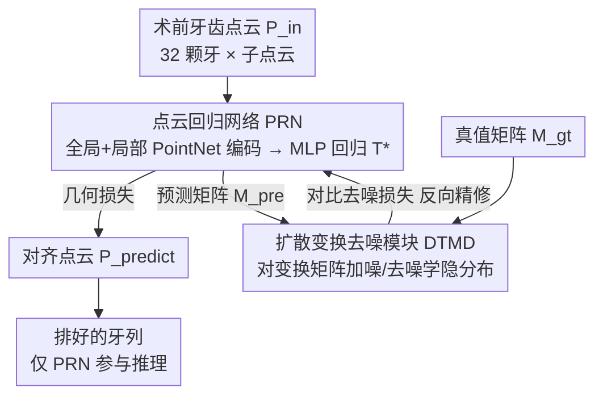

# TAlignDiff: Automatic Tooth Alignment assisted by Diffusion-based Transformation Learning

**会议**: CVPR 2026  
**论文**: [CVF Open Access](https://openaccess.thecvf.com/content/CVPR2026/html/Liu_TAlignDiff_Automatic_Tooth_Alignment_assisted_by_Diffusion-based_Transformation_Learning_CVPR_2026_paper.html)  
**代码**: 无（论文称录用后开源）  
**领域**: 医学图像 / 3D视觉  
**关键词**: 自动牙齿排列、正畸、点云回归、扩散模型、变换矩阵

## 一句话总结
TAlignDiff 用一个点云回归网络（PRN）从术前牙齿点云直接预测每颗牙的 4×4 变换矩阵，再训一个轻量扩散模型（DTMD）把"临床上合法的变换矩阵长什么样"学成隐分布，用一条对比去噪损失把回归输出往这个分布拉，从而在点云几何对齐之外额外约束了变换矩阵的统计特性，TRE/AAE 误差全面优于现有方法。

## 研究背景与动机

**领域现状**：自动牙齿排列（正畸排牙）的主流做法是把术前 3D 牙模采样成点云，用回归网络在"逐点几何损失"监督下，为每颗牙输出一个刚体变换（旋转+平移），把错位牙挪到目标位置。这类点云回归方法（PSTN、TANet、LETA 等）已经显著减轻了正畸医生手工排牙的负担。

**现有痛点**：只靠点云上的几何约束，监督的是"挪完之后点云对不对得上目标"，但完全忽略了变换矩阵本身的分布特性。作者观察到，错位与牙齿移动是长期生物力学、咬合关系、解剖约束共同作用的结果——这让真实的变换矩阵带有很强的统计规律：比如某颗磨牙左移往往伴随逆时针旋转（平移与旋转角显著正相关），且旋转角受生理约束（磨牙旋转角很少超过 15°）。纯几何损失对这些"哪些变换矩阵临床上才合理"的先验毫无感知，可能回归出几何上凑得上、但临床上不合理的解。

**核心矛盾**：几何一致性（点云对齐）和分布合理性（变换矩阵符合临床规律）是两套互补的监督信号，但现有方法只用了前者。最接近的工作 TADPM 虽然引入扩散建模，却是直接从高维几何特征回归变换矩阵，对小临床数据集依赖大、不够稳。

**本文目标**：在保持几何一致的同时，额外把变换矩阵的内在分布特性学进来，且要在只有上百例的小临床数据上能用。

**核心 idea**：先用点云回归网络给出变换矩阵初值，再用一个只对"变换矩阵"做扩散（而非对原始点云/网格做扩散，输入维度大幅降低）的轻量扩散模型当"评判器"，通过比较预测矩阵与真值矩阵在同一加噪步上的噪声估计差异，把回归输出引导到合法分布上——几何回归与扩散精修之间形成双向反馈。

## 方法详解

### 整体框架

TAlignDiff 输入一例术前牙齿点云 $P_{in}$（4096 点，按 32 颗恒牙拆成 32 个子点云），输出每颗牙的 4×4 变换矩阵 $T=\{T_i\}\in\mathbb{R}^{32\times4\times4}$，把它作用到术前点云上即得排好的目标点云 $P_{gt}=T\cdot P_{in}$。每颗牙的矩阵 $T_i=\begin{bmatrix}R_i & D_i\\ 0 & 1\end{bmatrix}$ 含 3×3 旋转 $R_i$ 与 3×1 平移 $D_i$。

整个框架由两条互补的支路构成：**点云回归网络 PRN**（主干，负责几何）和**扩散去噪模块 DTMD**（辅助，负责分布）。PRN 用几何损失把点云挪对位；DTMD 先无监督学会"合法变换矩阵的隐分布"，再通过一条对比去噪损失反过来精修 PRN 的输出。关键的一点是 **DTMD 只在训练期参与、推理期完全不参与**——它像一个训练好就固定的"临床合理性评判器"，所以不增加任何推理开销。

### 关键设计

**1. 点云回归网络 PRN：用全局+局部双编码把"整口牙"与"单颗牙"的几何都喂给回归头**

这一支负责传统的几何对齐。它采用两个 PointNet 编码器：$\epsilon_g$ 提全牙列的全局特征（整口牙的相对排布），$\epsilon_l$ 提单颗牙级别的局部几何细节，两者拼接后送入一个 MLP 解码器（全连接通道 [512, 256, 16]）回归出变换矩阵：$T^*=\phi(\epsilon_g(P_{in})\oplus\epsilon_l(P_{in}))$。监督用两条几何损失：逐点重建损失 $L_{rec}=\frac1N\sum\lVert T^*\cdot P_{in}-T\cdot P_{in}\rVert_1$ 惩罚挪完后与目标点云的逐点位置差；牙齿质心偏移损失 $L_{center}=\frac1M\sum\lVert C_{predict}-C_{target}\rVert_1$ 约束每颗牙质心的整体位移，保证排布在"重心层面"也对得上。同时用全局+局部双特征是因为排牙既要看单颗牙自身姿态、也要看它在整口牙里的相对位置。但作者明确指出：单靠 PRN 的几何损失不足以捕捉变换矩阵的内在分布特性，所以才有了第二支。

**2. 扩散变换去噪模块 DTMD：只对"变换矩阵"做扩散，把临床合法变换的隐分布学成一个评判器**

DTMD 的输入不是点云/网格，而是把真值变换矩阵 $M_{gt}$ reshape 后的低维向量——这是它相比 TADPM 的关键省力点：扩散对象维度大幅降低，从而大幅减少对大数据集的依赖，更适配只有上百例的小临床数据。它走标准 DDPM 的前向加噪 $q(M_t\mid M_0)=\mathcal N(M_t\mid\sqrt{\gamma_t}M_0,(1-\gamma_t)I)$ 与反向去噪，训练目标是让噪声估计器 $\epsilon_{\theta_d}$ 预测加进矩阵里的噪声：$L_{diffusion}=\mathbb E\big[\lVert\epsilon-\epsilon_{\theta_d}(M_t,t)\rVert_2^2\big]$。训完之后，$\epsilon_{\theta_d}$ 实际上编码了"合法正畸方案的梯度场" $\nabla_x\log p(x)$——也就是说，给它一个变换矩阵，它能告诉你这个矩阵离"临床上合理的分布"有多远。这正是 PRN 缺的那块先验。

**3. 对比去噪损失：让预测矩阵和真值矩阵"在同一加噪步上噪声估计一致"，把几何回归往合法分布上拽**

这是把 DTMD 的先验真正反馈给 PRN 的桥梁，也是本文最核心的创新点。具体做法：对预测矩阵 $M_{pre}$ 和真值矩阵 $M_{gt}$ 各自加上同一步 $t$ 的高斯噪声，送进固定的 DTMD 求噪声估计，然后比较两者的差异：

$$L_{denoi}=\mathbb E_{M^t_{gt},M^t_{pre},t}\Big[\big\lVert \epsilon_{\theta_d}(M^t_{gt},t)-\epsilon_{\theta_d}(M^t_{pre},t)\big\rVert_1\Big]$$

直觉是：把预训练 DTMD 当成一个"评判器"，它编码了合法方案的梯度流。当两个矩阵的噪声估计接近，说明预测矩阵和真值矩阵落在同一条梯度流上、即在 DTMD 眼里属于同一个合法分布。最小化 $L_{denoi}$ 就是逼着 $M_{pre}$ 往 $M_{gt}$ 所在的合法流形上靠，从而间接修正 PRN 的回归输出。和直接对矩阵做 L1（那只是几何意义的逐元素接近）不同，这里的接近是"在扩散评判器学到的分布度量下接近"，所以约束的是临床合理性而非单纯数值。

**4. 分阶段联合训练：先各练各的避免互相干扰，再固定 DTMD 单练 PRN**

为避免两支训练初期互相拉扯，作者用分阶段策略：前 200 epoch 把有监督的 PRN 和无监督的 DTMD **分开独立训练**，等各自稳定；之后引入对比去噪损失，把 DTMD 的信息注入 PRN，在接下来 200 epoch **只训 PRN、固定 DTMD 参数**，用预训好的评判器去优化 PRN 输出。总损失为 $L_{total}=L_{rec}+\lambda_1 L_{center}+\lambda_2 L_{denoi}+\lambda_3 L_{diffusion}$（最优权重 $\lambda_1{=}0.1,\lambda_2{=}0.01,\lambda_3{=}0.1$）。这样既让评判器稳定不漂移，又因为推理期不需要 DTMD 而保持轻量。此外训练用了多牙旋转（随机选 5–10 颗牙按欧拉角独立旋转，并对操纵牙计算逆变换以保证标签一致）+ 单牙平移的数据增强来应对小样本。

### 损失函数 / 训练策略

总目标 $L_{total}=L_{rec}+\lambda_1 L_{center}+\lambda_2 L_{denoi}+\lambda_3 L_{diffusion}$。其中 $L_{rec}$ 为主损失（几何对齐），$L_{center}$ 约束质心整体位移，$L_{diffusion}$ 训 DTMD 学分布，$L_{denoi}$ 把分布先验反馈给 PRN。Adam 优化，PRN 学习率 0.01、DTMD 0.005，batch=4，共 400 epoch，单张 3090。

## 实验关键数据

**数据集**：主数据来自 ISICDM 2024 自动排牙挑战赛，124 例临床术前牙齿点云（每例 4096 点、32 子点云、每子点云 128 点），含正畸医生制定的排牙方案（编码为 32×4×4 变换矩阵），划分 74/20/30（训练/验证/测试）。另有一个独立正畸数据集做跨域泛化测试（30 例，不重新训练直接测）。

**指标**：TRE（Target Registration Error，预测与目标牙齿点云的配准误差）与 AAE（Absolute Arch Error，预测与目标牙弓的差异，本文新提）。两者**均越低越好**。

### 主实验（与 SOTA 对比，Table 2，越低越好）

| 方法 | 验证集 TRE | 验证集 AAE | 测试集 TRE | 测试集 AAE |
|------|-----------|-----------|-----------|-----------|
| PointNet++ | 0.769 | 0.702 | 0.791 | 0.717 |
| PointMLP | 0.826 | 0.758 | 0.819 | 0.743 |
| TADPM | 0.907 | 0.848 | 0.890 | 0.821 |
| PSTN | 0.730 | 0.658 | 0.779 | 0.705 |
| TANet | 0.885 | 0.828 | – | – |
| LETA | 0.777 | 0.712 | – | – |
| **TAlignDiff（本文）** | **0.690** | **0.617** | **0.725** | **0.646** |

本文在验证集与测试集的 TRE/AAE 全部最低，且对各方法的显著性检验 p<0.01。

### 跨域泛化（独立正畸数据集，Table 3，越低越好）

| 方法 | TRE | AAE |
|------|-----|-----|
| PointNet++ | 0.899 | 0.831 |
| PointMLP | 0.758 | 0.685 |
| TADPM | 0.747 | 0.679 |
| PSTN | 0.843 | 0.776 |
| TANet | 0.884 | 0.834 |
| LETA | 0.803 | 0.736 |
| **TAlignDiff（本文）** | **0.716** | **0.645** |

不重新训练直接在未见数据上测，仍全面领先，说明学到的分布先验有泛化性。

### 消融 / 损失权重（Table 1，测试集，越低越好）

| $\lambda_1$ | $\lambda_2$ | $\lambda_3$ | 测试 TRE | 测试 AAE | 说明 |
|---|---|---|---------|---------|------|
| 0 | 0 | 0 | 0.784 | 0.711 | baseline，仅 $L_{rec}$ |
| 0.1 | 0 | 0 | 0.748 | 0.670 | 加质心损失 $L_{center}$ |
| 0.1 | 0.01 | 0.1 | **0.725** | **0.646** | 完整模型（最优） |
| 0.2 | 0.01 | 0.1 | 0.766 | 0.692 | $\lambda_1$ 调大反而变差 |
| 0.1 | 0.05 | 0.1 | 0.739 | 0.663 | $\lambda_2$ 偏大略差 |
| 0.1 | 0.005 | 0.1 | 0.725 | 0.646 | $\lambda_2$ 偏小，与最优持平 |

另有 baseline / variant（PRN+DTMD 但只各自分开训）/ proposed 三档消融：variant 因引入 DTMD 已优于 baseline，proposed 的联合训练再进一步，TRE/AAE 最低；把预测矩阵拆成平移+欧拉角画 3D 散点，proposed 的变换矩阵聚类明显更紧，说明模型更稳。

### 关键发现
- **质心损失 $L_{center}$ 单独就能明显涨点**（baseline 0.784 → 0.748），但 $\lambda_1$ 从 0.1 调到 0.2 反而退化，说明它该作为约束而非主导。
- **对比去噪损失 $L_{denoi}$（即 DTMD 反馈）是核心增益来源**：在 $L_{center}$ 基础上再加 DTMD 损失把 TRE 从 0.748 压到 0.725，验证了"分布先验"的价值。
- **TADPM 在本数据上表现意外靠后**（测试 TRE 0.890），印证作者论点：直接从高维几何特征回归矩阵在小数据上不稳，而本文只对低维矩阵做扩散更适配小临床集。
- 在深覆𬌗等难例上视觉对齐也更贴近目标。

## 亮点与洞察
- **把扩散模型当"评判器"而非"生成器"**：DTMD 不生成最终矩阵，而是提供一个分布度量，通过比较预测/真值的噪声估计来打分并反传梯度——这种"扩散即学到的临界场 $\nabla\log p(x)$"的用法可迁移到任何"输出需符合某种合法分布"的回归任务（如关节角预测、运动规划）。
- **训练用、推理不用的辅助分支**：DTMD 只在训练期当监督信号，推理只跑 PRN，等于"免费"获得分布先验而零推理开销，是很务实的工程取舍。
- **对扩散对象降维以适配小数据**：只对 32×4×4 的变换矩阵扩散、而非高维点云，是它能在 74 例上训起来的关键，这个"选对扩散对象"的思路值得借鉴。

## 局限与展望
- 数据规模很小（训练仅 74 例），虽有数据增强与跨域测试，但临床覆盖的错位类型、人群多样性是否足够仍存疑 ⚠️。
- 变换矩阵的"分布特性"（平移-旋转正相关、角度生理上界）主要在 intro 用定性观察论证，DTMD 是否真学到了这些具体物理约束、还是只学了数据统计相关性，缺直接验证。
- DTMD 训练与 PRN 分阶段、固定参数，超参（两段各 200 epoch、各损失权重）较为手工，自适应调度或端到端联合或可进一步提升。
- 只评 TRE/AAE 两个几何/牙弓误差，缺咬合功能、临床可接受度等更贴近正畸目标的指标。

## 相关工作与启发
- **vs TADPM**：同样引入扩散建模正畸变换，但 TADPM 直接以高维几何特征为条件回归矩阵，对大数据依赖强；本文把扩散对象降到低维变换矩阵、且让扩散只当"评判器"反馈给一个独立的点云回归网络，几何与分布解耦，小数据更稳（本文测试 TRE 0.725 vs TADPM 0.890）。
- **vs PSTN / TANet / LETA 等纯几何回归**：它们只用点云几何损失监督，忽略变换矩阵的临床分布；本文在几何损失之外，用对比去噪损失额外注入分布先验，TRE/AAE 全面更低。
- **vs PointNet++ / PointMLP（通用点云骨干当 PRN）**：在相同训练目标下，本文的全局+局部双编码 PRN 配 DTMD 反馈优于直接换骨干，说明增益主要来自分布建模而非更强的点云编码器。

## 评分
- 新颖性: ⭐⭐⭐⭐ 把扩散模型用作变换矩阵分布的"评判器"、通过对比噪声估计反馈精修几何回归，思路清晰且贴切正畸先验。
- 实验充分度: ⭐⭐⭐⭐ 有主对比、跨域泛化、损失权重与模块消融、可视化，但数据规模偏小、缺临床功能性指标。
- 写作质量: ⭐⭐⭐⭐ 动机（变换矩阵分布特性）讲得具体，方法与损失推导清楚。
- 价值: ⭐⭐⭐⭐ 正畸自动排牙有明确临床价值，且"扩散当评判器、推理零开销"的范式可迁移。

<!-- RELATED:START -->

## 相关论文

- [\[CVPR 2026\] SD-FSMIS: Adapting Stable Diffusion for Few-Shot Medical Image Segmentation](sd_fsmis_adapting_stable_diffusion_for_few_shot_medical_image_segmentation.md)
- [\[CVPR 2026\] SemiGDA: Generative Dual-distribution Alignment for Semi-Supervised Medical Image Segmentation](semigda_generative_dual-distribution_alignment_for_semi-supervised_medical_image.md)
- [\[CVPR 2026\] Diffusion with a Linguistic Compass: Steering the Generation of Clinically Plausible Future sMRI Representations for Early MCI Conversion Prediction](diffusion_with_a_linguistic_compass_steering_the_generation_of_clinically_plausi.md)
- [\[CVPR 2026\] Breaking the Continuum: Discrete Distribution Learning for Structural MRI Reconstruction](breaking_the_continuum_discrete_distribution_learning_for_structural_mri_reconst.md)
- [\[CVPR 2026\] Bridging Brain and Semantics: A Hierarchical Framework for Semantically Enhanced fMRI-to-Video Reconstruction](bridging_brain_and_semantics_a_hierarchical_framework_for_semantically_enhanced_.md)

<!-- RELATED:END -->
