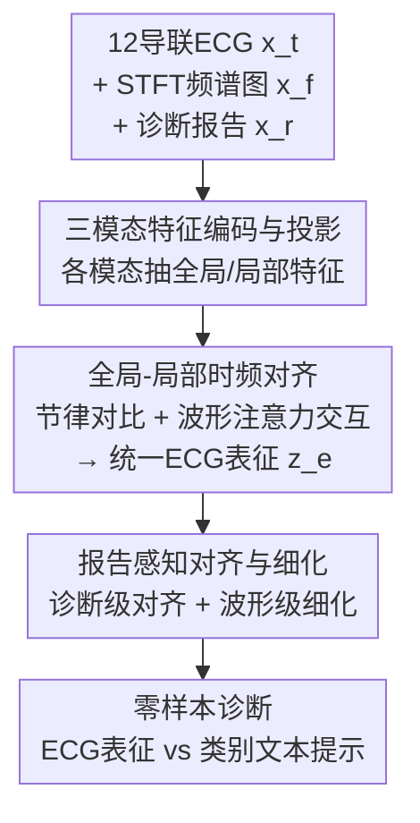

# TAMER: A Tri-Modal Contrastive Alignment and Multi-Scale Embedding Refinement Framework for Zero-Shot ECG Diagnosis

**会议**: CVPR 2026  
**论文**: [CVF Open Access](https://openaccess.thecvf.com/content/CVPR2026/html/Zhou_TAMER_A_Tri-Modal_Contrastive_Alignment_and_Multi-Scale_Embedding_Refinement_Framework_CVPR_2026_paper.html)  
**代码**: https://github.com/zhouxw12345/TAMER  
**领域**: 医学图像 / 自监督表示学习  
**关键词**: 心电图诊断, 零样本, 三模态对比学习, 时频对齐, 报告引导细化

## 一句话总结
TAMER 把心电图（ECG）波形、STFT 频谱图和临床诊断报告当成三个互补模态做自监督预训练，通过"时-频"全局/局部对齐 + "报告锚定"的诊断级与波形级细化，在三个公开数据集上拿到了零样本分类（平均 AUC 81.2%）和跨域迁移（83.1%）的 SOTA。

## 研究背景与动机

**领域现状**：临床上心电图是筛查心血管病（CVD）最便宜、最普及的工具，但有标注的 ECG 数据稀缺。主流做法是用自监督学习（SSL）从海量无标注 ECG 里预训练表征——分对比式（构造正负对）和生成式（掩码重建）两条路；近期一些工作开始引入临床诊断报告做跨模态监督（如 MERL、C-MET），把 ECG 分析变成类似视觉-语言的表示学习。

**现有痛点**：作者指出两个具体短板。其一，纯单模态 ECG SSL 只看电信号本身，表征能力受限，抓不住复杂的结构/功能异常，且信号天然带噪。其二，已有的多模态方法在两个维度上"粗"：时域和频域两路特征因为 STFT 变换带来分辨率差异 + 各自的模态噪声，全局节律层面容易语义错位、融合不稳；而 ECG-报告对齐又只做全局粗匹配，忽略了"某段波形异常 ↔ 某句诊断短语"这种局部细粒度对应，导致细微异常检测不出来。

**核心矛盾**：心电诊断本质需要"多尺度"信息——既要全局节律一致性（心律是否规则），又要局部波形细节（QRS 波群、ST 段这些诊断关键段）。但跨模态对齐如果只在单一粒度（全局）上做，就会在另一个粒度（局部）上丢信息，两者难以兼得。

**本文目标**：拆成三个子问题——(1) 如何让时域和频域两路 ECG 特征在全局和局部都对齐成一个统一表征；(2) 如何把高层临床报告语义同时注入到 ECG 的全局诊断嵌入和局部波形上；(3) 怎么在完全零样本（下游不微调、参数全冻结）的设定下还能泛化到未见类别和未见域。

**切入角度**：作者的关键观察是——把 1D ECG 波形通过 STFT 显式转成 2D 频谱图，相当于多引入一个"视觉模态"，于是 ECG 诊断被重新表述成视觉-语言表示学习范式；时/频/文三路各有不冗余的互补信息，联合对齐能降低对齐歧义。

**核心 idea**：用"三模态（ECG 波形 + 频谱图 + 诊断报告）+ 多尺度（全局节律 / 局部波形）对比对齐"替代"单模态或全局粗对齐"，让模型在零样本下既懂节律又懂波形细节。

## 方法详解

### 整体框架
TAMER 是一个三模态自监督预训练框架，输入是 (12 导联 ECG 波形 $x^t$，由 STFT 得到的频谱图 $x^f$，临床诊断报告 $x^r$) 三元组，输出是一个强泛化的 ECG 表征，下游零样本时直接把 ECG 表征和类别文本提示算相似度做分类。整个流程分三大模块串行：先由 **TFEP** 给三个模态各自抽全局特征 $(g^t,g^f,g^r)$ 和局部特征 $(l^t,l^f,l^r)$ 并投影到隐空间；接着 **GLTSA** 在时-频两路上做全局节律对比对齐 + 局部波形注意力交互，融出一个统一 ECG 表征 $z^e$，并用 dropout 扰动做一致性正则；最后 **RAAR** 把 $z^e$ 和报告全局嵌入 $g^r$ 做诊断级对齐、把局部 ECG 波 $l^t$ 和报告局部词 $l^r$ 做波形级细化，注入临床语义。三个对比损失加起来端到端优化。

### 关键设计

**1. 三模态特征编码与投影（TFEP）：把 1D 心电信号扩成"时-频-文"三路，各抽全局+局部两尺度**

痛点是单模态 ECG 信号既抓不住复杂病理、又带噪声，难以稳定融合。TFEP 先把原始波形 $x^t \in \mathbb{R}^{L\times T}$（$L$=12 导联，$T$=时长）用短时傅里叶变换转成频谱图 $x^f \in \mathbb{R}^{L\times F\times M}$（500 Hz 采样、0.25 秒 Hann 窗、62 点重叠），相当于显式造出一个 2D 时频"视觉模态"。然后三路各用专属编码器：ECG 用随机初始化的 1D ResNet-34，频谱图用 2D CNN，报告用**冻结**的 Med-CPT 编码器（保持语义稳定）。每路都同时取局部特征 $l$（编码器隐层）和全局特征 $g$（对局部做平均池化）；报告侧还额外取出 [CLS] token 对各词的注意力权重 $w$，用来衡量每个诊断词的重要性——这个 $w$ 后面在波形级细化里当软权重用。所有特征投影到模态专属隐空间后才做对齐。这样设计的好处是，频域信息被显式结构化成 2D 表示（而非指望模型从波形里隐式学出来），为后续稳定的波形级对齐打底。

**2. 全局-局部时频对齐（GLTSA）：节律级对比保全局一致，波形级注意力交互保局部细节，再加一致性正则**

针对"时频两路因分辨率差异 + 模态噪声导致全局语义错位、局部诊断波没建模"的痛点，GLTSA 内含三个子模块。其一 **RLCA（节律级对比对齐）**：在全局特征对 $(g^t,g^f)$ 上做 InfoNCE 式对比，把同一样本的时/频全局表征拉近、不同样本推远，损失为 $L_{\text{RLCA}}=L_{\text{CL}}(g^t,g^f)$，其中对比损失双向定义为

$$\mathcal{L}_{i,j}^{a2b} = -\log \frac{\exp(\text{sim}(\eta_i^a,\eta_i^b)/\tau)}{\sum_{j=1}^{N}\mathbf{1}_{[j\neq i]}\exp(\text{sim}(\eta_i^a,\eta_j^b)/\tau)}$$

$\tau$ 为温度、$\text{sim}(\cdot)$ 为余弦相似度，从而强制时频在全局节律层面一致，提升对周期性异常的识别。其二 **WLAI（波形级注意力交互）**：把局部 $l^t,l^f$ 拼接后过两级残差注意力 $z^{(1)}=l^{\text{joint}}+\text{att}(l^{\text{joint}})$、$z^{(2)}=z^{(1)}+\text{att}(z^{(1)})$，再用可学习 class token + 注意力池化 $z^e=\text{attpool}(z^{(2)})$ 聚出统一 ECG 表征——相比直接求和/拼接容易冗余或丢信息，注意力式融合能挑出 QRS 波群、ST 段这类诊断敏感波。其三 **UECR（一致性正则）**：对融出的 $z^e$ 做 dropout 生成两个随机视图 $z^u,z^v$ 并施加对比损失 $L_{\text{UECR}}=L_{\text{CL}}(z^u,z^v)$，逼表征对模态噪声/运动伪影保持视图不变性。三者合起来既守住全局节律，又抠出局部波形，还稳住了表征。

**3. 报告感知对齐与细化（RAAR）：诊断级全局对齐 + 报告引导的波形级细化，把临床语义注入两个尺度**

光有 ECG 内部时频对齐还缺高层临床语义，RAAR 用冻结文本编码器提供稳定诊断语义，分两个尺度注入。**RADA（诊断级对齐）**：把统一 ECG 表征 $z^e$ 和报告全局嵌入 $g^r$ 做对比 $L_{\text{RADA}}=L_{\text{CL}}(z^e,g^r)$，强制 ECG 嵌入和报告在全局诊断语义上一致。**RGWR（报告引导波形级细化）**：针对全局对齐抓不住"哪段波 ↔ 哪句诊断短语"的细粒度对应，它在 ECG 局部词集 $\{t_i^k\}$ 和报告局部词集 $\{r_i^m\}$ 之间做双向交叉注意力，得到上下文表征 $c_i^k=\sum_m \text{softmax}\big(\frac{(Qt_i^k)^\top Kr_i^m}{\sqrt{D}}\big)Vr_i^m$（反向同理算 $c_i^m$），再用前面 TFEP 拿到的报告 token 注意力权重 $w_i$ 作软权重，构造**加权对比损失**：

$$\mathcal{L}_{\text{ECG}} = -\frac{1}{2NK}\sum_{i=1}^{N}\sum_{k=1}^{K} w_i^k \log \frac{\exp(\text{sim}(t_i^k,c_i^k)/\lambda)}{\sum_{j=1}^{K}\exp(\text{sim}(t_i^k,c_i^j)/\lambda)}$$

$L_{\text{RGWR}}=L_{\text{ECG}}+L_{\text{report}}$（report 项对称定义）。$w_i$ 让损失自动加重那些诊断上更重要的报告词/波形段，使模型聚焦关键异常、增强可解释性。RAAR 总损失 $L_{\text{RAAR}}=L_{\text{RADA}}+L_{\text{RGWR}}$。

### 损失函数 / 训练策略
总损失为三大模块对齐损失之和：$L_{\text{total}}=L_{\text{RLCA}}+L_{\text{UECR}}+L_{\text{RAAR}}$。预训练在 MIMIC-ECG（80 万条 ECG-报告对，处理后保留 77.1 万高质量三元组）上做，单张 A100；AdamW，初始学习率 $2\times10^{-4}$、weight decay $1\times10^{-7}$，余弦退火热重启（$T_0$=40000），温度 $\lambda=0.04$，50 epoch、batch 256。下游零样本时所有预训练参数冻结，用 CKEPE 提示词典生成类别文本描述，ECG 表征与提示算相似度当预测分。

## 实验关键数据

### 主实验
评估指标统一用 macro-AUC（应对类别不平衡），两种设定：零样本分类（识别未见疾病类别）与跨域迁移（源/目标域标签语义对齐但分布不同，目标域直接评测不微调）。基线里单模态 SSL 全部用 100% 源域标注微调，多模态方法（MERL、C-MET）和 TAMER 都是 0% 微调。

| 数据集 | 设定 | TAMER | MERL | C-MET | 强单模态(ST-MEM) |
|--------|------|-------|------|-------|------------------|
| CPSC2018 | 零样本 | **88.3** | 82.8 | 80.1 | 62.27 |
| PTBXL-Super | 零样本 | **76.5** | 74.2 | 76.2 | 76.12 |
| CSN | 零样本 | **78.7** | 74.4 | 76.3 | 73.05 |
| 三数据集平均 | 零样本 | **81.2** | — | — | — |
| 三数据集平均 | 跨域迁移 | **83.1** | — | — | — |

TAMER 在三个数据集的零样本分类上整体领先，CPSC2018 提升最明显（88.3 vs MERL 82.8）。一个诚实的反例：在 PTBXL-Super→CSN 这条跨域迁移上 ST-MEM（84.50）反超 TAMER（80.95），作者归因于掩码建模在某些域偏移下的鲁棒性，但强调 TAMER 用更简洁统一的三模态对齐框架仍整体最优。

### 消融实验

| 配置 | 零样本 AUC | 跨域 AUC | 说明 |
|------|-----------|---------|------|
| Full (RLCA+WLAI+RGWR) | 81.19 | 83.08 | 完整模型 |
| w/o RLCA | 80.62 | 81.49 | 去全局节律对齐，零样本掉 0.57 |
| w/o WLAI | 76.16 | 78.94 | 去波形注意力交互，零样本掉 5.03（最狠） |
| w/o RGWR | 78.73 | 79.44 | 去报告波形级细化，零样本掉 2.46 |

| 模态组合 | 零样本 | 跨域 |
|----------|--------|------|
| time+spec+report | 81.19 | 83.08 |
| time+report | 77.53 | 79.12 |
| time+spec | — | 63.33 |

### 关键发现
- **WLAI（局部波形注意力交互）贡献最大**：去掉后零样本平均 AUC 掉 5.03%、跨域掉 4.14%，说明把 QRS/ST 这类局部诊断波融好是整套框架的命门，远比全局节律对齐（RLCA 仅掉 0.57%）更关键。
- **三模态都不冗余**：去掉频谱图（time+report）零样本掉到 77.53，去掉报告（time+spec）跨域只剩 63.33——显式 STFT 频谱图提供了从原始波形隐式学不出的结构化时频表示，报告则是跨域泛化的语义支柱。
- **温度 $\lambda=0.04$ 最优**（零样本 81.19），0.03/0.05 都更差，是训练稳定性与判别性的折中。
- **文本编码器选择影响巨大**：Med-CPT（81.19）显著优于 Clinical ModernBERT（76.92）和 PubMedBERT（72.23），因其对比预训练更擅长建模医学报告的语义一致性。
- **性能非来自堆参数**：TAMER 122.05M vs MERL 114.27M 仅多 6.8%，ECG 编码器虽多 177% 参数（额外频谱图分支），但整体规模相当，提升来自架构而非容量。

## 亮点与洞察
- **把 1D 信号 STFT 成 2D 频谱图当"视觉模态"**：这步很巧——它把心电诊断直接接入成熟的视觉-语言表示学习范式，让"显式频域结构"成为可对齐的一等公民，而不是指望卷积从波形里隐式学频率。消融里去掉频谱图掉点明显，验证了这一观察的价值。
- **复用报告编码器的 [CLS] 注意力权重当软标签**：RGWR 直接拿文本编码器自己给出的 token 重要性 $w$ 去加权对比损失，几乎零成本地让模型聚焦"诊断上重要的词/波"，是个可迁移到任何"信号-报告"对齐任务的 trick。
- **多尺度对齐的拆分干净**：全局（RLCA/RADA）管节律和诊断语义、局部（WLAI/RGWR）管波形细节，消融清楚显示局部分支才是涨点主力，对"医学信号该在哪个粒度对齐"给了实证答案。

## 局限与展望
- **作者承认的局限**：在 PTBXL-Super→CSN 跨域上不及掩码建模的 ST-MEM，说明对比对齐在某些分布偏移下不如生成式鲁棒，可考虑融合掩码重建。
- **依赖配对的高质量报告**：整套框架建立在 MIMIC-ECG 的 ECG-报告三元组上，报告稀缺或质量差的场景能否迁移未验证；冻结的 Med-CPT 也意味着文本端语义被锁死，换语言/换专科可能需重选编码器。
- **STFT 超参写死**：窗长 0.25 秒、500 Hz 等固定参数对采样率/时长不同的临床设备是否稳健，论文未做敏感性分析。
- **缺与生成式多模态方法的更广对比**：主要对比 MERL/C-MET 两个多模态基线，跨域反例也只出现一次，多模态阵营的覆盖可以更全。

## 相关工作与启发
- **vs MERL**：MERL 是 ECG-报告双模态对齐的代表，TAMER 沿用其数据处理与下游评测协议，但多引入频谱图这一模态、并把对齐从全局粗匹配细化到"诊断级 + 波形级"两个尺度，三数据集零样本全面超过 MERL（如 CPSC2018 88.3 vs 82.8）。
- **vs C-MET**：同为多模态 ECG 方法，TAMER 在 CPSC2018/CSN 上明显更强，差距主要来自局部波形交互（WLAI）和报告引导的细粒度对齐（RGWR）。
- **vs 单模态 SSL（ST-MEM 等）**：单模态方法需 100% 源域标注微调，TAMER 完全零样本仍整体领先，凸显临床文本作为语义先验对缓解分布偏移的作用；唯一例外是 ST-MEM 在一条跨域路径上靠掩码建模的鲁棒性反超。

## 评分
- 新颖性: ⭐⭐⭐⭐ 把 STFT 频谱图当视觉模态接入 ECG 三模态对比、并做全局+局部双尺度报告对齐，组合有新意但多为成熟组件的巧妙拼装。
- 实验充分度: ⭐⭐⭐⭐ 三数据集×两设定 + 模块/模态/温度/编码器/复杂度多维消融，较充分；跨域基线覆盖和敏感性分析可再扩。
- 写作质量: ⭐⭐⭐⭐ 结构清晰、模块命名一致、对反例（ST-MEM 反超）诚实交代。
- 价值: ⭐⭐⭐⭐ 零样本 + 跨域的临床友好设定下拿到 SOTA，且代码开源，对 ECG 多模态预训练有实用参考价值。

<!-- RELATED:START -->

## 相关论文

- [\[CVPR 2026\] PMRNet: Physics-informed Multi-scale Refinement Network for Medical Image Segmentation](pmrnet_physics-informed_multi-scale_refinement_network_for_medical_image_segment.md)
- [\[CVPR 2026\] Interpretable Cross-Domain Few-Shot Learning with Rectified Target-Domain Local Alignment](interpretable_cross-domain_few-shot_learning_with_rectified_target-domain_local_.md)
- [\[ICML 2025\] From Token to Rhythm: A Multi-Scale Approach for ECG-Language Pretraining](../../ICML2025/medical_imaging/from_token_to_rhythm_a_multi-scale_approach_for_ecg-language_pretraining.md)
- [\[AAAI 2026\] PulseMind: A Multi-Modal Medical Model for Real-World Clinical Diagnosis](../../AAAI2026/medical_imaging/pulsemind_a_multi-modal_medical_model_for_real-world_clinical_diagnosis.md)
- [\[CVPR 2026\] A Semi-Supervised Framework for Breast Ultrasound Segmentation with Training-Free Pseudo-Label Generation and Label Refinement](a_semi-supervised_framework_for_breast_ultrasound_segmentation_with_training-fre.md)

<!-- RELATED:END -->
