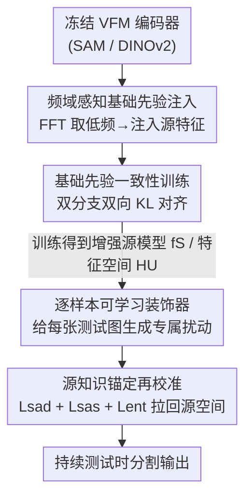

# TANGO: Learning Distribution-wise Foundation Prior Consistency and Instance-wise Style Calibration for Medical Image Generalization

**会议**: CVPR 2026  
**论文**: [CVF Open Access](https://openaccess.thecvf.com/content/CVPR2026/html/Liu_TANGO_Learning_Distribution-wise_Foundation_Prior_Consistency_and_Instance-wise_Style_Calibration_CVPR_2026_paper.html)  
**代码**: 待确认  
**领域**: 医学图像  
**关键词**: 持续测试时适应, 医学图像分割, 视觉基础模型, 频域先验, 风格校准

## 一句话总结
TanGo 把视觉基础模型（SAM/DINOv2）的低频泛化先验在**训练阶段**蒸馏进轻量分割源模型、在**测试阶段**用可学习的逐样本"装饰器"把漂移的测试图像拉回增强后的源分布，从而在持续测试时适应（CTTA）的医学图像分割上拿到 SOTA。

## 研究背景与动机
**领域现状**：医学图像分割部署时常遇到扫描仪、协议、医院不同带来的域漂移。测试时适应（TTA）和持续测试时适应（CTTA）通过在线用无标签目标样本微调源模型的一部分（如 BN 仿射参数、视觉 prompt）来对抗漂移，代表方法有 TENT、CoTTA、DomainAdaptor、VPTTA 等。

**现有痛点**：这些方法暗含两个站不住的假设——(i) 源模型本身具备强泛化先验；(ii) 测试分布相对稳定。但实际上源模型往往在有限的源数据上过拟合（论文用 t-SNE 展示了这一点），基于源域预测的正则化策略反而会误导目标模型的优化；而真实场景里单源到多目标的漂移既大又持续演化，会进一步放大伪标签误差累积和类别遗忘。

**核心矛盾**：CTTA 的成败取决于"源模型有多可靠"，但现有做法直接拿一个过拟合的源模型当锚点去在线适应，等于在沙地上盖楼——锚点本身不稳，越适应越偏。

**本文目标**：(1) 训练阶段就把源模型变得更泛化、特征空间更稳；(2) 测试阶段让每张漂移的测试图都能被精准地拉回这个增强后的源分布，同时不破坏语义。

**切入角度**：视觉基础模型（VFM）有强大的图像内容理解和稳定特征表示，而低频分量编码域相关的风格、高频信号保留解剖结构。于是作者把 VFM 的**低频先验**当作"泛化锚点"在训练时注入轻量专家模型，测试时再以这个增强源空间为锚做风格校准。

**核心 idea**：用"训练时蒸馏 VFM 低频先验 + 测试时逐样本风格校准回锚"这套训练-测试协同范式，替代"直接微调过拟合源模型"的传统 CTTA。

## 方法详解

### 整体框架
TanGo 是一个两阶段范式。**训练阶段**用 Distribution-wise Consistency Learning（DSCL）把冻结 VFM 编码器的频域泛化先验蒸馏进轻量源模型 $f_S$（如 ResUNet-34 / PraNet），形成一个统一、域协调的特征空间 $H_U$；**测试阶段**用 Instance-wise Style Adaptive Calibration 把进来的目标样本分布 $H_T^i$ 自适应地对齐到这个源知识锚定空间 $H_U$，实现高效的在线持续适应。训练阶段内部又拆成"频域先验注入（FAFPI）"和"一致性训练（FCL）"两步；测试阶段拆成"逐样本装饰器（LID）"和"源知识锚定再校准（SKAR）"两步。

### 关键设计

**1. 频域感知基础先验注入（FAFPI）：把 VFM 的低频"风格底子"塞进专家模型**

要把 VFM 的泛化能力迁给轻量源模型，直接蒸馏整张特征图既贵又会把 VFM 的高频解剖噪声也带过来。FAFPI 的做法是只搬"低频"这一层：先给冻结 VFM 加 Adapter 做参数高效微调以适配医学域，再用轻量 Feature Refinement Module（深度可分离 3×3 卷积）把 VFM 中间特征 $\tilde F_i^V$ 在分辨率上对齐到源特征 $F_i^S$；然后对两者做 2D FFT，用一个由超参 $r{=}0.4$ 控制中心区域的二值掩码 $M$ 分离出低频幅度分量。注入公式为 $\tilde{\mathcal{F}}^{SA}_{li} = \mathcal{F}^{SA}_{li} + \Sigma(\mathcal{F}^{SA}_{li}) \odot \mathcal{F}^{VA}_{li} \odot R,\ R\sim U(0,1)$，其中 $\Sigma(\cdot)$ 是源低频幅度的标准差、用来调节注入强度，$R$ 是均匀分布随机噪声、用来扰动融合幅度，逼迫 $f_S$ 去关注相位分量里的结构线索以增强鲁棒性。最后逆 FFT 重建出融合特征 $\tilde F_i^S$——它既带了 VFM 的低频先验，又能让源模型提前"预演"测试时会遇到的潜在分布漂移。

**2. 基础先验一致性训练（FCL）：用双分支双向 KL 把先验真正"焊"进源模型**

光注入还不够，得让源模型学会对"原始特征"和"注入先验后的特征"都给出一致的分割。FCL 让源模型在训练时产生两条预测分支：原始源分支 $f_S(F_i^S)$ 和注入先验分支 $f_S(\tilde F_i^S)$，再用双向 KL 把它们对齐：$L_{FCL} = \frac{1}{2N}\sum_i [\mathrm{KL}(\tilde q_i^S \| q_i^S) + \mathrm{KL}(q_i^S \| \tilde q_i^S)]$。双向（而非单向）一致性的好处是两条分支互相约束，迫使源模型无论看到不看到先验都输出同样的分割，等于把 VFM 的泛化行为内化进 $f_S$ 自己的表示空间 $H_U$。总训练损失再叠上两条分支各自的分割损失（Dice + 交叉熵）：$L_{total} = L_{seg}(\tilde q_i^S, y) + L_{seg}(q_i^S, y) + \lambda_1 L_{FCL}$，$\lambda_1{=}0.5$。

**3. 逐样本可学习装饰器（LID）：每张测试图都配一个专属"美颜滤镜"**

传统视觉 prompt 学习给所有测试样本共享一个固定 prompt，忽略了域内样本之间的差异。LID（记作 $f_D(\cdot;\phi)$）改成给每张进来的测试图 $x_i^t$ 动态生成专属装饰：$\tilde x_i^t = x_i^t + f_d(x_i^t;\phi)$。它是一个轻量可学习网络（输入卷积层 + 若干增强块 + 输出卷积层，块间加残差连接保语义），把每张图的风格分布 $H_T^i$ 往源模型学到的 $H_U$ 上拽，从而在持续变化的测试环境里保持适应能力。

**4. 源知识锚定再校准（SKAR）：给装饰器套上三道约束，别越校越离谱**

LID 灵活但没约束会生成偏离源流形 $H_S$ 的"虚假"测试样本。SKAR 用三个目标把装饰后的样本锚回源空间：① **源锚定分布损失** $L_{sad}$ 用 Gram 矩阵（风格迁移里常用来刻画通道相关性的风格特征）做对齐——对目标/源模型第 $j$ 个 block 的特征算 Gram 矩阵 $G_j^T, G_j^S$，行归一化后求 MSE：$L_{sad} = \frac{1}{C}\|\tilde G_j^T - \tilde G_j^S\|_2^2$，把全局风格拉齐；② **源锚定语义损失** $L_{sas} = \frac{1}{B}\sum_i \|f_T(\tilde x_i^t) - f_S(x_i^t)\|_2^2$ 在 logits 层对齐目标和源模型的分割输出，保证装饰不破坏语义完整性；③ **熵最小化损失** $L_{ent}$ 稳定目标模型可学习 BN 参数的优化、降低预测不确定性、加速收敛。测试目标为 $L_{SKAR} = \lambda_2 L_{sad} + \lambda_3 L_{sas} + L_{ent}$，$\lambda_2{=}0.5,\ \lambda_3{=}0.6$。三者合起来同时管住风格对齐、语义保持和不确定性，是 LID 能稳定工作的关键。

### 损失函数 / 训练策略
- 训练阶段：$L_{total} = L_{seg}(\tilde q_i^S, y) + L_{seg}(q_i^S, y) + \lambda_1 L_{FCL}$，$L_{seg}$ 为 Dice + 交叉熵，$\lambda_1{=}0.5$。
- 测试阶段：$L_{SKAR} = \lambda_2 L_{sad} + \lambda_3 L_{sas} + L_{ent}$，$\lambda_2{=}0.5,\ \lambda_3{=}0.6$；只更新目标模型 $f_T$ 中的 LID 参数和 BN 仿射参数 $\gamma,\beta$。
- 骨干：眼底 OD/OC 用 ResUNet-34，息肉用带 Res2Net 的 PraNet；VFM 用 ViT-B SAM 编码器（加 Adapter 微调）。

## 实验关键数据

### 主实验
眼底 OD/OC 分割（5 域 RIM-ONE-r3 / REFUGE / ORIGA / REFUGE-Val / Drishti-GS），CTTA 设定下 DSC（%）：

| 方法 | Domain A | Domain B | Domain C | Domain D | Domain E | 平均 ↑ |
|------|----------|----------|----------|----------|----------|--------|
| No Adapt (ResUNet-34) | 64.53 | 76.06 | 71.18 | 52.67 | 64.87 | 65.86 |
| VPTTA (CVPR 2024) | 73.91 | 79.36 | 74.51 | 56.51 | 75.35 | 71.93 |
| GraTa (AAAI 2025) | 76.58 | 78.72 | 76.27 | 67.15 | 72.88 | 74.32 |
| **TanGo（本文）** | **87.76** | **85.96** | **84.49** | **84.41** | **83.52** | **85.23** |

TanGo 平均比次优 GraTa 高 10.91%、比 No Adapt 高 19.37%；尤其在最难的 Domain D 上从 67.15 飙到 84.41。息肉分割（CTTA）平均 DSC 也比次优 VPTTA 高 3.24%、比 No Adapt 高 7.93%。

### 消融实验
息肉任务上拆解训练侧 DSCL（平均 DSC %）：

| 配置 | Domain A | Domain B | Domain C | Domain D | 平均 ↑ |
|------|----------|----------|----------|----------|--------|
| No Adapt | 79.90 | 66.33 | 73.89 | 82.95 | 75.77 |
| w/ FAFPI | 80.53 | 74.68 | 74.73 | 83.42 | 78.34 |
| w/ FCL（FAFPI+FCL） | 81.89 | 78.89 | 76.88 | 85.98 | 80.91 |
| Ours（+ 测试时校准） | **83.95** | **82.44** | **81.11** | **87.29** | **83.70** |

测试侧三约束消融（息肉，平均 DSC）：只加 $L_{ent}$ 为 78.25，再加 $L_{sad}$ 升到更高，三者全开最佳；FAFPI→FCL→完整模型逐级递增，最后一步测试时校准再贡献约 2.79 DSC。

### 关键发现
- **训练-测试两侧互补**：FAFPI 把低频先验搬进来（+2.57），FCL 用一致性焊牢（再 +2.57），测试时校准再 +2.79，三段累加缺一不可，说明"增强源模型"和"测试时回锚"是互补而非冗余。
- **优于通用蒸馏**：DSCL 对比 CWD / AttnKD / SpaKD 等特征蒸馏，息肉 80.91 vs 79.02、眼底 83.05 vs 81.32 均更高——只搬低频比整张特征蒸馏更对症。
- **静态 TTA 也稳**：在 A→rest / B→rest / D→rest 长程适应里 TanGo 始终领先，说明它"测试样本越多越受益"，符合真实部署场景。

## 亮点与洞察
- **"低频=风格、高频=结构"的频域分解用得很巧**：只注入 VFM 的低频幅度而留住源模型自己的相位/高频结构，等于把"泛化风格"和"任务解剖知识"解耦迁移，这个思路可迁到任何"想借大模型先验又怕破坏专家结构"的蒸馏场景。
- **训练时就"预演"测试漂移**：用随机噪声 $R$ 扰动融合幅度，逼源模型提前见识分布漂移，是一种很省的数据/特征增广，比测试时才手忙脚乱地适应更治本。
- **逐样本装饰器 + 三约束回锚**：把"自由生成"（LID）和"别跑偏"（SKAR 的 Gram 风格 + logits 语义 + 熵）配成一对，是测试时适应里"灵活性 vs 稳定性"这对矛盾的一个干净解法。

## 局限与展望
- 依赖一个高质量 VFM（ViT-B SAM）当先验源，VFM 本身在某些医学模态上的零样本能力会决定先验质量；论文没讨论 VFM 选择敏感性（正文以原文为准）。
- 频域掩码半径 $r{=}0.4$、各损失权重 $\lambda$ 都是经验设定，跨任务是否需要重调未充分展开。
- 只验证了眼底和息肉这类 2D 分割，3D 体数据（CT/MRI）上低频注入和 Gram 风格对齐是否同样有效仍待验证。

## 相关工作与启发
- **vs VPTTA（CVPR 2024）**：VPTTA 给每个测试样本学持续的低频 prompt 并用统计对齐缓解误差累积，但仍建立在一个泛化有限的源模型上；TanGo 在训练阶段就把源模型变强，测试时再以增强源空间为锚，因此眼底平均高出约 13 个点。
- **vs DomainAdaptor（CVPR 2023）**：DomainAdaptor 混合源/目标 BN 统计来缓解归一化层漂移，属于"统计层修补"；TanGo 是"先把源模型练好 + 再逐样本风格校准"，从特征空间层面解决问题。
- **vs 通用特征蒸馏（CWD / AttnKD）**：它们蒸馏整张特征图，TanGo 只蒸馏低频幅度，更对症且避免把 VFM 的高频噪声带进专家模型。

## 评分
- 新颖性: ⭐⭐⭐⭐ 训练-测试协同 + 频域低频先验注入的组合在 CTTA 医学分割里较新颖，但各组件（频域分解、Gram 风格、熵最小化）多是已有积木的巧妙重组。
- 实验充分度: ⭐⭐⭐⭐⭐ 眼底/息肉两类任务、TTA/CTTA/mixed 多设定、9-10 个对比方法、训练侧与测试侧分别消融，还有蒸馏对比和 t-SNE 可视化。
- 写作质量: ⭐⭐⭐⭐ 动机（源模型过拟合 + 分布演化）讲得清楚，公式完整；缩写较多（DSCL/FAFPI/FCL/LID/SKAR）初读略费劲。
- 价值: ⭐⭐⭐⭐ 医学分割部署侧的实用问题，平均提升显著，方法对"借基础模型先验"的迁移范式有借鉴意义。

<!-- RELATED:START -->

## 相关论文

- [\[CVPR 2026\] Delving Aleatoric Uncertainty in Medical Image Segmentation via Vision Foundation Models](delving_aleatoric_uncertainty_in_medical_image_segmentation_via_vision_foundatio.md)
- [\[CVPR 2026\] Semantic Class Distribution Learning for Debiasing Semi-Supervised Medical Image Segmentation](semantic_class_distribution_learning_for_debiasing.md)
- [\[ICCV 2025\] Vector Contrastive Learning for Pixel-wise Pretraining in Medical Vision](../../ICCV2025/medical_imaging/vector_contrastive_learning_for_pixel-wise_pretraining_in_medical_vision.md)
- [\[CVPR 2026\] CG-Reasoner: Centroid-Guided Positional Reasoning Segmentation for Medical Imaging with a Robust Visual-Text Consistency Metric](cg-reasoner_centroid-guided_positional_reasoning_segmentation_for_medical_imagin.md)
- [\[CVPR 2026\] SemiGDA: Generative Dual-distribution Alignment for Semi-Supervised Medical Image Segmentation](semigda_generative_dual-distribution_alignment_for_semi-supervised_medical_image.md)

<!-- RELATED:END -->
