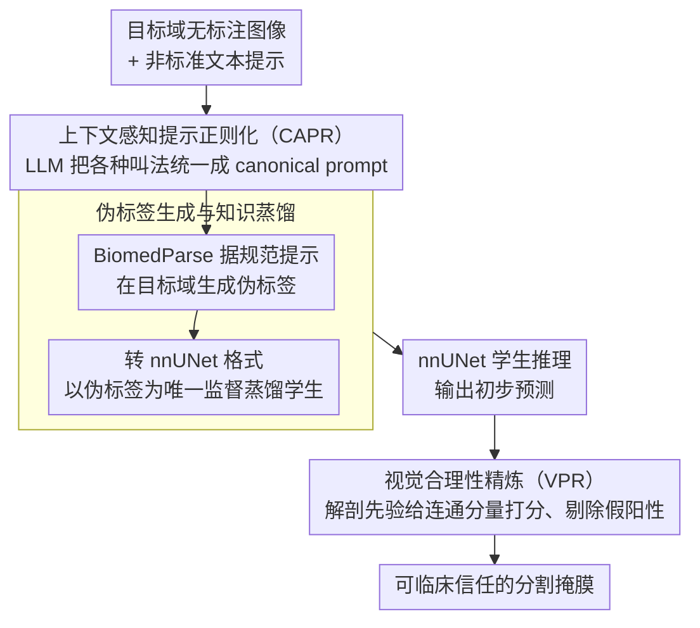

# Tell2Adapt: A Unified Framework for Source Free Unsupervised Domain Adaptation via Vision Foundation Model

**会议**: CVPR 2026  
**arXiv**: [2603.05012](https://arxiv.org/abs/2603.05012)  
**作者**: Yulong Shi, Shijie Li, Ziyi Li, Lin Qi
**代码**: [derekshiii/Tell2Adapt](https://github.com/derekshiii/Tell2Adapt)  
**领域**: 医学图像  
**关键词**: source-free domain adaptation, vision foundation model, medical image segmentation, pseudo label, prompt regularization

## 一句话总结

提出 Tell2Adapt 统一框架，利用视觉基础模型（BiomedParse）的泛化知识，通过上下文感知提示正则化（CAPR）生成高质量伪标签，再经视觉合理性精炼（VPR）去除解剖学不合理预测，实现跨 10 个域迁移方向、22 个解剖目标的统一无源域自适应医学图像分割。

## 研究背景与动机

Source-Free Unsupervised Domain Adaptation (SFUDA) 在医学影像部署中至关重要——源域数据因隐私限制无法共享，模型需仅凭目标域未标注数据完成自适应。

现有 SFUDA 方法存在关键局限：
- **场景特定性强**：大多数方法针对低域差距的特定迁移任务设计（如 MRI→MRI），无法扩展为统一的多模态、多目标框架
- **泛化能力弱**：当面临大域差距（如 CT→MRI）或多个解剖目标时，现有方法性能显著下降
- **伪标签质量差**：基于源模型直接生成的伪标签在目标域噪声大，严重限制自适应效果
- **临床可靠性不足**：缺乏对预测结果的解剖学合理性验证，可能产生临床不可接受的假阳性

核心观察：Vision Foundation Model（VFM）如 BiomedParse 在大规模生物医学数据上预训练，具备跨模态、跨解剖结构的广泛知识。如何有效地将这些知识迁移到轻量级部署模型，同时保证临床可靠性，是本文要解决的关键问题。

## 方法详解

### 整体框架

Tell2Adapt 想解决的是一个很现实的窘境：源域数据因隐私不能共享，目标域又只有一堆无标注图像，传统 SFUDA 方法只能围着「某一种特定迁移」打转，换个模态或换个器官就失灵。它的破局思路是把一个见多识广的视觉基础模型（BiomedParse）当作「外脑」，借它的泛化知识在目标域上无中生有地造出伪标签，再把这份能力蒸馏进一个轻量、可临床部署的 nnUNet 学生模型。

整条流水线串起三件事：先用 CAPR 把五花八门的文本提示「翻译」成 BiomedParse 听得懂的规范指令，喂给它跑出伪标签；再以这份伪标签为监督，蒸馏训练 nnUNet；最后用 VPR 拿解剖学统计先验给学生模型的输出做体检，把那些解剖上根本说不通的预测剔掉。三步各管一段——前端保证「问得对」，中段保证「学得到」，后端保证「信得过」。

### 关键设计

**1. 上下文感知提示正则化（CAPR）：让基础模型听懂临床黑话**

BiomedParse 是 prompt-driven 的分割模型，提示一变质，分割就垮。可现实里同一个解剖结构会有无数种叫法——"left ventricle"、"LV"、"左心室"指的是同一处，不同医生、不同协议写出来的提示千差万别，直接丢给 BiomedParse 就会得到参差不齐的伪标签。CAPR 的做法是在提示进入 BiomedParse 之前先架一道「翻译层」：设计一段 meta-prompt 驱动 LLM（如 GPT-4 ⚠️ 以原文为准），把各种非标准表述统一映射到 BiomedParse 认可的 canonical prompt，确保「同一概念 → 同一指令」。这一步看似只是文字处理，却直接决定了下游伪标签的质量上限——消融实验里它单独贡献了约 4.7% Dice，说明 prompt 的一致性对 VFM 推理远不是细枝末节。

**2. 伪标签生成与知识蒸馏：把基础模型的本事搬进轻量学生**

有了规范提示，BiomedParse 在目标域图像上推理出伪标签，但它本身太重、太慢，不适合直接当部署模型。于是 Tell2Adapt 走的是「教师造标、学生接班」的蒸馏路线：先把 BiomedParse 的输出转成 nnUNet 兼容的标注格式，再以这份伪标签为唯一监督信号训练 nnUNet 学生。关键在于整个训练完全不碰源域数据——学生只在目标域伪标签上学习，天然满足 source-free 约束；而 nnUNet 推理快、占用低，正好补上 BiomedParse 在临床落地时的效率短板。等于用一次性的「重模型推理 + 蒸馏」换来一个长期可用的轻量分割器。

**3. 视觉合理性精炼（VPR）：用解剖先验给预测做体检**

学生模型再好也会冒出临床上不可接受的假阳性——比如肝脏区域突然蹦出一块孤立的碎片。VPR 不靠额外训练，而是借 BiomedParse 预计算的解剖统计先验来当裁判。它从 `Anatomical_Priors.json` 读出目标模态与解剖结构的 Beta 分布参数，对每个预测连通分量 $p_i$，在其低层视觉特征上算一个 log 空间的合理性分数：

$$\log S(p_i) = \sum_{k=1}^{4} \left[ (\alpha_k-1)\log f_{i,k} + (\beta_k-1)\log(1-f_{i,k}) - \log B(\alpha_k, \beta_k) \right]$$

其中 $f_{i,k}$ 是该连通分量在第 $k$ 维低层特征上的取值。分数落在 $\mu_S - 2\sigma_S$ 以下的分量被判为「解剖上离谱」直接丢弃，尺寸小于阈值的碎片也一并清掉。这套机制的巧处在于它把「合理与否」量化成了一个可计算的概率密度——既不需要重新训练，又把临床可靠性这层保险显式地加在了输出端，消融里它额外带来约 2.3% Dice 并大幅压低 HD95。这套解剖先验覆盖了 CT 腹部/胸部/肝脏、MRI 腹部/心脏/脑部、X 光胸片、超声心脏、内镜息肉、眼底/皮肤镜/OCT 等 14 种临床场景。

### 一个完整示例

以一张腹部 CT 切片为例走一遍：医生输入的提示可能是随手写的 "kidney (right side)"，CAPR 先把它规范成 BiomedParse 标准词表里的 canonical prompt（如 "right kidney"），BiomedParse 据此在这张 CT 上分割出右肾区域，作为伪标签。这份伪标签转成 nnUNet 格式后参与蒸馏训练，让学生模型逐渐学会在腹部 CT 上分肾。推理阶段，nnUNet 给出预测，但可能在右肾旁多吐出一小块孤立的假阳性碎片——VPR 这时介入，对每个连通分量算合理性分数：真实的右肾分量特征落在解剖先验的高密度区、分数高被保留，而那块碎片的特征偏离先验、分数掉到 $\mu_S - 2\sigma_S$ 以下，连同尺寸过小的杂点一起被剔除，最终输出一张解剖上站得住脚的分割图。一张图就这样从「歧义提示」一路被收敛成「可临床信任的掩膜」。

## 实验关键数据

### 实验设置
- **评估规模**：10 个域迁移方向、22 个解剖目标，号称迄今最大规模的 SFUDA 评估之一
- **解剖区域**：脑部（BraTS 脑肿瘤分割）、心脏（M&Ms 心脏 MRI）、息肉（内镜息肉分割）、腹部（AMOS/CHAOS 腹部器官）
- **VFM 教师**：BiomedParse
- **学生模型**：nnUNet
- **评估指标**：Dice Similarity Coefficient (DSC)、Hausdorff Distance 95% (HD95)

### Table 1: 跨模态腹部器官分割 Dice (%) 对比

| 方法 | 类型 | Liver | R.Kidney | L.Kidney | Spleen | Avg |
|---|---|---|---|---|---|---|
| Source Only | — | 58.2 | 47.6 | 46.1 | 42.3 | 48.6 |
| TENT | Test-time | 63.4 | 52.1 | 51.8 | 48.7 | 54.0 |
| AdaptSeg | UDA | 71.5 | 63.2 | 62.4 | 59.8 | 64.2 |
| DPL | SFUDA | 69.3 | 58.7 | 57.2 | 55.1 | 60.1 |
| ProSFDA | SFUDA | 74.8 | 65.3 | 64.1 | 62.4 | 66.7 |
| **Tell2Adapt** | **SFUDA** | **82.6** | **76.8** | **75.4** | **73.1** | **77.0** |

Tell2Adapt 在平均 Dice 上领先第二名 ProSFDA 约 10%，在高域差距迁移中优势更为显著。

### Table 2: 心脏 MRI 分割与消融结果

| 配置 | LV | RV | Myo | Avg DSC | Avg HD95 |
|---|---|---|---|---|---|
| Source Only | 72.3 | 65.1 | 58.4 | 65.3 | 14.2 |
| ProSFDA | 81.2 | 74.6 | 69.3 | 75.0 | 8.7 |
| Tell2Adapt (w/o CAPR) | 83.1 | 77.2 | 71.8 | 77.4 | 7.4 |
| Tell2Adapt (w/o VPR) | 85.4 | 79.8 | 74.1 | 79.8 | 6.8 |
| **Tell2Adapt (Full)** | **87.6** | **82.3** | **76.5** | **82.1** | **5.6** |

消融分析表明：
- CAPR 提升约 4.7% Dice（提示正则化对 VFM 推理质量影响显著）
- VPR 进一步提升约 2.3% Dice 并大幅降低 HD95（有效去除假阳性和噪声）
- 两个模块互补，完整框架达到最优性能

## 亮点与洞察

- **统一框架设计**：首次构建覆盖 10 个域迁移方向、22 个解剖目标的统一 SFUDA 框架，打破了现有方法"一任务一模型"的局限
- **VFM 知识迁移路径**：提出 VFM→伪标签→知识蒸馏→轻量模型 的完整迁移路径，既利用了大模型的泛化能力，又满足临床部署的效率需求
- **提示工程的正则化**：CAPR 解决了 prompt-driven VFM 中提示表述不一致的实际问题，通过 LLM 实现 canonical mapping
- **解剖学先验驱动的后处理**：VPR 不依赖额外训练，仅通过统计先验和低层视觉特征即可有效去除假阳性，增强临床可靠性
- **广泛的模态覆盖**：解剖先验库支持 CT、MRI、X 光、超声、内镜、眼底、皮肤镜、OCT、病理等 14 种临床场景

## 局限性

- **依赖 VFM 质量**：框架性能上界受 BiomedParse 能力限制；对 VFM 覆盖不好的罕见解剖结构或模态，伪标签质量可能不足
- **CAPR 依赖 LLM API**：提示正则化需要调用 LLM（如 GPT-4），在无网络或受限环境中部署存在障碍
- **解剖先验需预设**：VPR 的先验参数需从 BiomedParse 预计算，新增解剖目标需要更新先验库
- **端到端性不足**：三阶段流水线设计使整体流程较复杂，各阶段独立优化可能存在信息传递损耗
- **计算成本**：BiomedParse 推理 + nnUNet 蒸馏训练的整体计算成本仍较高，尽管最终部署模型轻量

## 相关工作

- **SFUDA 方法**：TENT（测试时自适应）、DPL（域伪标签）、ProSFDA（渐进式无源域自适应）→ 多针对特定域差距设计，缺乏统一框架
- **视觉基础模型**：SAM（通用分割基础模型）、BiomedParse（生物医学分割基础模型）→ 本文基于 BiomedParse 作为知识来源
- **知识蒸馏**：将大模型知识迁移到轻量模型的经典范式 → 本文用于从 VFM 伪标签训练 nnUNet
- **医学图像分割 DA**：AdaptSeg（对抗训练）、UAMT（不确定性感知）→ 多需源域数据或仅支持特定模态
- **Tell2Adapt 定位**：将 VFM 泛化知识通过提示正则化和解剖先验精炼，高效迁移到轻量级部署模型，实现首个统一多模态多目标 SFUDA 框架

## 评分

- 新颖性: ⭐⭐⭐⭐ — VFM + CAPR + VPR 的组合思路清晰有新意，将基础模型知识迁移到 SFUDA 场景的路径设计合理
- 实验充分度: ⭐⭐⭐⭐⭐ — 10 个域迁移方向、22 个解剖目标，规模在 SFUDA 领域非常突出
- 写作质量: ⭐⭐⭐⭐ — 框架结构清晰，但三阶段设计描述略显分散
- 价值: ⭐⭐⭐⭐ — 统一 SFUDA 框架对医学影像临床部署有直接实用价值，代码已开源

<!-- RELATED:START -->

## 相关论文

- [\[CVPR 2026\] SHAPE: Structure-aware Hierarchical Unsupervised Domain Adaptation with Plausibility Evaluation for Medical Image Segmentation](shape_structure-aware_hierarchical_unsupervised_domain_adaptation_with_plausibil.md)
- [\[CVPR 2026\] Reclaiming Lost Text Layers for Source-Free Cross-Domain Few-Shot Learning](reclaiming_lost_text_layers_for_source-free_cross-domain_few-shot_learning.md)
- [\[CVPR 2026\] Uni-Hema: Unified Model for Digital Hematopathology](uni-hema_unified_model_for_digital_hematopathology.md)
- [\[CVPR 2026\] GaussianPile: A Unified Sparse Gaussian Splatting Framework for Slice-based Volumetric Reconstruction](gaussianpile_a_unified_sparse_gaussian_splatting_framework_for_slice-based_volum.md)
- [\[CVPR 2026\] CoFiDA-M: Concept-Aware Feature Modulation for Cross-Domain Adaptation with Image-Only Inference](cofida-m_concept-aware_feature_modulation_for_cross-domain_adaptation_with_image.md)

<!-- RELATED:END -->
